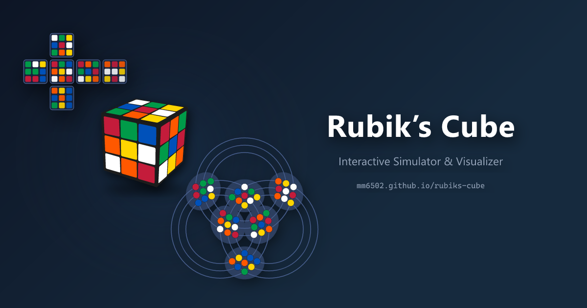

# Rubik's Cube

  

An implementation of a Rubik's Cube solver with multiple visualization modes. Written in TypeScript and compiled with Vite to a single HTML file for portability / easy deployment.

## Quickstart (for Users)

Try it out directly in your browser by opening the `dist/index.html` file after building the project, or visit the [live demo](https://mm6502.github.io/rubiks-cube).

Prerequisities: A modern web browser (tested on Edge and Firefox).

## Quickstart (for Contributors)

See [quickstart-contributors.md](src/docs/quickstart-contributors.md) for development setup and project structure.

## Background and motivation

This project was created as a fun side project. The goal was to create a portable, easy-to-use Rubik's Cube solver that could run entirely in the browser without any server-side components, with multiple visualization options to explore different ways of representing the cube. I wanted to see the Circular view in action, as I had not seen that representation implemented elsewhere before (not that I had looked very hard).

Almost all of the code (99%) was written by an AI agent (Claude Sonnet 4.5) in a pair-programming style, with the human author providing high-level design, architecture, and guidance, while the AI generated most of the implementation code based on prompts and feedback.

## Features

- **Single File Build**: Compiles to a single HTML file for portability
- **Multiple View Types**: Basic, Flat, Circular visualizations
- **State Import/Export**: Save and load cube states
- **State Restoration**: Automatically restore your last cube state on app start
- **Responsive Design**: Works on desktops, tablets, and phones; supports touch and mouse interaction

For more details on features and usage, see the [documentation](src/docs/README.md).

## Development

Current development is focused on improving test coverage and documentation.

See [TODO.md](TODO.md) for current tasks. See [implementation-status.md](implementation-status.md) for overall implementation progress.

## License

This project is licensed under the EUPL-1.2 License. See the [LICENSE](LICENSE.txt) file for details.
