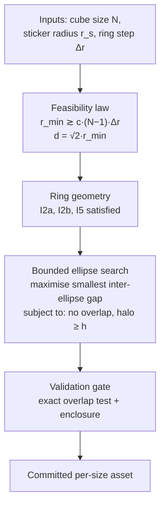

# Circular View Layout — Feasibility Law and Ellipse Solver (Requirements)

> **Amendment (2026-09-19) — premise does not reproduce against the shipped
> configuration.** This document's Problem Frame states that the committed
> layouts overlap, and uses that as the reason to build a derived scaling law
> plus an ellipse solver. Measured today, against the parameter sets the app
> actually ships, **no size overlaps**. The proposed remedy is also not what
> resolved the sizes. Both findings are recorded below so a future reader does
> not act on the Problem Frame as if it described the current system.
>
> ## Finding 1 — the overlap figures do not reproduce
>
> Re-measured against `src/views/circular/svg-generator/parameters.json` (the
> shipped set, which is what the app renders at runtime), for every size 2–7:
>
> | N       | This document claims             | Measured now | Minimum gap        |
> | ------- | -------------------------------- | ------------ | ------------------ |
> | 3       | 3 overlapping pairs (depth 0.65) | **0 pairs**  | 0.20               |
> | 4       | 6 pairs (depth 15.63)            | **0 pairs**  | 5.32               |
> | 5       | 9 pairs (depth 35.82)            | **0 pairs**  | 2.76               |
> | 2, 6, 7 | —                                | **0 pairs**  | 7.53 / 4.82 / 9.13 |
>
> **The criterion**, stated so the numbers are checkable rather than asserted:
> the gap is the exact signed separation between two _filled_ ellipses computed
> from the support function, in SVG user units, where `gap ≤ 0` means the two
> shapes intersect (including containment). "No overlap" means the minimum gap
> across all 15 face pairs is strictly positive. The harness is
> `scripts/circular-layout/analyse-tangency.ts` and
> `scripts/circular-layout/render-previews.ts`, both reading the shipped
> parameters through the generator. The support function is the right tool here
> precisely because sampling the two boundaries under-reports a crossing — no
> sample lands exactly on it — which is the failure mode this document itself
> warns about in its acceptance examples.
>
> Two of the three causes the document names are also gone. No size inherits the
> `2.9286` ellipse margin: every one of the six configured sizes overrides
> `ellipseMargin` (2.05 / 2.4 / 2.2 / 2.3 / 2.35 / 2.35), so the "mis-scaled
> halo" no longer exists. And the label mask no longer emits a fixed 400×340
> white rectangle — it derives its width and height from the canvas the
> generator actually emitted, so the hidden-clip problem it describes cannot
> occur.
>
> ## Finding 2 — hand-tuning, not a derived law, is what resolved the sizes
>
> This matters more than the measurement drift, because it means the document's
> _approach_ was not the one taken. The shipped layout values are
> **hand-tuned**, and the three ways to confirm that are:
>
> - `parameters.json` says so itself, in the file's own preamble: the values
>   "come from the geometry spec's invariants, **tuned by eye** where the spec
>   declines to derive (face-ellipse offset and semi-axes, apex rounding)".
> - **Nothing writes the file.** No script in `scripts/` or `src/` persists
>   `parameters.json`; it is read-only to the toolchain. A solver that fed it
>   would have to write it.
> - `analyse-tangency.ts` is a one-shot _analysis_ over configuration B — a
>   superseded starting point — that prints a table to stdout and exits. It is
>   not a solver wired into the generator, and its own header describes it as
>   the starting point rather than the source of truth.
>
> So R1's "derives each size's governing ratios from a stated relation instead
> of applying one Triangle side to every size" was not implemented. Each size
> does carry its own `triangleSide` and `innerRadius`, but as reviewed constants
> rather than as the output of a relation carrying a stated comfort factor above
> a measured feasibility boundary (R2). The ellipse placement is likewise
> hand-chosen rather than the product of the bounded search R4 specifies.
>
> ## Status and disposition
>
> The derived-law approach is **not currently planned** and nothing here is
> deleted. It remains available as a future option: the observation that the
> binding quantity is a scale-invariant _ratio_ of Triangle side to ring step,
> and that raising the Triangle side alone makes overlap worse, are genuinely
> useful and were what pointed the way to the per-size constants that shipped.
>
> Two things to weigh before reviving it. First, the document's premise would
> need re-measuring against the current configuration before any of its
> feasibility claims are used, since the numbers it reasons from describe a
> layout that is no longer shipped. Second, the concrete pain it aimed to remove
> — "adding a size requires tuning rather than a parameter choice" — persists in
> a different form and is already tracked as a follow-up: the shipped ellipse
> values now live in **three** places that nothing keeps in sync
> (`parameters.json`, the `PROPOSALS` block in `render-previews.ts`, and
> configuration `B` in `analyse-tangency.ts`). Consolidating those is a smaller,
> better-scoped task than deriving the law, and
> `docs/plans/2026-09-19-001-fix-default-selection-and-doc-truth-up-plan.md`
> records it under "Deferred to Follow-Up Work".
>
> The body below is the original requirements document, unchanged, as the
> historical record of the investigation.

## Summary

Replace the shared Triangle side and hand-tuned face-ellipse values with a
derived per-size layout: a closed-form relation that sets the governing ratios
from the cube size, plus a bounded numerical search that places the face
ellipses. Every supported size then gets an overlap-free layout with a real
halo, while keeping the local density it has today at 3×3.

---

## Problem Frame

Face ellipses are the Circular view's tap targets: a pointer event resolves a
face by finding the nearest `ellipse[id$="-face-ellipse"]` ancestor. Two
ellipses covering the same point therefore make the selected face depend on DOM
order, so ellipse overlap is a functional defect rather than a cosmetic one.

Measured with an exact convex-distance test, the committed assets overlap:

| N   | overlapping ellipse pairs | worst overlap depth |
| --- | ------------------------- | ------------------- |
| 3   | 3 (U-R, U-F, R-F)         | 0.65 units          |
| 4   | 6                         | 15.63 units         |
| 5   | 9                         | 35.82 units         |

Two independent causes compound.

The first is a mis-scaled halo. `ellipseMargin` is a multiple of the sticker
radius, so the inherited value adds $2.9286 \times 7 \approx 20.5$ units of
padding to _every_ semi-axis — three sticker radii of empty space. That padding,
not the ring geometry, is what pushes neighbouring ellipses into each other.

The second is that the layout holds one Triangle side for every size while ring
radii grow with $N$. This makes the cells increasingly sheared as $N$ rises, and
shear is what defeats a uniform halo.

An earlier analysis concluded that N=5 admits no overlap-free configuration at
any ellipse parameter. That conclusion was correct but scoped too narrowly: it
held the shared Triangle side fixed. The binding quantity turns out to be a
_ratio_ of the Triangle side to the ring step, which is invariant under uniform
scaling — so enlarging the canvas alone changes nothing, but raising the ratio
does. This is why N=5 is reachable after all.

Three findings from the investigation are load-bearing and counterintuitive
enough to record:

- **Raising the Triangle side alone makes overlap worse.** With ring radii
  fixed, widening the triangle also spreads the face clusters, and the ellipses
  grow with them. The Triangle side is additionally capped by I2a
  ($d < 2 r_{min}$), so it cannot be raised far in isolation.
- **The ring step cannot go below 14.** I5 requires $2 r_s = 14 < \Delta r$, so
  the shear ratio can only be reduced by raising $r_{min}$, not by shrinking
  $\Delta r$.
- **The label mask is a hidden clip.** `viewBox` is already per-size, but the
  ring `label-mask` emits a fixed $400 \times 340$ white rectangle, and the mask
  hides ring geometry outside it. The layout centre is $(200, 219)$ while the
  mask centre is $(200, 170)$ — 49 units higher — so the layout has only 121
  units of headroom below its centre against 219 above. N=5 already loses 1.57%
  of its ring arc to this, and any re-scaling loses far more.

---

## Key Decisions

- **The layout scale is derived per size.** One shared Triangle side is what
  makes the larger sizes infeasible. Because the governing ratio is
  scale-invariant, a size that fails at one absolute scale fails at every
  absolute scale — the _ratio_ is the only thing that helps, so each size gets
  the ratio it needs.

- **Sizes need not share their global spread.** Local density is held to a
  common target, but how far the face clusters sit apart is per size, because
  that is where the feasibility pressure lands. The consequence to accept
  knowingly: larger cubes read slightly airier at the clusters while their
  stickers and rings keep the same texture.

- **A closed-form relation sets the ratios; a bounded search places the
  ellipses.** The law is the transferable knowledge — it is what makes the next
  size predictable rather than guessed — while ellipse placement has no usable
  closed form, because fitting one ellipse to a sheared grid is a minimisation.
  Keeping the search narrow keeps its output explainable.

- **Ellipse containment is measured against the cell shear, not assumed.** The
  law is a design guide with a comfort factor, not a biconditional: the measured
  boundary is fuzzy because the objective is flat near it. The numerical check
  remains the real gate.

- **Local density is preserved exactly; global spread absorbs the change.** The
  layout is scale-free — only ratios change its shape. Holding the sticker
  radius and the ring step fixed keeps $r_s/\Delta r$ at the 3×3 value, so
  stickers stay the same size against the same ring spacing and the requested
  local density is preserved by construction. The adjustment then lands entirely
  in how much space separates the face clusters.

- **The 3×3 asset stays frozen.** Its sticker coordinates and ring radii are
  pinned to a committed reference by an existing fidelity test, so re-scaling it
  would break that contract. N=3 is already feasible, so nothing is lost by
  leaving it alone.

---

## Requirements

**Layout ratios**

- R1. The generator derives each size's governing ratios from a stated relation
  instead of applying one Triangle side to every size.
- R2. The relation is expressed in the dimensionless ratios that govern the
  layout — local texture $r_s/\Delta r$, radial texture $\Delta r/r_{min}$, and
  global spread $d/r_{min}$ — together with a stated comfort factor above the
  measured feasibility boundary.
- R2a. Local texture is held at the 3×3 reference value, so a sticker's size
  against its ring gap is identical at every size. The adjustment needed to
  clear overlap lands in radial texture and global spread instead.
- R3. A size whose ratios cannot satisfy the constraints is reported as
  unsupported, rather than emitted with a layout that overlaps.

**Ellipse placement**

- R4. Face-ellipse parameters (centre offsets and semi-axis margin) are resolved
  by a bounded search that maximises the smallest inter-ellipse gap, subject to
  two hard constraints: no pair of ellipses may overlap, and every sticker must
  lie entirely inside its own face ellipse with a stated minimum halo.
- R5. The search is deterministic and reproducible: identical inputs produce
  identical outputs, with no dependence on iteration order or unseeded
  randomness.
- R6. The objective, the constraints, and the resulting parameters per size are
  committed, so a solution is reviewable without re-running the search.
- R7. Where a parameter has a closed form, the closed form is used in preference
  to search.

**Canvas and masking**

- R8. The label mask covers the computed layout rather than a fixed rectangle,
  so no ring geometry is silently hidden at any size.
- R9. Canvas extent is not a constraint on the solution: both the `viewBox` and
  the mask derive from the layout the parameters produce.

**Reference fidelity**

- R10. The committed 3×3 asset remains reproducible from the generator — its
  sticker coordinates and ring radii are unchanged.
- R11. An existing 3×3 fidelity test continues to pass unchanged. Relaxing it is
  a separate, explicit decision and is not part of this work.

**Verification**

- R12. A check asserts, for every configured size, zero ellipse overlap and a
  positive minimum halo, using an exact intersection test rather than a sampled
  approximation.
- R13. That check is part of the generator's validation gate, so an unusable
  parameter set fails before any file is written.

---

## Acceptance Examples

- AE1. **Known failure reproduces.** At the current shared scale, N=4 reports 6
  overlapping ellipse pairs and N=5 reports 9. The check must detect both rather
  than pass them.

- AE2. **Derived ratios clear the bar.** At the derived ratios, N=4 is reported
  with zero overlapping pairs and a positive minimum halo, and likewise N=5.

- AE2a. **Local density matches 3×3.** For every supported size, the ratio of
  sticker radius to ring step equals the 3×3 value, so the generated asset's
  stickers are the same size against the same ring spacing as the committed
  reference.

- AE3. **A sampled test must not be substituted for an exact one.** Two ellipse
  boundaries that cross can appear as a small positive "gap" under vertex
  sampling, because no sample lands exactly on the crossing. A check that
  reports a positive gap for a known overlap is a failure of this requirement,
  not a rounding artefact.

- AE4. **The mask follows the layout.** For a size whose rings extend beyond the
  original $400 \times 340$ window, no ring arc is hidden and the emitted mask
  rectangle encloses the rings.

- AE5. **3×3 is untouched.** Regenerating N=3 reproduces the committed asset's
  sticker coordinates and ring radii within the existing tolerance.

---

## Success Criteria

- No supported size has overlapping face ellipses, verified exactly.
- Every sticker is fully enclosed by its own face ellipse with a positive halo
  at every supported size.
- The gap between adjacent face ellipses is positive and of comparable magnitude
  across sizes, rather than positive at one size and negative at another.
- The layout ratios for a size follow from the stated relation, so a size not in
  the configured set can be solved predictably rather than by trial.
- Local density is consistent across sizes: a sticker's size relative to its
  ring gap matches the 3×3 reference everywhere.
- Regeneration is reproducible and the 3×3 fidelity check still passes.

---

## Visualizations

---

## Scope Boundaries

Deferred for later:

- Re-scaling 3×3 for cross-size visual consistency. It is feasible in principle
  but requires changing the pinned fidelity test, which is a larger decision
  than this work.
- Extending the configured sizes beyond the currently supported set. The law
  should make further sizes predictable, but adding them is not part of this
  work.
- Revisiting the sticker radius or the ring-step policy. Both are treated as
  fixed inputs; only the ratio between layout scale and ring step is in play.

Outside this work:

- Hand-authoring or hand-editing SVG assets. The generator remains the source of
  truth, and tuning continues to flow back into parameters.
- Changing the runtime interaction model. Ellipses stay the tap targets; this
  work removes the ambiguity rather than routing around it.

---

## Dependencies / Assumptions

- The generator's parameter set, geometry module, validation module, and emitter
  already exist and are the extension points; this work changes their inputs and
  their checks rather than their role.
- The label mask is currently a fixed rectangle and must become derived before
  R8 and R9 can hold. This is a prerequisite, not an optional extra.
- **Assumption:** canvas extent is unconstrained, so a layout may grow freely.
- **Assumption:** local density consistency across sizes is required, and is
  achievable by construction since $r_s/\Delta r$ is held fixed. Global spread
  consistency across sizes is _not_ required, because it is where the
  feasibility pressure lands.
- **Assumption:** the law's comfort factor is a tuned value rather than a
  derived constant. The measured feasibility boundary is flat enough near the
  threshold that a comfort factor is needed for robustness, and the exact value
  is expected to be settled during planning against measured results.
- Keeping $r_s/\Delta r$ fixed also satisfies I5 automatically at every size, so
  the density target and the invariant reinforce each other rather than trading
  off.
- **Assumption:** the ghost layer's derivation is unaffected, since ghosts are
  placed relative to stickers and ring radii rather than to ellipses.

---

## Milestones

Configurations are named so they can be referred to unambiguously. **C is the
current frozen configuration.** B and A are superseded, recorded so their
numbers are not mistaken for current ones.

**C — the current configuration.**

Differs from B in the face ellipses only: at N>2 they are grown until the inner
trio (U, R, F) touches, and at N=2 they are grown by half a sticker diameter.
The ring geometry is B's, unchanged.

Reproducible via `npm run svg:layout-preview`, which emits every size through
the real generator and verifies the result by reading it back.

| N   | margin | $offset_{near}$ | $offset_{far}$ | inner-inner | inner-outer | halo |
| --- | ------ | --------------- | -------------- | ----------- | ----------- | ---- |
| 2   | 2.4    | 0.05            | 0.05           | 7.53        | 20.98       | 9.55 |
| 3   | 1.739  | 0               | 0              | −0.01       | 13.76       | 5.07 |
| 4   | 1.474  | 0               | 0              | 0.01        | 7.85        | 2.85 |
| 5   | 1.929  | 0               | 0              | 0.01        | 5.25        | 5.53 |
| 6   | 2.215  | 0               | 0              | 0.00        | 3.78        | 7.03 |
| 7   | 2.879  | 0               | 0              | −0.01       | 0.92        | 8.23 |

Verified at every size: no ellipse interpenetration beyond bisection noise, no
sticker clipping, and no sticker intruding into another face's ellipse.

Three results from solving C that a later change would otherwise have to
re-derive:

- **The offset wants to be zero, and moving the ellipses cannot help.** With
  $offset_{near} = offset_{far}$ the two trios move together, so the offset only
  slides ellipses along their own arms. Sliding outward pushes the inner trio's
  ellipses in the _same_ direction as the neighbours they would need to move
  away from, so it cannot separate them, and it only shrinks the gap to the
  outer trio (at N=7, inner-outer falls 0.92 → 0.18 as the offset goes 0 →
  0.01). Zero is optimal for the inner trio _and_ leaves the largest outer gap.
  The offset was swept from 0 to 0.40 at every size to establish this.
- **Making the two trios symmetric costs a little.** B's N=3 offset was
  asymmetric (0.05 both, but the ellipse values were hand-fitted to the
  reference). Letting $offset_{far}$ vary independently of $offset_{near}$ was
  also tested: it makes the inner-outer gaps equal or worse at every size. So
  $offset_{near} = offset_{far}$ is imposed by the requirement that both trios
  sit the same way relative to their own faces, and that requirement has a small
  cost.
- **Tangency squeezes the outer channels.** Growing the inner ellipses to
  tangency narrows the gaps to the outer trio, because the two sets of ellipses
  interleave. Measured inner-outer gap, B → C: N=4 5.5 → 7.9, N=5 9.4 → 5.5, N=6
  11.7 → 3.8, N=7 12.7 → **0.9**. There is no headroom left to grow further at
  N=7; the "grow them as large as possible" instruction is saturated.

At N=2 the ellipses are larger than tangency would require — the channels there
are wide enough that half a sticker diameter of extra halo still leaves a
7.5-unit gap. This is the one size where the ellipses are sized by request
rather than by a constraint.

**B — superseded.**

Held the face ellipses at their pre-tangency sizes. Superseded by C for the
ellipses; B's ring geometry is what C uses.

**A — superseded.**

A tuned N=2 and N=3 only; N=4 upwards sat at the densest feasible radial texture
rather than at a planned value, and its cluster gaps were correspondingly narrow
(N=4 at 4.2 units). B replaced it.

### B's table, for reference

| N   | $d$   | $r_{min}$ | $\Delta r$ | grain $r_s/\Delta r$ | unevenness | extent | excl. gap | halo | cell long/side |
| --- | ----- | --------- | ---------- | -------------------- | ---------- | ------ | --------- | ---- | -------------- |
| 2   | 100.0 | 75.0      | 20         | 0.350                | 2.49×      | 34     | 21.5      | 2.55 | 1.57 – 1.66    |
| 3   | 100.0 | 70.0      | 15         | 0.467                | 2.51×      | 51     | 6.7       | 2.51 | 1.50 – 1.72    |
| 4   | 113.6 | 79.5      | 15         | 0.467                | 2.33×      | 81     | 4.2       | 3.04 | 1.49 – 1.79    |
| 5   | 141.2 | 98.8      | 15         | 0.467                | 2.28×      | 110    | 8.5       | 2.52 | 1.48 – 1.80    |
| 6   | 169.4 | 118.6     | 15         | 0.467                | 2.25×      | 138    | 10.7      | 3.15 | 1.47 – 1.81    |
| 7   | 198.2 | 138.8     | 15         | 0.467                | 2.23×      | 167    | 12.6      | 2.57 | 1.46 – 1.81    |

What B established, beyond the numbers:

- **The invariant is intersection, not distance.** Euclidean distance between
  disjoint ellipses is continuous but is exactly zero for every overlapping
  pair, so minimising it cannot express "just barely touching". The constraint
  is therefore stated as intersection, which the support-function test decides
  directly and exactly.
- **The halo is not an independent knob.** Growing the ellipse margin reduces
  the inter-ellipse gap at roughly one `stickerRadius` per unit of margin, so a
  halo floor and a gap objective pull against each other on the same axis and
  cannot both be maximised.
- **$r_{min}$ and the cluster gap trade off cleanly.** Raising $r_{min}$ buys
  inter-cluster clearance at essentially constant sticker clearance, because
  that clearance tracks $\Delta r$ alone and $\Delta r$ is held at 15 for N≥3.
  It is the natural knob for opening channels, but it does not change a size's
  ellipse-to-centroid "arm" length, which is set by the triangle side.

**A — superseded.**

A tuned N=2 and N=3 only; N=4 upwards sat at the densest feasible radial texture
rather than at a planned value, and its cluster gaps were correspondingly narrow
(N=4 at 4.2 units). B replaces it. A's N=2 and N=3 values survive unchanged into
B, since those two sizes were already settled explicitly.

---

## Supporting analysis

How the numbers above were arrived at, kept because the reasoning is what a
future change would need to re-derive them.

**Every size renders at the target density.**

A preview generator produced all six sizes with the sticker radius and ring step
held at the reference values, per-size ring geometry at the densest feasible
setting, and ellipse parameters from the search. Measured from the emitted
files:

| N   | $d$   | $r_{min}$ | $\Delta r/r_{min}$ vs 3×3 | cell long/side | halo | ellipse gap |
| --- | ----- | --------- | ------------------------- | -------------- | ---- | ----------- |
| 2   | 100   | 70        | reference                 | 1.50 – 1.55    | 2.76 | 11.47       |
| 3   | 100   | 70        | reference                 | 1.50 – 1.72    | 2.51 | 6.70        |
| 4   | 113.6 | 79.5      | −12%                      | 1.49 – 1.79    | 3.04 | 4.19        |
| 5   | 141.2 | 98.8      | −29%                      | 1.48 – 1.80    | 2.52 | 8.52        |
| 6   | 169.4 | 118.6     | −41%                      | 1.47 – 1.81    | 3.15 | 10.69       |
| 7   | 198.2 | 138.8     | −50%                      | 1.46 – 1.81    | 2.57 | 12.65       |

These were A's figures. N=2 and N=3 carry forward into B; N=4 and above were
later re-derived, and B's table above supersedes them.

The cell-shape target holds at every size. N=4 needs only a 12% looser radial
texture than 3×3, and the sticker radius is unchanged throughout.

Two caveats recorded honestly rather than resolved:

- **A visual review and the geometric checks disagree at N≥5.** The review
  reported crowding and apparent ellipse crossings; the exact checks on the
  emitted files report zero overlaps, zero cross-face collisions and a positive
  halo everywhere. The checks are exact and read the rendered files, so they are
  the more reliable of the two, but the disagreement is unresolved until a human
  has looked at the renders.
- **N=2 and N=3 stay on the reference ring geometry** rather than joining the
  growth progression, since both are already feasible and N=3 is pinned by the
  fidelity test. The progression therefore starts at N=4.

**N=2 rebalanced, and imbalance understood as a family property.**

N=2 at the reference geometry is measurably the least balanced size. Measured
across the set, the far trio's distance from the triangle centroid over the near
trio's falls with $N$ and settles near 2.2×:

| N   | near | far | unevenness |
| --- | ---- | --- | ---------- |
| 2   | 30   | 88  | **2.95×**  |
| 3   | 38   | 96  | 2.51×      |
| 4   | 46   | 104 | 2.25×      |
| 5   | 64   | 146 | 2.28×      |
| 6   | 78   | 176 | 2.25×      |
| 7   | 93   | 208 | 2.23×      |

N=2 is the outlier, and N=3 — the hand-authored reference — sits at 2.51×. So
the target for N=2 is **not** the minimum of this metric: minimising it pushes
N=2 _below_ every other size, which reads as wrong. The target is the value that
puts N=2 back in the family band its own size would occupy, close to 2.4–2.5×.

This was settled by eye, not by the metric. A layout at 2.15× — the minimum the
search could reach — was judged worse than layouts at 2.33–2.49×. Recorded
because it is the kind of thing a future reader would otherwise re-optimise in
the wrong direction.

**The local-grain trade-off.** Cluster extent at N=2 is exactly $\Delta r$,
because two rings leave one grid spacing. So enlarging the cluster — the fix for
"too sparse" — requires raising $\Delta r$, which necessarily moves local grain
$r_s/\Delta r$ away from the reference's 0.467:

| $\Delta r$      | grain $r_s/\Delta r$ | vs 3×3 | cluster extent | cluster gap |
| --------------- | -------------------- | ------ | -------------- | ----------- |
| 15 (§reference) | 0.467                | 0.000  | 26             | 34.2        |
| 20              | 0.350                | −0.117 | 35             | 31.1        |
| 22              | 0.318                | −0.148 | 38             | 29.8        |

**Both are reachable at the preferred imbalance, so this is a genuine choice
rather than a constraint. Decided: N=2 takes the larger cluster.** The chosen
layout is $d=100$, $r_{min}=75$, $\Delta r=20$, which keeps the reference
triangle side while raising the ring step, giving unevenness 2.49× against the
N=3 reference's 2.51× and a cluster extent of 34 units against the reference
geometry's 23.

$N=2$ is therefore an explicit exception to consistent local grain: its
$r_s/\Delta r$ is 0.350 where every other size holds 0.467. Recorded as a
decision so it is not re-optimised away later, and so the sizing law is not
quietly bent to accommodate it.

Verified from the emitted asset: zero ellipse overlaps, zero stickers intruding
into another face's ellipse, a 2.55-unit halo on every sticker, and a 32.5-unit
cluster-to-cluster clearance.

---

## Outstanding Questions

Resolve before planning:

- The comfort factor is a tuned constant, applied on top of the feasibility
  boundary (see _Comfort factor_ below). The boundary itself is known; the
  factor is not, and it needs a deliberate choice rather than a value read off a
  single run. It is a value on a curve the planner can reproduce, not a
  judgement call.

Deferred to planning:

- The exact solver objective, and how ties are broken when several parameter
  combinations produce the same minimum gap.
- How the mask should be parameterised, and whether the layout centre should be
  recentred on the mask while it is being changed.
- Whether the derived scale should be expressed directly in the parameter set or
  computed from the law at resolution time.

---

## Sources / Research

- `docs/brainstorms/circular-view-svg-geometry-spec.md` — invariants I1–I5,
  including the bounds this work must respect: $(N-1)\Delta r < d < 2r_{min}$
  and $2r_s < \Delta r$.
- `docs/brainstorms/2026-09-17-circular-view-svg-generator-2x2-requirements.md`
  — the generator this work extends, and the source of the per-size parameter
  design.
- `src/views/circular/svg-generator/parameters.json` — the shared defaults and
  per-size overrides being replaced.
- `src/views/circular/svg-generator/geometry.ts` — ring, sticker, ellipse, and
  label geometry, including the ellipse derivation this work replaces.
- `src/views/circular/svg-generator/validate.ts` — the existing validation gate
  the new check joins.
- `src/views/circular/svg-generator/emit.ts` — where the fixed label-mask
  rectangle is emitted.
- `src/views/circular/generated-svg.test.ts` — the 3×3 fidelity contract that
  pins sticker coordinates and axis-circle radii.
- `src/views/circular/touch-handler-hit-testing.ts` — evidence that face
  ellipses are tap targets, which is what makes overlap functional.
- `scripts/circular-svg/README.md` — the generator's own account of what scales
  with size, including the earlier (correct but narrow) claim that only the
  `viewBox` needs to grow.

### Governing ratios

Because the layout is scale-free, only ratios change its shape. Three ratios
describe it completely, and they map onto what a viewer actually perceives:

| Ratio              | Governs                                       | 3×3 reference |
| ------------------ | --------------------------------------------- | ------------- |
| $r_s/\Delta r$     | Local texture — sticker size against ring gap | 0.467         |
| $\Delta r/r_{min}$ | Radial texture — ring spacing against size    | 0.214         |
| $d/r_{min}$        | Global spread — separation of face clusters   | 1.429         |

Feasibility is decided by the second and third together, per size. The first is
the density control and is pinned to the 3×3 value.

### Measured feasibility, at 3×3's local density

Searching the two free ratios with $r_s/\Delta r$ pinned to 3×3's 0.467 (which
satisfies I5 automatically) and requiring zero overlap plus a positive halo:

| N   | feasible $\Delta r/r_{min}$ | change vs 3×3 | feasible $d/r_{min}$ | sample solution        |
| --- | --------------------------- | ------------- | -------------------- | ---------------------- |
| 4   | 0.060 – 0.200               | up to −7%     | 1.00 – 1.65          | $r_{min}$=75, $d$=109  |
| 5   | 0.060 – 0.170               | up to −21%    | 1.00 – 1.65          | $r_{min}$=88, $d$=128  |
| 6   | 0.060 – 0.130               | up to −39%    | 1.00 – 1.65          | $r_{min}$=115, $d$=167 |
| 7   | 0.060 – 0.120               | up to −49%    | 1.00 – 1.65          | $r_{min}$=136, $d$=198 |

Two results are worth carrying forward.

**The density target is achievable at the sizes that matter.** N=4 needs
$\Delta r/r_{min}$ reduced by as little as 7% from 3×3's value, and N=5 by 21%.
Both are small moves in the ratio that governs the _look of the rings_, and
neither changes $r_s/\Delta r$ at all — so stickers keep their size against
their ring gap exactly, which is what was asked for.

**Raising $d$ alone does not work, and is separately forbidden.** Holding the
ring geometry and growing only the triangle clears nothing at any size, and I3
fails once $d/\Delta r \geq 8.67$ as the outer rings swallow the inner sticker
row. So $d$ cannot be the lever on its own; $\Delta r/r_{min}$ must move.

For N≥6 the required move grows quickly, and by N=7 the rings are compressed
relative to the layout by roughly half. That is a real change in character, not
a nuance, which is why extending beyond the supported sizes is out of scope.

### Comfort factor

The feasibility boundary sits on a plateau: near the threshold, several halo
levels become available at the same layout scale, and then further halo costs a
jump. Because the objective is flat there, a solution placed exactly on the
boundary can tip back into overlap under a small change to any other ellipse
parameter.

The comfort factor is therefore chosen against the measured curve rather than
derived, and the operative gate remains R12's numerical check. A modest margin
above the boundary is sufficient: the data shows extra spread buys clearance
linearly and cheaply once past the threshold, while remaining nearly free in
visual terms because $r_s/\Delta r$ is untouched.

### Superseded analysis

An earlier form of this document recorded a minimum feasible $r_{min}$ per size
(75 / 90 / 110 / 130 for N = 4 / 5 / 6 / 7) obtained by anchoring
$d = \sqrt2\,r_{min}$, i.e. scaling the inner radius together with the triangle.
That anchor shrinks the stickers relative to the whole picture, which is exactly
the _sparser_ look this document's density target rejects. Those figures remain
valid as points in the space, but the ratio framing above supersedes them as the
design basis, because it separates the density control from the spread control.
