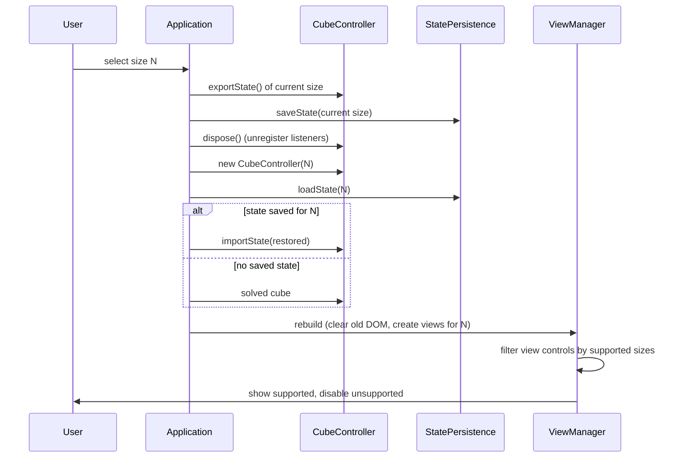

# feat: Multi-size cube support (2–7)

## Summary

Add a UI size selector for cube sizes 2 through 7, with per-size saved state and
per-view size-capability declarations. Flat, basic, and basic-2 work for all six
sizes; circular stays at 3×3 until per-N SVGs are authored. Moves parse against
the active size, and scramble length scales with size.

---

## Problem Frame

The app boots a fixed 3×3 cube (`new CubeController()` in `src/application.ts`).
The core model layer is largely size-agnostic, but three gaps block multi-size
shipping: (1) move parsing defaults to `cubeSize = 3` so a 4×4–7×7 controller
would rotate the wrong layers; (2) state persistence uses a single
`localStorage` slot so switching sizes would discard work; (3) views and the
view picker have no notion of which sizes they support, and the controller
re-registers event listeners on every construction with no teardown.

---

## Requirements

**Size selection and switching**

- R1. A size selector offers sizes 2–7; selecting a size activates a cube of
  that size. (origin R1, R2)
- R2. The last selected size is persisted and restored on launch; first launch
  with no saved size defaults to 3×3. (origin R3, R6)
- R3. Each size keeps its own saved state; switching sizes does not discard
  another size's progress. (origin R4, R5)

**Move correctness**

- R4. Face moves and whole-cube rotations parse against the active cube size and
  produce legal, correctly permuted states at every size 2–7. (origin R16)
- R5. Recreating the controller on size switch applies each move exactly once
  (no leaked event listeners). (plan-added)

**State persistence**

- R6. State is saved and restored per size, in a distinct storage slot per size.
  (origin R5)
- R7. Restoring or importing an even-size (2/4/6) state emits no spurious errors
  and skips no sticker-color handling; virtual-center cubies are excluded from
  color reconstruction. (origin R12)

**View size capability**

- R8. Each view declares the sizes it supports. (origin R7)
- R9. The UI renders only views that support the active size; unsupported views
  are disabled in the picker with a neutral note. (origin R8, R9)
- R10. Switching size hides open unsupported views and re-shows them when
  switching back to a supported size. (origin R9)

**Scramble**

- R11. Scramble works at every size with move count scaled to size (minimum
  `8 × N`). (origin R10, R11)

**Rendering**

- R12. Flat, basic, and basic-2 render all sizes 2–7 correctly; sticker sizing
  and spacing adapt for non-3 sizes. (origin R13, R14)
- R13. Circular view supports only sizes with a conforming SVG (3×3 initially).
  (origin R15)

---

## Key Technical Decisions

- **Size switch recreates the controller and the view manager.** A
  `CubeController` is bound to one `StateManager` whose invariants are
  size-specific; a size change means a new controller. Recreating the view
  manager keeps every view's model binding correct and treats size change as a
  full re-init (matches the prior "rebuild drops callbacks" lesson). The old
  controller must be disposed and old view DOM cleared before recreation.
- **Controller gains `dispose()`.** The constructor registers three listeners
  via `getEventBus()` but stores no references. `dispose()` stores the bound
  handlers and unregisters them, so repeated size switches cannot accumulate
  duplicate move handling.
- **Move parsing is size-aware.** `applyMove`/`undo`/`redo` pass the active size
  to `parseStringMove`, which currently defaults to 3. This is the one real
  core-layer defect found in research.
- **Per-size storage keys, unchanged format.** Keep the existing
  `<cubeSize>:<faceOrder>:<face1Colors>:...` string format. Size 3 reuses the
  existing `rubikCube_autoSave` key (so legacy 3×3 data loads with no
  migration); sizes 2 and 4–7 use per-size keys, plus one last-size key.
- **View capability via factory declaration.** An optional `getSupportedSizes()`
  on each `ViewFactory`; circular returns sizes with an authored SVG, others
  return the full 2–7 range. The registry exposes it for the picker.
- **Even-size fix is skip-not-remove.** In `stringToState` color reconstruction,
  skip `VIRTUAL_CENTER` cubies rather than removing virtual centers outright
  (removal loses cube-orientation info used for face labels).
- **Scramble count `8 × N`.** Follows the origin's own examples (16 for 2×2, 56
  for 7×7). 3×3 changes 20→24; accepted as part of the formula — the "no
  regression" criterion applies to view and move behavior, not scramble length.

---

## High-Level Technical Design

Size switch is a teardown-and-rebuild cycle across three components.

---

## Implementation Units

### U1. CubeController — size-aware move parsing and listener cleanup

- **Goal** — Make move parsing honor the active size and make the controller
  safe to recreate.
- **Requirements** — R4, R5
- **Dependencies** — none
- **Files** — `src/cube-controller.ts`, `src/cube-controller.core.test.ts`,
  `src/cube-controller.events.test.ts`
- **Approach** — Thread the controller's size through `applyMove`, `undo`, and
  `redo` into `parseStringMove(move, cubeSize)` (currently the size argument is
  omitted, defaulting to 3). Store the three `getEventBus().on(...)` bound
  handler references on construction and add a `dispose()` method that removes
  them via `getEventBus().off(...)`. No other public API change.
- **Patterns to follow** — Existing `getEventBus().on/off` usage in
  `src/events/event-bus.ts`; the constructor listener pattern already in
  `src/cube-controller.ts`.
- **Test scenarios**
  - Happy path: applying `R` on a 4×4 controller rotates layer 3 (the far
    layer), not layer 2; verify the moved cubies match 4×4 geometry.
  - Happy path: whole-cube rotation `x` on a 5×5 controller produces a legal
    state with all 6 faces permuted consistently.
  - Edge case: `2×2` controller applying `U` and `R` stays legal (8 cubies, no
    centers).
  - Integration: after `dispose()`, emitting `MOVE_REQUESTED` no longer calls
    the old controller's handler (register a spy, dispose, emit, assert not
    called).
  - Integration: constructing two controllers and disposing the first applies a
    move exactly once (second controller only).
- **Verification** — Type-check clean; new tests pass; existing 3×3 move tests
  unchanged.

---

### U2. StatePersistence — per-size slots and even-size import fix

- **Goal** — Store one state slot per size plus a last-size key, and stop
  even-size imports from logging spurious errors.
- **Requirements** — R2, R3, R6, R7
- **Dependencies** — none
- **Files** — `src/cube/core/state-persistence.ts`,
  `src/cube/core/state-persistence.test.ts`
- **Approach** — Add size to the storage key (e.g. derive a per-size key from
  the existing `STORAGE_KEY`) and add last-size accessors. Keep
  `stateToString`/`stringToState` format unchanged. In `stringToState`, skip
  `VIRTUAL_CENTER` cubies in the sticker-color reconstruction loop — their
  `facePosition` is non-integer for even sizes, which currently indexes
  `grid[row][col]` to `undefined` and logs "Unknown color letter".
- **Patterns to follow** — Existing `STORAGE_KEY` constant and save/load/clear
  method signatures in `src/cube/core/state-persistence.ts`; the
  `LocalStorageMock` in `vitest.setup.ts`.
- **Test scenarios**
  - Happy path: save a 4×4 state, load with size 4, assert round-trip equality
    (Covers AE5).
  - Happy path: save distinct states for sizes 2 and 5; loading each size
    returns its own state, not the other's.
  - Happy path: last-size key round-trips; absent last-size returns the 3×3
    default sentinel.
  - Edge case: importing a 2×2 state emits no "Unknown color letter" or "Invalid
    position" log (Covers AE3).
  - Error path: importing a malformed string still returns `null`.
- **Verification** — New tests pass; existing state-persistence tests still
  green (including the single-slot 3×3 path when size defaults to 3).

---

### U3. Application — size selector UI and size-switch orchestration

- **Goal** — Add the size selector control and wire the save → dispose →
  recreate → restore cycle.
- **Requirements** — R1, R2, R3, R6
- **Dependencies** — U1, U2
- **Files** — `index.html`, `src/application.ts`, `src/main.css`,
  `src/application.test.ts`
- **Approach** — Add a new `control-section` (Size) to `index.html` with a radio
  group of size options 2–7, mirroring the existing Theme/Views section markup.
  The group is a radiogroup with `aria-checked` on the active size; each option
  has a minimum 44×44px touch target, left/right arrow-key navigation across the
  group, and a visible focus style. The active option gets a distinct fill, and
  switching sizes updates `aria-checked` before the view re-render. In
  `Application`, add a size-switch path: export and save the current size's
  state, dispose the current controller, construct the new controller for the
  selected size, restore that size's state (or leave solved), then rebuild the
  view manager so views bind to the new model. Persist the selected size on
  change and restore it on launch. Ensure the previous view-manager DOM is
  cleared before rebuilding. Move history is per-controller (in-memory): it is
  cleared on size switch, so undo/redo never re-parses a move at a different
  size than the one it was made at.
- **Execution note** — Add a characterization test asserting the current 3×3
  boot path (single controller, default size) before wiring the switch, so the
  no-regression criterion is pinned.
- **Patterns to follow** — Existing `control-section` markup in `index.html`;
  the `setupControlVisibilityPersistence` persistence helper in
  `src/application.ts`; `getEventBus`/`Application.eventBus` singleton access.
- **Test scenarios**
  - Happy path: selecting size 4 swaps the active cube to a solved 4×4 and the
    selector reflects 4.
  - Happy path: the active size option is `aria-checked` and arrow keys move
    selection across 2–7 with a visible focus ring.
  - Happy path: scramble a 4×4, switch to 5×5, switch back — the 4×4 state is
    intact (Covers AE2, F2).
  - Happy path: launch with a saved last-size of 6 restores size 6 and its state
    (Covers R6).
  - Edge case: first launch with no saved size defaults to 3×3 (Covers R2).
  - Error path: a corrupted per-size saved string falls back to a solved cube
    rather than throwing.
- **Verification** — Type-check clean; tests pass; manual boot shows the size
  selector and a default 3×3.

---

### U4. View capability — declarations, picker filtering, hide/reshow

- **Goal** — Let each view declare supported sizes and have the picker/panels
  respect the active size.
- **Requirements** — R8, R9, R10, R12, R13
- **Dependencies** — U3
- **Files** — `src/view-manager/view-registry.ts`,
  `src/view-manager/view-lifecycle-manager.ts`,
  `src/view-manager/view-manager.ts`, `src/views/circular/index.ts`,
  `src/views/flat/index.ts`, `src/views/basic/index.ts`,
  `src/views/basic-2/index.ts`, `src/views/moves/index.ts`,
  `src/view-manager/view-registry.test.ts`,
  `src/view-manager/view-lifecycle-manager.test.ts`
- **Approach** — Add an optional `getSupportedSizes(): number[]` to the
  `ViewFactory` interface. Circular returns sizes with an authored SVG
  (currently `[3]`); basic/basic-2/flat/moves return the 2–7 range. In
  `ViewLifecycleManager.createViewControls`, read the active size and disable
  checkboxes for unsupported views, rendering an inline note next to each
  disabled checkbox ("Current size unsupported") associated via
  `aria-describedby` and removed when the size switches back to a supported
  value. On size switch, hide open unsupported views (removing their panel DOM)
  while keeping their visibility preference so switching back re-shows them; if
  the switch would hide the last visible view, auto-open a supported view (flat)
  so the viewport never goes empty. Also verify and minimally tune basic/basic-2
  sticker sizing and spacing for non-3 sizes (R12): confirm the size-driven
  loops already scale, then adjust CSS geometry only where a non-3 size visibly
  breaks.
- **Patterns to follow** — `getAvailableViews`/`getViewTitle` registry accessors
  in `src/view-manager/view-registry.ts`; the checkbox build loop in
  `src/view-manager/view-lifecycle-manager.ts`; per-view factory files already
  exporting `getViewType`/`getTitle`.
- **Test scenarios**
  - Happy path: with circular open at 3×3, switching to 4×4 hides the circular
    panel and disables its picker checkbox; switching back to 3×3 re-shows it
    (Covers AE1, R9, R10).
  - Happy path: flat/basic/basic-2 picker entries remain enabled at every size
    2–7.
  - Edge case: circular picker entry is disabled at 2×2 and 4×4–7×7.
  - Integration: hiding an unsupported view on switch removes its panel DOM and
    re-shows it with a fresh model binding on switch-back.
  - Edge case: switching away from 3×3 with only circular open auto-opens a
    supported view (flat) instead of leaving an empty viewport.
- **Verification** — Registry tests assert each factory's supported sizes; view
  lifecycle tests assert disabled/hidden behavior at non-3 sizes.

---

### U5. Scramble — size-scaled move count

- **Goal** — Scale scramble length with cube size per the `8 × N` floor.
- **Requirements** — R11
- **Dependencies** — U1
- **Files** — `src/cube-controller.ts`, `src/cube-controller.core.test.ts`
- **Approach** — Make `scramble` compute its move count from the controller's
  size when no explicit count is passed (default path). Keep the explicit
  `moveCount` argument for callers and tests that pass one. The formula is
  `8 × N` (2→16, 3→24, 4→32, 5→40, 6→48, 7→56).
- **Patterns to follow** — Existing `scramble(moveCount = 20)` signature and its
  random face/modifier loop in `src/cube-controller.ts`.
- **Test scenarios**
  - Happy path: a 7×7 scramble produces at least 56 moves and more than a 2×2
    scramble (Covers AE4).
  - Happy path: a 2×2 scramble produces at least 16 moves.
  - Edge case: explicit `scramble(10)` still honors the passed count (10 moves)
    regardless of size.
  - Edge case: a 4×4 scramble produces a legal, non-solved state.
- **Verification** — New tests pass; existing 3×3 scramble tests updated to
  reflect the 24-move default (or re-asserted with an explicit count).

---

## Scope Boundaries

**Deferred for later**

- Circular view sizes 2, 4, 5, 6, 7 (separate phase; per-N SVG authoring; order
  decided at that phase).
- Removal and replacement of virtual-center cubies (separate refactor).

**Outside this feature**

- Solver and parity algorithms for any size.
- Sizes above 7.
- Cross-device or cloud state sync.

**Deferred to Follow-Up Work**

- The `diagnostics.dumpFlatView` virtual-center logging path can be removed as
  dead code once `faceGrid.virtualCenter` is confirmed unused elsewhere — not
  required by this feature.

---

## Open Questions

**Deferred to Planning / Implementation**

- Exact per-size scramble formula beyond the `8 × N` floor (the floor is fixed;
  any richer mixing standard is implementation-time).
- CSS geometry tuning specifics for basic/basic-2 at each non-3 size (visual
  pass, discovered during implementation).
- Phase order and scheduling for the remaining circular view sizes.

---

## Risks & Dependencies

- **Event-listener leak on recreation** — without `dispose()`, each size switch
  adds three more move handlers and every move is applied multiple times.
  Mitigated by U1.
- **View DOM teardown** — recreating the view manager must clear the old panels
  or the page mixes stale and new markup (prior regression in this area).
  Mitigated by U3/U4 clear-before-rebuild.
- **3×3 scramble length changes 20→24** — a consequence of the `8 × N` formula
  chosen per the origin's own examples; not a view/move regression but worth
  confirming at review.
- **Basic/basic-2 CSS geometry** — non-3 sizes may need sticker sizing/spacing
  adjustments beyond a one-line change; the plan treats this as a bounded visual
  pass inside U4's supported-size scope, not a structural rewrite.

---

## System-Wide Impact

- `localStorage` gains per-size state keys plus a last-size key; size 3 reuses
  the existing `rubikCube_autoSave` key, so legacy 3×3 data continues to load
  with no migration (verified in U2).
- `CubeController` construction is now paired with a required `dispose()` call
  before replacement; any future code that constructs controllers must follow
  the same pattern.
- The `ViewFactory` interface gains an optional capability method; factories
  that omit it are treated as supporting all sizes (safe default).

---

## Sources / Research

- Origin requirements:
  `docs/brainstorms/2026-08-16-multi-size-2-7-support-requirements.md`
- Readiness overview: `docs/brainstorms/multi-size-readiness-overview.md`
- Move parser default-size defect: `src/cube/core/move-parser.ts`
  (`parseStringMove(moveString, cubeSize = 3)`) called without size from
  `src/cube-controller.ts`.
- Even-size import defect: `src/cube/core/state-persistence.ts` `stringToState`
  color-reconstruction loop indexing `grid[row][col]` with a non-integer
  `facePosition`.
- Institutional learning:
  `docs/solutions/features/basic-view-ghost-stickers-2026-05-03.md`
  (shared-module DOM queries must be scoped per view; even sizes have no center
  cubie).
