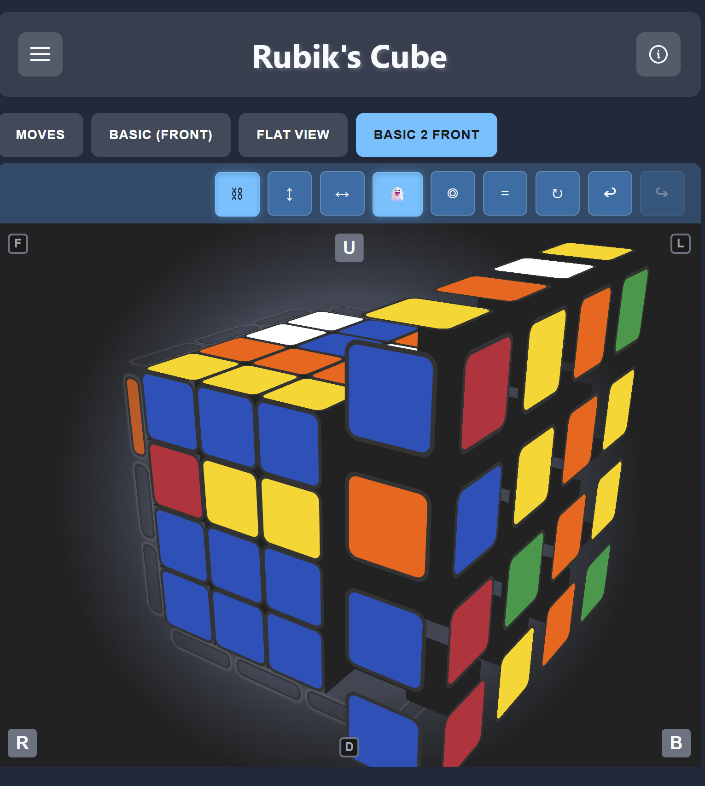
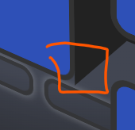
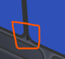
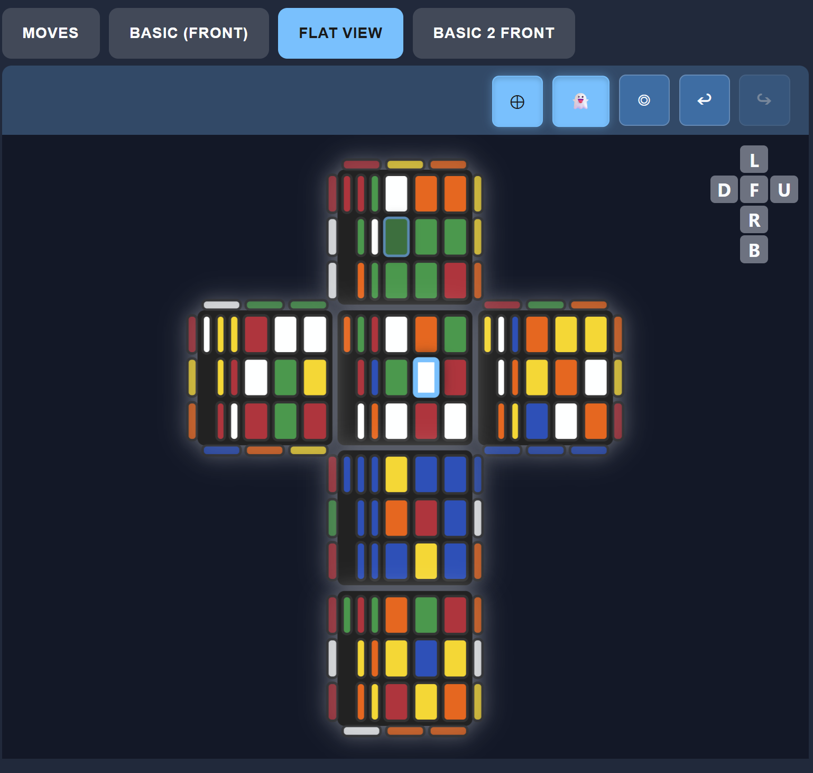
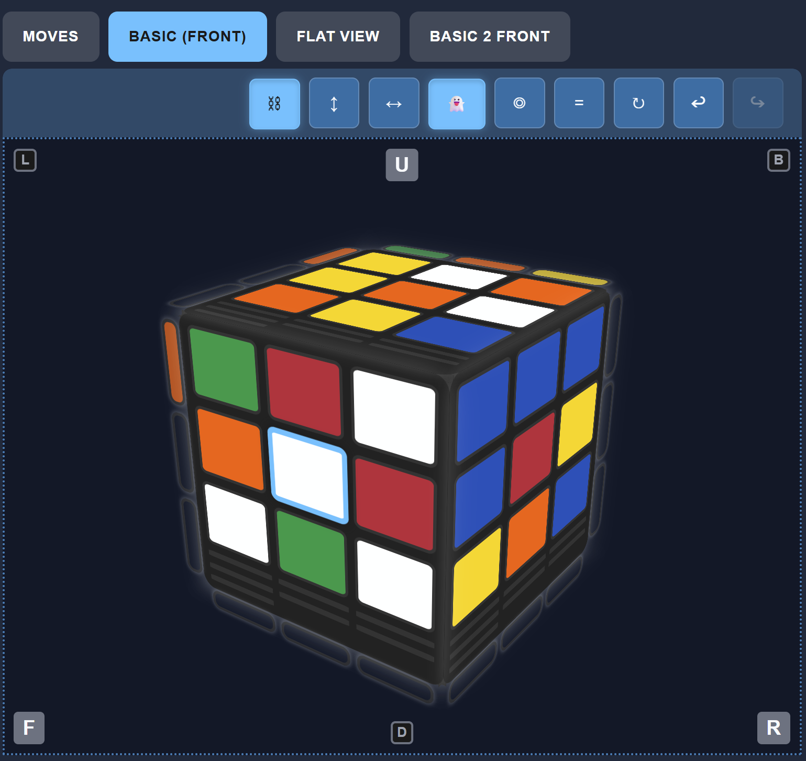
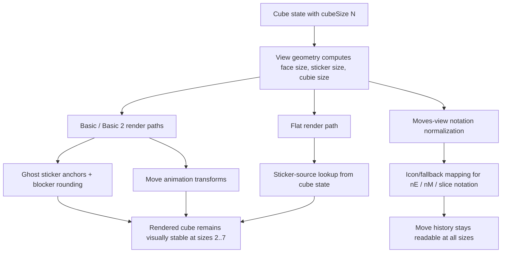

# fix: Multi-size rendering and move notation defects

## Summary

Fix the remaining non-3×3 rendering defects across the Basic, Basic 2, Flat, and
Moves views. The work is scoped to the visual fidelity issues reported in
browser review: ghost stickers remain fixed at 3-wide, layer geometry breaks
during moves for non-3 cube sizes, the Basic 2 background and blocker styling do
not match the legacy Basic view, source sticker inference is wrong in non-3
render paths, and many valid non-3 move notations have no icon mapping in the
Moves view.

---

## Problem Frame

The multi-size support work already landed the size selector, per-size
persistence, and core model support for 2–7. The regression now sits in the view
layer and move-notation layer rather than in the cube engine itself. The browser
review isolated six concrete breakpoints:

1. Ghost stickers stay visibly 3×3 regardless of cube size.
2. Basic 2 layers expand/collapse during rotations when cube size is not 3.
3. Basic 2 keeps a different background than the original Basic view.
4. Basic 2 blockers retain harsh square corners and visually punch out of the
   cube.
5. Basic and Flat views infer sticker source geometry incorrectly for non-3
   sizes.
6. Many moves like `3E2` and other non-3 slice notations have no icon fallback
   in the Moves view.

The goal is to restore visual parity for all supported sizes without regressing
the 3×3 experience.

### Current regression note (post-animation corner orientation)

A partial fix was attempted for the Basic 2 re-render path, but it exposed a
new, distinct regression: the move rotation itself remains correct, yet corner
cubies are visibly re-oriented with the wrong sticker faces after the turn
finishes. In other words, the layer rotates correctly, but the final post-move
repaint applies stale or incorrectly ordered sticker metadata to the affected
corner cubies. This appears to be a view-layer issue introduced while fixing the
repaint/DOM update path, not a core cube-model invariant problem.

This means the work is still split between:

- the already-resolved size/geometric defects in the Basic 2 layer layout and
  ghost sizing, and
- a separate corner-orientation regression that occurs after animation
  finalization and must be isolated before we consider the move-visual fix
  complete.

---

## Canonical terminology and execution order

To keep the work unambiguous across views, this plan uses the following naming
consistently:

- Basic = the original 3D cube view.
- Basic 2 = the new, alternate 3D layered view.
- Flat = the flat projected view (cube surface unfolded as cross).
- Ghost stickers = the transparent/guide overlay used to show face alignment and
  move context.

The fixes are intentionally sequenced in dependency order so the visual symptoms
do not get patched before the underlying geometry contract is corrected:

1. Root-cause geometry and sticker-source alignment in the shared render layer.
2. Basic 2 layer stability and ghost anchor sizing during non-3 moves.
3. CSS parity between Basic and Basic 2 for background and blocker rounding.
4. Moves-view notation normalization and fallback mapping for nE / nM / slice
   families.
5. Final regression pass across sizes 2, 3, 4, 5, 6, and 7 and view modes Basic,
   Basic 2, Flat, and Moves.

This ordering prevents cosmetic styling changes from obscuring a still-broken
render primitive or stale sticker-source lookup.

---

## Requirements

- R1. Ghost stickers scale with the active cube size and stay aligned to the
  real face geometry for all supported sizes.
- R2. Basic 2 move animations keep a stable layer geometry for sizes 2, 4, 5, 6,
  and 7 and do not expand or collapse as the layer rotates.
- R3. Basic 2 matches the Basic view's cube background tone and visual treatment
  for the same mode.
- R4. Basic 2 blockers use corner rounding consistent with the visible face
  geometry so they read as part of the cube rather than as separate hard-edged
  plates.
- R5. Basic and Flat render paths derive sticker positions from the active cube
  size and source sticker mapping rather than from a 3×3 assumption.
- R6. The Moves view exposes an icon or fallback representation for all valid
  move notations in the current history, including size-specific layer moves
  such as `3E2` and similar `nE`, `nM`, or slice forms.
- R7. 3×3 behavior remains unchanged across all views and move actions.

## Scope Boundaries

### In scope

- Ghost sticker geometry and sizing in the Basic, Basic 2, and Flat views.
- View layer transform and cubie layout logic for non-3 sizes.
- CSS parity between Basic and Basic 2 for face background, blocker rounding,
  and visual treatment.
- Sticker-source lookup in Basic and Flat view rendering and move interaction.
- Moves-view icon fallback mapping for size-specific layer notations.
- Regression coverage for the underlying render and interaction paths.

### Deferred to follow-up work

- New icon assets for every unique non-3 move notation beyond the existing
  symbol set.
- A full design cleanup of the Moves view layout beyond the fallback mapping
  required for readability.
- Circular view multi-size asset work; that remains a separate phase under the
  existing requirement document.

---

## Key Technical Decisions

- The root cause is likely in view-local geometry, not in the core cube model.
  The core move engine already works across sizes; the rendering layer appears
  to keep hardcoded 3×3 assumptions for ghost strip sizing, sticker-grid
  projection, layer transforms, and icon lookup. Existing size-aware
  calculations must be characterized before being replaced; the browser symptom
  alone does not establish which transform or measurement is wrong.
- The fix should be implemented at the render boundary and CSS boundary: derive
  geometry from `model.getCurrentState().cubeSize`, face side length, cubie
  size, and the active face grid instead of using fixed numeric assumptions.
- The Basic, Basic 2, and Flat views should share the same calculation
  primitives wherever possible to avoid drift between the 3D and projected
  visuals, while preserving each view's distinct host geometry.
- Moves icons should use a normalization strategy, not a one-off icon per
  notation. Most non-3 slice moves collapse to a canonical face + layer family,
  with a single generic icon used as a fallback when a precise match is absent.
- The changes should be validated at the view contract level with DOM-based
  tests and targeted move-history render tests, because the user-facing defect
  is visual and interaction-oriented rather than purely model-level.

### Notation fallback matrix

The Moves view will normalize notation families before icon lookup. The
canonical fallback precedence is:

- Exact icon match for the literal notation, if present.
- Canonical family match by axis and layer family (`M`, `E`, `S`, `U`, `D`, `L`,
  `R`, `F`, `B`, etc.).
- Generic slice-family fallback when the notation is valid but no dedicated icon
  exists.
- Final text fallback for unrecognized or malformed notation, keeping the move
  list readable without crashing or dropping the entry.

Representative mapping examples:

- `2M`, `3M`, `4M`, `5M` -> family `M` fallback, with a generic M-style icon or
  the move text if no icon exists.
- `2E`, `3E`, `4E`, `5E`, `3E2` -> family `E` fallback.
- `2S`, `3S`, `4S` -> family `S` fallback.
- `Rw`, `Lw`, `Uw`, `Dw`, `Fw`, `Bw` and equivalent wider slice families ->
  canonical face + wide-layer fallback.

This keeps the icon system small while ensuring that all valid history entries
remain readable across cube sizes.

---

## Visual References

The screenshots below were archived from the VS Code image cache for repeated
review and comparison during later fixes. They are intentionally stored next to
the plan so they remain available without depending on the temporary
browser/image cache.

- [Basic 2 front / ghost issue reference](visuals/image-1786902119735.png)
  
- [Basic view parity comparison](visuals/image-1786902228442.png)
  
- [Basic 2 edge / blocker corner issue](visuals/image-1786902390799.png)
  
- [Flat view non-3 render issue](visuals/image-1786902481643.png)
  
- [Basic 2 / flat visual reference set](visuals/image-1786902471019.png)
  

---

## High-Level Technical Design

---

## Implementation Units

### U1. Ghost sticker sizing and anchor geometry

- **Goal** — Ensure ghost stickers always match the active cube size and face
  dimensions, rather than staying locked to a 3×3 layout.
- **Requirements** — R1, R7
- **Dependencies** — none
- **Files** — `src/views/basic/ghost-stickers.ts`,
  `src/views/basic/ghost-stickers.module.css`,
  `src/views/basic/rendering.test.ts`, `src/views/basic-2/rendering.ts`,
  `src/views/basic-2/basic-2-view.module.css`,
  `src/views/basic-2/basic-2-view.ghost.test.ts`,
  `src/views/flat/ghost-strips.ts`, `src/views/flat/ghost-strips.test.ts`
- **Approach** — Replace hardcoded 3×3 ghost-strip assumptions with calculations
  derived from the active face size and sticker spacing. Recompute visible
  edges, source positions, and ghost anchor positions from `cubeSize` and the
  actual sticker grid instead of static 9-cell geometry. Keep the current 3D
  ghost visibility behavior but resize it to each cube size, and apply the
  equivalent source-position correction to Flat's independent ghost-strip
  implementation. The geometry should be computed once per render and refreshed
  on move updates. Preserve the Basic 2 anchor wrapper as a separate non-cubie
  host so animated layer selection cannot reparent or distort ghost anchors.
- **Patterns to follow** — The existing ghost sticker composition in
  `src/views/basic/ghost-stickers.ts`, the ghost-anchor lifecycle in
  `src/views/basic-2/rendering.ts`, and Flat's source-position table and colour
  synchronization in `src/views/flat/ghost-strips.ts`.
- **Test scenarios**
  - Happy path: a 2×2 cube produces ghost strips sized for the 2×2 face grid,
    not a 3×3 grid.
  - Happy path: a 7×7 cube produces ghost strips that span the larger face
    without clipping or overlap.
  - Happy path: a 2×2 and 7×7 Flat view creates exactly one ghost sticker per
    source edge position and copies colours from the corresponding source face.
  - Edge case: toggling ghost visibility on a non-3 size keeps the anchors and
    visible faces aligned after a move.
  - Integration: a move after ghost toggle still preserves the correct ghost
    placement and opacity.
- **Verification** — DOM tests pass for ghost visibility; browser screenshots
  confirm ghost strips remain proportional across sizes.

### U2. Basic 2 layer transform stability during move animations

- **Goal** — Stop the rotating layer from expanding or collapsing when cube size
  is not 3.
- **Requirements** — R2, R7
- **Dependencies** — U1
- **Files** — `src/views/basic-2/animations.ts`,
  `src/views/basic-2/cubie-rendering.ts`, `src/views/basic-2/rendering.ts`,
  `src/views/basic-2/basic-2-view.ts`, `src/views/basic-2/animations.test.ts`,
  `src/views/basic-2/cubie-rendering.test.ts`
- **Execution note** — Add characterization coverage first for the current
  `cubieSize`, face-size, transform-origin, and layer-element bounding-box
  behavior at 2×2, 4×4, 5×5, and 7×7. Only change the geometry calculation after
  the characterization distinguishes a stale measurement, incorrect pivot, or
  layer membership defect.
- **Approach** — Trace the layer transform and cubie placement path against the
  characterization cases; do not assume the currently size-aware calculations
  are the defect. If a fixed width, stale measurement, or hardcoded spacing is
  found, replace it with values derived from the cube face size and current
  active layer. Normalize the per-cubie transform origin and pivot timing so
  layer movement is driven by `cubieSize`, and ensure the render is remeasured
  after each move before the display is rebound.
- **Patterns to follow** — Existing cubie rendering and animation helpers under
  `src/views/basic-2/`.
- **Test scenarios**
  - Happy path: a `U` move on a 4×4 Basic 2 cube keeps the affected layer within
    the same bounding box before and after rotation.
  - Happy path: a `R` move on a 2×2 cube does not collapse the layer or create
    overlap with neighboring cubies.
  - Edge case: a whole-cube rotation on a 5×5 cube preserves face alignment and
    layer spacing.
  - Integration: a move followed by a second move still uses the updated cubie
    geometry rather than stale 3×3 coordinates.
- **Verification** — Targeted animation tests pass and visual regression check
  confirms that non-3 Basic 2 layer transforms remain stable.

### U3. Basic 2 visual parity and blocker rounding

> **Status:** Partial — the Basic 2 cube-background/glow parity portion (R3) is
> complete. Blocker rounding (R4) remains.
>
> Implemented: added theme-agnostic `--color-basic2-cube-glow` semantic token in
> `src/styles/tokens.scss` (transparent in light, `--palette-slate-800` in dark)
> and used it as the Basic 2 `.cube-container` radial-gradient glow stop,
> matching the Basic view background treatment per theme.

- **Goal** — Make the Basic 2 view match the established Basic view background
  and soften blocker edges to avoid sharp corners.
- **Requirements** — R3, R4, R7
- **Dependencies** — U1, U2
- **Files** — `src/views/basic-2/basic-2-view.module.css`,
  `src/views/basic-2/rendering.ts`, `src/views/basic/basic-view.module.css`,
  `src/views/basic/initialization.ts`, `src/views/basic-2/rendering.test.ts`
- **Approach** — Review the CSS tokens and face-shell styling to align Basic 2
  with the same dark cube background used by the original Basic view. Reuse the
  same radius variables or derived values for blocker silhouette and sticker
  corners so the blocker edge reads as part of the cube body instead of a rigid
  plate. The fix should be CSS-only unless it reveals that the markup still
  emits 3×3-specific geometry tokens.
- **Patterns to follow** — Existing `cube-blocker` and face styling in
  `src/views/basic/basic-view.module.css` and the shared style tokens in
  `src/styles/tokens.scss`.
- **Test scenarios**
  - Happy path: Basic 2 background matches the Basic background color on the
    same active face and view mode.
  - Edge case: blocker radius remains visually consistent at 2×2 and 7×7 without
    clipping or overflow.
  - Integration: toggling ghost states or rotating the cube does not reintroduce
    square blocker edges.
- **Verification** — CSS snapshot checks or browser screenshot review confirms
  the background and blocker rounding match the Basic viewport.

### U4. Source sticker inference in Basic and Flat views for non-3 sizes

- **Goal** — Correct the wrong sticker-source lookup that makes Basic and Flat
  render incorrectly for sizes other than 3.
- **Requirements** — R5, R7
- **Dependencies** — none
- **Files** — `src/views/basic/rendering.ts`,
  `src/views/basic/initialization.ts`, `src/views/basic/selection.ts`,
  `src/views/basic/rendering.test.ts`, `src/views/flat/rendering.ts`,
  `src/views/flat/selection.ts`, `src/views/flat/rendering.test.ts`,
  `src/views/flat/flat-view.test.ts`, `src/interaction/move-inference.ts`,
  `src/cube/utils/state-conversion.ts`
- **Approach** — Audit the render path for any cell-index or face-grid
  assumptions that still assume a 3×3 sticker lattice. The fix should source
  sticker data from the active cube model and the face's generated grid
  structure, not from a fixed 3×3 lookup in the DOM. Use `cubeSize` and sticker
  IDs for the source mapping, and ensure selection and move inference rebind to
  the correct sticker on every face after a move. This is likely the core issue
  behind the reported “wrong source sticker” behavior in Basic and Flat views.
- **Patterns to follow** — `CubeStateUtils.getStickerAt(...)`,
  `createFlatView(...)`, and the face-grid generation in
  `src/cube/utils/state-conversion.ts`.
- **Test scenarios**
  - Happy path: a 4×4 Basic view renders each face from its actual sticker
    layout, with no 3×3 skew or missing stickers.
  - Happy path: a 5×5 Flat view shows the correct sticker ordering and valid
    face neighbors after a face move.
  - Edge case: selecting a center sticker on a non-3 size does not resolve to a
    stale sticker on the wrong face.
  - Integration: a face move updates the selected sticker and the rendered
    geometry to the new source sticker without stale highlight references.
- **Verification** — Existing rendering tests pass; new tests cover 2×2, 4×4,
  and 6×6 selection and render paths for both Basic and Flat.

### U5. Moves view fallback mapping for non-3 move notation

- **Goal** — Keep move history readable for non-3 slice notation without
  introducing a large new icon set.
- **Requirements** — R6, R7
- **Dependencies** — none
- **Files** — `src/views/moves/renderer.ts`, `src/views/moves/moves-view.ts`,
  `src/views/moves/renderer.test.ts`, `src/icons/move-icon-generator.ts`,
  `src/icons/index.ts`
- **Approach** — Keep notation-family normalization adjacent to
  `MOVE_ICON_PRESETS` in `src/icons/move-icon-generator.ts`, where the canonical
  icon families and their exact-match metadata are defined. Use the parser and
  generated move definitions as the authority for valid numeric prefixes, slice
  families, suffixes, and wide-layer forms; do not duplicate move validity rules
  in the icon resolver. Expose a resolver for the renderer that preserves exact
  matches, maps valid numeric layer prefixes and wide-layer suffixes to a
  canonical family preset, and returns an explicit text-fallback result for
  malformed or unsupported notation. The renderer should consume that result
  rather than indexing `MOVE_ICONS` directly, retaining the original notation as
  the visible label. This keeps the existing icon system and does not require
  new exact assets for every notation.
- **Patterns to follow** — The current `MOVE_ICON_PRESETS`, `isMoveNotation`,
  and `MOVE_ICONS` lookup in `src/icons/move-icon-generator.ts` and
  `src/icons/index.ts`, the parser grammar and canonical casing in
  `src/cube/core/move-parser.ts`, generated numeric slice definitions in
  `src/cube/core/cube-invariants.ts`, plus the label overlay and text fallback
  in `src/views/moves/renderer.ts`.
- **Test scenarios**
  - Happy path: `3E2` resolves to the canonical `E`/slice-family icon with a
    readable label.
  - Happy path: `2M`, `3M`, and `4M` all map to the same family of generic M
    icon or fallback style without crashing.
  - Happy path: a numbered wide move such as `2Rw2` resolves to the canonical
    wide-face family while retaining `2Rw2` as its visible label.
  - Edge case: notations without a stored icon use the text fallback while
    preserving the move history list layout.
  - Integration: long move histories continue to render in the correct
    current-item state and scroll position after a move.
- **Verification** — Renderer tests cover normalized notation families and
  fallback rendering; the UI remains readable for 2×2, 4×4, and 7×7 move
  histories.

### U6. Cross-view regression pass and visual verification

- **Goal** — Validate the fix across all affected views and prevent the 3×3
  regression from reappearing.
- **Requirements** — R1-R7
- **Dependencies** — U1-U5
- **Files** — `src/views/basic/rendering.test.ts`,
  `src/views/basic-2/*.test.ts`, `src/views/flat/ghost-strips.test.ts`,
  `src/views/flat/rendering.test.ts`, `src/views/flat/flat-view.test.ts`,
  `src/views/moves/renderer.test.ts`, `src/application.test.ts`
- **Approach** — Run a final targeted regression pass over the full size matrix
  for 2, 3, 4, 5, 6, and 7 in Basic, Basic 2, and Flat views. Confirm the 3×3
  view remains unchanged while non-3 sizes render correctly. Keep the testing
  focused on actual view behavior rather than only model state because the
  defect is visual and interaction-driven.
- **Patterns to follow** — Existing view-specific tests and the
  application-level size-switch tests already used in the multi-size feature
  branch.
- **Test scenarios**
  - Happy path: sizes 2, 4, 5, 6, and 7 render without ghost misalignment or
    broken source sticker mapping.
  - Happy path: Basic 2 move animations remain stable for each size after
    repeated U/R rotations.
  - Happy path: 3×3 remains visually and functionally unchanged.
  - Integration: size switching from 3 to 4 to 2 and back preserves the
    corresponding saved state and view configuration.
- **Verification** — The targeted test matrix passes and browser review confirms
  that the six reported issues are resolved without regressions in the 3×3
  baseline.

---

## Verification Strategy

The implementation is complete only when the checks below pass for the supported
size matrix and the 3×3 baseline remains unchanged.

| Size | Views                       | Required checks                                                                   | Pass condition                                                                     |
| ---- | --------------------------- | --------------------------------------------------------------------------------- | ---------------------------------------------------------------------------------- |
| 2    | Basic, Basic 2, Flat, Moves | ghost alignment, sticker-source mapping, layer stability, notation fallback       | no 3×3 assumptions remain; rendered faces and move history are readable and stable |
| 3    | Basic, Basic 2, Flat, Moves | baseline parity and no visual drift                                               | existing 3×3 behavior remains unchanged                                            |
| 4    | Basic, Basic 2, Flat, Moves | face geometry, layer transforms, ghost anchors, `2M`/`3E2`-like notation families | no expansion/collapse, no stale sticker mapping, no missing icon fallback          |
| 5    | Basic, Basic 2, Flat, Moves | repeated rotations, ghost toggle cycles, slice notation fallback                  | all layers remain aligned and visible after move updates                           |
| 6    | Basic, Basic 2, Flat, Moves | geometry consistency with larger tile counts                                      | no clipping, overlaps, or mis-scaled ghost stickers                                |
| 7    | Basic, Basic 2, Flat, Moves | maximum-size rendering sanity                                                     | no misalignment or degraded layer spacing in the largest supported cube            |

Required acceptance signals:

- Basic, Basic 2, and Flat views render consistently for sizes 2, 3, 4, 5, 6,
  and 7.
- Ghost stickers stay aligned at every size and remain responsive to toggling
  and move updates.
- Basic 2 layers no longer expand or collapse during rotation for size != 3.
- The Basic 2 background and blocker angles visually match the expected styling
  from the Basic view.
- Invalid or stale sticker-source inference is eliminated in Basic and Flat
  non-3 render paths.
- The Moves view shows a readable icon or normalized fallback for size-aware
  notation family names such as `3E2` and `2M`.
- The existing test suite continues to pass with the new targeted coverage for
  the non-3 render defects.

---

## Risks and Dependencies

- The most likely risk is that the render issue is spread across multiple small
  geometry assumptions rather than a single root cause, so the fix should be
  done in the smallest possible render helper set rather than by editing each
  symptom in isolation.
- A second risk is that visual parity changes in CSS can be subtle; browser
  review remains important because automated tests cannot assess the exact
  corner radius and background match in a way that is reliable for the user
  report.
- The work depends on the existing size-aware state model and view registry
  already introduced by the multi-size feature branch; it is a view-rendering
  and UI polish fix, not a core model rewrite.
