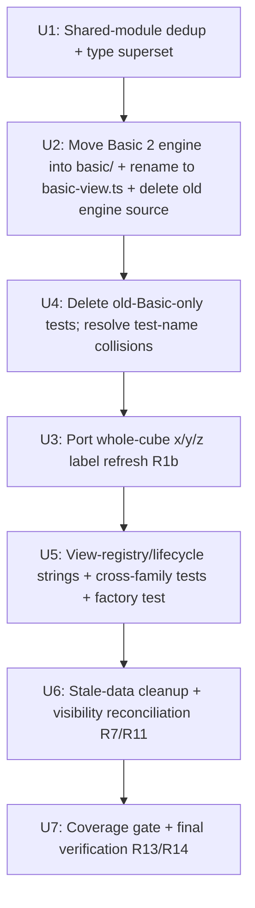

# refactor: Cut over Basic 2 to replace the Basic view

## Summary

Make the animated per-cubie "Basic 2" view the single, default 3D cube view by
having it absorb the "Basic" identity: its files move into `src/views/basic/`,
its viewType IDs become `basic-front`/`basic-back`, the old static face-based
Basic-only code is deleted, duplicated types are unified, and stale
`view-panel-basic-2-*` data is cleaned up. Executed incrementally so each unit
lands independently.

## Problem Frame

The app ships two near-identical 3D views: the original static Basic view
(face-grid DOM, no move animations) and Basic 2 (per-cubie DOM with Web
Animations API move animations). Basic 2 has reached production readiness and
fixes the multi-size rendering that Basic cannot (Basic's face grid is hardcoded
`repeat(3, 1fr)`; Basic 2 is per-cubie and size-agnostic). Keeping both is pure
carrying cost: two renderers, two CSS modules, duplicated view classes (~28
identical `c8 ignore` guards), and overlapping test surfaces. The shared
interaction modules (`commands`, `navigation`, `selection`, `touch-handler`,
`interaction-adapter`, `linked-rotations`, `ghost-stickers`) already live in
`src/views/basic/` and Basic 2 imports them — so this is a controlled cutover
(Basic 2 absorbs Basic's identity), not a from-scratch rebuild and not a folder
delete of `src/views/basic/`.

One real functional gap must be ported, not deleted: Basic 2 does receive
whole-cube `x`/`y`/`z` model moves (via global keys and `alignCubeToView`), but
its `handleMoveExecuted` never refreshes face labels after them, while the old
Basic's `updateSelective` did. See
`docs/brainstorms/2026-09-05-basic2-cutover-requirements.md` for the full
requirements and the review that corrected this parity claim.

## Requirements

Carried from the origin requirements doc (R-IDs preserved). Grouped by concern.

**View consolidation**

- R1. The app offers exactly one 3D cube view family with viewType IDs
  `basic-front` and `basic-back`, backed by the Basic 2 engine (per-cubie DOM,
  move animations).
- R1b. The surviving engine refreshes face labels after whole-cube `x`/`y`/`z`
  `MOVE_EXECUTED` events, matching the deleted Basic `updateSelective` behavior.
  Hooked at the top of `handleMoveExecuted` on the move notation so it fires on
  all whole-cube outcome paths (animated, reduced-motion fallback,
  no-`movedCubies` full update). Regression test is net-new.
- R2. The old static face-based Basic rendering path is removed: its
  `basic-view.ts`, `rendering.ts`, `initialization.ts`, `basic-view.module.css`,
  and their Basic-only tests are deleted. No runtime code path may still
  reference the removed renderer.
- R3. Shared interaction modules (`commands`, `navigation`, `selection`,
  `touch-handler`, `interaction-adapter`, `linked-rotations`, `ghost-stickers`)
  are deduplicated to a single home inside the surviving `src/views/basic/`
  folder, with no `basic-2` / old-vs-new branch remaining in them.
- R4. The duplicated type declarations (`BasicVariant`, `BasicViewState`,
  `BasicViewInternalData`) and duplicated `BASIC_VIEW_ANGLES` constants are
  unified into one source of truth.
- R5. The hover-scale interaction from the old Basic view is intentionally
  **removed** during consolidation (the surviving engine reads `state.isHovered`
  but nothing sets it). Its removal is a deliberate product decision alongside
  the halo-ring removal; confirm no test asserts the removed behavior.

**Identity and defaults**

- R6. The surviving view is titled and registered as the "Basic" view (Basic
  (Front) / Basic (Back)), replacing the "Basic 2" labels.
- R7. `basic-front` and `basic-back` are default-checked in the view picker.
  **Visibility reconciliation:** when a returning user's saved
  `rubiksCubeVisibleViews` shows `basic-2-front`/`basic-2-back` enabled, the
  surviving `basic-front`/`basic-back` variant is auto-checked so no
  post-cutover launch leaves the user without a 3D Basic view. If a user has
  explicitly hidden both `basic-front` and `basic-back` (both `false`) with no
  `basic-2-*` pref, honor the hide.
- R8. The view registry order and any panel/geometry defaults follow the
  surviving `basic-*` viewTypes; the `basic-2-*` variants no longer exist in the
  registry.

**Data migration and cleanup**

- R9. Users who previously used the Basic view keep their Basic panel layout and
  view orientation unchanged after the cutover (Basic 2 engine inherits the
  saved `view-panel-basic-front`/`view-panel-basic-back` state, whose format the
  two engines share). No legacy Euler-shape migration is required.
- R10. Users who previously opted into Basic 2 lose that view's panel layout and
  orientation (stored under `view-panel-basic-2-*`) when they launch after the
  cutover. This is accepted as a minor, defensible loss: Basic 2 was an opt-in,
  default-unchecked view, and only its customization is affected — never cube
  state. No layout-inheritance fallback is provided.
- R11. Stale `view-panel-basic-2-*` keys **and the `basic-2-front`/
  `basic-2-back` entries inside the `rubiksCubeVisibleViews` visibility map**
  are cleared. **Ordering:** the reconciliation in R7 reads the `basic-2-*`
  visibility entries on the first post-cutover launch, so cleanup runs only
  after that first view-boot reconciliation pass. Cleanup is prefix-scoped to
  `basic-2-*` — never the full storage-clear command.

**Testing and quality**

- R12. During the cutover, tests are carried through the refactor; the
  intermediate state is not forced to meet the full coverage gate.
- R13. The end state (one Basic folder) meets the project quality gate:
  `npm run all` passes. Note the gate is global (project-wide thresholds in
  `vitest.config.ts`), not per-module.
- R14. Move animations, per-cubie rendering, layer stability, corner
  orientation, and ghost-sticker integration retain their existing functional
  coverage after the rename (the Basic 2 test files move with the code).

## Key Technical Decisions

- **Basic 2 absorbs the Basic identity; files move into `src/views/basic/`,**
  and the engine file is renamed `basic-2-view.ts` → `basic-view.ts`. Choosing
  the clean end-state name means internal imports in `rendering.ts`,
  `initialization.ts`, `cubie-rendering.ts`, `animations.ts`, and their tests
  are updated in the same change (see U2). Rationale: a `basic-2-view.ts`
  sitting inside `basic/` perpetuates the very naming confusion the cutover
  removes.
- **The surviving `types.ts` is the superset.** The consolidated
  `BasicViewInternalData` gains the three Basic-2 fields (`onStickerSelected`,
  `ghostAnchorContainer`, `cubieSize`) that the old Basic-only shape lacked. The
  old engine (deleted) is the only consumer of the old narrower shape.
- **`commands.ts` needs no change to its `./rendering` import after the move.**
  It calls only `updateRotation` and `updateFaceLabels`, both exported with
  identical signatures by the Basic-2 engine's `rendering.ts`, so when the old
  `rendering.ts` is deleted the surviving shared module resolves to the Basic-2
  renderer automatically.
- **The registry/lifecycle needs no structural change.** The single remaining
  `basic/index.ts` factory (returning `basic-front`/`basic-back`) auto-fits the
  glob discovery, `desiredOrder`, and the default-checked list. All work is the
  viewType string updates plus deleting the second factory.
- **Cleanup is a one-time, prefix-scoped pass, sequenced after reconciliation.**
  Modeled on the existing `clearViewStorage` pattern but restricted to
  `basic-2-*` keys and `rubiksCubeVisibleViews` entries, gated by a marker key
  so it runs once, and it must not run before R7's reconciliation reads the
  `basic-2-*` visibility entries (R11 ordering).
- **Move-vs-delete ordering is explicit: delete the old engine files and their
  old-only tests in the same unit that places the Basic-2 files at the
  destination.** `src/views/basic/` and `src/views/basic-2/` both contain
  `rendering.ts`, `initialization.ts`, and (as test files) `rendering.test.ts`
  and `initialization.test.ts`. A git move of the Basic-2 files onto paths still
  occupied by the old files cannot land as a clean move, and leaving both
  `rendering.test.ts`/`initialization.test.ts` in `basic/` produces duplicate
  vitest definitions. Therefore U2 deletes the old engine source files (old
  `basic-view.ts` content is replaced by the rename; old
  `rendering.ts`/`initialization.ts`/`basic-view.module.css` are removed) and U4
  deletes the old-only test files — but the two units must land so no
  intermediate commit has both the old and new `rendering.test.ts`/
  `initialization.test.ts` in `basic/`. The safe sequence is: U2 removes the old
  source files as it places the new ones, and U4 (old test deletion) is
  reordered to run immediately after U2's file placement, before U3, so the test
  collision is resolved before any unrelated change lands.
- **The surviving factory is a plain object aligned to `ViewFactory`.** The old
  `basic/index.ts` and every other view (`flat`, `circular`, `moves`) export a
  plain-object factory; only `basic-2/index.ts` uses a static class. U2 rewrites
  the surviving `index.ts` as a plain object returning identity `basic`,
  matching the repo convention and the registry's structural typing (verified:
  the registry consumes factories via `import.meta.glob` and `getVariants()`
  with no class requirement).
- **Whole-cube label refresh ports the old `/^[xyz]['2]?$/` branch into Basic
  2's `handleMoveExecuted`.** The `buildFaceMap`/`updateFaceLabels` machinery
  already exists in `basic-2/rendering.ts`; it is simply never invoked after
  whole-cube moves today. The direction mapping is preserved: `x` → `vertical`,
  `y`/`z` → `horizontal`.

## High-Level Technical Design

The cutover is a sequence of file-moves and renames with no runtime
architectural change. The dependency chain:

Ordering rationale: U1 (type superset + family-branch dedup) must precede the
move so the moved files can import the consolidated `types.ts`. U2 places the
Basic-2 engine in `basic/` and deletes the old engine source at the destination
(they cannot coexist — same filenames). U4 must land immediately after U2 and
before U3 because U2's move puts the Basic-2 `rendering.test.ts`/
`initialization.test.ts` beside old-Basic files of the same name; leaving both
would run duplicate vitest definitions. U3 (label refresh) touches the surviving
engine and can land after the test collision is resolved. U5 (string renames) is
safest after the old tests are gone so tests reference the final state. U6
(cleanup) is runtime behavior independent of the code moves. U7 verifies the end
state.

## Implementation Units

### U1. Unify shared types and deduplicate family branches

- **Goal** — Make `src/views/basic/types.ts` the single superset type source and
  remove the `basic-2` family branches from the shared interaction modules,
  without moving any files yet.
- **Requirements** — R3, R4
- **Dependencies** — none
- **Files** —
  - `src/views/basic/types.ts` (modify — add Basic-2 fields to
    `BasicViewInternalData`)
  - `src/views/basic/linked-rotations.ts` (modify — collapse `basic-2` family
    branch)
  - `src/views/basic/commands.ts` (modify — collapse `familyViewTypes` branch)
  - `src/views/basic/basic-view.ts` (modify — re-export consolidated type)
  - `src/views/basic/basic-view.commands.test.ts` (modify — cross-family case)
- **Approach** — Extend the `BasicViewInternalData` in `types.ts` with the three
  fields Basic 2 carries (`onStickerSelected`, `ghostAnchorContainer`,
  `cubieSize`) so it becomes a superset. Confirm the old Basic-only engine still
  type-checks against the widened shape (it will — extra optional fields are
  compatible). Update `linked-rotations.ts` `getFamilyKey` to drop the
  `basic-2-` branch (all surviving viewTypes will be `basic-*`). Update
  `commands.ts` `familyViewTypes` to always emit
  `['basic-front', 'basic-back']`. Update the cross-family linked-rotation test
  in `basic-view.commands.test.ts` — after the absorb, `basic-2-front` is the
  same family as `basic-front`, so the "ignored from different family" case must
  use a genuinely different family id (e.g. `flat-front` or a fabricated string)
  or be removed. Do NOT yet change `basic-2-view.ts`'s local type copies — that
  happens in U2.
- **Patterns to follow** — The existing `linked-rotations.ts` family-key
  function and `commands.ts` `familyViewTypes` arrays.
- **Test scenarios**
  - `getFamilyKey` returns `'basic'` for `basic-front`/`basic-back` and no
    longer has a `basic-2` branch.
  - The `link-rotations` command emits `VIEW_STATE_CHANGED` for
    `['basic-front','basic-back']` regardless of the triggering viewType.
  - Cross-family linked-rotation: an event from a non-`basic` family id is
    ignored; an event from a `basic-*` peer is honored.
  - Type-check: both the old Basic engine and Basic 2's local code still compile
    against the widened `BasicViewInternalData`.
- **Verification** — `npm run type-check` passes; the modified shared-module
  tests pass; no `basic-2-` family branch remains in `linked-rotations.ts` or
  `commands.ts`.

### U2. Move the Basic 2 engine into `basic/` and rename to `basic-view.ts`

- **Goal** — Relocate the Basic 2 engine files into `src/views/basic/`, rename
  the view class file to `basic-view.ts`, repoint all internal imports and the
  factory, and update the duplicated local types to import from the consolidated
  `types.ts`. This unit also removes the old engine source files at the
  destination (see Approach — they cannot coexist).
- **Requirements** — R1, R4, R6
- **Dependencies** — U1
- **Files** —
  - Move + rename: `src/views/basic-2/basic-2-view.ts` →
    `src/views/basic/basic-view.ts`
  - Move: `src/views/basic-2/rendering.ts`,
    `src/views/basic-2/initialization.ts`, `src/views/basic-2/animations.ts`,
    `src/views/basic-2/cubie-rendering.ts`,
    `src/views/basic-2/basic-2-view.module.css` → `src/views/basic/` (CSS →
    `basic-view.module.css`)
  - Replace `src/views/basic/index.ts` with the Basic-2 factory as a plain
    object (identity `basic`, variants `basic-front`/`basic-back`, titles "Basic
    (Front)"/"Basic (Back)").
  - Delete (old engine source at destination): old
    `src/views/basic/basic-view.ts` (static — content superseded by the rename),
    old `src/views/basic/rendering.ts` (face-grid), old
    `src/views/basic/initialization.ts`, old
    `src/views/basic/basic-view.module.css`, old `src/views/basic/constants.ts`
    (only the old renderer + its tests import it; `BASIC_VIEW_ANGLES` lives in
    the moved Basic-2 rendering).
  - Modify all moved files' internal imports (`./basic-2-view` → `./basic-view`)
    and remove their now-duplicate local type definitions, importing from
    `./types` instead.
  - Modify: `src/views/basic/basic-view.ts` (was `basic-2-view.ts`) constructor
    viewType default `'basic-2-back'`/`'basic-2-front'` → `'basic-back'`/
    `'basic-front'`.
- **Approach** — The old static engine files occupy the destination paths, so a
  pure `git mv` onto them is impossible. Order within this unit: (1) delete the
  old engine source files listed above (the static `basic-view.ts` content is
  fully superseded — its behavior lives on in the moved Basic-2 engine;
  `rendering.ts`/`initialization.ts`/`constants.ts`/`basic-view.module.css` are
  old-face-grid-only); (2) move the Basic-2 files in (git mv preserves history);
  (3) rename `basic-2-view.ts` → `basic-view.ts` and update the moved files'
  `./basic-2-view` imports to `./basic-view`; (4) replace the local duplicate
  types with imports from `./types` (the U1 superset); (5) rewrite `index.ts` as
  a plain-object factory. After this unit the old engine source is gone and the
  Basic-2 engine is the sole `basic/` engine. Old-only TEST files
  (`rendering.test.ts`, `initialization.test.ts`, and the `basic-view.*.test.ts`
  files) are handled in U4 — see U4's reordering note for why it must land
  immediately after this unit.
- **Patterns to follow** — The old `src/views/basic/index.ts` plain-object
  factory shape (and `flat`/`circular`/`moves` factories); the repo `@/` alias
  import convention.
- **Test scenarios**
  - The surviving view instantiates with `viewType 'basic-front'` when given no
    config (constructor default), and `'basic-back'` when asked for back.
  - The consolidated `types.ts` import resolves for all moved modules (no local
    type duplication remains in `basic-view.ts`).
  - The factory (plain object) returns identity `basic`, both variants, and the
    correct titles.
  - After this unit, `src/views/basic/` contains no old face-grid-only source
    export (`initializeFaces`, `buildCubeFace`, `buildCubeElement` from the old
    renderer are gone).
- **Verification** — `npm run type-check` passes after the move; the surviving
  engine renders (manual smoke or a moved smoke test).

### U3. Port the whole-cube x/y/z face-label refresh

- **Goal** — Make the surviving engine refresh face labels after whole-cube
  `x`/`y`/`z` moves on every outcome path, closing the R1b parity gap.
- **Requirements** — R1b
- **Dependencies** — U2
- **Files** —
  - `src/views/basic/basic-view.ts` (modify — `handleMoveExecuted`)
  - `src/views/basic/basic-view.ghost.test.ts` or a new
    `basic-view.label-refresh.test.ts` (test)
- **Approach** — Mirror the deleted old Basic logic. In `handleMoveExecuted`,
  inspect `event.moveDetails?.notation`; when it matches `/^[xyz]['2]?$/`, call
  `updateFaceLabels` with
  `direction = notation[0] === 'x' ? 'vertical' : 'horizontal'`. Because Basic 2
  animates asynchronously, the refresh must run on all three whole-cube outcome
  paths: the animation-finished `.then()` (after
  `updateCubiePositions`/`restoreSelection`), the no-animation fallback
  (reduced-motion / no matching layer), and the no-`movedCubies` full-update
  branch. The simplest robust placement is a check near the top of
  `handleMoveExecuted` that records the notation, plus a refresh invoked after
  each path completes — the label DOM is built from model virtual centers
  already in post-move state, so any post-move point is correct.
- **Patterns to follow** — The deleted `basic-view.ts` `updateSelective`
  `/^[xyz]['2]?$/` branch (direction mapping: `x`→vertical, `y`/`z`→horizontal);
  the existing `updateFaceLabels(state, direction)` call sites in the view's
  rotate methods.
- **Test scenarios**
  - Happy path: after an `x` move executes, `updateFaceLabels` is called with
    `'vertical'` (animated path).
  - Happy path: after a `z` move, `updateFaceLabels` is called with
    `'horizontal'`.
  - Reduced-motion/no-animation path: a whole-cube move with
    `prefers-reduced-motion` still refreshes labels.
  - No-`movedCubies` path: a whole-cube move with no moved cubies still
    refreshes labels.
  - Negative: a face move (`R`, `U`) does NOT trigger the label refresh.
  - Covers AE6.
- **Verification** — New regression test passes on all three paths; manual
  smoke: an `x` whole-cube move updates the F/B/R/L/U/D face letters.

### U4. Delete the old static Basic-only engine tests

- **Goal** — Remove the old-Basic-only test files whose subjects were deleted in
  U2 (the old engine source is already gone). Resolve the test-file name
  collisions (`rendering.test.ts`, `initialization.test.ts`) that exist in both
  folders before any unrelated change lands.
- **Requirements** — R2, R12
- **Dependencies** — U2. **Reordering note:** this unit must land immediately
  after U2 and before U3, because U2 placed the Basic-2 `rendering.test.ts`/
  `initialization.test.ts` into `basic/` where the old-Basic files of the same
  name still exist — an intermediate commit with both would run duplicate vitest
  definitions. U4 removes the old ones in the same change window.
- **Files** —
  - Delete old-Basic-only tests: `src/views/basic/basic-view.core.test.ts`,
    `src/views/basic/basic-view.events.test.ts`,
    `src/views/basic/basic-view.keyboard-navigation.test.ts`,
    `src/views/basic/basic-view.manual-rotation.test.ts`,
    `src/views/basic/basic-view.commands.test.ts` (its cross-family case was
    already moved/updated in U1), `src/views/basic/rendering.test.ts`,
    `src/views/basic/initialization.test.ts`, `src/views/basic/index.test.ts`
    (superseded by the new factory test in U5).
  - Note: `src/views/basic/basic-view.model-state.test.ts` tests
    `CubeStateUtils`/`CubeController` model behavior (no view import) — retain
    it or relocate it, but it is not old-engine-only.
  - Move (from U2, already landed): the Basic-2 tests `rendering.test.ts`,
    `initialization.test.ts`, `animations.test.ts`, `cubie-rendering.test.ts`,
    `layer-stability.test.ts`, `corner-orientation.test.ts`,
    `basic-2-view.ghost.test.ts` are now in `basic/`.
- **Approach** — Delete the old-Basic-only test files. Confirm no surviving
  source or shared test imports a removed old-renderer export
  (`initializeFaces`, `buildCubeFace`, `buildCubeElement`, the old face-grid
  `updateSelective`). The shared-module tests (`navigation`, `selection`,
  `touch-handler`, `interaction-adapter`, `ghost-stickers`) remain and must not
  depend on the old engine — they import `BasicViewInternalData` from
  `./basic-view`, which the new engine re-exports from the consolidated
  `./types`.
- **Test scenarios**
  - No surviving source file imports a removed old-renderer export (grep).
  - The shared-module tests (`navigation`, `selection`, `touch-handler`,
    `interaction-adapter`, `ghost-stickers`) still pass — they must not depend
    on the old engine.
  - `src/views/basic/` contains exactly one `rendering.test.ts` and one
    `initialization.test.ts` (the moved Basic-2 versions), not duplicates.
- **Verification** — `npm run type-check` and `npm test` pass with the old
  engine tests gone and no duplicate test definitions.

### U5. Update registry/lifecycle strings, cross-family tests, and factory test

- **Goal** — Finalize the viewType identity: update the remaining `basic-2-*`
  string references in registry/lifecycle tests, the moved Basic-2 test
  fixtures, and add the missing factory `index.test.ts`.
- **Requirements** — R1, R6, R8
- **Dependencies** — U4
- **Files** —
  - `src/view-manager/view-registry.test.ts` (modify — remove `basic-2-front`/
    `basic-2-back` from the size-support enumeration)
  - Moved Basic-2 tests now under `src/views/basic/` (after U2/U4):
    `basic-2-view.ghost.test.ts` (rename → `basic-view.ghost.test.ts`),
    `rendering.test.ts`, `initialization.test.ts`, `layer-stability.test.ts`,
    `corner-orientation.test.ts`, `cubie-rendering.test.ts`,
    `animations.test.ts` (modify — `basic-2-front`/`basic-2-back` →
    `basic-front`/`basic-back`; view constructor calls; assert `viewId`).
  - `src/views/basic/index.test.ts` (new — factory test)
- **Approach** — Rename viewType strings in the moved Basic-2 test files from
  `basic-2-*` to `basic-*`. Update `view-registry.test.ts`'s size-support
  enumeration to drop the two `basic-2-*` entries (the registry now has only
  `basic-front`/`basic-back`). Add an `index.test.ts` for the surviving factory
  asserting `create`/`getViewType`/`getTitle`/`getVariants`/
  `getSupportedSizes`/`getDefaultConfig` — the old Basic had this test and Basic
  2 never did (R14 gap).
- **Patterns to follow** — The old `src/views/basic/index.test.ts` factory test
  shape.
- **Test scenarios**
  - Factory test: `getViewType()` returns `'basic'`; `getVariants()` returns
    both `basic-front` and `basic-back` with correct titles; sizes 2–7.
  - Registry size-support test passes with only `basic-*` variants.
  - All moved Basic-2 tests assert `viewId: 'basic-front'`/`'basic-back'` (not
    `basic-2-*`) and pass.
  - Covers AE1.
- **Verification** — Full `npm test` passes with no `basic-2-*` viewType
  references remaining in source or tests.

### U6. Stale-data cleanup and visibility reconciliation

- **Goal** — Add the one-time, prefix-scoped cleanup of `basic-2-*` storage and
  the R7 visibility reconciliation, sequenced so cleanup never runs before
  reconciliation.
- **Requirements** — R7, R10, R11
- **Dependencies** — U5 (viewType identity finalized)
- **Files** —
  - `src/view-manager/view-lifecycle-manager.ts` (modify — reconciliation +
    cleanup hook in `createViewControls` or a startup path)
  - `src/view-manager/view-lifecycle-manager.test.ts` (modify — new cases)
  - Possibly `src/view-manager/view-manager.ts` (modify — if the hook lives in
    the manager constructor path)
- **Approach** — On the first post-cutover launch: (1) before creating view
  controls, read `rubiksCubeVisibleViews`; if it contains `basic-2-front`/
  `basic-2-back` enabled, ensure the surviving `basic-front`/`basic-back`
  checkbox is checked (R7 reconciliation) — honoring an explicit hide of both
  `basic-*` when no `basic-2-*` pref exists; (2) after view creation (so
  reconciliation has read the data), run a one-time cleanup gated by a marker
  key (e.g. `basic-view-absorbed-v1`) that removes `view-panel-basic-2-front`/
  `view-panel-basic-2-back` and the `basic-2-*` entries in
  `rubiksCubeVisibleViews` (R11). Do NOT reuse `clearViewStorage` (it clears
  live `basic-*` keys).
- **Patterns to follow** — `restoreVisibleViews`/`persistVisibleViews` in
  `view-lifecycle-manager.ts`; the prefix-scoped removal pattern in
  `view-manager.ts` `clearViewStorage`.
- **Test scenarios**
  - A saved `rubiksCubeVisibleViews` with `basic-2-front: true` and
    `basic-front: false` results in `basic-front` being checked on launch (R7
    reconciliation; Covers AE4).
  - A user with both `basic-front: false` and `basic-back: false` and no
    `basic-2-*` pref keeps both hidden (honor the hide).
  - The one-time cleanup removes `view-panel-basic-2-front`/`-back` and the
    `basic-2-*` visibility entries, and does not touch `view-panel-basic-*` or
    `rubikCube_*` keys.
  - The cleanup runs only once (marker key set after first run).
  - Cleanup does not run before reconciliation has read the `basic-2-*`
    visibility entries.
- **Verification** — New lifecycle tests pass; manual: simulate a saved
  `basic-2-*` pref, launch, confirm Basic (Front) is shown and the stale keys
  are removed on the next launch.

### U7. Coverage gate and final verification

- **Goal** — Confirm the consolidated end state meets the project quality gate
  and no coverage regressions hide behind deleted tests.
- **Requirements** — R12, R13, R14
- **Dependencies** — U1–U6
- **Files** — none (verification)
- **Approach** — Run the full quality gate. Confirm the global coverage
  thresholds pass. Note the global gate does not independently protect the
  consolidated Basic module (see Open Questions — per-file coverage decision),
  so verify the moved Basic-2 tests still exercise the engine: animations, cubie
  rendering, corner orientation, layer stability, ghost integration, and the new
  label-refresh test. Sweep for any surviving reference to the removed `basic-2`
  family in `src/` (the end-state grep from AE2 — only controller command groups
  and "basic 2D" comments may remain).
- **Test scenarios**
  - `npm run all` passes on the final state (Covers AE5).
  - The end-state grep for `basic-2` returns only unrelated controller command
    groups and "basic 2D" geometry comments (Covers AE2).
- **Verification** — `npm run all` green; end-state grep clean.

## Scope Boundaries

**Deferred for later**

- Any migration prompt, keep/discard/export modal, or per-user data-migration
  UI. Accepted as out of scope because the only data affected is opt-in Basic 2
  panel customization; cube state is never touched and Basic users' layouts are
  preserved.
- Deleting the shared interaction modules' git history (they move/consolidate
  within `src/views/basic/` but their code predates this cutover).
- Removing the now-redundant `basic-2` references in historical docs and plans
  (kept as history).
- Full coverage on the intermediate refactor state (only the end state is
  gated).

### Deferred to Follow-Up Work

- Adding per-file coverage thresholds for the surviving Basic engine files (the
  global gate alone does not protect them) — recorded as an Open Question in the
  origin doc.
- Relabeling the user-visible "Basic 2/.Back" controller command-group headers
  (a separate cosmetic change).
- A bounded deprecation window for the static Basic view (rejected for this
  cutover; recorded as an Open Question).

## Risks & Dependencies

- **Deleting `src/views/basic/`-only files breaks Basic 2 if shared modules are
  not handled first.** Mitigated by U1 (types superset) + U2 (move before
  delete) sequencing; the shared modules stay in `src/views/basic/`.
- **The old `rendering.ts` deletion must not strand `commands.ts`.** U2's moved
  Basic-2 `rendering.ts` exports `updateRotation`/`updateFaceLabels` with
  matching signatures, so `commands.ts` resolves correctly after the old file is
  deleted in U2. No compile window exists where neither is present, because U2
  deletes-then-moves within one unit.
- **Name collision during the move is the highest-risk hazard.** Both engines
  have
  `basic-view.ts`/`rendering.ts`/`initialization.ts`/`basic-view.module.css`,
  and both folders have `rendering.test.ts`/`initialization.test.ts`. U2 deletes
  the old engine source before/while placing the Basic-2 versions; U4 (landing
  immediately after U2) deletes the old-only tests. No intermediate commit may
  contain both old and new files of the same name in `basic/`.
- **Basic-2 test fixtures carry `basic-2-*` literals** (constructor calls,
  `viewId` assertions). U5 must rename them in the same change or `npm run all`
  fails.
- **Cleanup ordering.** R11 cleanup must not run before R7 reconciliation reads
  the `basic-2-*` visibility entries, or adopters lose their default view. U6
  sequences this.
- **Coverage.** The consolidated Basic module's own coverage could drop below
  the (global) gate only if overall coverage drops; the moved Basic-2 tests
  (animations, corner orientation, layer stability, ghost) must carry over so
  the engine stays exercised (R14).

## System-Wide Impact

- `localStorage` gains a one-time marker key and loses stale `basic-2-*`
  panel/visibility keys; `view-panel-basic-front`/`back` are reused by the new
  engine with the shared state format.
- The view registry loses the `basic-2-front`/`basic-2-back` entries; the picker
  shows a single "Basic (Front)/(Back)" family, default-checked.
- Deleting the old Basic-only tests (~8 files) reduces test count but the moved
  Basic-2 tests preserve engine coverage; shared-module tests remain.
- The surviving engine becomes the sole 3D view — the Firefox >180° matrix3d
  rotation note (documented for Basic) now applies to every user of the default
  view.

## Documentation / Operational Notes

- The known-issues line in `implementation-status.md` (Firefox rotation) should
  be revisited once Basic 2 is the sole view, since the surviving engine shares
  the matrix3d scheme.
- The `--color-basic2-cube-glow` token in `src/styles/tokens.scss` may be
  renamed to `--color-basic-cube-glow` (comment + references) as a cosmetic
  follow-up; not required for the cutover.

## Sources / Research

- Origin requirements:
  `docs/brainstorms/2026-09-05-basic2-cutover-requirements.md` (post
  ce-doc-review; R1b added, R9/R10 simplified, R11 ordered, AE6 added).
- Shared-module import map and viewType references:
  `src/views/basic-2/basic-2-view.ts`, `src/views/basic/linked-rotations.ts`,
  `src/views/basic/commands.ts`, `src/views/basic-2/index.ts`,
  `src/view-manager/view-registry.ts`,
  `src/view-manager/view-lifecycle-manager.ts`.
- The whole-cube label gap chain: `src/cube-controller.commands.ts` (x/y/z
  keys), `src/views/basic/navigation.ts` (`alignCubeToView`), the deleted
  `src/views/basic/basic-view.ts` `/^[xyz]['2]?$/` branch, and
  `src/views/basic-2/rendering.ts` (existing `buildFaceMap`/`updateFaceLabels`).
- Storage keys: `src/view-manager/panel-positioning.ts`
  (`view-panel-<viewType>`), `src/view-manager/view-lifecycle-manager.ts`
  (`rubiksCubeVisibleViews`), `src/view-manager/view-manager.ts`
  (`clearViewStorage`).
- Prior institutional learning:
  `docs/solutions/features/basic-view-ghost-stickers-2026-05-03.md` (shared
  ghost module location), repo memory `basic-2-ghost-anchors.md` (DOM scoping),
  `basic-vs-basic2-bugs.md` (consolidation hazards).
