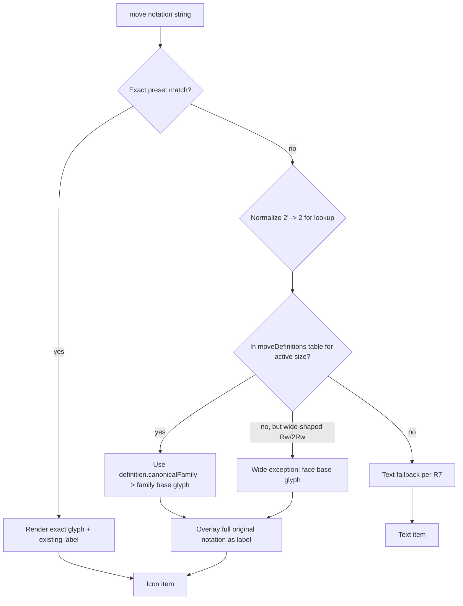

# feat: Moves view icon fallback for size-specific moves

> **Post-completion amendment (2026-09-06):** KTD3 and R3/R4 originally stated
> fallback items "always use the family's base symbol (never the suffix-variant
> glyph)". A follow-up bug report showed this made `5E` vs `5E'` (and
> `2M`/`2M'`, `3S`/`3S'`) render identical arrows, losing the turn direction the
> 3×3 exact icons encode. The shipped implementation composes the family base
> letter with the notation's modifier suffix to select the direction-accurate
> glyph (`5E`→`e`, `5E'`→`ep`, `5E2`→`e2`, `5E2'`→`e2p`; same for M/S, face, and
> wide families), keeping the layer number in the label. R3/R4/KTD3 below are
> the historical decision record; the code and tests reflect the amended
> behavior (commit `932505c`).

## Summary

Make the Moves view's icon mode readable on cubes larger than 3×3 by resolving
every valid move notation in the history to an icon: exact-match notations keep
their dedicated glyph, and size-specific moves with no dedicated icon (numbered
slices like `3E`, wide moves like `Rw`/`2Rw`, and their `'`/`2`/`2'` variants)
render the canonical family base glyph (`M`/`E`/`S` slice, face, or rotation)
with the full original notation as a label overlay. Validity and family are
resolved from the per-size cube-invariants move table — not from duplicated
pattern rules in the icon layer — and 3×3 rendering is unchanged for the
standard notation set (every exact-match move keeps its glyph; no 3×3-valid
exact notation falls back).

## Problem Frame

The multi-size feature added engine support for cubes 2–7, and user
drag/keyboard gestures on inner layers of an n>3 cube generate numbered-slice
moves (`axisLayerToMoveBase` returns `2M`/`3E`/`4S`). In the Moves view's icon
mode, moves render through the `MOVE_ICONS` proxy, which returns `undefined` for
any notation not in `MOVE_ICON_PRESETS` — a fixed 48-entry map covering exactly
the 3×3 notation set. Numbered slices therefore fall through to the plain-text
branch while face moves beside them render as icons, producing a mixed text/icon
history that is harder to scan on a 5×5 than on a 3×3.

The icon sprite already contains direction- and axis-meaningful family glyphs
(`move-icon-{m,e,s,f,r,u,d,l,b,x,y,z}` with base/prime/2/2′ variants) that are
not being reused for these moves. The prior multi-size plan
(`docs/plans/2026-08-16-002-fix-multi-size-rendering-and-move-notation-plan.md`,
unit U5) scoped this as a notation-family normalization that must not add a
large new icon set. This plan resolves the tension by mapping a size-specific
notation to an existing family base glyph plus a full-notation label overlay — a
small, purely additive resolver.

## Requirements

Origin R-IDs are preserved from
`docs/brainstorms/2026-09-05-moves-view-icon-fallback-requirements.md` (see
origin). Plan-local additions (grouped by concern) extend them for testability
and the engine-side numbered-wide support the origin defers.

**Icon resolution**

- R1. When icon mode is on, every valid move notation in the current history
  renders as an icon (not bare text), for every supported cube size.
- R2. A notation with an exact icon match (`M`, `E`, `S`, `R`, `U`, `F`, `B`,
  `D`, `L`, `x`/`y`/`z` and their `'`/`2`/`2'` variants) keeps that exact icon,
  unchanged from today.
- R3. A numbered slice notation (`2M`, `3E`, `4S`, `2M'`, `3E2`, `3E2'`, ...)
  renders the canonical family base glyph (`M`, `E`, or `S`) with the full
  original notation as its label overlay; the base glyph is never swapped for a
  suffix-variant glyph.
- R4. A wide notation — numbered or not (`Rw`, `Uw`, `Rw2`, `Uw'`, `2Rw`,
  `3Rw2`, `4Uw'`, ...) — renders the canonical face base glyph (`R`, `U`, ...)
  with the full original notation as its label overlay. A recognizable wide form
  gets an icon even if the notation is not (yet) present in the engine's move
  table.
- R5. For fallback items the overlay is the notation itself, replacing any
  default label, so the notation and its modifier appear in exactly one place.
- R5b. The full-notation overlay fits the glyph's existing label area without
  clipping or overlapping adjacent tiles at the smallest icon-mode row size,
  including labels up to 4–5 characters (`3Rw2`, `4Uw'`, `3E2'`), and never
  scales below a legible minimum font size.

**Validation authority**

- R6. The resolver derives move validity from the precomputed move table
  (`moveDefinitions` in cube invariants for the active cube size), not from
  duplicated pattern rules in the icon layer.
- R7. Malformed or unrecognized notations — where no family/icon can be
  determined (`ZZ9`) — keep the existing text fallback and never crash the
  renderer or drop the history entry.

**Non-regression**

- R8. Rendering for cube size 3 is unchanged: no notation that has an exact icon
  today changes appearance, and no 3×3-valid notation falls back to a family
  glyph when it already has an exact match.
- R9. Long move histories continue to render in the correct current-item state
  and scroll position after a move (existing renderer behavior is preserved).
- R10. No new SVG assets are added to `src/icons/move-icon-sprite.svg`.

**Engine move-table support (plan-local, from origin open question, path A)**

- R11. The per-size move table gains numbered-wide definitions (`2Rw`, `3Rw`,
  ... with `'`/`2`/`2'` variants) for cube sizes > 3 (4×4 and up), mirroring the
  numbered-slice precedent — so 3×3 vocabulary stays unchanged while
  numbered-wide notations are valid per R6/R4 rather than relying solely on a
  pattern exception.
- R12. A trailing `2'` suffix is treated as equivalent to the table's `2` form
  for validity (mirroring how the move parser already executes `2'` today), so
  valid moves like `3E2'` and `Rw2'` resolve to an icon instead of falling back
  to text.

## Key Technical Decisions

- **KTD1 — Reuse existing family glyphs; author zero new SVGs.** Every family
  the fallback needs already exists as a sprite symbol
  (`move-icon-m`/`move-icon-e`/`move-icon-s` for slices,
  `move-icon-{f,r,u,d,l,b}` for faces, `move-icon-{x,y,z}` for rotations, each
  with base/prime/2/2′ variants). The fallback maps a size-specific notation to
  an existing family base symbol plus the notation label. Zero new assets keeps
  the single-file build unchanged (R10).

- **KTD2 — Exact-match precedence before family fallback.** Resolution checks
  the exact icon-preset match first and it always wins; the canonical-family
  fallback applies only when no exact preset exists. This makes R2/R8 hold by
  construction: a table-valid notation that also has an exact preset (`M`, `E`,
  `S`, `R`, `U`, ... and their `'`/`2`/`2'` variants) never renders through the
  family fallback.

- **KTD3 — Family base glyph + full-notation label overlay.** Fallback items
  always use the family's base symbol (never the suffix-variant glyph) and carry
  the full original notation in the label overlay, which reuses the existing
  label-overlay mechanism (`btn-icon-label` + `btn-icon-label-{position}`)
  already used for exact-match icons. The layer number, `w`, and modifier live
  only in the label, in exactly one place.

- **KTD4 — The cube-invariants move table is the validity/family authority.**
  Resolution consults `getCubeInvariants(size).moveDefinitions`, not duplicated
  pattern rules in the icon layer. `MoveDefinition` gains an optional
  `canonicalFamily` field that `buildMoveDefinitions` assigns at generation time
  (slice/face/wide/rotation is known in the builder). The field is optional so
  existing literal `MoveDefinition` constructions in tests
  (`layer-manager.test.ts`, `circular/animations.test.ts`) compile unchanged.

- **KTD5 — Thread the active cube size into the renderer.** The resolver needs
  the active size to consult the correct invariants table. The moves renderer
  currently has no size; `MovesView` (which holds the read-only model) passes
  the current cube size down through the renderer on create/update. Size is read
  from the model's current cube state (`cubeSize`).

- **KTD6 — Extend the move table for numbered-wide forms (origin path A).**
  Because wide moves are already table-valid on every size ≥ 2 (`Rw`/`Uw`/...),
  the numbered-wide spelling (`2Rw`, `3Rw`, ...) is added for cube sizes ≥ 4
  (R11), mirroring the numbered-slice precedent (`cubeSize > 3`) and keeping 3×3
  vocabulary unchanged. This keeps R6 uniform — a numbered-wide notation is in
  the table, so the family fallback resolves it — with the wide exception
  reduced to a narrow defensive fallback (U3 step 4) for sizes the numbered-wide
  gate excludes, as origin R6 permits. The scramble pool is unaffected:
  `isEligibleScrambleMove` filters by `layerIndices.length !== 1`, so
  multi-layer wide moves (bare or numbered) stay excluded, preserving scramble
  distribution.

- **KTD7 — `2'`-suffix normalization for validity.** The move table stores only
  base/`'`/`2` forms; `2'` forms (`3E2'`, `Rw2'`, `R2'`) are executable but
  absent from the table — the parser resolves a `2'` token by looking up the `2`
  form and negating the angle. The resolver mirrors that: to test
  validity/family for a `2'` notation, it looks up the `2` form first. This
  prevents valid `2'` moves from wrongly hitting the R7 text fallback (R12).

- **KTD8 — Wide-vs-face distinction deferred.** Wide and single-layer face moves
  share the face glyph and differ only by the label (`Rw` vs `R`). This matches
  the origin's accepted scope boundary ("distinct visual treatment" deferred);
  the notation label is always present so the reading is preserved.

## High-Level Technical Design

The resolution flow for one move in a history item, given the active cube size:

Key shapes:

- `MoveDefinition` gains
  `readonly canonicalFamily?: 'slice' | 'face' | 'wide' | 'rotation'`.
  `buildMoveDefinitions` sets it on each base definition; `pushVariants` carries
  it onto `'`/`2` variants unchanged.
- The icon resolver is a small pure function in the icons layer:
  `resolveMoveIcon(move, cubeSize)` returns either
  `{ exact: MoveIconMetadata }`,
  `{ family: { baseSymbolId, labelPosition }, label }`, or `undefined` (text
  fallback). It never renders; it only resolves. The renderer consumes the
  result and builds the same DOM shapes it builds today.
- A `2'` notation like `3E2'` resolves family from the `3E2` table entry (KTD7),
  then renders the `M`/`E`/`S` base glyph with the label `3E2'`.

## Implementation Units

### U1. Add `canonicalFamily` to move definitions

**Goal:** Give every base move definition a stable canonical-family label so the
icon resolver can map a notation to a family glyph without parsing notation
strings.

**Requirements:** R6, R3, R4

**Dependencies:** none

**Files:**

- `src/cube/types/move.ts` (modify)
- `src/cube/core/cube-invariants.ts` (modify)
- `src/cube/core/cube-invariants.moves.test.ts` (test)
- `src/cube/core/cube-invariants.test.ts` (test)

**Approach:** Add an optional
`readonly canonicalFamily?: 'slice' | 'face' | 'wide' | 'rotation'` to
`MoveDefinition`. In `buildMoveDefinitions`, tag each base definition — slice
moves (`M`/`E`/`S` and numbered `2M`/`3E`) as `'slice'`, wide moves as `'wide'`,
face moves as `'face'`, cube rotations as `'rotation'` — and let `pushVariants`
spread the field onto the `'`/`2` variants. Keep the field optional so the
existing test literal constructions compile without edits.

**Patterns to follow:** The existing `pushVariants` spread pattern in
`src/cube/core/cube-invariants.ts` (each variant is
`{ ...definition, name, angle }`), which already propagates extra fields onto
variants for free.

**Test scenarios:**

- For a 3×3 and a 5×5 invariants instance: every base and variant definition in
  `moveDefinitions` has the expected `canonicalFamily` (`R`/`U`/... → `face`,
  `M`/`E`/`S`/`2M`/`3E` → `slice`, `Rw`/`Uw` → `wide`, `x`/`y`/`z` →
  `rotation`).
- The `'` and `2` variants inherit the base family (`3E` and `3E2` and `3E'` all
  report `slice`).

**Verification:** `moveDefinitions` values across sizes 2–7 carry a correct
`canonicalFamily`; existing move-table tests still pass.

---

### U2. Add numbered-wide definitions to the move table

**Goal:** Make numbered-wide notations (`2Rw`, `3Rw2`, `4Uw'`, ...) table-valid
so they resolve through the same R6 path as numbered slices, matching the
origin's path-A decision (R11).

**Requirements:** R11, R4, R6

**Dependencies:** U1 (family field available for the new wide definitions)

**Files:**

- `src/cube/core/cube-invariants.ts` (modify)
- `src/cube/core/cube-invariants.moves.test.ts` (test)

**Approach:** In `buildMoveDefinitions`, after the existing bare-wide block, add
numbered-wide definitions for cube sizes ≥ 4 (matching the `cubeSize > 3`
numbered-slice precedent, so 3×3 vocabulary is unchanged), mirroring the
numbered-slice structure: for each face (`U`/`D`/`R`/`L`/`F`/`B`) and each
turned-layer count n in 2..last, emit `<n><Face>w` definitions (e.g. `2Rw`,
`3Rw`, `4Uw`) and push `'`/`2` variants. The set of layers for a numbered-wide
move is the same physical identity as the equivalent bare-wide spelling — which
is exactly why `buildScramblePool`'s geometry grouping already keeps them out of
the scramble pool (`layerIndices.length !== 1`).

**Patterns to follow:** The numbered-slice generation loop (for
`layerIndex of innerLayers`, push `${sliceNumber}M/E/S`) in
`src/cube/core/cube-invariants.ts`; the bare-wide block it sits beside.

**Test scenarios:**

- For a 5×5 and 7×7 invariants instance: `moveDefinitions` contains `2Rw`,
  `3Rw`, `2Rw'`, `2Rw2`, `2Rw2'`, `3Uw2'`, etc., with correct `layerIndices`
  (outer 2 / 3 / ... layers) and `canonicalFamily: 'wide'`.
- For a 3×3 invariants instance: numbered-wide names are absent (bare `Rw`
  remains the only wide spelling) — 3×3 vocabulary is unchanged.
- Scramble-pool regression: `buildScramblePool` for sizes 4–7 contains no
  multi-layer (wide) move after the table extension — wide moves of any spelling
  stay excluded and the pool distribution is unchanged.

**Verification:** New wide names execute through `getMoveDefinition` without
throwing and produce the same physical permutation as the composed equivalent
(covered by a move-engine or parser test if one is added here).

---

### U3. Add the icon fallback resolver in the icons layer

**Goal:** Provide a pure resolution function that maps any notation string
(given the active cube size) to either an exact icon or a family-glyph + label
fallback, without duplicating validity grammar.

**Requirements:** R1–R8, R12

**Dependencies:** U1, U2 (family + numbered-wide available)

**Files:**

- `src/icons/move-icon-generator.ts` (modify)
- `src/icons/index.ts` (modify)
- `src/icons/move-icon-generator.test.ts` (test)

**Approach:** Add a resolver that takes `(move: string, cubeSize: number)` and
returns a discriminated result: exact preset metadata, a family fallback
descriptor `{ baseSymbolId, labelPosition, label }`, or `undefined`. Resolution
order: (1) exact preset match wins; (2) normalize a trailing `2'` to `2` for the
table lookup only; (3) look up `getCubeInvariants(cubeSize).moveDefinitions` —
if present, map `canonicalFamily` to the family base symbol and label position
(slice `M`/`E`/`S` and face/rotation symbols have known positions from the
existing presets); (4) for wide-shaped notations still absent from the table
after the extension (reachable only on sizes the numbered-wide gate excludes —
e.g. a `2Rw` imported into a 3×3 history, where bare `Rw` is already caught by
step 3), resolve to the face base glyph as a narrow defensive fallback per
origin R6's exception; (5) otherwise `undefined` (text fallback). The label is
always the full original move string. Add a `resolveMoveIcon` export and a
helper that returns the base-symbol id + label position for a canonical family,
reusing the label positions already declared on the exact presets (`M`'s
position, `R`'s position, etc.) so fallback labels sit in the same slot as exact
labels.

**Patterns to follow:** `MOVE_ICON_PRESETS` label positions and `symbolId`
naming in `src/icons/move-icon-generator.ts`; the `MOVE_ICONS` proxy's
narrow-guard shape in `src/icons/index.ts`.

**Test scenarios (most carry AE coverage):**

- `resolveMoveIcon('R', 3)` → exact icon (unchanged). `Covers AE3` (3×3 exact
  unchanged).
- `resolveMoveIcon('3E', 5)` → E-family base glyph with label `3E`. `Covers AE1`
  (numbered slice family icon + notation label).
- `resolveMoveIcon("2M'", 5)` → M-family base glyph with label `2M'`; never a
  prime-variant glyph. `Covers AE1`.
- `resolveMoveIcon('3Rw2', 7)` → R-family base glyph with label `3Rw2`.
  `Covers AE2` (numbered wide family icon + label).
- `resolveMoveIcon("4Uw'", 7)` → U-family base glyph with label `4Uw'`.
  `Covers AE2`.
- `resolveMoveIcon("3E2'", 7)` → resolves via the `3E2` table entry (KTD7/R12)
  to E-family base glyph with label `3E2'` — not the text fallback.
- `resolveMoveIcon('Rw', 3)` → R-family base glyph with label `Rw` (bare wide is
  table-valid on 3×3; KTD6/R4). `Covers AE3`-adjacent (wide is not in the 3×3
  exact set, so this is the intended fallback, not a regression).
- `resolveMoveIcon('ZZ9', 5)` → `undefined` (text fallback, no throw).
  `Covers AE4` (malformed keeps text).
- Every exact-preset notation (`R`, `M`, `x`, ... and `'`/`2`/`2'` variants)
  resolves to its exact icon, never the family fallback. `Covers AE3` (no
  3×3-valid exact notation falls back).

**Verification:** The resolver is pure (no DOM); all AE1–AE4 resolution
expectations pass at the unit level.

---

### U4. Thread the active cube size into the moves renderer

**Goal:** Give the renderer the cube size it needs to consult the correct
invariants table when resolving fallback icons.

**Requirements:** R6 (authority per active size), R1

**Dependencies:** U3

**Files:**

- `src/views/moves/renderer.ts` (modify)
- `src/views/moves/moves-view.ts` (modify)
- `src/views/moves/renderer.test.ts` (test)
- `src/views/moves/moves-view.test.ts` (test)

**Approach:** Extend `MovesViewRenderer` to hold an active cube size, updated
via a new setter. `MovesView.create/update` reads `cubeSize` from the model's
current cube state and pushes it to the renderer before render. Because the view
already receives the read-only model, no new model interface is required.

**Patterns to follow:** The existing `setShowAsIcons`/`setMoveHistory` setter
pattern on `MovesViewRenderer` (each setter stores state and the next `render()`
picks it up).

**Test scenarios:**

- After `setCubeSize(5)`, a render of a history containing `3E` renders an icon
  item (not bare text).
- After `setCubeSize(3)`, a render of `R` renders the exact icon as today.
- Size changes between renders (e.g., 5 → 3) re-resolve correctly on the next
  render without stale state.

**Verification:** Renderer tests construct the renderer with a size (defaulting
to 3 for existing tests) and existing tests still pass unchanged.

---

### U5. Render family-fallback icons with the notation label

**Goal:** In icon mode, render fallback-resolved moves as the family base glyph
SVG with the full notation label overlay, wired through the existing
`createMoveItem` icon branch.

**Requirements:** R3, R4, R5, R5b, R1, R8, R9

**Dependencies:** U3, U4

**Files:**

- `src/views/moves/renderer.ts` (modify)
- `src/views/moves/moves-view.module.css` (modify)
- `src/views/moves/renderer.test.ts` (test)

**Approach:** In `createMoveItem`, when icon mode is on, first try the exact
`this.moveIcons[move]` lookup (unchanged), then the fallback resolver. For a
fallback result, build the same DOM shape as an exact icon item: wrapper SVG
referencing the family base symbol (via `isolateSvgIds`), plus the
`btn-icon-label` span with the label-position class and the full original
notation as text. Extend the CSS so the label scales to fit and never drops
below a legible minimum at the smallest row size (R5b) — e.g., allow the label
to shrink within the tile while capping the shrink, matching the fixed 48px icon
tile. The render loop's current-item/scroll logic is untouched.

**Patterns to follow:** The existing exact-icon branch in `createMoveItem`
(`src/views/moves/renderer.ts`) — SVG via `isolateSvgIds(iconMeta.svg)` and the
`btn-icon-label`/`btn-icon-label-{position}` classes — which the fallback
mirrors one-to-one.

**Test scenarios:**

- A 5×5-style history (`4E 3M' 2E 2S' B' 3E 4S 4E' 2E`) in icon mode renders an
  SVG icon for every numbered slice with a label equal to the full notation, and
  `B'` renders its exact icon. `Covers AE1`.
- A history containing `3Rw2` and `4Uw'` in icon mode renders R- and U-family
  glyphs labeled `3Rw2` and `4Uw'`. `Covers AE2`.
- A history containing a malformed token (`ZZ9`) renders that entry as text,
  does not throw, and does not disturb adjacent icon entries. `Covers AE4`.
- Toggling icon/text mode on a non-3 history keeps every entry readable in both
  modes with the same order and current-item marker. `Covers AE5`.
- A row containing long fallback labels (`3Rw2`, `4Uw'`, `3E2'`) at the smallest
  icon-mode row size renders each label fully with no clipping or overlap.
  `Covers AE6`.
- Regression: 3×3 histories render identically to today for the standard set
  (`R R' R2 R2' L ... M ... x ... z2'`). `Covers AE3`.
- Long-history scroll/current-item behavior after a move is unchanged (existing
  renderer behavior preserved — R9).

**Verification:** Icon-mode renders for non-3 histories contain no bare-text
tokens for valid moves; AE1–AE6 pass.

---

## Scope Boundaries

**Deferred for later** (carried from origin)

- A distinct visual treatment distinguishing wide moves from single-layer face
  moves at a glance (a true "two-layer" glyph family). Today both reuse the face
  glyph and differ only by label (KTD8).
- A full design cleanup of the Moves view layout beyond the fallback mapping.
- New glyph authoring for a future notation that has no family ancestor in the
  current sprite.

**Outside this product's identity** (carried from origin)

- New SVG assets per notation — explicitly rejected to keep the single-file
  build unchanged (R10).
- Circular view multi-size assets (separate phase under its own requirement
  doc).

**Deferred to Follow-Up Work** (plan-local)

- Updating `cube-controller.ts` scramble eligibility or scramble tests —
  verified not needed (see KTD6) but flagged for confirmation during
  implementation if the move-table extension changes any pool geometry grouping.

---

## Risks & Dependencies

- **R1 — `2'`-suffix validity (mitigated by KTD7/R12).** If the resolver tests
  raw table membership, valid `2'` moves (`3E2'`, `Rw2'`) would wrongly fall
  back to text. The `2'`→`2` normalization mirrors the parser, so this is closed
  in U3.
- **R2 — Wide vocabulary change could affect scramble probability (low,
  verified).** `buildScramblePool` groups by physical identity and excludes
  multi-layer moves via `isEligibleScrambleMove` (`layerIndices.length !== 1`),
  so adding numbered-wide table entries does not change the pool. Confirmed by
  reading `src/cube-controller.ts`; guarded by a U2 scramble-pool regression
  test.
- **R3 — `MoveDefinition` widening.** Adding a required field would break many
  test literal constructions. Making `canonicalFamily` optional (KTD4) avoids
  that; U1 asserts the field is populated for generated definitions.
- **R4 — 3×3 non-regression.** The exact-match-first ordering (KTD2) plus the
  existing preset coverage guarantees no 3×3-valid notation falls back; locked
  by the AE3 test scenarios.

## System-Wide Impact

- **Build size:** No new SVG assets; the sprite is untouched (R10). The resolver
  is a small pure function, so single-file bundle growth is negligible.
- **Move table:** The cube-invariants move table gains numbered-wide names and a
  `canonicalFamily` field (sizes 2–7). Consumers that iterate `moveDefinitions`
  (scramble pool, command generation) must tolerate the added entries — verified
  harmless for the scramble pool; other consumers are read-only lookups.
- **Moves renderer:** Constructor/setter surface changes (cube size threaded
  in). Views that construct `MovesViewRenderer` directly (tests) default to
  size 3.

## Open Questions

- Whether the numbered-wide engine extension (U2) should also flow into the
  visible scramble/command surfaces beyond the move table. Default: no — the
  scramble pool already excludes wide moves by geometry, and command buttons are
  not part of this feature. Left open only because U2 touches the shared move
  table.

## Sources / Research

- `docs/brainstorms/2026-09-05-moves-view-icon-fallback-requirements.md` —
  origin; R1–R10, AE1–AE6, scope boundaries, open questions (path A/C for
  numbered-wide).
- `docs/plans/2026-08-16-002-fix-multi-size-rendering-and-move-notation-plan.md`
  — unit U5 scoped this normalization; "no large new icon set" constraint.
- `src/icons/move-icon-generator.ts` — `MOVE_ICON_PRESETS` (48 exact entries,
  each with `labelPosition` + `symbolId`), `MoveNotation` union,
  `isMoveNotation`; sprite symbol id convention
  `move-icon-{m,e,s,f,r,u,d,l,b,x,y,z}{p|2|2p}`.
- `src/icons/index.ts` — `MOVE_ICONS` proxy (returns `undefined` for
  non-presets), `COMMANDS_ICONS`, `isolateSvgIds`.
- `src/views/moves/renderer.ts` — `createMoveItem` icon-vs-text branch; label
  overlay via `btn-icon-label`/`btn-icon-label-{position}`.
- `src/cube/core/cube-invariants.ts` — `buildMoveDefinitions`
  (face/wide/slice/numbered-slice/rotation generation; `pushVariants` emits
  base/`'`/`2` only), `moveDefinitions` map, `getCubeInvariants`.
- `src/cube/types/move.ts` — `MoveDefinition`
  (`name`/`axis`/`layerIndices`/`angle`).
- `src/cube/core/move-parser.ts` — parser normalizes `2'`→`2` lookup + angle
  negation; recognizes numbered-wide token shapes.
- `src/interaction/move-inference.ts` — `axisLayerToMoveBase`/`toFar` prove
  numbered slices (`3E`) and `2'` forms are what gestures generate on n>3.
- `src/cube-controller.ts` — `isEligibleScrambleMove`/`buildScramblePool` keep
  wide moves out by `layerIndices.length !== 1`.
- `src/styles/buttons.module.css` — label overlay styles (`btn-icon-label`,
  position variants).
