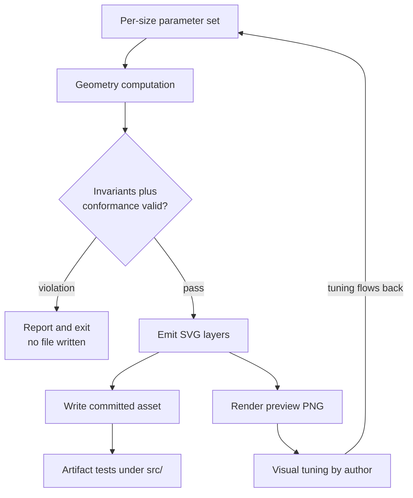
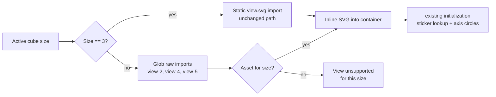

# feat: Circular View per-N SVG generator with 2×2 support

## Summary

Build a standalone generator under `scripts/circular-svg/` that emits a complete
conforming Circular view SVG for a given cube size from a small parameter set.
Use it to produce a 2×2 asset, make the Circular view load an SVG by active cube
size, and enable 2×2 as a supported size. Then run the tuned generator for 4×4
as a proof of concept, and validate the ghost rule at N=5 — the size that
actually exercises it.

---

## Problem Frame

The Circular view renders each sticker at the intersection of two axis rings,
with one hand-authored SVG per size. Only `3×3` has an asset, and the view
declares exactly that (`getSupportedSizes()` returns `[3]`), so selecting any
other size disables the view outright rather than degrading it.

The TS layer is already size-ready — `data-cube-size` is read from the SVG root,
far-face coordinates derive from `cubeSize - 1`, and the sticker id pattern
accepts multi-digit indices. The gap is the asset: `view.svg` is 363 lines
holding 54 stickers, 9 axis circles, 9 mask rects, 6 face ellipses, 6 face
labels, and 72 ghost circles. Hand-authoring that per size does not scale, and
geometric mistakes surface only in the browser.

`docs/brainstorms/circular-view-svg-geometry-spec.md` already captures the
geometric invariants for any N and states it exists so "a future generator
script can be validated against these rules" — that generator does not exist
yet. This plan builds it, brings 2×2 online, and tests whether the procedure
generalizes.

Recovering the ghost rule was the significant unknown: the spec excludes ghost
placements as requiring design judgment, but an audit of the existing 72 ghosts
shows the placement is deterministic (multiplicity from grid-cell class, a
tangential offset of one sticker radius, direction opposite the source→target
travel). That finding is what makes the ghost layer generatable rather than
per-size hand work.

---

## Requirements

Carried from the origin document. R-IDs are preserved so traceability holds
across both artifacts.

**Generator**

- R1. A generator produces a complete Circular view SVG for a given N and
  parameter set, committed to the repo.
- R2. Output satisfies the SVG Conformance Checklist in
  `docs/brainstorms/circular-view-multi-size-prep-requirements.md`.
- R2a. Output includes the `face-label-L` / `face-label-B` / `face-label-D`
  elements the interaction dead-zone depends on (not covered by the checklist).
- R3. The ghost layer is emitted from the derived rule, not hand-placed.
- R4. The generator validates before writing and refuses to emit on violation,
  covering the invariants, the conformance contract, and the ellipse/mask/ghost
  layers.
- R5. Size-dependent layer features are omitted where they do not exist —
  notably middle-layer rings and their notation labels at N=2.
- R6. Adding a size requires a new parameter set, not generator code changes.

**2×2 support**

- R7. A conforming 2×2 SVG exists and the view loads it when the active cube is
  2×2.
- R8. `getSupportedSizes()` includes 2.
- R9. The 2×2 view is functionally usable — stickers reflect state, selection
  and highlighting work, drag produces correct moves.
- R10. Layout reads correctly at 2×2 with no overlapping or mispositioned
  elements.
- R11. 3×3 behavior is unchanged.

**Knowledge capture**

- R12. Post-generation hand-tuning flows back into the generator; re-running
  reproduces the tuned result. Tuning ends at zero required hand-edits. The
  accepted SVG and a rendered reference are committed.
- R13. `scripts/circular-svg/README.md` documents the generator, its parameters,
  and the ghost rule well enough that a new size is a parameter choice.

**4×4 proof of concept**

- R14. The tuned generator is run for 4×4 and produces a usable result.
- R15. 4×4 is available to try in the app; keeping it enabled is decided after
  trying it.

**Validation targets**

- R16. N=5 validates the ghost rule. It is not shipped, not added to
  `getSupportedSizes()`, and not selectable — the asset is validated and
  discarded.

---

## Key Technical Decisions

- **The generator's logic lives in TypeScript under `src/`, driven by a thin
  script shim.** The generator is not part of the app build, but its compute,
  validate, and emit logic sits under `src/views/circular/svg-generator/` as
  `.ts` modules, with a small CLI entry point that the `npm run` shortcut
  executes. This is forced by the toolchain, not stylistic: `allowJs` is off and
  `tsc --noEmit` compiles `src/**/*.ts` under `strict`, so a `src/` test cannot
  import a `.cjs` module without failing the type-check gate (TS7016, and the
  ambient-module workaround is itself rejected). Keeping the logic in TS means
  the type checker and `vitest` both see it, and the generator's own logic is
  unit-testable in the normal way. The shim stays outside the app build, so
  nothing here ships to `dist/`.

- **A TypeScript script precedent already exists.** `scripts/demo-video/` is
  authored in TypeScript with its own local modules (`acts.ts`,
  `demo-helpers.ts`) and run through `npx tsx`, which is the shape the generator
  follows: typed logic, invoked by a script command, outside `vite build`. The
  generator's modules live under `src/` rather than `scripts/` so the existing
  `src/**` include covers them without a tsconfig change; the `npm run` entry
  point sits under `scripts/circular-svg/` beside its parameters and README.

- **Artifact conformance is verified independently, not by reusing generator
  logic.** Tests parse the committed SVGs and assert the conformance contract
  and geometric invariants with their own expectations. This is deliberate
  rather than duplication to be factored away: R16/AE9 require the ghost layer
  to be checked against an **independently computed** expected set, and a shared
  helper would make the check self-confirming. Independent assertions are also
  what guard R11 against a silent 3×3 drift. The expected ghost set for N=5 is
  therefore a fixture owned by the test, not a call into the generator.

- **The 3×3 asset keeps its current static import.** `view-*` sizing is resolved
  through a glob import for non-3 sizes only, so the 3×3 code path is untouched
  and R11 has no import-mechanism regression to defend. The glob pattern
  `view-*.svg` deliberately excludes the stray `view.old.svg` in the same
  directory (`view.` ≠ `view-`); the resolver must never pick it up.

- **The sticker selection rule is nearest-own-face-centroid.** Each ring-pair
  intersection yields two candidate points; the correct one is the point nearer
  the _target_ face's centroid than its paired opposite face's centroid. This
  was verified against the committed asset — the rule reproduces all 54 of its
  stickers. A plausible-sounding alternative ("the point outside the third
  axis's outer ring") is **wrong**: 22 of the 54 reference stickers sit inside
  that ring, so a generator built on it emits U, R, and F stickers at the wrong
  intersection and U6's fidelity check cannot pass. The three centroids are
  triangle-derived constants, and U1 must name them.

- **Notation labels are derived from `axisLayerToMoveBase`, not a per-size
  table.** That function already takes `cubeSize` and returns `L`/`R` for X,
  `D`/`U` for Y, `F`/`B` for Z at the extremes, with `M`/`E`/`S` only at
  `cubeSize === 3` and `{n}M`/`{n}E`/`{n}S` for inner layers otherwise. At N=2
  every layer is an extreme, so middle-layer labels cannot be produced — R5's
  requirement falls out of the existing rule instead of being special-cased. The
  base letter is only half the label: the committed asset renders `B↺`, `S↻`,
  `F↻`, so the direction glyph is a second rule, derived from the reversed-axis
  parity logic in `isAxisLayerReversedFromCanonical`, and the `<title>` prose
  follows the same source. The generator restates both rules rather than
  importing them, and U6 compares the full `<text>` content including the glyph.

- **Validation must cover more than the geometric invariants.** I1–I5 constrain
  ring intersections, sticker clearance, and sticker radius only. They say
  nothing about face ellipses, mask holes, the ghost layer, or the element
  contract the runtime resolves — so a clean I1–I5 run is not evidence an SVG is
  loadable or usable. R4 therefore gates on the conformance contract and those
  layers as well. This is the single most load-bearing decision here: getting it
  wrong means the generator's "validation passed" reads as safety while emitting
  assets the view cannot use.

- **Ghost geometry is a parameter set, not hand-placed coordinates.** Per-class
  radius offset, direction, and per-axis exclusions fully determine ghost
  coordinates, so ghost tuning flows back through R12 like every other tuning
  and the no-diff property holds for ghosts too. Without this, any ghost
  adjustment would produce a permanent diff and R12 would fail at the first
  size.

- **Rendered references use the existing `@resvg/resvg-js` devDependency.** It
  is already present for `scripts/og-image/svg-to-png.cjs`, so R12's visual
  reference costs no new dependency.

- **No view-side handling is needed for 2×2's missing middle layers — but one
  view-side fix is.** Every runtime lookup is structural rather than
  count-based: `circle[data-axis]`, `circle.sticker`, `{FACE}-face-ellipse`,
  `face-label-{FACE}`, and `computeBiasedBoundaries` over however many circles
  exist, so fewer rings simply means fewer bands. That resolves the origin's
  fourth deferred question. It does **not** mean 2×2 works untouched: the view's
  default selection hard-codes a 3×3-only face position (`Face.F, 4`), which
  silently selects nothing at N=2, while the keyboard recovery path already
  derives its centre as `Math.floor(cubeSize * cubeSize / 2)`. U8 aligns the two
  and covers it with a test.

---

## High-Level Technical Design

Two flows matter: how an asset is produced (offline, committed), and how it is
selected at runtime.



The tuning edge closing back to the parameter set is the whole point of the
design: R12 is satisfied only while that cycle terminates in parameters rather
than in a hand-edited file.

At runtime, size determines which asset is resolved — with 3×3 on its existing
path:



---

## Output Structure

```text
scripts/circular-svg/
    generate.ts           # CLI entry point (run via the npm shortcut)
    parameters.json       # per-size parameter sets (data, not code)
    preview/              # committed rendered references
    README.md             # parameters + derived ghost rule (R13)

src/views/circular/svg-generator/
    geometry.ts           # ring/intersection math from the invariants
    labels.ts             # base letter + direction glyph rules
    emit.ts               # SVG layer serialisation
    validate.ts           # invariant + conformance checks

src/views/circular/
    view.svg              # existing 3x3, untouched
    view-2.svg            # generated
    view-4.svg            # generated (proof of concept)
```

Generated logic is TypeScript under `src/` so `tsc --noEmit` and `vitest` both
see it; only the entry point, parameters, previews, and docs live under
`scripts/`. The N=5 validation asset is written to `scripts/circular-svg/tmp/`
(untracked, outside the loader's glob directory) and deleted after validation —
it is never committed and never lands in `src/`, because R16 makes N=5 a
validation target rather than a shipped asset.

The per-unit `**Files:**` lists remain authoritative if implementation finds a
better factoring.

---

## Implementation Units

Two test-module conventions apply throughout.
`src/views/circular/svg-generator.test.ts` is a single shared unit-test module
hosting a `describe` block per generator concern (geometry, validation,
emission, CLI), referenced by the units that add those blocks. Artifact-level
assertions against committed SVGs live separately in
`src/views/circular/generated-svg.test.ts`. Each unit's `**Files:**` list names
only the paths that unit adds or modifies.

### U1. Generator scaffold, parameter model, and geometry computation

- **Goal** — A runnable generator with per-size parameters and the ring /
  intersection math the rest of the pipeline consumes.
- **Requirements** — R1, R6
- **Dependencies** — none
- **Files** — `src/views/circular/svg-generator/geometry.ts`,
  `scripts/circular-svg/generate.ts`, `scripts/circular-svg/parameters.json`,
  `src/views/circular/svg-generator.test.ts`
- **Approach** — The parameter model is the five scalars the geometry spec names
  (triangle side `d`, inner ring radius `r_min`, ring step `Δr`, sticker radius
  `r_s`, viewBox) plus ghost parameters. Parameters live in JSON so R6's "new
  parameter set, not new code" is literal. Geometry derives ring radii from the
  spec's asymmetric layer→radius rule (Z grows with index; X and Y shrink),
  computes sticker positions as ring-pair intersections selecting the candidate
  nearer the target face's centroid than its opposite face's, and derives
  face-ellipse geometry from the sticker centroid and grid-edge direction. The
  three face centroids are triangle-derived constants this unit must name — they
  are what makes the selection rule decidable. Parameter values for 3×3 are
  extracted from the existing `view.svg` (d=100, r_min=70, Δr=15, r_s=7).
- **Patterns to follow** — `scripts/demo-video/` for the TypeScript-script shape
  (local modules, run via `npx tsx`, outside the app build);
  `scripts/og-image/compute-cube-camera.cjs` for the compute/emit separation;
  `docs/brainstorms/circular-view-svg-geometry-spec.md` for the math (invariants
  I1–I5, ring–layer mapping, face-region derivation).
- **Test scenarios** — Asserted directly against the geometry module in
  `src/views/circular/svg-generator.test.ts`.
  - Happy path: for N=3 with the extracted parameters, computed ring radii match
    the existing `view.svg` circles (`Z-layer-0` r=70 … `Z-layer-2` r=100;
    `X-layer-0` r=100 … `X-layer-2` r=70).
  - Happy path: computed sticker positions for face U match the existing file's
    `sticker-U-*` `cx`/`cy` values within the exported tolerance constant.
  - Happy path: the nearest-own-face-centroid rule reproduces all 54 reference
    stickers — this is the assertion that fails loudly if the rule is
    re-implemented as "outside the third axis's ring".
  - Happy path: the ring→radius direction asymmetry holds — Z grows with layer
    index while X and Y shrink, at every N.
  - Edge case: N=2 produces exactly two rings per axis and a 2×2 sticker grid
    per face.
  - Edge case: N=4 produces four rings per axis and a 4×4 sticker grid.
  - Edge case: for every N in {2, 3, 4, 5}, each face's sticker count equals N²
    and every sticker resolves to exactly two axis rings — never one, never
    three.
- **Verification** — Running the generator for N=3 reproduces the existing
  asset's sticker coordinates; N=2 and N=4 produce the expected ring and sticker
  counts.

### U2. Validation layer: invariants plus conformance contract

- **Goal** — The generator refuses to write an SVG that is geometrically illegal
  or that the view cannot consume.
- **Requirements** — R4, R2, R2a
- **Dependencies** — U1, U3, U4
- **Files** — `src/views/circular/svg-generator/validate.ts`,
  `scripts/circular-svg/parameters.json`,
  `src/views/circular/svg-generator.test.ts`
- **Approach** — Two check groups that must both pass before any write. The
  geometric group implements the spec's algebraic constraints —
  `(N-1)·Δr < d < 2·r_min` and `2·r_s < Δr` — plus the numerical checks the spec
  says have no closed form (minimum sticker clearance above `2·r_s`, and no
  sticker landing on a third-axis ring). The conformance group asserts the
  element contract the runtime actually resolves: `data-cube-size` on the root,
  `circle[data-axis]` with `data-layer-index`, `circle.sticker` with `data-face`
  and `data-pos`, `{AXIS}-layer-{INDEX}` and `sticker-{FACE}-{POS}` ids,
  `{FACE}-face-ellipse` ids, `face-label-{FACE}` ids, the ghost wrapper class
  and `circle.ghost-sticker`, and the mask rect count. Failures report which
  check failed and write nothing.
- **Patterns to follow** — `src/views/circular/initialization.ts` for the
  authoritative list of what the runtime reads (its `querySelectorAll` calls and
  `data-cube-size` validation are the contract in executable form);
  `src/views/circular/view.svg` for the concrete attribute set to assert
  against.
- **Test scenarios**
  - `Covers AE1.` A parameter set violating `(N-1)·Δr < d < 2·r_min` reports the
    violation and writes no SVG.
  - `Covers AE10.` An SVG whose face ellipses overlap reports the violation and
    writes no file.
  - `Covers AE10.` An SVG missing mask holes, or whose ghost layer is
    inconsistent, reports the violation and writes no file.
  - Edge case: `2·r_s < Δr` fails at the boundary (exactly equal) and passes
    just above it.
  - Integration: a validation failure leaves no partial file on disk.
- **Verification** — Invalid inputs produce a reported violation and no
  artifact; valid inputs proceed to emission.

### U3. Static layer emission

- **Goal** — Serialise every non-ghost layer of the SVG in a paint order the
  runtime expects.
- **Requirements** — R1, R2, R2a, R5
- **Dependencies** — U1
- **Files** — `src/views/circular/svg-generator/emit.ts`
- **Approach** — Emit, in document order: `defs` (styles, label mask with one
  hole per axis label), masked ring groups, axis label groups carrying
  `data-label-id` / `data-axis` / `data-layer-index`, face ellipses, and the
  sticker groups. Label content comes from `labels.ts`: the base letter from the
  size-aware mapping rule, and the direction glyph from the reversed-axis parity
  rule — so N=2 emits only face letters and no `M`/`E`/`S`. Sticker
  `data-axis-circles` documents ring membership for authoring clarity; note it
  is **not** derivable from the ring indices the runtime resolves (the reference
  asset's `sticker-U-8` resolves to Z-layer-0/X-layer-2 but is tagged
  `Z:0 X:0`), so U6 must exclude that attribute from comparison.
- **Patterns to follow** — `src/views/circular/view.svg` for element ordering,
  attribute sets, and the `stroke` / `axisLabel` / `faceLabel` / `sticker` /
  `sticker-wrapper` class vocabulary the stylesheet expects.
- **Test scenarios**
  - `Covers AE2.` Generating N=2 emits two axis circles per axis and no `M`,
    `E`, or `S` notation labels.
  - `Covers AE2.` Generating N=2 emits no middle-layer ring elements.
  - Happy path: N=3 emits 9 axis circles, 54 stickers, 9 mask rects, 6 face
    ellipses, and 6 face labels.
  - `Covers R2a.` Every generated size emits `face-label-L`, `face-label-B`, and
    `face-label-D`.
  - Happy path: emitted label text includes the direction glyph (`B↺`, `S↻` as
    in the reference), not just the base letter.
  - Edge case: the emitted label-mask hole count equals the axis-label count for
    that N (3 holes per axis at N=3, 2 per axis at N=2).
  - Edge case: every emitted element id is unique within the document, so a
    duplicated id cannot silently shadow the element the view resolves.
- **Verification** — Generated markup for N=3 is element-for-element comparable
  to `view.svg` apart from float formatting; non-3 sizes carry only the layers
  that exist for them.

### U4. Ghost layer generation and falsification at N=5

- **Goal** — Emit the ghost layer from the derived rule, and prove the rule
  generalises rather than assuming it does.
- **Requirements** — R3, R16
- **Dependencies** — U1, U3
- **Files** — `src/views/circular/svg-generator/emit.ts`,
  `scripts/circular-svg/parameters.json`,
  `src/views/circular/svg-generator.test.ts`
- **Approach** — Ghosts are generated per target sticker: multiplicity from the
  sticker's grid-cell class (2 edges → 2, 1 edge → 1, 0 edges → 0), each ghost
  tagged with an axis circle the target lies on, placed tangentially along that
  circle at one `r_s`, in the direction opposite the source→target travel, with
  `data-ghost-source` naming the adjacent sticker across that edge. Per-class
  offset, direction, and axis exclusions are parameters so tuning flows back.
  The falsification step is the important part. Ghosts derived from the 1-edge
  class are `6 x (4N - 8)` of a total `24N`, so their share is `1 - 2/N` —
  absent at N=2, a third at N=3, and exactly half at N=4. That makes N=5 the
  first size where the edge class is a strict majority (60%), and therefore the
  first that exercises the class the rule is most likely to get wrong.
- **Execution note** — Treat a ghost mismatch at any size as a generator bug to
  fix, not a size to demote to hand-tuning. The fallback would hide exactly the
  failure this unit exists to detect.
- **Patterns to follow** — The existing 72 ghosts in
  `src/views/circular/view.svg` are the worked example for every attribute and
  the ordering of the wrapper group.
- **Test scenarios**
  - `Covers AE4.` The generated ghost layer for N=3 matches the existing 72
    ghosts in multiplicity, axis/layer tag, offset magnitude, and direction
    exactly, under a stated sign convention for the near-zero-angle cases rather
    than a tolerance.
  - `Covers AE9.` For N=5, the generated ghost layer matches an independently
    computed expected set — multiplicity, tag, offset magnitude and direction,
    and source — held as a test-owned fixture computed without calling the
    generator, so the check can fail on the rule rather than only on the
    implementation.
  - Happy path: at N=2 every sticker is a corner and receives exactly 2 ghosts.
  - Edge case: face centres receive no ghosts at any N that has them.
  - Edge case: at N=4, straight-edge stickers receive exactly 1 ghost each —
    this is the class that is exactly half of all ghosts there, and a strict
    majority from N=5 up.
- **Verification** — Generated ghosts match the reference implementation at N=3,
  and the rule holds at N=5 where the edge class dominates.

### U5. CLI entry point, npm shortcut, and per-size parameters

- **Goal** — Producing an asset for a size is a single documented command with
  no code edits.
- **Requirements** — R6, R1
- **Dependencies** — U2, U3, U4
- **Files** — `scripts/circular-svg/generate.ts`, `package.json`,
  `scripts/circular-svg/README.md`
- **Approach** — The CLI takes a size, reads that size's parameter set, runs
  compute → emit → validate → write, and reports what it wrote. Validation runs
  before writing, so a failed run never leaves a partial asset and a violating
  parameter set is assertable without touching the working tree — that ordering
  is what makes AE1/AE10 testable without a separate write-suppression flag.
  Preview rendering invokes the existing `scripts/og-image/svg-to-png.cjs`
  converter, which already accepts input and output paths as arguments, rather
  than adding a second resvg wrapper to keep in sync. An `npm run` shortcut
  exposes the generator alongside the existing script tooling.
- **Patterns to follow** — `scripts/demo-video/record-demo.ts` for a TypeScript
  script run via `npx tsx` with `npm run` shortcuts;
  `scripts/og-image/README.md` for how a script directory documents its
  pipeline; `scripts/og-image/svg-to-png.cjs` for the resvg conversion; the
  existing `package.json` scripts block for shortcut naming and argument
  passing.
- **Test scenarios** — Argument handling asserted in
  `src/views/circular/svg-generator.test.ts`; end-to-end generation is covered
  by U6's artifact test.
  - Happy path: a known size with a parameter set runs compute → validate → emit
    and reports the path it wrote.
  - Error path: an unknown size fails with a message naming the size, rather
    than silently choosing a default parameter set.
  - Error path: a violating parameter set reports the violation and leaves no
    file behind on the default path.
- **Verification** — Generating a size requires only a command and an existing
  parameter set; an unknown size fails with a clear message rather than picking
  a default.

### U6. 3×3 regeneration fidelity check

- **Goal** — Prove the generator reproduces a known-good asset before trusting
  it with a size that has no reference.
- **Requirements** — R1, R2, R2a, R11
- **Dependencies** — U5
- **Files** — `src/views/circular/generated-svg.test.ts`,
  `src/views/circular/svg-generator.test.ts`
- **Approach** — Generate 3×3 from the extracted parameters and compare against
  the committed `view.svg`: sticker positions and identifiers, ring radii and
  layer indices, label ids and full text including the direction glyph, mask
  hole count, face-ellipse geometry, and the ghost layer. Comparison is
  structural rather than byte-wise, because float formatting and attribute order
  legitimately differ. Two things must be pinned so the check cannot be tuned
  into vacuity. First, one exported numeric tolerance constant governs every
  coordinate comparison, and it is set strictly tighter than the runtime's own
  `isPointOnCircle` tolerance (2 units) — otherwise the generator and its test
  could agree on a displacement the view would misresolve. The reference asset
  already contains a 0.4-unit irregularity (`sticker-R-8` sits at y=218.60 where
  the exact intersection is 219), so the constant must exceed that while staying
  well inside the runtime tolerance. Second, `data-axis-circles` is excluded
  from comparison because it is authoring metadata that does not follow from the
  ring indices the runtime resolves. This test is the plan's central safety net:
  it is what establishes the generator is faithful before any new size depends
  on it.
- **Execution note** — Generate the 3×3 output into a temporary location for
  comparison; never write it over `view.svg` (see Scope Boundaries).
- **Patterns to follow** — Existing `src/views/circular/initialization.test.ts`
  for how an SVG is constructed and parsed under jsdom; the SVG Conformance
  Checklist for the assertion vocabulary.
- **Test scenarios**
  - `Covers AE3.` Generating N=3 with the extracted parameters produces a
    conforming SVG whose sticker positions match `view.svg` within the exported
    tolerance constant.
  - `Covers AE7.` The existing 3×3 Circular view tests still pass unchanged.
  - Happy path: every one of the 54 generated sticker ids exists in `view.svg`
    with matching `cx`/`cy` within the exported tolerance constant.
  - Edge case: a synthetic displacement larger than the tolerance constant is
    reported as a mismatch, proving the check is not vacuous at its bound.
  - Integration: the generated 3×3 satisfies the same validation gate the
    generator applies before writing.
- **Verification** — The regenerated 3×3 is structurally equivalent to the
  committed asset within a tolerance tighter than the runtime's own resolution,
  and `view.svg` is byte-unchanged afterwards.

### U7. Size-aware SVG loading

- **Goal** — The view resolves the SVG matching the active cube size instead of
  always loading 3×3.
- **Requirements** — R7 (loading half)
- **Dependencies** — U6
- **Files** — `src/views/circular/svg-loader.ts`,
  `src/views/circular/svg-loader.test.ts`,
  `src/views/circular/initialization.ts`,
  `src/views/circular/initialization.test.ts`
- **Approach** — A small resolver returns the raw SVG markup for a size: 3×3
  from the existing static import, and non-3 sizes from a build-time glob of
  `view-*.svg`. Three deliberate choices. First, 3×3 keeps its current static
  import so the unchanged-behaviour requirement has no import regression to
  defend. Second, the glob pattern must not match the stray `view.old.svg` in
  that directory — `view-*` does not, since the separator differs; the test must
  pin this so a future rename cannot silently make the resolver pick up a dead
  asset. Third, because no file in this repo currently combines
  `import.meta.glob` with a raw query, the glob expression is a spike rather
  than an assumption: assert it resolves to a `{path: string}` record under both
  `vite build` and the vitest transform before building the resolver on it, and
  fall back to committed per-size TS markup modules if either path disagrees. An
  absent size resolves to "unsupported" rather than falling back to 3×3, so a
  wrong-size render is impossible.
- **Patterns to follow** — `src/view-manager/view-registry.ts` for the existing
  `import.meta.glob` usage in this repo; `src/views/circular/initialization.ts`
  for where the markup is consumed and inlined.
- **Test scenarios**
  - Happy path: size 3 resolves to markup containing `data-cube-size="3"`.
  - Happy path: once U8's 2×2 asset exists, size 2 resolves to it. Until then
    the resolver reports size 2 as unsupported, which is itself the assertion
    for the non-3 path.
  - Edge case: `view.old.svg` is never returned for any size.
  - Error path: a size with no asset resolves as unsupported rather than falling
    back to another size's markup.
  - Integration: every asset the loader can resolve corresponds to a size the
    view declares support for — so a dropped size cannot leave a committed asset
    silently unreachable, and a stray asset cannot become selectable.
  - Integration: `initialize()` inlines the resolved markup and builds a sticker
    lookup map for the size it was given, with `axisCircles.length` matching
    that size's ring count.
- **Verification** — The view renders the asset matching the active size, and
  3×3 continues to load through its original path.

### U8. Generate 2×2, tune it, and capture the tuning

- **Goal** — 2×2 becomes a supported, usable Circular view size, with the
  hand-tuning captured back into the generator.
- **Requirements** — R7, R8, R9, R10, R12, R13
- **Dependencies** — U7
- **Files** — `src/views/circular/view-2.svg`, `src/views/circular/index.ts`,
  `src/views/circular/index.test.ts`, `scripts/circular-svg/parameters.json`,
  `scripts/circular-svg/README.md`, `scripts/circular-svg/preview/`
- **Approach** — Generate a first-pass 2×2 asset, enable size 2 in
  `getSupportedSizes()`, then inspect it in the app and tune. The tuning loop's
  exit condition is explicit: it ends when a generator run requires no manual
  post-edit to reproduce the accepted asset. Any residual hand-edit must become
  a named parameter; if one cannot be expressed, that is a failure of the
  round-trip, not an accepted cost. Commit the accepted SVG and a rendered
  preview so the visual parameters are reviewable per-parameter. Then write
  `README.md` documenting the parameters and the derived ghost rule, so a future
  size is a parameter choice. Parameter derivation note for 2×2: reusing the 3×3
  family (d=100, r_min=70, Δr=15, r_s=7) satisfies both constraints
  (`Δr=15 < d=100 < 2·r_min=140`; `2·r_s=14 < Δr=15`) with `r_max=85`, so the
  2×2 asset shares the triangle geometry and needs a viewBox reflecting the
  smaller outer extent.
- **Execution note** — Tune against the real view, not the preview alone —
  usable interaction is part of the bar, and the preview cannot prove drag,
  selection, or highlighting behaviour.
- **Patterns to follow** — `src/views/circular/view.svg` for the asset shape it
  must conform to; `src/views/basic/index.test.ts` for how a view factory's size
  capability is tested; `scripts/og-image/README.md` for the README shape.
- **Test scenarios**
  - `Covers AE5.` With the 2×2 asset in place and size 2 active, the Circular
    view is offered in the picker and renders rather than being disabled.
  - `Covers AE6.` Re-running the generator after tuning reproduces the tuned SVG
    with no diff, for the ghost layer as well as the stickers.
  - `Covers AE11.` At 2×2, stickers reflect cube state after a move, selection
    and highlighting update on interaction, and a sticker drag produces the
    correct move.
  - `Covers AE12.` The committed README contains the parameter table and the
    ghost rule, and adding a new size requires only a new parameter set.
  - Happy path: `getSupportedSizes()` returns `[2, 3]` (U9 extends this to
    include 4 in the same commit that enables it).
  - Happy path: at 2×2 the view selects a default sticker after `create()`,
    instead of silently selecting nothing as the hard-coded 3×3 position does.
  - Edge case: with the 3×3 asset still the only static import, size 3 loading
    is unaffected by 2×2's arrival.
- **Verification** — 2×2 renders, interacts, and reads correctly in the app; the
  committed asset is reproducible from parameters alone with no manual step.

### U9. 4×4 proof of concept

- **Goal** — Show the procedure generalises beyond the size it was tuned on.
- **Requirements** — R14, R15
- **Dependencies** — U8
- **Files** — `src/views/circular/view-4.svg`, `src/views/circular/index.ts`,
  `scripts/circular-svg/parameters.json`, `scripts/circular-svg/README.md`
- **Approach** — Run the tuned generator for 4×4 and make it reachable in the
  app so it can actually be inspected; whether it stays enabled is decided after
  trying it. The pass condition is that the generator, not a hand-edited file,
  remains the source of truth: after any 4×4 tuning, re-running must produce no
  diff.

  Selecting the 4×4 ring step is explicit work in this unit, not a deferred
  question. The 3×3 family's `Δr=15` leaves only 1 unit of margin over
  `2·r_s=14`, and 4×4's four rings per axis put adjacent intersections closer
  together, so it will likely need to grow; `(N-1)·Δr < d` still holds
  comfortably at `Δr=18` (54 < 100). Work a bounded search over `Δr` that picks
  the value satisfying the I4 clearance check, and record both the chosen value
  and the resulting minimum clearance in `parameters.json` / the README. The
  clearance threshold itself is fixed: if no candidate satisfies it, that is a
  generator failure to solve, never a threshold to relax — the origin is
  explicit that validation failure is a generator error, not a shipping
  tolerance.

- **Execution note** — If the ghost rule fails at 4×4, fix the generator. Per
  the origin's scope boundary, demoting 4×4 to hand-tuning would make the proof
  of concept uninterpretable, since it would no longer demonstrate
  generalisation.
- **Patterns to follow** — U8's parameter set and tuning loop; the geometry
  spec's I4 clearance requirement for how to reason about the numerical check.
- **Test scenarios**
  - `Covers AE8.` After any 4×4 tuning, re-running the generator for 4×4
    produces no diff.
  - `Covers AE13.` With 4×4 enabled, the Circular view at size 4 is reachable in
    the app and renders the generated asset.
  - Happy path: 4×4 passes the full validation gate — invariants, conformance
    contract, and ghost-layer checks — with the searched `Δr` and its recorded
    minimum clearance.
  - Edge case: at 4×4 the edge-derived ghosts are exactly half of the total, and
    ghosts whose source is a centre sticker are absent because centres have no
    edges.
  - Error path: if no candidate `Δr` satisfies the clearance threshold, the run
    reports a failure rather than relaxing the threshold to pass.
- **Verification** — 4×4 is generated from parameters, validates, renders, and
  is reproducible with no diff; the chosen `Δr` and its clearance margin are
  recorded in the README; the decision on keeping it enabled is recorded
  separately once it has been used.

---

## Acceptance Examples

Copied from the origin document so reviewers can verify against one list without
cross-referencing. Each is enforced by the unit noted beside it.

- AE1. **Covers R4, R6.** (U2) A parameter set violating
  `(N-1)·Δr < d < 2·r_min` reports the violation and writes no SVG.
- AE2. **Covers R5.** (U3) Generating for N=2 produces no middle-layer rings and
  no E/M/S notation labels.
- AE3. **Covers R1, R2, R2a.** (U6) Generating for N=3 with the parameters
  extracted from `view.svg` produces a conforming SVG whose sticker positions
  match the existing file.
- AE4. **Covers R3.** (U4) The generated ghost layer for N=3 matches the
  existing 72 ghosts in multiplicity, tag, offset magnitude, and direction.
- AE5. **Covers R7, R8.** (U8) With the 2×2 asset in place and size 2 active,
  the view is offered in the picker and renders rather than being disabled.
- AE6. **Covers R12.** (U8) Re-running the generator after tuning reproduces the
  tuned SVG with no diff, for ghosts as well as stickers.
- AE7. **Covers R11.** (U6) Existing 3×3 Circular view tests pass unchanged.
- AE8. **Covers R14.** (U9) After any 4×4 tuning, re-running the generator for
  4×4 produces no diff.
- AE9. **Covers R16.** (U4) The generated ghost layer for N=5 matches an
  independently computed expected set, with any mismatch treated as generator
  failure rather than a fallback to hand-tuning.
- AE10. **Covers R4.** (U2) An SVG whose face ellipses overlap, whose mask holes
  are missing, or whose ghost layer is inconsistent reports the violation and
  writes no SVG.
- AE11. **Covers R9, R10.** (U8) At 2×2, stickers reflect state after a move,
  selection and highlighting update on interaction, a drag produces the correct
  move, and the layout is legible with no overlap or mispositioning.
- AE12. **Covers R13.** (U8) The committed README contains the parameter table
  and the ghost rule, and adding a new N requires only a new parameter set.
- AE13. **Covers R15.** (U9) With 4×4 enabled, the Circular view at size 4 is
  reachable in the app and renders the generated asset.

---

## Scope Boundaries

### Out of Scope

- **Runtime SVG generation from `cubeSize`.** The plan commits per-N SVG assets,
  but the view never generates geometry at runtime — no computed rings, no
  computed sticker positions in the browser. Producing assets offline and
  shipping them as files is the approach; computing them at initialization is a
  separate direction with its own trade-offs (it loses the ability to open and
  adjust an SVG in an editor) and the subject of other plans. plans.
- **Tuning and shipping sizes 6–7.** N=5 appears only as a validation target
  (R16) — validated and discarded, never committed or selectable.
- **4×4 quality beyond usable.** Further 4×4 tuning and any knowledge capture
  from it belongs to a follow-up. Re-running the generator for 4×4 is therefore
  expected to overwrite un-captured 4×4 _visual_ tuning; only 2×2 has a captured
  tuning guarantee. This does not apply to ghost-rule failures — a ghost
  mismatch at any size is a generator bug to fix.
- **`src/views/circular/view.svg` is never regenerated in place.** The shipping
  3×3 asset is not overwritten. Generated 3×3 is written to a temporary
  location, compared, and discarded.
- **No changes to the Circular view's interaction model.** Touch, drag, halo,
  cube-walking, and zoom/pan behaviour stay as they are.
- **No changes to core cube, move, or persistence layers** — already
  size-agnostic.
- **No new notation or move families** for non-3 sizes.

### Deferred to Follow-Up Work

- Capturing 4×4 tuning into parameters, if 4×4 is kept enabled.
- Sizing 6–7 assets from the tuned generator.
- Any bundle-size work if the added raw SVG imports prove material (see Risks).

---

## Risks & Dependencies

- **The clearance invariant may bind at N=4.** `2·r_s < Δr` leaves 1 unit of
  margin at `Δr=15`, and denser rings put adjacent intersections closer
  together, so `Δr` likely needs to grow. Mitigation: the parameter set is
  per-size by design, and the algebraic constraints leave room (`Δr=18` still
  satisfies `(N-1)·Δr < d`). Let the numerical I4 check choose the value.
- **The ghost rule is derived from a single size.** Its support is correlational
  across 72 observations at N=3, and two of those disagreed on direction sign
  near zero-angle cases. Mitigation: N=5 is the falsification test (U4), chosen
  because it is the first size where edge-derived ghosts are a strict majority
  of the total; a mismatch is treated as a generator bug rather than a fallback
  to hand-tuning, so the failure cannot be silently absorbed.
- **Loader work is the one place 3×3 can regress.** R11 depends on the view's
  existing behaviour surviving the addition of size-aware selection. Mitigation:
  3×3 keeps its current static import, non-3 sizes use a separate mechanism, and
  U6 compares the regenerated 3×3 against the committed asset before the loader
  changes land.
- **Eager raw SVG imports inflate the single-file build.** `vite.config.ts`
  inlines all assets (`assetsInlineLimit: 100000000`, `codeSplitting: false`),
  so every committed per-size SVG adds to `dist/index.html`. Two assets of
  roughly 38 KB each is likely acceptable; this is noted rather than
  pre-optimised. This risk multiplies with every size a follow-up adds, which is
  why it is recorded here rather than absorbed silently. Mitigation if it
  becomes material: refine the loader to resolve sizes lazily instead of
  eagerly, or trim preview/ghost markup from shipped assets.
- **Nothing mechanically binds the released size list to the committed assets.**
  Once R15's deferred decision lands, 4×4 may be dropped from
  `getSupportedSizes()` while `view-4.svg` stays committed and inlined, and the
  N=5 validation asset could be left staged. Mitigation: the N=5 asset is
  written outside `src/` to an untracked generator-local path so it can never be
  globbed or inlined, and U7 asserts an unsupported size resolves to no asset at
  all rather than to another size's markup.
- **Element id collisions across sizes.** Both assets define ids like
  `Z-layer-0`, `sticker-U-0`, and `face-label-U`. Only one is inlined per view
  instance, so collision is unlikely today — but the repo already treats this
  class of hazard seriously (`src/icons/isolate-svg-ids.ts` exists to rewrite
  ids and their references). Worth knowing if two Circular views ever coexist.
- **`view.old.svg` is a live trap in the asset directory.** Any glob intended to
  find per-size assets in that directory can silently pick up a dead file.
  Mitigation: the pattern excludes it by separator (`view-*` ≠ `view.old.svg`),
  and U7 pins this with a test.
- **Generator type-safety.** The generator's logic is TypeScript under `src/`,
  so `npm run type-check` compiles it and `vitest` runs its tests. Its entry
  point, parameters, and docs live under `scripts/`, which the type-check does
  not include — but those are thin, and the logic they drive is checked. This
  resolves what would otherwise be a toolchain gap: a `.cjs` generator could not
  have been imported by the `src/` tests the plan's verification strategy rests
  on.
- **Prettier applies to `scripts/`.** `npm run format:check` covers everything
  outside `.prettierignore`, so generated JSON, README, and script files must be
  Prettier-clean. This is a formatting gate, not a correctness one.
- **Dependency:** `@resvg/resvg-js` must remain available for preview rendering.
  It is already a devDependency used by `scripts/og-image/svg-to-png.cjs`.
- **Dependency:** the `npm run` shortcut must run TypeScript. No `tsx`
  devDependency is presently declared even though `scripts/demo-video/`'s
  shortcuts invoke `npx tsx` on demand; confirm the same pattern works here, or
  add the dependency. This is a small, known prerequisite rather than an open
  question.

---

## Sources & Research

- `docs/brainstorms/2026-09-17-circular-view-svg-generator-2x2-requirements.md`
  — origin document; requirements, acceptance examples, and scope boundaries are
  carried from it.
- `docs/brainstorms/circular-view-svg-geometry-spec.md` — the geometric
  contract: five free parameters, invariants I1–I5, the ring–layer radius
  asymmetry, face region derivation, and the note that it exists to validate a
  future generator. Also the source of the claim that ghosts need design
  judgment, which the ghost audit contradicts.
- `docs/brainstorms/circular-view-multi-size-prep-requirements.md` — the SVG
  Conformance Checklist and the shipped R1–R5 that made the TS layer size-ready.
- `src/views/circular/initialization.ts` — the runtime's actual element
  contract, in executable form: `circle[data-axis]`, `circle.sticker`,
  `data-cube-size` validation, `cubeSize - 1` far-face derivation, and the
  sticker id pattern.
- `src/views/circular/view.svg` — the reference asset: element inventory, paint
  order, attribute sets, and the 72 ghost instances the rule was derived from.
  Its sticker positions were also used to verify the selection rule — the
  nearest-own-face-centroid rule reproduces all 54, while an "outside the third
  axis's ring" rule fails 22 of them.
- `src/views/circular/circular-view.ts` and `keyboard-cube-walking.ts` — the
  hard-coded 3×3 default selection position versus the size-derived centre the
  recovery path already uses.
- `scripts/demo-video/` — the TypeScript-script precedent: typed modules run via
  `npx tsx` through `npm run` shortcuts, outside the app build.
- `src/views/circular/touch-handler-hit-testing.ts` and
  `touch-handler-overlays.ts` — `face-label-{FACE}` and `{FACE}-face-ellipse` id
  construction, and the LBD dead-zone dependency on the three label elements.
- `src/interaction/move-inference.ts` — `axisLayerToMoveBase` and
  `axisLayerToNotation`, the existing size-aware rule that determines which
  notation letters exist for a given size.
- `src/view-manager/view-registry.ts` — `viewSupportsSize` and the existing
  `import.meta.glob` usage; also the fact that a factory omitting
  `getSupportedSizes` is treated as supporting all sizes 2–7.
- `scripts/og-image/` — the committed-artifact generator precedent: pipeline
  shape, `.cjs` convention, README structure, and the resvg PNG conversion.
- `src/icons/isolate-svg-ids.ts` — prior art for the SVG id-collision hazard.
