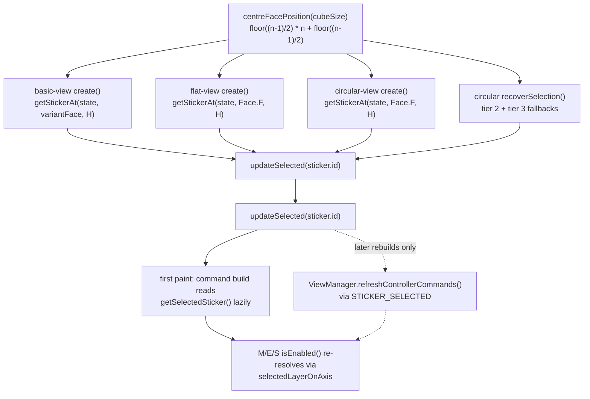
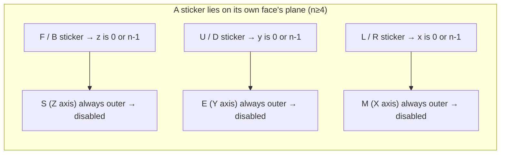

# fix: Size-correct default selection and documentation truth-up

## Summary

Two related jobs in one pass. First, a behavioural fix: the default sticker
selection a view establishes on creation is computed three different ways, and
only the Circular view's version is size-correct — Basic and Flat hardcode a
3×3-only face position, so they open with no selection at 2×2 and with a
corner/edge sticker at 4×4 and above, while the Circular view's arrow-key
recovery uses a _second_, different formula that is wrong at even sizes. Replace
all of them with one shared size-correct rule. Second, a documentation
correction: two root docs and one plan describe already-shipped work as pending,
a plan whose every unit targeted a deleted directory is still marked active, and
one brainstorm's motivating measurements do not reproduce against the shipped
configuration.

The two jobs belong together because the audit that found the bug also found the
documentation drift, and both are small, bounded, and verifiable in the same
session.

---

## Problem Frame

### The behavioural defect

Each view sets its default selection at the end of `create()`:

| View                                          | Expression                                    | Defect class                     |
| --------------------------------------------- | --------------------------------------------- | -------------------------------- |
| `src/views/basic/basic-view.ts`               | `getStickerAt(state, defaultFace, 4)`         | Hardcoded 3×3 position           |
| `src/views/flat/flat-view.ts`                 | `getStickerAt(state, Face.F, 4)`              | Hardcoded 3×3 position           |
| `src/views/circular/circular-view.ts`         | `floor((n-1)/2) * n + floor((n-1)/2)`         | Correct                          |
| `src/views/circular/keyboard-cube-walking.ts` | `floor(n²/2)` — recovery path, not `create()` | Size-derived but wrong at even n |

The third and fourth are **not** the same defect. The recovery formula is
size-derived and happens to be correct at every odd size; it diverges from the
Circular view's own default only at n=2, 4, and 6, where it lands on column 0.
It is also reached through a different lifecycle hook — `recoverSelection` runs
when `currentSelected` is lost, not when the view is created — so unifying it is
a genuine behaviour change at even sizes rather than a no-op refactor. Treating
all four as "a hardcoded default" would misstate both the cause and the blast
radius.

`CubeStateUtils.getStickerAt` is a linear scan with strict equality — it has no
range validation and returns `undefined` when nothing matches. Because every
call site guards with `if (x)`, an out-of-range position fails **silently**.

Measured against a real `CubeController(size)`, `Face.F, 4` resolves to:

| N   | `Face.F, 4`   | 3D position | Consequence                             |
| --- | ------------- | ----------- | --------------------------------------- |
| 2   | **undefined** | —           | view opens with **no selection**        |
| 3   | row 1, col 1  | (1,1,0)     | correct (the centre)                    |
| 4   | row 1, col 0  | (0,2,0)     | off-centre; M disabled (x=0 is outer)   |
| 5   | row 0, col 4  | (4,4,0)     | **a corner**; all three slices disabled |
| 6   | row 0, col 4  | (4,5,0)     | off-centre; E disabled (y=5 is outer)   |
| 7   | row 0, col 4  | (4,6,0)     | off-centre; E disabled                  |

And the Circular recovery formula diverges from the Circular default at even
sizes — `floor(n²/2)` lands on **column 0** for n=4 and 6, so pressing an arrow
key after losing the selection silently disables M where the view's own default
had enabled it.

### Why it is user-visible, not cosmetic

An absent selection is a genuine dead-end in Basic and Flat. Arrow keys return
"not handled" (so the browser scrolls the page), Space does nothing, and the
M/E/S buttons are disabled — the user must first _tap_ a sticker to get
selection-dependent behaviour. Circular self-heals on the first arrow key
because its recovery path runs; Basic and Flat have no equivalent.

### The documentation drift

Six distinct problems, none requiring behavioural change:

1. `implementation-status.md` and `TODO.md` list the Moves-view icon fallback
   and Circular multi-size support as pending; both shipped.
2. `implementation-status.md`, `TODO.md`, and `code-quality-evaluation.md` carry
   a stale quality snapshot (92 files / 2039 tests; actual: 103 / 2287).
3. `docs/plans/2026-08-16-002-…` is still `status: active`, but every
   implementation unit targets `src/views/basic-2/`, which no longer exists, and
   its blocker-rounding requirement targets a `blocker` concept deleted
   repo-wide.
4. `docs/plans/2026-09-17-001-…` is marked `completed` while two of its
   load-bearing requirements are now inverted in the shipped code (it required
   committed per-size SVG assets and required N=5 _not_ to be supported; today
   no assets are committed and all sizes 2–7 are served).
5. `docs/solutions/` holds six dangling cross-references to documents that no
   longer exist.
6. The scaling-law brainstorm's motivating measurements do not reproduce against
   the shipped configuration, and the approach it proposed is not the one that
   shipped.

---

## Requirements

**Default selection**

- R1. One shared, exported helper computes the centre face position for a given
  cube size — the single source of truth for "where does the default selection
  land".
- R2. All four production sites that establish or recover a default selection
  use that helper: Basic, Flat, Circular, and Circular's arrow-key recovery.
- R3. At every supported size (2–7) every view opens with a selection.
- R4. The default selection is the mathematical centre for odd sizes and a
  deterministic, documented choice for even sizes.
- R5. Basic's back variant keeps its own default face (Face.B) while using the
  shared position rule.
- R6. Behaviour at 3×3 is unchanged — the default still lands on the F-face
  centre (or B-face centre for the back variant).
- R7. M/E/S availability on load is ratifiable, not incidental: at n≥4 exactly
  one slice is disabled on load, and this is documented as the intended
  consequence, not a defect.

**Documentation**

- R8. `implementation-status.md`, `TODO.md`, and `code-quality-evaluation.md`
  reflect shipped work and carry a current quality snapshot pinned to the commit
  it was measured at.
- R9. `docs/plans/2026-08-16-002-…` is explicitly resolved (superseded), not
  left active.
- R10. `docs/plans/2026-09-17-001-…` records the shipped deviations from its own
  requirements.
- R11. Every path referenced from `docs/solutions/` resolves on disk.
- R12. Stale cross-references in code comments are corrected where they assert
  something false about where the default selection is set.
- R13. The scaling-law brainstorm records that its motivating measurements do
  not reproduce against the shipped configuration, and which approach shipped
  instead.
- R14. Basic and Flat have a decided, recorded position on what happens when a
  selection is lost after load — either a recovery path or an accepted residual.

---

## Scope Boundaries

### In scope

- The shared centre-position helper and its four production call sites.
- Test updates for the sites and assertions that encode the hardcoded position.
- The six documentation corrections enumerated above.
- A short slice-availability note in `src/docs/move-notation.md`, recording that
  a face-centred default leaves exactly one slice unavailable on n≥4. This is
  documentation of existing behaviour, not a change to slice notation or to the
  M/E/S resolution rules — the slice-notation boundary below means behaviour and
  syntax, not this note.
- Correcting one stale code comment (`src/application.ts`) that misattributes
  where the default selection is set.

### Deferred to Follow-Up Work

- **Arrow-key recovery for Basic and Flat.** Both views dead-end when no sticker
  is selected: arrow keys return "not handled" (so the browser scrolls), Space
  does nothing, and M/E/S are inert, and this is reachable _after_ load because
  tapping the background deselects. This plan fixes only the load-time cause.
  Porting Circular's `recoverSelection` to Basic and Flat is deliberately out of
  scope: it changes arrow-key semantics (Circular swallows the first keydown
  with no visible effect before recovering on keyup), which is a behaviour
  change beyond a default-selection fix. R14 requires that this residual is
  recorded.

  > **Superseded.** The residual was resolved the other way round: rather than
  > porting recovery to Basic and Flat, Circular's deselect paths were removed
  > so the state recovery existed for can no longer arise. `recoverSelection` is
  > deleted and `onStickerSelected` no longer accepts `undefined`. That also
  > dissolves the "tapping the background deselects" premise above — in Basic
  > and Flat it never did, and in Circular it no longer does.
  >
  > The narrative in this document is left as written, as the record of what was
  > believed and scoped at the time.

- **Consolidating the duplicated layout parameters.** The shipped ellipse values
  exist in three places — `src/views/circular/svg-generator/parameters.json`
  (what the app uses), `PROPOSALS` in
  `scripts/circular-layout/render-previews.ts` (a second hand-written copy for
  previews), and configuration `B` in
  `scripts/circular-layout/analyse-tangency.ts` (a superseded starting point).
  Nothing keeps them in sync. Real drift risk, but unrelated to selection and
  larger than this plan's scope.
- **Replacing the private `toFacePosition` in the generator's ghost module with
  the exported `calculateStickerPositionOnFace`.** A genuine near-duplicate, but
  it lives in the geometry layer and carries its own return-0 fallback, so
  folding it in is a behaviour question rather than a rename.
- **Deleting the orphaned solutions references' target documents' memory** — if
  a later refresh finds the underlying design is gone rather than merely moved.
- **Adding a per-view override seam for the default selection.** Explicitly
  declined for this plan; a face parameter is sufficient and the seam would be
  speculative.

### Out of scope

- Any change to M/E/S resolution logic, slice notation, or command enablement
  rules.
- Any change to circular geometry parameters or the generated SVG.
- Any new user-facing feature.

---

## Key Technical Decisions

- **One helper in an existing utils module, not a new view-layer abstraction.**
  `src/cube/utils/sticker-position.ts` already owns face-position geometry and
  already exports the 3D→face-position inverse
  (`calculateStickerPositionOnFace`) and the face→3D forward
  (`facePositionTo3D`). A centre-position helper belongs beside them. Placing it
  in the view layer instead would leave the geometry knowledge split across two
  modules and would make the helper unreachable from the recovery path.

- **The helper returns a position; the face is supplied at each call site.** The
  centre _position_ (row/col index) is face-independent, so it is not a
  parameter of the helper. Only the face differs between Basic's front and back
  variants, and the caller already computes it (`defaultFace`), so requiring
  each call site to pass its face to `getStickerAt` keeps the helper signature
  minimal and makes the face choice explicit rather than defaulted. For an odd
  size there is exactly one true centre cell; for an even size the documented
  choice is the lower-indexed cell of the centre block (`floor((n-1)/2)`).

- **Odd and even sizes agree on one formula.**
  `floor((n-1)/2) * n + floor((n-1)/2)` is correct for every n; the competing
  `floor(n²/2)` is only correct for odd n. Adopting the former everywhere
  removes the divergence rather than patching one side of it.

- **The face parameter is required on the sticker lookup, not defaulted to
  `Face.F`.** Basic's back variant needs `Face.B`, and a silent `Face.F` default
  would make the wrong choice easy to write by accident. Requiring it at each
  call site forces the intent to be stated.

- **The even-size tie-break is chosen deliberately, and its asymmetry is
  accepted.** At n=4 and n=6 the centre block holds four cells, so the choice is
  product-visible: at 4×4 the F-face centre gives `2M` and `3E`, and the
  adjacent cell would give `3M` and `2E`. The plan takes the lower-indexed cell
  (`floor((n-1)/2)`) because it is a single reproducible rule rather than a
  per-axis judgement, it preserves Circular's existing behaviour, and it matches
  the form already encoded in two test helpers. A consequence worth stating
  plainly: the resulting layer numbers are **asymmetric between axes** — the X
  slice takes the lower interior layer while the Y slice takes the upper — so
  `2M` and `3E` sit side by side at 4×4. That asymmetry is inherited, not
  designed, and is accepted because the alternative (a per-axis rule) is harder
  to state and to test than the one rule it replaces.

- **The "one slice disabled on load at n≥4" outcome is ratified deliberately.**
  A sticker on its own face always sits on that axis's outer layer, so a
  face-centre default structurally cannot enable all three slices: F/B leaves S
  disabled, U/D leaves E disabled, L/R leaves M disabled. This matches the
  documented product rule that turning an outer layer is a face move rather than
  a slice, so the plan documents it rather than engineering around it. Making
  all three available on load would require a non-face default, which is a
  product decision outside this plan's scope.

- **Documentation is corrected in place; nothing is deleted.** The repo's
  `docs/` tree is the durable record of why decisions were made. Superseding a
  plan and amending a brainstorm preserve that record; deleting them destroys
  the reasoning that a future reader needs to avoid re-litigating the same
  ground. The one exception is an outright false statement, which is corrected
  rather than annotated.

---

## High-Level Technical Design

The selection path after the fix — one rule, four call sites, one shared origin:

**Ordering invariant — do not break this.** The initial selection reaches the
M/E/S buttons through the _first paint_ path, not through the event. In
`ViewManager.initialize()`, views are created (`createViewControls()`, which
fires each view's default selection) **before** the `STICKER_SELECTED`
subscription is registered, so the initial emit is observed by nobody. The first
render is still correct because the controller commands are built afterwards and
read the selection lazily through `getSelectedSticker()`, while `isEnabled()`
re-resolves on every call. The event path only serves _later_ rebuilds. Any
reordering of `createViewControls()` relative to
`registerCommands('controller', …)` or the subscription would leave the labels
frozen at the bare `M`/`E`/`S` with stale enablement — so U2 must assert the
load-time enablement rather than assume the event carried it.

The `n≥4` qualifier matters: at 3×3 `resolveSliceTarget` returns the fixed bare
`M`/`E`/`S` from an early branch and never consults the selection at all, so all
three stay available. The structural argument above applies only where the
resolution is selection-driven.

For the F-face default at n≥4, the resulting load state is:

| N   | default position | 3D      | M        | E        | S        |
| --- | ---------------- | ------- | -------- | -------- | -------- |
| 2   | 0                | (0,1,0) | disabled | disabled | disabled |
| 3   | 4                | (1,1,0) | `M`      | `E`      | `S`      |
| 4   | 5                | (1,2,0) | `2M`     | `3E`     | disabled |
| 5   | 12               | (2,2,0) | `3M`     | `3E`     | disabled |
| 6   | 14               | (2,3,0) | `3M`     | `4E`     | disabled |
| 7   | 24               | (3,3,0) | `4M`     | `4E`     | disabled |

At n=2 all three are disabled by the existing `cubeSize < 3` early return, which
is correct — a 2×2 has no interior layer.

**The table is face-independent.** Measured against a real `CubeController(n)`,
the B-face centre resolves to `(2,2,3)` at n=4, `(2,2,4)` at n=5, `(3,3,5)` at
n=6 and `(3,3,6)` at n=7 — the same X and Y layers as the F-face centre, and the
equivalent outer layer on Z. So Basic's back variant sees the same M/E/S
availability and the same notations as the table above; only the highlighted
sticker's face differs. That is why one F-face table suffices for both variants
and why the helper needs no face parameter to produce the position.

---

## Implementation Units

### U1. Add the shared centre-position helper

- **Goal** — A single exported function computes the centre face position for a
  cube size, with the even-size tie-break documented.
- **Requirements** — R1, R4
- **Dependencies** — none
- **Files** — `src/cube/utils/sticker-position.ts`,
  `src/cube/utils/sticker-position.test.ts`
- **Approach** — Add the helper beside the existing `facePositionTo3D` and
  `calculateStickerPositionOnFace`. Take `cubeSize` only; return the row-major
  face position. Document in the JSDoc that odd sizes have a unique centre cell
  while even sizes choose the lower-indexed cell of the centre block, and say
  why the choice is that one. Do not take a face parameter — the position is
  face-independent, and U2 supplies the face at each call site. Reuse the
  existing `Math.floor` convention rather than introducing a new one.

  **Scope the unit explicitly.** Two neighbouring "centre" notions exist and are
  **not** in scope, because neither is a face position:
  `src/cube/core/cubie-manager.ts` computes `(cubeSize - 1) / 2`, which goes
  fractional at even sizes and is a geometric coordinate rather than a sticker
  index; and `src/views/circular/svg-generator/ghosts.ts` holds a private
  `toFacePosition` duplicating `calculateStickerPositionOnFace` in the same
  module — a genuine near-duplicate, but a consolidation in the generator's
  geometry layer, not part of a selection fix. Naming both here prevents the
  unit from absorbing a wider refactor than it budgets for. The `ghosts.ts`
  duplication is noted in Sources & Research as a consolidation candidate for a
  later pass.

- **Patterns to follow** — `facePositionTo3D` and
  `calculateStickerPositionOnFace` in the same file for signature style and
  JSDoc depth; the correct formula already written out in
  `src/view-manager/view-manager.test.ts` and
  `src/interaction/slice-target.test.ts`.
- **Test scenarios**
  - Happy path: for every size in `SUPPORTED_SIZES` (2–7) the helper returns a
    position within `[0, cubeSize²-1]`.
  - Happy path: for odd sizes (3, 5, 7) the returned position is the row-major
    index whose row and column both equal `floor((n-1)/2)`.
  - Edge case: at n=2 the helper returns 0 — the documented even-size choice.
  - Edge case: at n=4 the helper returns 5 (row 1, col 1), not 8 — the
    regression guard for the `floor(n²/2)` mistake.
  - Edge case: at n=6 the helper returns 14, not 18.
  - Integration: for every size, resolving the helper's position against a real
    `CubeController(size)` via `CubeStateUtils.getStickerAt(state, Face.F, pos)`
    yields a defined sticker — the property that Basic and Flat currently
    violate.
- **Verification** — The helper is exported, every size 2–7 resolves to a real
  F-face sticker, and the even-size values are pinned by test.

### U2. Route all four production call sites through the helper

- **Goal** — Basic, Flat, Circular, and Circular's recovery path all derive
  their default selection from the shared helper.
- **Requirements** — R2, R3, R5, R6, R7
- **Dependencies** — U1
- **Files** — `src/views/basic/basic-view.ts`,
  `src/views/basic/basic-view.core.test.ts`, `src/views/flat/flat-view.ts`,
  `src/views/flat/flat-view.test.ts`, `src/views/circular/circular-view.ts`,
  `src/views/circular/circular-view.test.ts`,
  `src/views/circular/keyboard-cube-walking.ts`,
  `src/views/circular/keyboard-cube-walking.test.ts`,
  `src/docs/move-notation.md`
- **Approach** — Replace the literal `4` in Basic and Flat with the helper's
  result, passing the correct face at each site: Basic passes its variant face
  (already computed as `defaultFace`), Flat passes `Face.F`. In Circular,
  replace the inlined row/col arithmetic with the helper. In `recoverSelection`,
  replace the local `centerPos` computation so tiers 2 and 3 both use the helper
  — this is the site whose even-size behaviour currently disagrees with
  Circular's own default. Keep each site's existing `if (sticker)` guard shape;
  the helper makes the guard's condition always true, but removing the guard
  would be an unrelated change and the guard is still correct defensively.

  Note on existing coverage: Basic currently has **no** test for its default
  selection at all, and Flat's only default-selection test asserts definedness
  without checking which sticker — which is why the Basic/Flat defect survived.
  Basic's tests belong in `src/views/basic/basic-view.core.test.ts`, which
  already constructs a real `CubeController` in `beforeEach`
  (`new CubeController()` alongside `view = new BasicView(...)`), so
  parameterizing it by cube size is the smallest addition. Circular's existing
  test does assert a specific sticker but does so through a mock that swallows
  the requested position, so it needs the position assertion added rather than a
  new test.

  **Where each site reads its cube size.** All four must read the size from the
  live cube state (`model.getCurrentState().cubeSize`, which is non-optional on
  `CubeState`). Do not route the helper through the `() => … ?? 3` closures the
  views already pass to their touch handlers: those exist to tolerate a missing
  model, and a fabricated 3 would make the helper return 4, `getStickerAt` would
  match nothing at 2×2, and the `if (sticker)` guard would swallow it — silently
  reproducing the exact defect this plan exists to fix, at the exact size it
  exists to fix, with a green suite (the unit tests use a real controller and
  would never exercise the closure).

- **Patterns to follow** — The Circular view's existing `create()` block, which
  already derives rather than hardcodes; `recoverSelection`'s three-tier
  structure.
- **Test scenarios**
  - `Covers R3.` Happy path: for each size 2–7, creating a Basic view yields a
    defined `getSelectedSticker()`.
  - `Covers R3.` Happy path: for each size 2–7, creating a Flat view yields a
    defined `getSelectedSticker()`.
  - `Covers R6.` Happy path: at 3×3 the Basic front variant selects the F-face
    centre and the back variant the B-face centre; Flat and Circular select the
    F-face centre. Assert the **exact sticker identity**, not definedness — R6
    is the safety rail for this change, and a definedness-only assertion would
    stay green if the helper were later "simplified" to `floor(cubeSize/2)`,
    which at 3×3 yields position 5 (an edge sticker) and silently changes M/E/S
    labels. Pair each identity assertion with the expected M/E/S notation at
    that size.
  - `Covers R5.` Edge case: at 4×4 and 6×6 the Basic back variant selects the
    _B_-face centre, not an F-face sticker — guards against a fix that
    accidentally hardcodes the face.
  - Edge case: at 2×2 all four views select a sticker (the case that currently
    produces no selection in Basic and Flat).
  - Edge case: `recoverSelection` from a cleared selection at n=4 and n=6
    selects the same position the view's `create()` would choose — the
    divergence guard.
  - Integration: creating a view at n>3 and then reading the M/E/S command
    enablement through the ViewManager yields the state tabled in the High-Level
    Technical Design section (exactly one slice disabled at n≥4).
  - Integration: creating a view emits `STICKER_SELECTED`, and the ViewManager's
    command rebuild reflects the default selection on first render.
  - `Covers R14.` Edge case: the Basic and Flat post-deselect behaviour is
    recorded — either a test pinning the current dead-end (tapping the
    background deselects; a subsequent arrow key is unhandled) or a comment plus
    a deferred entry, so the residual is deliberate rather than unnoticed.
  - `Covers R7.` Integration: `src/docs/move-notation.md` records that on n≥4 a
    Face.F default leaves the S slice unavailable, so the load-time slice
    availability is documented behaviour rather than an unexplained dead button.
    The note must state the `n≥4` qualifier: at 3×3 the resolution
    short-circuits to the fixed bare `M`/`E`/`S` and all three remain available.
- **Verification** — No production file hardcodes a face position for the
  default selection; every size opens with a selection in all views; the
  recovery and creation paths agree at even sizes; the one-slice-disabled
  outcome at n≥4 is recorded in the move-notation doc.

### U3. Update the tests and fixtures that encode the hardcoded position

- **Goal** — Tests no longer assert or fabricate the 3×3-only assumption, and
  the assertions that were passing by accident are strengthened.
- **Requirements** — R2, R6
- **Dependencies** — U2
- **Files to change** — `src/views/circular/circular-view.test.ts`,
  `src/views/flat/flat-view.test.ts`,
  `src/views/circular/keyboard-cube-walking.test.ts`
- **Files to verify unchanged** — `src/views/basic/basic-view.commands.test.ts`,
  `src/views/flat/commands.test.ts`, `src/views/flat/navigation.test.ts`,
  `src/views/circular/animations.test.ts`,
  `src/views/circular/highlights.test.ts`,
  `src/views/circular/touch-handler-hit-testing.test.ts`,
  `src/interaction/keyboard-moves.test.ts`,
  `src/cube/utils/surface-walking.test.ts`
- **Approach** — Two distinct jobs. First, tests that _assert_ default-selection
  behaviour must assert the new expectation: the Circular test that mocks
  `getStickerAt` and expects `'sticker-f4'` should assert which position was
  requested rather than only what the mock returned, since the current mock
  swallows the position and would pass under any formula. The Flat test that
  checks only `toBeDefined()` should assert the specific sticker.
  `keyboard-cube-walking.test.ts` is the test for one of the four production
  sites U2 changes — it holds `stickerAt(Face.F, 4)` at two call sites and must
  be updated alongside the recovery-path change. Second, tests and fixtures that
  _fabricate_ a selection at position 4 purely to drive unrelated behaviour are
  on 3×3 fixtures and remain valid — leave their behaviour alone, but verify
  each is genuinely 3×3-scoped so it cannot silently mislead a future non-3×3
  test. Do not mechanically rewrite fixtures; judge each by whether its comment
  claims something about "the centre".

  **New Basic coverage does not belong here.**
  `src/views/basic/basic-view.core.test.ts` is where U2 adds the size-2–7 Basic
  assertions, and it is listed under U2 for that reason — it contains no
  hardcoded-position literal, so it is not part of this unit's sweep. Keeping
  the two concerns in separate units means this unit's file list is exactly the
  literal-bearing set.

  The "files to verify unchanged" list is derived from a grep for the literal,
  not from memory. All are 3×3 fixtures where position 4 is legitimately the
  centre; leave them as-is unless a comment claims "the centre" in a way that
  would mislead at another size. `interaction/keyboard-moves.test.ts` carries
  the comment `// center of F` at its first site, which is the one worth
  tightening.

- **Patterns to follow** — `src/view-manager/view-manager.test.ts`'s
  `frontCentre()` helper, which is already size-correct and is the model for how
  a test should express "the default selection".
- **Test scenarios**
  - Happy path: the mocked-`getStickerAt` test asserts the position argument it
    was called with equals the helper's result for the fixture's cube size.
  - Happy path: the Flat default-selection test asserts the specific expected
    sticker identity rather than mere definedness.
  - Edge case: a test exists that would fail if a site reverted to the literal
    `4` at n≠3 — at least one per view.
  - Integration: the full suite passes with no test relying on
    `getStickerAt(..., 4)` outside a 3×3 fixture.
- **Verification** — The suite passes, and reverting any single call site in U2
  to the literal `4` causes at least one test failure per view.

### U4. Resolve the stale plans

- **Goal** — No plan in `docs/plans/` claims a state the code contradicts.
- **Requirements** — R9, R10
- **Dependencies** — none
- **Files** —
  `docs/plans/2026-08-16-002-fix-multi-size-rendering-and-move-notation-plan.md`,
  `docs/plans/2026-09-17-001-feat-circular-svg-generator-plan.md`,
  `docs/plans/2026-09-05-002-refactor-basic2-cutover-plan.md`
- **Execution note** — Reconcile `2026-08-16-002` unit by unit against shipped
  code _before_ writing its superseded note. The cutover reimplemented the Basic
  view, so some of that plan's units may have landed under different names. A
  plausible-sounding "what landed" paragraph written without that check would
  permanently mark genuinely unshipped requirements as superseded, and no future
  reader would re-open them — replacing one documentation drift with another.
  Where coverage cannot be established, say `landed: unknown` for that unit
  rather than asserting either outcome.
- **Approach** — For `2026-08-16-002`: it is superseded, not abandoned. Flip its
  status and add a short superseded-by note explaining that every unit targeted
  `src/views/basic-2/` (removed by the Basic 2 cutover) and that its
  blocker-rounding requirement targets a concept deleted repo-wide — but note
  which of its units _did_ land under the cutover, so the reader knows the work
  was not wasted. For `2026-09-17-001`: add a post-completion amendment in the
  style `2026-09-06-001` already uses, recording that assets became optional and
  that all sizes 2–7 ship, so the plan's committed-asset and N=5-not-shipped
  requirements are inverted rather than unmet. For `2026-09-05-002`: verify its
  status is still accurate after the cutover and adjust only if it is not.
- **Patterns to follow** — The post-completion amendment block at the top of
  `docs/plans/2026-09-06-001-feat-moves-view-icon-fallback-plan.md` — same
  format, same placement, same purpose.
- **Test expectation: none — documentation-only unit, no behavioural change.**
- **Verification** — Reading `docs/plans/` top to bottom, no plan's declared
  status contradicts the shipped code, and each superseded plan explains why.

### U5. Correct the root status and quality docs

- **Goal** — `implementation-status.md`, `TODO.md`, and
  `code-quality-evaluation.md` describe the shipped state.
- **Requirements** — R8
- **Dependencies** — U4
- **Files** — `implementation-status.md`, `TODO.md`,
  `code-quality-evaluation.md`
- **Approach** — Move the Moves-view icon fallback and Circular multi-size
  support from pending to complete, removing the per-size sub-item lists that
  are no longer meaningful. Refresh the quality snapshot to the measured current
  numbers, **pinned to the commit they were measured at**, and treat this unit
  as the last one to run: U1–U3 add tests, so a snapshot taken before them is
  stale on arrival. State which content is de-duplicated and which must stay
  verbatim — `implementation-status.md` and `TODO.md` carry overlapping feature
  checklists, and de-duplicating those is in scope, but the quality snapshot
  must appear (or be correct) in both, since R8 names both documents. Update the
  "Long Term (almost certainly not)" section, which currently lists multi-size
  visualisations as not planned while they ship. Keep the acknowledged Firefox
  rotation issue — verify it is still reproducible before removing any
  known-issue entry.
- **Patterns to follow** — The existing document structure and checkmark
  vocabulary; do not restructure the docs, only correct them.
- **Test expectation: none — documentation-only unit, no behavioural change.**
- **Verification** — Every claim in the three docs can be checked against the
  code and the test run in a couple of minutes, and the duplicated checklist is
  gone.

### U6. Repair the solutions library's dangling references and the stale code comment

- **Goal** — `docs/solutions/` no longer points at documents that do not exist,
  and the one misleading code comment is fixed.
- **Requirements** — R11, R12
- **Dependencies** — none
- **Files** — `docs/solutions/conventions/move-notation-casing-2026-05-12.md`,
  `docs/solutions/features/basic-view-ghost-stickers-2026-05-03.md`,
  `docs/solutions/ui-bugs/circular-ghost-selective-hide-2026-05-03.md`,
  `src/application.ts`
- **Do not touch** — `docs/solutions/logic-errors/directional-180-moves.md`. Its
  two relative references were an initial suspect but both resolve.
- **Approach** — The real staleness here is **dangling cross-references**, not
  wrong technical claims. Six references across four entries point at documents
  that no longer exist — verified by resolving each referenced path against the
  tree with correct relative-path handling:

  | Entry                                                 | Dangling reference                                                                                                                             |
  | ----------------------------------------------------- | ---------------------------------------------------------------------------------------------------------------------------------------------- |
  | `conventions/move-notation-casing-2026-05-12.md`      | `docs/move-notation.md` — the file is now `src/docs/move-notation.md`                                                                          |
  | `features/basic-view-ghost-stickers-2026-05-03.md`    | three refs: a brainstorm, a plan, and an ideation doc, all absent                                                                              |
  | `ui-bugs/circular-ghost-selective-hide-2026-05-03.md` | `docs/plans/2026-05-02-001-…` and `../logic-errors/directional-180-move-hardening-2026-05-09.md` (the live file is `directional-180-moves.md`) |

  `logic-errors/directional-180-moves.md` was an initial suspect but its two
  relative references **do** resolve — do not "fix" them. The first row is a
  moved path; the rest point at genuinely removed documents, so either repoint
  to a surviving equivalent or drop the reference while keeping the entry's
  reasoning intact. Verify each fix by resolving the corrected target rather
  than by eye.

  Do **not** rewrite the technical content: the entries' code references
  (`collectAffectedGhostElements`, `CUBE_EDGE_MAP`, `basic-view.ghost-hints`)
  all still resolve against the current tree, so their implementation notes are
  accurate. The one exception is `move-notation-casing`, whose
  `docs/move-notation.md` reference is a moved path rather than a deleted
  document.

  Separately, correct the comment in `src/application.ts` that claims the
  ViewManager sets the default selection — it does not; each view sets its own.
  The comment is already wrong today and becomes doubly wrong once U2 lands, so
  the correction stands alone and does not need to wait for U2.

- **Patterns to follow** — Existing `docs/solutions/` frontmatter and section
  structure; keep corrections surgical and preserve each entry's reasoning.
- **Test expectation: none — documentation corrections plus a comment fix, no
  behavioural change.**
- **Verification** — Every path referenced from `docs/solutions/` resolves on
  disk, and the `src/application.ts` comment describes what the code actually
  does.

### U7. Amend the scaling-law brainstorm

- **Goal** — The brainstorm records that its motivating measurements do not
  reproduce against the shipped configuration, and that its proposed approach
  was not the one taken.
- **Requirements** — R13
- **Dependencies** — none
- **Files** —
  `docs/brainstorms/2026-09-17-circular-view-layout-scaling-law-requirements.md`
- **Approach** — Add an amendment section recording three verified findings.
  First, the overlap figures do not reproduce: measured against the shipped
  parameter sets with `scripts/circular-layout/analyse-tangency.ts` and
  `render-previews.ts`, all sizes 2–7 report zero overlapping ellipse pairs with
  a positive minimum gap — n=3 is the tightest at 0.20 units, and the others run
  from 2.76 (n=5) to 9.13 (n=7). Record the criterion alongside the number: the
  gap is the exact support-function separation between filled ellipses in SVG
  user units, where `≤ 0` means intersection, and "no overlap" means a strictly
  positive minimum across all 15 face pairs. Second, the document's own two
  stated causes are gone: no size inherits the `2.9286` ellipse margin (every
  size overrides it) and the label mask now derives its rectangle from the
  emitted canvas rather than a fixed 400×340. Third, and most importantly, the
  proposed remedy was not what unblocked the sizes — the shipped ellipse values
  are hand-tuned, not derived. Verified: no script writes `parameters.json`, its
  own `$comment` says the values are "tuned by eye", and `analyse-tangency.ts`
  is a one-shot analysis over a superseded configuration rather than a solver
  that feeds the file. Phrase the conclusion as **"no longer true under the
  shipped configuration"**, not "never reproducible": the measurements were
  correct against the configuration they were taken from, and the record has no
  baseline for what the original author measured. Record the scope decision that
  the derived-law approach stays unimplemented and unplanned, and add a pointer
  to the duplicated-parameter-values follow-up noted in Scope Boundaries.
- **Patterns to follow** — The post-completion amendment format in
  `docs/plans/2026-09-06-001-feat-moves-view-icon-fallback-plan.md`. Write the
  amendment as findings, not as blame — the measurements were correct against
  the configuration they were taken from.
- **Test expectation: none — documentation-only unit, no behavioural change.**
- **Verification** — The document no longer presents a non-reproducing premise
  as current, and a reader can tell which approach shipped.

---

## Verification Strategy

| Check                     | Pass condition                                                                                                                                                                        |
| ------------------------- | ------------------------------------------------------------------------------------------------------------------------------------------------------------------------------------- |
| Type check                | Clean                                                                                                                                                                                 |
| Full test suite           | All tests pass, no new failures                                                                                                                                                       |
| Sizes 2–7, all views      | Every view opens with a sticker selected                                                                                                                                              |
| 3×3 regression            | Basic front selects F-centre, back selects B-centre; Flat and Circular select F-centre — unchanged from today                                                                         |
| Even-size consistency     | At n=4 and n=6, `recoverSelection` and `create()` agree on the selection                                                                                                              |
| Hardcoded-literals grep   | No production file computes a default selection from a literal face position                                                                                                          |
| Slice availability at n≥4 | Exactly one of M/E/S disabled on load, matching the documented table                                                                                                                  |
| Docs audit                | No root doc or plan claims a state the code contradicts                                                                                                                               |
| Solutions library links   | Every path referenced from `docs/solutions/` resolves on disk                                                                                                                         |
| Doc claims                | The three root docs' test/file counts and feature statuses match a fresh run taken after U1–U3's tests land, with the commit pinned                                                   |
| Load-time enablement      | At n≥4 the M/E/S enablement observed on first paint matches the documented table — asserted, not inferred from the `STICKER_SELECTED` event, which nothing observes at initialisation |

---

## Risks and Dependencies

- **The even-size tie-break is a product-visible choice.** At n=4 and n=6 the
  centre block has four cells and the choice determines which slice notation
  appears in the button label (`2M` vs `3M`). The plan picks the lower-indexed
  cell to match the Circular view's existing behaviour, so nothing changes where
  behaviour is already correct. If a different cell is preferred, that is a
  deliberate change to state up front rather than discover mid-implementation.
- **Ratifying the disabled slice could be read as a regression.** Going from
  "N=5 opens with all three slices disabled" to "N=5 opens with exactly one
  disabled" is a strict improvement, but the remaining disabled slice is
  structural. Document it in the same breath as the fix so it does not later get
  filed as a bug.
- **Documentation units have no test gate.** Units U4–U7 are verified by
  reading, which is weaker than a test. The mitigation is that each unit's
  verification names a specific checkable claim rather than "the doc reads
  better".
- **The `?? 3` occurrences are noise, not signal.** Several files guard
  `cubeSize` with `?? 3` even though `CubeState.cubeSize` is non-optional. The
  plan does not touch them; do not read them as evidence that the size might be
  undefined.

---

## Deferred to Implementation

- **Helper export shape.** The Key Technical Decisions constrain the signature
  (takes `cubeSize`, returns a position, no face parameter). What remains open
  is whether it returns a plain number or a small `{row, col}` — decide by how
  it reads beside `facePositionTo3D` and `calculateStickerPositionOnFace` in the
  same file.
- **Which files need outright cleanup versus a tightening comment.** U3 names
  the three groups and how each should be treated, but which individual fixtures
  read as claiming "the centre" is only judgeable by reading each comment in
  place.
- **Whether each dangling solutions reference should be repointed or dropped.**
  U6 names the six broken references. For those pointing at genuinely removed
  documents, whether a surviving equivalent exists is a per-case judgement.
- **How much of `2026-08-16-002`'s work landed under the cutover.** U4's note
  should name what was absorbed rather than only what was dropped, but the exact
  mapping between its units and the cutover commits needs reading the plan
  against the cutover diff.

---

## Sources & Research

- `docs/plans/2026-09-17-001-feat-circular-svg-generator-plan.md` — records the
  hardcoded-default finding at lines 190–192, including the now-known-incorrect
  claim that the two centre formulas "align" (they agree only for odd sizes).
- `src/interaction/slice-target.ts` — the M/E/S resolution rule and the
  `isInteriorLayer` boundary that makes one slice structurally unavailable from
  a face default.
- `src/cube/utils/sticker-position.ts` — where the helper belongs, beside
  `facePositionTo3D` and `calculateStickerPositionOnFace`.
- `src/views/circular/svg-generator/ghosts.ts` — carries a private duplicate of
  the same 3D→face-position inverse; a consolidation candidate, noted but not
  actioned here.
- `scripts/circular-layout/analyse-tangency.ts` and
  `scripts/circular-layout/render-previews.ts` — the tools used to measure the
  shipped ellipse gaps, and the evidence for the hand-tuned finding in U7.
- `docs/plans/2026-09-06-001-feat-moves-view-icon-fallback-plan.md` — the
  amendment format U4 and U7 follow.
