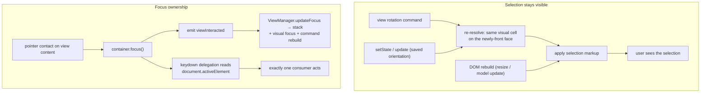
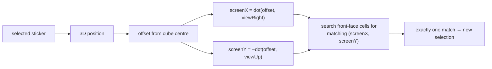
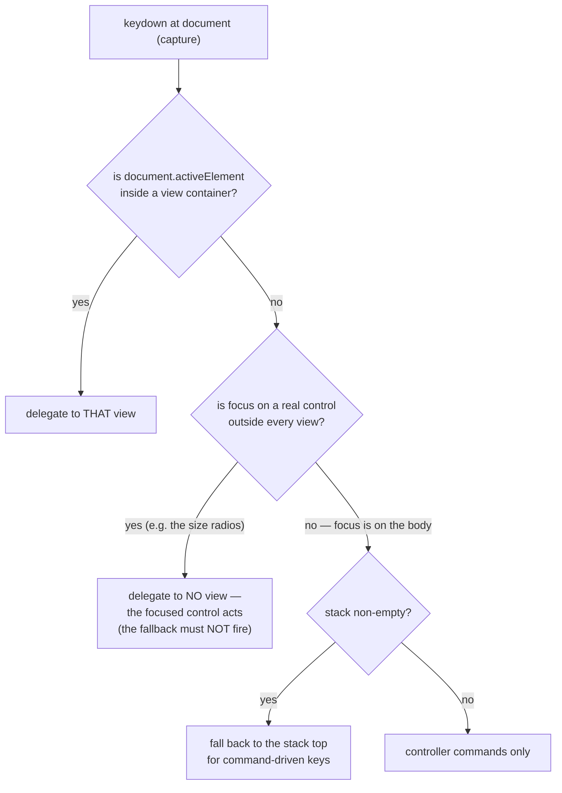

# fix: Selection visibility and view focus ownership

## Summary

Finish two half-built halves of one architecture. Anchor the Basic view's
selection to the visible front face so it survives an orientation change, and
re-derive its markup whenever the cube DOM is rebuilt so what the user sees
agrees with what the app reports. Then complete view focus ownership: a view the
user contacts takes DOM focus, reports that contact through the documented
`viewInteracted` event, and the app derives keyboard ownership from where focus
is — delegating to a view only while focus is inside one.

---

## Problem Frame

The architecture described in `src/docs/commanding-and-eventing-system.md`
specifies a focus model as an event: _"Views emit `viewInteracted` on mouse
enter/click. ViewManager maintains stack."_ Today the event is declared and both
ends are missing — `EventName.VIEW_INTERACTED` is defined in
`src/types/events.ts`, nothing emits it, and `ViewManager.initialize()`
subscribes to four other events but not this one. The event is inert in both
directions.

Meanwhile each view sets `container.tabIndex = 0` to be focusable, but only the
Flat view ever calls `container.focus()`. Basic and Circular set the attribute
and never use it, so contacting those views leaves DOM focus wherever it was.

That combination produces a concrete, reported failure. Basic's touch handler
calls `preventDefault()` on pointer-down — which is correct, it suppresses
native drag — but nothing moves focus, and `preventDefault()` does not stop
propagation. If focus was last on the cube-size radio group, an arrow key
reaches both the document-level capture handler (which delegates to the active
view and consumes the key) _and_ the size selector's own container-level
listener, which switches cube size. The user sees the cube resize while trying
to move the selection.

Selection visibility fails in two independent ways. First, the selection is
_model-anchored_: rotating the view changes which faces face the viewer but
never touches the selection, so one rotation can leave it on a face behind the
cube. Second, `create()` applies the `selected` class, and then the app's own
startup sequence calls `resize()`, which rebuilds every cubie element and drops
the class — while `state.currentSelected` survives. The app therefore reports a
selection that the user cannot see.

**Two corrections to the origin document's premise**, both verified in code:

- The focus stack is _not_ driven only by panel chrome.
  `PanelInteractionHandler` registers its pointerdown listener on the ancestor
  container and resolves the panel with `target.closest('.view-panel')`, so
  contacting a view's **content** already reaches `updateFocus`. The missing
  piece is DOM focus and the event bridge, not the stack update — which makes
  this work narrower than the brainstorm implies.
- `VIEW_INTERACTED` has no consumer either. Adding an emitter alone would change
  nothing; a subscription (and its disposal) has to be added too.

**Scope note.** Whole-cube view rotation — `viewForward` and the
`rotateViewLeft/Right/Up/Down` family — exists **only in the Basic view**;
nothing outside `src/views/basic/` references them. The selection-visibility
requirements therefore land in Basic. The rebuild failure and the focus
requirements are cross-view.

---

## Requirements

Carried from the origin document. R-IDs are preserved so traceability holds
across both artifacts.

**Selection visibility**

- R1. The selected sticker is always on a face that is currently visible to the
  user. No reachable state has the selection existing but drawn on a face the
  user cannot see.
- R2. When the view rotates, the selection moves to the sticker occupying the
  same visual cell on the newly-front face, rather than following the physical
  sticker.
- R3. The re-anchored selection lands on a sticker that actually exists at that
  visual cell for the active cube size — including edge and corner cells, and
  sizes where the 2×2 centre block makes "the centre" ambiguous.
- R4. The visual-cell mapping is defined for every face pair the user can rotate
  between, and is symmetric with respect to rotation direction.
- R5. The invariant holds at every orientation entry point, not only arrow-key
  navigation: view rotation commands, cube-size change, and restoring a saved
  view state.
- R6. The selection's on-screen markup survives any DOM rebuild, so what the
  user sees always agrees with what the app reports as selected.

**View focus ownership**

- R7. Interacting with a view's content gives that view DOM focus, equally for
  Basic, Circular and Flat.
- R8. The app-level notion of "active view" is derived from where focus is: the
  view containing the focused element is active, and no view is active while
  focus is on a control outside every view. The focus stack is a consequence of
  that derivation, not an independent source of truth.
- R9. When a view holds focus, keyboard events it handles cannot also be acted
  on by an unrelated focused control elsewhere in the app.
- R10. When a view does _not_ hold focus, keys it would otherwise consume are
  not silently swallowed on its behalf — the control the user is focused on
  keeps working.
- R11. Focus acquisition does not cause the page or a scroll container to jump.
- R12. The evidence a view gives for being interactive is the documented event,
  so the mechanism is inspectable rather than implicit.

**Machine hygiene**

- R13. No member declared in the event catalogue or on a view state bag remains
  inert in production code. Each is either wired to the behaviour it was
  declared for, or removed along with the reads depending on it.
- R14. The hover-scale affordance on the Basic view is removed, not restored.

> R14 shipped before this plan (`bd418a2`): the `isHovered` field, its `HOVER`
> angle constant, the rendering branch and the test asserting `scale(1.05)` are
> all gone. It is carried here only so the origin's requirement set is complete;
> no unit below advances it.

---

## Key Technical Decisions

- **Style the correction into the plan rather than trusting the origin's
  framing.** The origin reads the focus stack as panel-chrome-only. The code
  says otherwise. The plan therefore treats the stack update as already working
  and scopes the fix to DOM focus plus the event bridge — a smaller change than
  the brainstorm implies, and one that will not accidentally rebuild a working
  path.

- **The event gets both a producer and a consumer.** `viewInteracted` is the
  documented mechanism, and emitting into a void would be worse than leaving it
  inert because it would look wired. The subscription is added to
  `ViewManager.initialize()` alongside the existing four, with matching `off()`
  in `dispose()` — the existing disposal block unregisters exactly four events,
  so a fifth must be added deliberately or listeners accumulate across size
  switches.

- **The visual cell is resolved by projection, not by a face-pair table.** A
  sticker is addressed by its offset along the two _fixed_ screen axes
  (`viewRight`, `viewUp`) from the cube centre; the axis whose face becomes
  front is free. Verified by measurement against a real cube and view: on the
  front face the projection identifies exactly one sticker for every cell (9 of
  9 at 3×3, 16 distinct visual cells of 16 at 4×4), it resolves under all four
  rotation directions, and a rotate-then-rotate-back round trip returns the
  selection to its starting cell. This removes the need for a hand-written
  mapping per face pair and is size-independent, so R3 holds at every supported
  size without per-size code.

- **Horizontal and vertical rotations behave differently, and the rule must not
  paper over it.** The same projection produces mirrored cell indices for
  horizontal rotations (`0→2`, `2→0`) and identity for vertical ones (`0→0`).
  That asymmetry is a property of how face bases orient, not an artifact — it is
  exactly why preserving the raw index would put the selection on the wrong
  side. The rule preserves the _screen_ position, which is why the indices
  differ.

- **The projection comparison is exact — no tolerance.** Measured across every
  supported size (2–7), the projected coordinates land exactly on half-step
  values: the worst deviation from the nearest half-integer is `0.00e+0` at
  every size from 2 to 7. Because the view vectors are axis-aligned units and
  positions are integral half-steps, there is no floating-point drift to absorb.
  Comparing rounded values is therefore sufficient, and adding an epsilon would
  only hide a genuine mismatch behind a fuzzy match. Uniqueness holds at every
  size: 4 of 4 cells at 2×2, 9 of 9 at 3×3, and up to 49 of 49 at 7×7, with zero
  duplicates.

- **Delegation follows DOM focus, not the stack's last entry.** This is the
  decision that makes R9 and R10 both hold. If delegation keeps using the stack
  alone, then clicking the size control leaves the stack pointing at the view,
  and an arrow key would be consumed by the view _and_ switch the size — both
  actions firing. Deriving the active view from `document.activeElement`
  (falling back to the stack when focus is inside no view) means exactly one of
  the two acts: the view when it is focused, the size control when it is. The
  stack keeps its existing job — visual focus indication and command rendering —
  so nothing about z-order or the tab bar changes.

- **Focus is claimed on contact, not on selection.** Basic's touch handler
  suppresses the native default on pointer-down, so a selection `click` may
  never fire on touch input. Claiming focus on the contact event itself is the
  only variant that works across mouse, touch and drag, and it is also what the
  user asked for: click into the view, then arrow keys.

- **Markup is re-derived at the rebuild boundary, not re-applied at each call
  site.** The fault is that derived DOM state is written once at creation and
  lost on rebuild. Fixing it where the rebuild happens covers every path —
  resize, model update, size change — instead of patching whichever call sites
  happen to be known today. `initializeCubies` is reached from two places
  (`rendering.update` and `cubie-rendering`), so a per-call-site fix would leave
  the other path broken.

- **Circular and Basic are not symmetric, and the plan does not pretend they
  are.** Basic and Flat call `preventDefault()` on pointer-down; Circular does
  not, relying on `touch-action: none`. Circular also has no focus call at all.
  The shared helper standardises _acquiring_ focus; it does not standardise the
  surrounding gesture handling, which is out of scope.

---

## High-Level Technical Design

The two mechanisms are independent but both terminate in the same guarantee:
what the app reports matches what the user sees and can act on.

The projection rule, which is the one piece of geometry worth stating plainly
because every re-anchor depends on it:

Measured behaviour of that rule, which is why it replaced the brainstorm's open
question with a decision:

| Property                              | Result                          |
| ------------------------------------- | ------------------------------- |
| Unique match per front-face cell, 3×3 | 9 of 9                          |
| Unique match per front-face cell, 4×4 | 16 distinct cells, 0 duplicates |
| All four rotation directions          | resolves in every case          |
| Rotate-then-rotate-back               | returns to the starting cell    |

The delegation gate — the decision that makes R9 and R10 hold simultaneously:

---

## Scope Boundaries

### In scope

- The projection-based visual-cell rule and its use when the Basic view rotates
  or restores an orientation.
- Re-deriving selection markup at the cubie-rebuild boundary.
- Claiming DOM focus on contact, for all three views, through one shared helper.
- Wiring `viewInteracted` end to end: producer in the views, consumer in
  `ViewManager`, disposal alongside the existing four subscriptions.
- Deriving keyboard delegation from where DOM focus is.
- Correcting the two stale claims in
  `src/docs/commanding-and-eventing-system.md` that this work proves wrong (the
  "panel chrome only" reading and the missing subscription).

### Out of scope

- **Not a rework of sticker navigation.** `navigate()`'s existing rule of
  rotating the view to bring a hidden selection forward stays. It is a different
  mechanism — key-driven — from the rotation-driven re-anchoring here.
- **Not a change to what selection means for commands.** Re-anchoring may change
  which M/E/S slice is available, because slice enablement derives the layer
  from the selected sticker's face position. That is an accepted consequence,
  not a target, and the slice rules are untouched.
- **Not a general focus-management framework.** Tab ordering, focus trapping,
  roving tabindex, screen-reader announcements and cross-panel focus-visible
  styling are not addressed.
- **Not a visual redesign of the focus indicator.** The panel focus presentation
  already exists and is not restyled.
- **Not the removal of `preventDefault()` from the touch handlers.** Suppressing
  native drag is intentional; the fix is to make focus follow contact.
- **Not standardising Circular's gesture handling onto Basic's.** The asymmetry
  in `preventDefault` and `touch-action` is noted, not resolved.

### Deferred to Follow-Up Work

- **Collapsing the size control's arrow-key handling into the shared command
  system**, so it participates in the same ownership rules rather than being a
  special case with its own listener.
- **Reconciling the three shapes of "selection" state across views.** Basic uses
  `selectedCubiePosition: Vector3`, Flat uses `selectedPosition: number` +
  `selectedFace`, Circular uses `selectedPosition: number` — three encodings of
  one concept. Unifying them is a refactor with no user-visible effect and is
  not needed for any requirement here.
- **Circular's duplicate notion of "selected face".** Interaction state carries
  a `selectedFace` on the touch-handler state as well as on the view state bag,
  so that view has two sources for one question. Unverified whether they can
  disagree; worth a follow-up look rather than a speculative fix now.

---

## Implementation Units

### U1. Add the visual-cell resolution rule

- **Goal** — A focused, tested function answers "which sticker on the current
  front face occupies this visual cell" using the view's own orientation
  vectors.
- **Requirements** — R3, R4
- **Dependencies** — none
- **Files** — `src/views/basic/visual-cell.ts` (new),
  `src/views/basic/visual-cell.test.ts` (new)
- **Approach** — Resolve a sticker's visual cell from its 3D position's offset
  along `viewRight` and `viewUp`; resolve a target cell by searching the current
  front face's cells for a match. Keep it pure: take the view vectors, the cube
  size and the candidate cells as inputs rather than reading view state, so the
  property can be tested without constructing a view. The two screen axes are
  signed and must stay signed — collapsing them to magnitudes is what would
  reintroduce the mirroring bug. Floating-point comparison needs a tolerance;
  positions are integral half-steps, so an exact comparison on rounded values is
  sufficient and simpler than an epsilon search. The module sits beside
  `navigation.ts`, which already owns the orientation helpers (`viewFrontFace`,
  `rotateViewToFace`) this work extends.
- **Patterns to follow** — `src/cube/utils/sticker-position.ts` for pure
  geometry with JSDoc stating the invariant; `src/views/basic/navigation.ts` for
  how view-derived helpers are shaped and named.
- **Test scenarios**
  - Happy path: at every supported size, every cell of the front face resolves
    to exactly one sticker.
  - Happy path: centre cell maps to the F-face centre at 3×3.
  - Edge case: `Covers AE2.` the top-left corner of `F` resolves, after a left
    rotation, to the top-left visual cell — not the mirrored top-right.
  - Edge case: `Covers AE3.` resolving, rotating one way, then resolving again
    after rotating back returns the original cell.
  - Edge case: `Covers AE4.` at 4×4 and 3×3 the resolved cell exists and its
    index is within range for that size.
  - Edge case: the four corner and four edge cells all resolve (the centre is
    the easy case and must not be the only one covered).
  - Error path: a cell that does not exist at the active size resolves to
    nothing rather than to a nearest match or a clamped index.
- **Verification** — The rule is exercised as a property (uniqueness,
  resolution, round trip) rather than against a fixture table, so a regression
  in the geometry fails rather than silently matching stale expectations.

### U2. Re-anchor the selection when the view's orientation changes

- **Goal** — Rotating the Basic view moves the selection to the same visual cell
  on the newly-front face, at every entry point that changes orientation.
- **Requirements** — R1, R2, R5
- **Dependencies** — U1
- **Files** — `src/views/basic/basic-view.ts`,
  `src/views/basic/basic-view.manual-rotation.test.ts`,
  `src/views/basic/basic-view.core.test.ts`
- **Approach** — Re-anchor after the orientation has been applied, so the new
  front face is already known. Wire it into the four rotation commands, and into
  the restore path taken by `setState` / `update` — the entry points R5 names.
  Capture the selection's visual cell _before_ the rotation and resolve it
  _after_, rather than deriving one from the other, so the rule has a single
  implementation. Leave `navigate()`'s existing front-face rule alone: it is
  key-driven and complementary. Be explicit about the re-anchor's failure mode —
  if resolution finds nothing, keep the prior selection rather than clearing it,
  so a geometry gap degrades to today's behaviour instead of a
  newly-selected-nothing state.

  **Placement within the rotation sequence is settled:** re-anchor _after_
  `updateRotation` and `updateFaceLabels`. `updateFaceLabels` reads only
  `state.model` and the view vectors (`buildFaceMap` / `buildTargets`) and never
  reads `currentSelected`, so the labels are independent of the selection and
  the order between them does not matter — but putting the re-anchor last keeps
  the DOM-facing label work ahead of it and means the selection is resolved
  against a fully-applied orientation.

- **Patterns to follow** — the existing `rotateView*` methods, which already
  sequence "mutate orientation → `updateRotation` → `updateFaceLabels` →
  `updateGhostEdges`"; re-anchoring joins that sequence rather than forming a
  parallel one.
- **Test scenarios**
  - `Covers AE1.` Happy path: with the F-face centre selected and the view
    showing `U/F/R`, after two left rotations the selection is on a visible
    face.
  - Happy path: the selection's face equals `viewFrontFace(state)` after every
    one of the four rotations, from a non-centre starting cell.
  - `Covers AE5.` Edge case: restoring a saved orientation in which the previous
    selection would be hidden results in a visible selection.
  - Edge case: at 4×4 the same rotation sequence keeps the selection visible.
  - Error path: when resolution finds no match, the previous selection is
    retained rather than cleared.
  - `Covers R5` (cube-size entry point). Edge case: changing cube size leaves a
    valid selection for the new size. The previous selection's cell generally
    does not exist at a different size, so the re-anchor resolves against the
    new size's front face and falls back to the size-correct default centre when
    no match exists — a smaller size can have no equivalent cell at all.
  - `Covers R5` at every size. Happy path: the rotation invariant is asserted
    for all sizes 2–7, not one representative size — the size sweep the
    Verification Strategy row claims is backed here rather than in U1, which has
    no caller for this path.
  - Integration: a rotation followed by arrow-key navigation behaves —
    navigation starts from the re-anchored cell, not the pre-rotation one.
- **Verification** — No rotation command, and no orientation restore, can leave
  `currentSelected` on a face outside the visible set.

### U3. Re-derive the selection's markup at the rebuild boundary

- **Goal** — A rebuilt cube DOM carries the selection markup, so the visible
  state matches the reported state without a later unrelated update.
- **Requirements** — R6
- **Dependencies** — none
- **Files** — `src/views/basic/cubie-rendering.ts`,
  `src/views/basic/rendering.ts`, `src/views/basic/selection.ts`,
  `src/views/basic/rendering.test.ts`
- **Approach** — Re-apply the selection at the point the cubies are rebuilt, so
  every caller is covered — `initializeCubies` is reached from both
  `rendering.update` and the resize path, and a per-caller fix would leave one
  broken. The selection is already known in state (`currentSelected`), so this
  is re-derivation, not new state. Do the same for the hover highlight only if
  it is already representable from state; if it is not, leave it — it is
  transient and the origin does not require it. Note the ordering constraint:
  the rebuild creates elements, so the re-application must run after creation
  completes, and must not resurrect a selection that has legitimately been
  cleared.
- **Patterns to follow** — `src/views/basic/selection.ts`'s `updateSelected`,
  which already owns "apply the selected class for this sticker id"; the rebuild
  should call existing machinery rather than duplicate the class logic.
- **Test scenarios**
  - `Covers AE6.` Happy path: after the real startup sequence (create, then
    resize, with no intervening update), exactly one sticker carries the
    selected markup and it is the one the view reports.
  - `Covers AE7.` Happy path: after a `update()` following a selection, the
    markup is present.
  - Edge case: with no selection, a rebuild produces no selected markup (the
    re-derivation does not invent one).
  - Edge case: a rebuild after the selection was cleared leaves it cleared.
  - Integration: the assertion observes the DOM, not `getSelectedSticker()` — a
    state-only assertion is what let this defect survive, so at least one test
    must fail on a state-only regression.
- **Verification** — The count of selected elements in the DOM equals the
  selection the view reports, after each of: create, create + resize, update,
  and resize-after-selection.

### U4. Claim DOM focus when a view's content is contacted

- **Goal** — Contacting any view's content gives that view DOM focus, through
  one shared mechanism rather than three implementations.
- **Requirements** — R7, R11
- **Dependencies** — none
- **Files** — a shared helper in `src/views/shared/focus.ts` (new, with its
  test), `src/views/basic/initialization.ts`,
  `src/views/basic/touch-handler.ts`, `src/views/circular/initialization.ts`,
  `src/views/circular/touch-handler.ts`, `src/views/flat/flat-view.ts`,
  `src/views/flat/touch-handler.ts`
- **Approach** — One helper that focuses a view's container without scrolling.
  Contact must be the trigger, not selection: Basic and Flat suppress the native
  default on pointer-down, so a later click may not fire on touch. Wire it into
  each view's existing contact path — Basic's pointer-down, Circular's
  pointer-down, Flat's pointer-down. **Placement is settled:**
  `src/views/shared/focus.ts` (new, with its test). `src/interaction/` is the
  wrong home — it holds view-agnostic policies over cube data (`keyboard-moves`,
  `slice-target`, `move-inference`) and does not touch the DOM, whereas this is
  a DOM operation. `src/view-manager/` is wrong for the opposite reason: views
  importing from the manager layer inverts the dependency, since the manager
  already imports the views. The behaviour is shared _by views_, so it lives in
  a view-level shared module. The shape to follow is
  `computeAvailableContentSize` in `src/cube/utils/view-utils.ts` — a small
  helper that takes a container and returns a derived result. **Flat's existing
  call is left in place.** It fires on sticker click, which is a narrower
  trigger than contact; the helper's contact-time call runs first and makes it
  redundant on mouse, but deleting it changes the click path in a way no
  requirement asks for. Consolidating it is recorded as follow-up work. Guard
  the helper against a null or detached container, since views are created and
  destroyed across size switches.
- **Patterns to follow** — the existing focus call in
  `src/views/flat/flat-view.ts`, which is the only working example of the
  behaviour, promoted to a shared helper rather than copied.
- **Test scenarios**
  - Happy path: pointer-down on each of the three views results in the view's
    container being the active element.
  - `Covers AE11.` Parity: all three views behave identically, asserted in one
    parametrised test rather than three near-copies.
  - `Covers AE10.` Edge case: focusing a container does not move the viewport —
    asserted on the scroll position before and after.
  - Edge case: a destroyed view's container is not focused, and the helper does
    not throw when the container is null.
  - Integration: contacting a view that was not previously focused makes it the
    active element _and_ leaves it there after the gesture completes — the focus
    is not stolen back by the gesture's own default handling.
- **Verification** — After a pointer contact on any view,
  `document.activeElement` is inside that view's container.

### U5. Wire `viewInteracted` end to end

- **Goal** — The documented event has a producer and a consumer, so view contact
  updates the app's focus model through the documented path.
- **Requirements** — R8, R12, R13
- **Dependencies** — U4
- **Files** — `src/views/basic/initialization.ts` or
  `src/views/basic/basic-view.ts`, `src/views/circular/circular-view.ts`,
  `src/views/flat/flat-view.ts`, `src/view-manager/view-manager.ts`,
  `src/view-manager/view-manager.test.ts`,
  `src/views/circular/initialization.test.ts`
- **Approach** — Emit from the same contact path that claims focus, carrying the
  view id the payload type already expects. Subscribe in
  `ViewManager.initialize()` beside the four existing subscriptions, mapping the
  event to `updateFocus` — the stack, visual focus and command rebuild already
  hang off that call, so no new derivation is needed. **Add the matching `off()`
  in `dispose()`**: the existing disposal block unregisters exactly four events,
  and a fifth subscription without it accumulates listeners across every size
  switch, which recreates the ViewManager. Keep the existing
  `PanelInteractionHandler` route as-is. It already covers container-level
  contact, and removing it would trade a working path for a narrower one; the
  event adds the content-level contact that was missing. Correct the two stale
  claims in `src/docs/commanding-and-eventing-system.md` that this work
  disproves: that the stack is driven only by panel chrome, and that the event's
  subscription already exists.
- **Patterns to follow** — the four existing subscriptions in
  `ViewManager.initialize()` and their `off()` counterparts in `dispose()`,
  which are the exact shape to mirror.
- **Test scenarios**
  - Happy path: emitting `viewInteracted` for a known view makes it the active
    view.
  - Happy path: contacting a view emits the event with that view's id.
  - Edge case: an event naming an unknown view id does not throw and does not
    change the active view.
  - Integration: `dispose()` followed by re-initialisation does not leave the
    previous ViewManager reacting to `viewInteracted` — the
    accumulating-listener failure this subscription is most likely to introduce.
  - Integration: the existing panel-chrome route and the new content route agree
    — contacting content yields the same active view whichever path runs.
  - `Covers R13.` Edge case: enumerating the event catalogue and asserting every
    declared member is emitted by production code. R13 has two clauses — the
    catalogue and view state bags — and the state-bag clause is discharged by
    R14's already-shipped removal rather than by this unit, so this scenario
    covers the catalogue half and the plan records the other half as done.
- **Verification** — `VIEW_INTERACTED` has a production emitter and a production
  consumer, and a ViewManager that was disposed does not respond to it.

### U6. Derive keyboard delegation from DOM focus

- **Goal** — Exactly one of the view and the focused control acts on a key, so
  arrow keys stop changing cube size while a view is being used, and stop being
  consumed on a view's behalf when it is not.
- **Requirements** — R9, R10
- **Dependencies** — U4
- **Files** — `src/view-manager/view-manager.ts`,
  `src/view-manager/view-manager.test.ts`, `src/application.test.ts`
- **Approach** — Choose the view to delegate to by asking which view container
  contains `document.activeElement`. **The fallback is conditional, and this is
  the load-bearing detail:** fall back to the top of the focus stack _only_ when
  focus is on the document body — i.e. nowhere in particular, or on a view-owned
  element that is not itself a container. When focus is on a real interactive
  control that is **not** inside any view, delegate to no view at all and let
  that control act.

  The distinction matters because the cube-size radio group lives in the
  controls sidebar (`.size-options` under `.controls`), **not** inside a
  `.view-panel`. Focus on it therefore reads as "inside no view", and an
  unconditional fallback would hand the arrow key straight back to the stack-top
  view — reproducing the exact defect this unit exists to fix, and contradicting
  R10 and AE8. An unconditional fallback and R10 cannot both hold; the condition
  is what reconciles them.

  Keep the existing decision order within the chosen view (view handler, then
  view commands, then controller commands) — only the _choice of view_ changes.
  Preserve the current return contract, which `Application.handleKeyDown`
  depends on to decide `preventDefault`, and which existing tests pin. Do not
  add a `defaultPrevented` guard to the size selector as the fix. It would
  prevent the double action but leave the view navigating its selection
  invisibly while the size changes — the delegation gate addresses the cause
  instead.

- **Patterns to follow** — the existing `handleKeyDown` decision order, which
  stays intact; `getActiveViewId`, which is the accessor the new derivation sits
  beside rather than replaces.
- **Test scenarios**
  - `Covers AE8.` Happy path: with focus on the size control and the stack
    pointing at a view, an arrow key does not reach the view.
  - `Covers AE9.` Happy path: with a view holding focus, an arrow key is
    consumed by the view and does not reach the size control.
  - Edge case: with focus on the document body (nowhere in particular),
    delegation falls back to the stack top rather than stopping — this preserves
    the existing behaviour for command-driven keys.
  - `Covers AE8.` Edge case: with focus on a control that is outside every view
    (such as the size radio group in the controls sidebar), **no** view is
    delegated to — the fallback must not fire, because that would re-create the
    reported defect. This is the case that distinguishes a conditional fallback
    from an unconditional one.
  - Edge case: with an empty stack and no focused view, only controller commands
    match.
  - Integration: the end-to-end sequence — focus the size control, contact the
    view, press an arrow key — moves the selection and leaves the cube size
    unchanged. This is the reported defect and must be asserted end to end, not
    only at the unit that was changed.
  - Integration: the reverse order leaves the size control responsive.
- **Verification** — No ordering of interactions between the size control and a
  view results in both acting on the same key press.

### U7. Move selection assertions onto what the user sees

- **Goal** — The test suite would catch a repeat of this defect, which it
  currently cannot.
- **Requirements** — R6, R9
- **Dependencies** — U3, U6
- **Files** — `src/views/basic/basic-view.core.test.ts`,
  `src/views/basic/rendering.test.ts`, `src/views/flat/flat-view.test.ts`,
  `src/views/circular/initialization.test.ts`, `src/application.test.ts`,
  `src/view-manager/view-manager.test.ts`
- **Approach** — Two jobs. First, add DOM-level assertions where the suite
  currently observes only state, so a state-only regression fails. Second,
  re-express the existing focus-adjacent tests as the intended contract rather
  than deleting them: the three `tabIndex` assertions and Flat's focus-on-click
  test should still pass, since no unit changes `tabIndex` handling and Flat's
  click-level focus call is deliberately left in place — so these tests are kept
  and **extended** with assertions on contact-time focus, not rewritten to match
  a behaviour change that was never made. Basic has **no** `tabIndex` test in
  source despite one being named in the stale `test-results.json`, so its focus
  behaviour needs new coverage rather than an update. Watch for tests that set
  the focus stack directly: they bypass the new derivation and may pass while
  the real path is broken, so at least one test per changed behaviour must go
  through the DOM rather than assigning `focusStack`.
- **Patterns to follow** — `src/views/flat/flat-view.test.ts`'s existing `focus`
  spy test, which is the right shape; `src/application.test.ts`'s existing
  dispatch-through-`document` tests, which exercise the real capture path rather
  than calling the handler directly.
- **Test scenarios**
  - Happy path: a selection assertion reads the DOM's selected element rather
    than the state accessor.
  - Edge case: the suite fails when the re-derivation is removed — verified by
    temporarily reverting it, so the assertion is known to be load-bearing
    rather than incidentally green.
  - Integration: at least one test drives the reported defect through
    `document`-level dispatch rather than invoking a handler directly.
- **Verification** — Reverting U3's re-derivation, or U6's delegation change,
  each causes at least one test failure.

---

## Verification Strategy

| Check                                        | Pass condition                                                                                                             |
| -------------------------------------------- | -------------------------------------------------------------------------------------------------------------------------- |
| Type check                                   | Clean                                                                                                                      |
| Full test suite                              | All tests pass, no new failures                                                                                            |
| Selection visible after rotation             | After each of the four rotations, at every supported size 2–7, the selection's face is in the visible set                  |
| Mapping at every size                        | Every front-face cell resolves to exactly one sticker at sizes 2 through 7, with an exact (untoleranced) comparison        |
| Selection visible on first paint             | After create + the app's own resize, exactly one sticker is marked selected and it matches the reported selection          |
| Mapping round trip                           | Rotating one way and back returns the selection to its starting cell                                                       |
| Focus on contact                             | After pointer contact, `document.activeElement` is inside the contacted view, for all three views                          |
| Delegation while focus is outside every view | With focus on a non-view control (the size radio group), no view is delegated to — the stack fallback does not fire        |
| No inert members                             | Every declared event has both a production emitter and a consumer                                                          |
| No viewport jump                             | Scroll position unchanged across focus acquisition                                                                         |
| Arrow-key ownership                          | With the size control focused, arrow keys do not move the selection; with a view focused, they do not change the cube size |
| Event wiring                                 | `VIEW_INTERACTED` has a production emitter and consumer; a disposed ViewManager does not respond to it                     |

---

## Risks and Dependencies

- **The delegation change touches the keyboard path every view shares.**
  Deriving the active view from DOM focus is the riskiest part of this plan: a
  mistake here changes which view responds to the keyboard everywhere. The
  mitigation is that the fallback preserves the existing stack behaviour when
  focus is inside no view, so only the focused case is new — and the existing
  tests that exercise delegation with a manually-set stack must keep passing.
- **Listener accumulation across size switches.** `dispose()` currently
  unregisters exactly four subscriptions and `switchSize` recreates the
  ViewManager. A fifth subscription without a matching `off()` leaks a listener
  per switch, and the symptom would not appear until several switches in. Called
  out explicitly in U5 rather than left to be remembered.
- **Re-anchoring changes which slice is available.** Because M/E/S enablement
  reads the selected sticker's face position, keeping the selection on the front
  face changes which of the three slices is enabled at a given moment. This is
  the origin's accepted consequence, not a defect — but it will look like a
  behaviour change to anyone comparing M/E/S availability before and after.
- **The projection rule is verified at every supported size.** Measured at 2, 3,
  4, 5, 6 and 7: every front-face cell resolves to exactly one sticker (4/4
  through 49/49 cells, zero duplicates), and the coordinates land exactly on
  half-steps (deviation `0.00e+0`). U1's property-shaped tests assert uniqueness
  at every size, so the rule is guarded by a test rather than by the
  measurement. The **tilted and pitched cosmetic orientations were not
  individually measured** — the earlier finding that the front face stays
  visible in those states was measured, but the re-anchoring rule itself was not
  exercised against them. U1's tests use the default orientation; if the
  cosmetic states behave differently, the failure surfaces as a resolution miss,
  which U2 downgrades to "keep the prior selection" rather than a broken state.
- **Two of the origin's premises were wrong.** The plan corrects them in its
  Problem Frame and in a documentation update, but a reader who encountered the
  brainstorm first may carry the inaccurate version. The correction is recorded
  in both places for that reason.
- **Dependency — the documented architecture is the authority for the focus
  mechanism**, so `src/docs/commanding-and-eventing-system.md` is corrected in
  U5 rather than diverged from.

---

## Deferred to Implementation

Only items that genuinely cannot be settled without editing the code. Everything
else that was open at drafting time has been resolved above or in the units, and
is recorded here as resolved so it is not re-litigated.

- **Whether the tilt and pitch states need their own measured check.** The rule
  is verified at all six sizes in the default orientation; the cosmetic states
  were not exercised. If U1's tests surface something unexpected there, record
  it as a follow-up rather than widening this change.

---

## Sources & Research

- `docs/brainstorms/2026-09-19-selection-visibility-and-view-focus-requirements.md`
  — the origin. Its problem frame, key decisions, flows and acceptance examples
  are carried here; two of its premises are corrected above.
- `src/docs/commanding-and-eventing-system.md` — the authoritative description
  of the intended focus mechanism. Lines describing `viewInteracted` emission
  and the ViewManager stack are the design this work implements; the two claims
  this work disproves are corrected in U5.
- `src/types/events.ts` — `VIEW_INTERACTED` declared, and the
  `ViewInteractedEvent` payload type the emitter must satisfy.
- `src/view-manager/view-manager.ts` — the four existing subscriptions and their
  disposals (the pattern U5 mirrors), and `handleKeyDown`'s decision order (the
  contract U6 must preserve).
- `src/view-manager/panel-interaction-handler.ts` — the ancestor-container
  pointerdown route that already reaches `updateFocus`, which is why the
  origin's "panel chrome only" reading is wrong.
- `src/views/basic/touch-handler.ts` — the pointer-down `preventDefault()` that
  suppresses native drag and, today, also suppresses the focus move.
- `src/views/flat/flat-view.ts` — the only view that focuses its container; the
  working example U4 promotes.
- `src/views/circular/initialization.ts` — `tabIndex` set with no focus call,
  and no `preventDefault` on pointer-down, which is why Circular is not
  symmetric with Basic and Flat.
- `src/cube/utils/view-utils.ts` — `computeAvailableContentSize`, the precedent
  for a small DOM-touching helper that takes a container and returns a derived
  value, which is the shape the focus helper follows.
- `src/views/basic/navigation.ts` — `viewFrontFace` and `rotateViewToFace`, and
  `navigate()`'s key-driven front-face rule that must coexist with the
  rotation-driven re-anchoring.
- `src/cube/utils/sticker-position.ts` — `facePositionTo3D`, whose per-face
  orientation is why a position index is not a visual cell and why the raw index
  cannot be preserved.
- `docs/plans/2026-09-19-001-fix-default-selection-and-doc-truth-up-plan.md` —
  the immediately preceding change, which introduced the shared centre-position
  helper and the size-correct default selection this work builds on.
- `src/views/basic/cubie-rendering.ts` and `src/views/basic/rendering.ts` — the
  two rebuild call sites and the `remove()` that drops the selection markup.
  `initializeCubies` is reached from both, which is why U3's re-derivation
  belongs at the rebuild rather than at either caller.

---

## Completion Record

All seven units are implemented. Three deviations from the drafted plan are
recorded here, each because the code disagreed with the draft.

### Deviation 1 — U5 surfaced a second inert catalogue member

Writing R13's test (enumerate the catalogue, assert every declared member has a
production emitter) measured all 17 members rather than assuming. Sixteen had
both an emitter and a subscriber. `COMMAND_EXECUTED` had **zero of each** and
had been declared since the first commit, with a payload interface describing
"command tracking and UI state management" — a feature the app does not have,
and which the architecture document does not list among its core events.

R13 permits removal, so it was removed along with `CommandExecutedEvent` and its
union member. Wiring it up instead would have meant inventing a consumer, which
is a new feature rather than this plan's scope. The R13 test now pins the rule:
adding an inert member fails the suite.

### Deviation 2 — U4's wiring point differs from the draft's suggestion

The draft named Basic's `attachContainerListeners` (which received an unused
`_container`) as the natural focus site. It is, but the trigger had to be
`pointerdown` on the container rather than `mouseenter`, because the draft's own
reasoning applies: the touch handlers suppress the native default on
pointer-down, so `mouseenter`-style triggers do not fire for touch input. The
unused parameter is now used.

Circular's wiring could not live in `initialization.initialize()` at all: the
`viewInteracted` payload requires the view id and that function never receives
one. It moved to `CircularCubeView.create()`, where `getViewType()` is
available. A consequence worth recording: a test driving `initialize()` alone
cannot observe Circular's focus behaviour, which is why U7's Circular test
drives `create()`.

### Deviation 3 — U6's delegation change also had to cover `handleKeyUp`

The draft described the decision order to preserve for `handleKeyDown`. Bound
commands, however, fire on **keyup** — `handleKeyDown` returns `true` only to
suppress the browser default. Leaving `handleKeyUp` stack-driven would therefore
have let a view with no focus execute its command on a key it was never given,
contradicting R10 in the opposite direction. Both handlers now share one
derivation.

### Verification performed

| Check                                                        | Result                                                               |
| ------------------------------------------------------------ | -------------------------------------------------------------------- |
| Type check (`tsconfig.json`, `tsconfig.test.json`)           | Clean                                                                |
| Full suite                                                   | 108 files, 2438 tests, all passing                                   |
| Coverage thresholds (70 %; `touch-handler.ts` 75 % branches) | 94.55 % statements, 85.97 % branches                                 |
| `npm run all2` (lint, format, type-check, coverage, build)   | Passed, single-file `dist/index.html` built                          |
| R13 catalogue test is load-bearing                           | Injecting an inert member fails 2 tests                              |
| U2 re-anchoring is load-bearing                              | Disabling it fails 13 tests                                          |
| U3 re-derivation is load-bearing                             | Disabling it fails 8 tests                                           |
| U4 focus wiring is load-bearing                              | Disabling it fails 1 integration test and the end-to-end test        |
| U5 subscription is load-bearing                              | Removing `on()` fails 4 tests; removing the matching `off()` fails 1 |
| U6 conditional fallback is load-bearing                      | Making it unconditional fails the two AE8 tests                      |
| U7 rotation assertion is load-bearing                        | After adding `resize()`, disabling re-derivation fails it            |

### Browser verification of the reported defect

Measured in a real browser against the dev server, dispatching keys on
`document.activeElement` with bubbling (browser semantics, unlike the synthetic
`document`-level dispatch a first attempt used, which cannot reach the size
control's listener and therefore proved nothing):

| Sequence                                          | Observed                                              |
| ------------------------------------------------- | ----------------------------------------------------- |
| Focus size radio → contact view → `ArrowRight`    | Focus moved into the view; **size unchanged** (3 → 3) |
| Focus size radio → `ArrowRight` (no view contact) | **Size changed** (3 → 4)                              |

Both halves of the requirement hold: the view no longer lets the key reach the
size control, and the size control still works when it is the focused element.

### Gap that was open at completion: tilt and pitch

Recorded when this plan completed: the tilted and pitched cosmetic orientations
were not exercised against the re-anchoring rule, as noted under Risks. A
failure there surfaces as a resolution miss, which U2 degrades to "keep the
prior selection" rather than a broken state.

Closed below, by measurement.

### Gap closed: tilt and pitch

That gap was investigated and closed by measurement rather than by argument, so
it is no longer an open risk.

`isTilted`/`isPitched` change:

- the CSS base angles (`rendering.ts:38-39`),
- which face label occupies each slot (`rendering.ts:78`, `:97`),
- ghost-edge visibility and the generated label DOM ids.

A first reading concluded they touch nothing the rule depends on. That was too
strong, and the measurement corrected it: tilting and pitching also change the
**visible face set**. At the same orientation the default state shows
`U@top F@bottom-left R@bottom-right`, while pitched shows
`F@top-left D@middle-bottom-pitched R@top-right` — pitching turns the up face
out of view and the down face into view.

So a visibility check is genuinely per-state, which is exactly why this coverage
was worth adding. The geometric rule itself (`visual-cell.ts`) never reads the
flags; only the visibility _assertion_ does.

**Measurement 1 — orientations.** All four cosmetic states × every rotation
sequence up to length 4, from the default orientation. BFS over the four
rotations establishes that the orientation group has **24** members and that one
of them is reachable only at depth 4 — so an earlier sweep capped at length 3
covered just 23 of 24, and the obvious "3 is enough" assumption was wrong. After
each sequence the selection must survive, sit on the face the view now shows as
front, and be among the visible faces: **0 failures**, and the front face was
hidden in **0** cases. The sweep asserts it reached all 24 orientations, so it
cannot silently degrade into covering a subset.

**Measurement 2 — the restore path.** `setState` restores the saved orientation
_and_ the cosmetic flags before re-anchoring, so a saved state could resolve a
selection against the wrong cosmetic context. Swept 4 source × 4 target cosmetic
states × 3 sizes = **48 cases**: **0 failures**.

**Negative controls.** A probe that cannot fail proves nothing, so both were
validated by disabling the re-anchor: the orientation sweep then fails 47 tests,
and the restore probe fails **48/48** reporting `sel=F front=D`. The zeroes
above are therefore statements about a measurement known to be able to detect
the failure it reports absent.

Made permanent as tests, rather than left as a one-off probe:
`basic-view.manual-rotation.test.ts` now parametrises the four cosmetic states
(default, tilted, pitched, both) and, for each, sweeps every rotation sequence
up to length 4 — asserting after each that the selection survives, sits on the
front face, and is visible, and asserting that all 24 orientations were reached.
Its per-size checks run at every supported size. That takes the file from 38 to
70 tests; disabling the re-anchor fails 47 of them.
