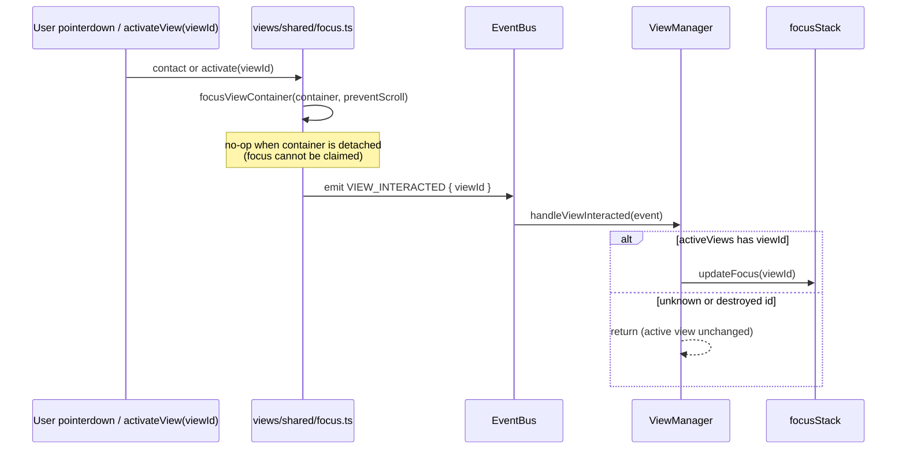
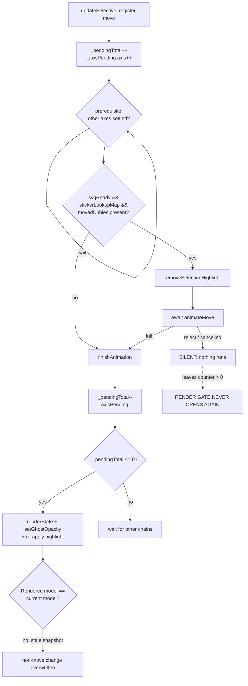
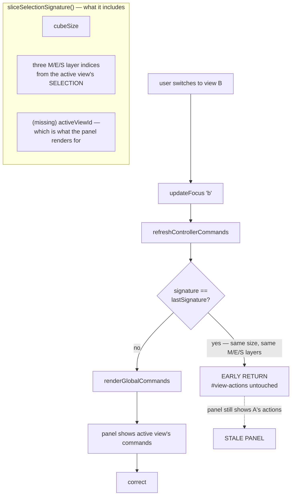

# fix: Close review findings and agent-native parity gaps

## Summary

A `ce-code-review` pass over the merged selection-visibility and view-focus work
(`5ffc021..6a0d5cf`) produced 15 findings and one agent-native gap. This plan
closes the verified ones, makes a view programmatically addressable so an actor
without a pointer can take focus ownership, resolves the size-selector fork the
origin brainstorm deliberately deferred, and fixes a user-reported defect the
review missed: the **View Actions panel does not follow the active view**, so
switching views leaves the previous view's actions on screen.

The ordering is deliberate: **agent-native parity first**, because it is the
same mechanism as the keyboard-only-user regression and because three other
findings sit on the code it touches. Then the correctness findings that can
leave the selection lost or the UI stale, then structure and test hygiene, then
documentation truth-up — including an auditable record of the review claims that
were investigated and refuted (seven disproven, one partially), so the same
ground is not re-litigated.

Execution is **measure-first**: two plan items were already refuted by negative
control while implementing (`setState`'s capture ordering, and the claim that
`alignCubeToView` loses the selection). Both are recorded in the Verification
Log with their evidence, and neither became code. Remaining units are validated
the same way before they are implemented, so a claim that does not hold does not
turn into a test asserting a bug that is not there.

---

## Problem Frame

The branch this reviews fixed a real class of bug: a selection that existed in
state but was invisible, or that drifted to the wrong face. That work is sound
and its tests pass. The review found a second layer of problems, which fall into
four groups.

**An actor without a pointer cannot take focus ownership.** `contactView()` is
the only writer of the app's focus model, and it is reachable only from a
`pointerdown` listener. An actor can call `element.focus()` on a view container
(they carry `tabIndex = 0`), but that moves DOM focus _without_ emitting
`viewInteracted`, so the app-level half — the focus stack, command routing,
active-view styling — never happens. The two halves can therefore disagree,
which is the exact split the branch set out to eliminate. This is simultaneously
an agent-parity gap and a keyboard-only-user gap: a keyboard user who Tabs into
a view gets one of the two focus models updated and not the other.

**Three ways the selection can still be lost or misrepresented.**

- The animation finish callback repaints a model snapshot captured when the move
  was _registered_, not when the callback runs. Any non-move model change
  mid-flight (reset, scramble, undo, size switch) is overwritten when the
  animation settles, and the post-promise reconcile that used to mask this was
  deleted in the branch under review.
- ~~`setState()` captures the selection's visual cell _before_ the
  legacy-migration branch calls `resetView()`.~~ **Refuted during execution**
  (see the Verification Log): the invariant holds with either capture ordering,
  because `reanchorSelection` resolves against the front face at call time. The
  reviewed code is left as it was and the ordering is now documented as
  deliberate.
- `alignCubeToView()` was the one orientation-changing command not wrapped in
  the re-anchor contract its five siblings honour. **Measured**: it does change
  the front face (rotate-left then align goes `R -> F`), so the contract applies
  — but its selection survives unwrapped, because it emits whole-cube moves that
  the `MOVE_EXECUTED` path already reconciles. The wrapper shipped as defence in
  depth and entry-point uniformity, not as a fix for a live defect.

**The View Actions panel does not follow the active view.** Reported by the user
and reproduced: switching between open views leaves the first view's actions in
the panel, so the panel describes a view the user is no longer looking at. The
mechanism is a stale-render gate, not a missing handler — `updateFocus` is wired
and does run on a switch, but the refresh it calls returns early.

```
after focus a: "A only"
after focus b: "A only"     <- expected "B only"
shows A's action after switching to B? true
shows B's action after switching to B? false
```

`ViewManager.updateFocus` calls `refreshControllerCommands()`, which exists to
avoid tearing down the command panel on every selection report and therefore
begins with a signature comparison:

```
private refreshControllerCommands(): void {
    const signature = this.sliceSelectionSignature();
    if (signature === this.lastSliceSelectionSignature) return;   // <- the gate
    ...
    this.renderGlobalCommands();
}
```

The signature is `cubeSize` plus the three M/E/S layer indices, derived from the
active view's selected sticker. **It does not include the active view id.** Two
views showing the same layer for the same size — the common case, since
switching views does not change the cube — produce an identical signature, so
the gate returns early and `renderGlobalCommands()` never runs.
`renderGlobalCommands` is the only code that renders `#view-actions`, so the
panel keeps whatever the last successful render left there.

Two aggravating details, both verified:

- The gate is **pre-existing**, not introduced by the branch under review
  (`git log -S` finds no history for it in the branch's 35 commits). What the
  branch changed is the environment it runs in: before it, the active view was
  updated by panel-chrome clicks; now it is also driven by `viewInteracted` from
  content contact, so switches reach this path much more often.
- `view-manager.test.ts` does not test `#view-actions` at all — there is no test
  that would have caught this, which is why the earlier review missed it.

**The "no selection" state is terminal and silent, unevenly enforced.** Circular
now forbids `undefined` and its three-tier `recoverSelection` fallback is gone;
Basic still accepts `undefined` through `updateSelected` and its touch-handler
wiring, and once cleared, `restoreSelection()` early-returns forever. The
capability to clear a selection survived; the capability to recover from it did
not. Because the removed fallback also removed the only `logger.error` on that
path, the dead state produces no signal at all.

**A divergence between two focus models, which the brainstorm anticipated.** Key
routing now follows DOM focus, while tabs, panel styling and the command
registry follow the focus stack via `updateFocus` — and `updateFocus` is driven
by panel `pointerdown` and `handleViewInteracted`, neither of which moves DOM
focus. The origin brainstorm deferred this exact question rather than deciding
it:

> "Does the size selector keep its own arrow-key handling, or defer to the
> shared ownership rules? The boundary above defers it, but planning may find
> the deferred state incoherent once focus ownership is centralised."

This plan takes the deferred question as in-scope and resolves it.

---

## Requirements

Plan-local R-IDs. Where a requirement hardens or completes an origin
requirement, the origin ID is cited as `(origin R<n>)` — origin IDs are not
reused as this plan's own numbering, since the origin set (R1–R14) was largely
satisfied by the branch under review.

**Agent-native parity**

- R1. A view can be activated programmatically without a pointer event,
  producing the same observable effects as contact: DOM focus on the view's
  container, the documented `viewInteracted` emission, and the app-level
  focus-stack update. A single addressable operation does all three, so the two
  focus models cannot be driven apart by an actor.
- R2. The app's notion of which view is active is readable through a supported
  accessor by callers other than ViewManager internals.
- R3. No new global-namespace surface is introduced for automation; the
  activation path is an importable module function, consistent with how the
  command registry and event bus are already reached.

**Selection integrity**

- R4. A model change that happens while an animation is in flight is not
  overwritten when that animation settles. The observable requirement: the paint
  after settling reflects the model as it stood at settle time. Whether this
  path produces that paint, or deliberately yields to the model-change path that
  already rendered it, is a mechanism choice — the requirement is the outcome,
  not which of the two writes it.
- R5. Animation completion bookkeeping runs whether the awaited animation
  fulfils or rejects, so a cancelled or aborted animation cannot latch the
  render-and-highlight path off permanently.
- R6. The selection is re-anchored against the orientation that will actually
  persist. A restored or reset orientation cannot leave the selection on a face
  behind the cube, and the re-anchor holds at every orientation entry point,
  including `alignCubeToView` (origin R5).

**Selection state honesty**

- R7. "Nothing selected" is never a silent terminal state. A view that reaches
  it reports it through a log rather than returning a bare `false`, and the two
  views agree on whether a cleared selection is reachable (origin R13).
- R8. Clearing the selection remains a supported user action, and
  re-establishing one after clearing is reachable without reloading — clearing
  is not a one-way door. Where a view constrains the value type, that constraint
  holds at the type boundary rather than by convention in one view and not the
  other. A constraint that removes the ability to clear is therefore **not** an
  acceptable reading of this requirement.

**Focus ownership**

- R9. Keyboard routing and the app-level active view cannot disagree. Either a
  single source of truth drives both, or the derivation is defined so that any
  disagreement is transient and self-correcting (origin R8).
- R10. A key the active view would handle is not silently dropped because focus
  happens to rest on a control that cannot act on it; a control that _can_ act
  on the key keeps working (origin R9, R10).
- R11. The size selector participates in the shared command/ownership rules
  rather than keeping a private listener outside them.

**Command surface**

- R18. The View Actions panel reflects the **currently active view**. Switching
  between open views replaces the panel's contents, so no action belonging to a
  view the user is not looking at remains visible, and no action of the active
  view is missing. A refresh-suppression gate may skip work only when nothing
  that the panel displays has changed — the active view id is part of "what the
  panel displays".

**Lifecycle and hygiene**

- R12. Every listener a view registers has a teardown path, and re-creating a
  view on the same container does not stack handlers. A destroyed view does not
  announce itself as interactive.
- R13. Derived DOM state — both the selection markup and the highlight — is
  re-derived at the rebuild boundary, so a rebuild cannot leave the DOM
  disagreeing with state, and cannot leave two elements carrying the same
  marker.
- R14. The re-anchor policy lives somewhere the other views can reuse it, and
  resolving a visual cell does not materialise every sticker on the cube.
- R15. Type boundaries between model and view are not widened by unchecked
  casts, and defensive guards in shipping code are not annotated as redundant.
- R16. Tests observe what the user sees, follow the project's own conventions,
  sweep the sizes the app actually supports, and restore any global they patch.

**Documentation**

- R17. The event catalogue matches the implemented payloads and records members
  that were retired; the review claims that were investigated and not upheld
  (five refuted, one partially) are recorded with their evidence so they are not
  re-investigated.

---

## Key Technical Decisions

- **Agent-native parity is delivered as an exported function, not a global.**
  The app already exposes `Logger`, `setLogLevel` and `addLogListener` on
  `window`, so a `window` facade would not be unprecedented — but those are
  diagnostics for a human at a console, and the request is for an addressable
  operation. An exported `activateView(viewId)` (or an exported `contactView`,
  whichever the implementation's call-site shape favours) is reachable by tests,
  by in-repo adapters, and by any future driver that imports the module — but
  deliberately not through a global. Note the honest limit: the production build
  is a single inlined HTML file with code splitting disabled, so an _external_
  actor driving the shipped artifact has no module graph to import. Closing that
  gap is what R3 rules out (a global facade) and is not attempted here. without
  widening the app's public surface. Keeping the three effects — focus, emit,
  stack update — inside one call is what makes R1 hold: splitting them is how
  the two models diverged in the first place.

- **The size selector changes owner rather than gaining an exception.** The
  origin brainstorm deferred this and named the risk exactly: once focus
  ownership centralises, a component with its own private `keydown` listener is
  incoherent. Routing the selector through the shared command system
  (`Command` + `keyBindings`, which every view already uses) gives it the same
  ownership semantics as everything else and removes the second listener that
  made the originally reported double-action possible. The alternative — a
  selector-sized exception in the focus fallback — was rejected because it
  preserves the special case the deferral was worried about.

- **The focus fallback question is answered by the command system, not by
  widening the fallback.** One reading of a review finding is that
  `viewIdHoldingFocus()` should fall back to the stack for any non-consuming
  control. That would re-create the reported defect for the size radio group.
  Once the selector is a command participant, the radio group's own listener is
  gone, so the key's only claimant is the command system and the fallback shape
  stops mattering. This is why R9/R10 are satisfied structurally rather than by
  a tuned predicate.

- **A render generation counter is preferred over clearing animation state on
  every model change.** Making `update()` and the reset path zero the pending
  counters would work, but it couples every model-change path to the animation
  tracker and would silently drop in-flight animations on unrelated updates. A
  monotonically increasing generation captured at registration and compared in
  the finish callback keeps the decision local to the one place that renders.

- **`alignCubeToView` joins the wrapper rather than being special-cased.** It is
  the sixth orientation entry point and has the identical tail. Whether it
  _provably_ changes the front face is a question for the unit's test; the
  default is to honour the contract and let a test pin any genuine exemption.

- **The re-anchor policy moves out of `BasicView`, but not into a new
  framework.** The wrapper and its five helpers are view-independent (an
  orientation, a sticker list, a cube size), so they belong beside the existing
  selection module. This is a move, not an abstraction layer: no registry, no
  plugin seam, no second convention for "visual cell".

- **The refuted findings are recorded in the plan and in the status docs, not
  re-litigated as code changes.** Eight review claims were investigated; seven
  were disproven against the code — some by measurement, two by negative control
  during execution. Recording them with their evidence is what stops the next
  review from rediscovering them, and is cheaper than adding defensive code for
  a defect that does not exist.

- **The View Actions defect is fixed by widening the gate's signature, not by
  removing the gate.** The early return exists because tearing down and
  rebuilding the command panel on every selection report caused a flicker the
  code comments record as a deliberate earlier fix. Deleting it would trade a
  stale panel for a flicker regression. Adding the active view id to the
  compared signature keeps both properties: selection reports during navigation
  still short-circuit (they do not change the active view), while a genuine
  switch now differs and renders.

- **The View Actions unit is ordered late, but the dependency is on U1 and U5,
  not on the correctness units.** It touches `view-manager.ts`, which U5 also
  edits, so landing after U5 avoids two units racing on the same signature
  helper. It does not block, and is not blocked by, the view-internal work.

- **A user-reported defect can outrank a review finding.** The review produced
  no finding against the View Actions panel — `view-manager.test.ts` never
  touches `#view-actions`, so there was no evidence for a reviewer to reason
  from. The report came from using the app, and it is scheduled as a first-class
  unit rather than an addendum, with the reproduction recorded.

---

## High-Level Technical Design

Three shapes carry this plan's reasoning better than prose: the focus-ownership
transition (two models becoming one addressable operation), the animation
completion lifecycle (where a rejection wedges the render gate), and the focus
resolution rules that U5 changes the weight of.

### Focus ownership: one operation, three effects

The branch under review made DOM focus the trigger and the focus stack the
consequence. The gap is that only a pointer can reach the combined operation, so
a caller that moves DOM focus directly completes half the interaction.



The failing shape this replaces: a caller invokes `element.focus()` directly,
which moves DOM focus and emits nothing, leaving `focusStack` pointed at
whatever it last held. R1 exists so that the two effects cannot be split by a
caller.

### Animation completion lifecycle

The pending counters gate the final render, and they are decremented inside a
function reachable only on fulfilment. The rejection path is therefore a latch,
not a glitch.



U3 closes both defects: the counters move into a `finally` so `H` cannot latch
the gate, and `K` renders the model as it stands rather than the snapshot taken
at `A`.

### Focus resolution rules, and what U5 changes

Keyboard routing resolves a view from live focus state. The third row is the one
the review flagged, and the row U5 removes the weight from.

| `document.activeElement`                                 | Resolves to                       | Consequence for an arrow key                            |
| -------------------------------------------------------- | --------------------------------- | ------------------------------------------------------- |
| body / documentElement                                   | stack top via `getActiveViewId()` | View handles it (historical behaviour preserved)        |
| inside a view container                                  | that view                         | View handles it; a control inside the view may also act |
| any other real control (currently: the size radio group) | `undefined` — no view active      | Reaches nothing, unless that control handles it         |

Today the size control handles arrows itself through a private listener, which
is why the third row is coherent _and_ why the originally reported double-action
was possible. U5 routes the control through the shared command system, so the
third row stops carrying an arrow-key decision: the command system becomes the
single claimant, and the fallback predicate does not need to distinguish
controls that consume arrows from controls that do not.

### View Actions refresh: the suppression gate omits a panel input

`renderGlobalCommands` is the only renderer of `#view-actions`. It is reached
through `refreshControllerCommands`, which deliberately suppresses redundant
renders — and its signature does not include the active view id, even though the
panel's contents depend on it.



Two views showing the same layer at the same size — the common case, since a
switch does not change the cube — collide on `D` and never reach `F`. U13 adds
the active view id to the signature, which keeps the gate's purpose (selection
_reports_ during navigation do not change the active view, so they still
short-circuit) while removing the collision.

---

## Implementation Units

### U1. Make a view addressable without a pointer

- **Goal:** One exported operation activates a view — claiming DOM focus,
  emitting `viewInteracted`, and moving the app-level focus model — so an actor
  with no pointer can complete the same interaction a user performs, and the two
  focus models cannot be driven apart.
- **Requirements:** R1, R2, R3
- **Dependencies:** none (deliberately first: U5 builds on it)
- **Files:**
  - `src/views/shared/focus.ts` (extend the shared focus module)
  - `src/view-manager/view-manager.ts` (expose the active-view accessor; wire
    the new entry point to `updateFocus`)
  - `src/view-manager/view-manager.test.ts` (activation through the new path)
  - `src/views/shared/focus.test.ts` (unit coverage for the activation call)
- **Approach:** The existing `contactView(container, viewId)` already performs
  focus + emit, and `handleViewInteracted` already performs the stack update.
  The gap is addressability, not mechanism: nothing outside a `pointerdown`
  closure can reach the pair. Export the activation so a caller supplies the
  viewId and the container is resolved from the registry rather than captured in
  a closure. Have the pointer listeners call the same function so there is one
  code path, not two. Expose the active view id through a supported accessor
  alongside the existing `getActiveViewId()` surface so R2 is satisfied without
  callers reaching into the focus stack.
- **Patterns to follow:** `src/views/shared/focus.ts`'s existing
  `focusViewContainer` / `contactView` split; `ViewManager.getActiveViewId()` as
  the read accessor shape; the module-level export style used by
  `src/event-bus-accessor.ts`.
- **Test scenarios:**
  - Activating a registered view by id focuses its container, emits exactly one
    `viewInteracted` with that id, and makes it the active view.
  - Activation of an unregistered or destroyed view id does not throw, and does
    not change the active view.
  - Activating a view whose container is detached leaves the active view
    unchanged but still reports the interaction (matching the documented
    `contactView` behaviour for a detached container).
  - Activating view B after view A makes B active and leaves A's container
    without DOM focus.
  - The active-view accessor returns the same value the focus stack reports
    after contact and after activation — the two writers agree on the same id.
  - After focus moves to a control outside every view, resolution reports no
    active view. The stack is **not** cleared — it still indicates the last-used
    view for panel styling and command rendering, per the origin R8 boundary —
    so this asserts the _resolved_ active view rather than equality with the
    stack. The plan states this explicitly because the two readings differ and
    would otherwise be implemented in opposite directions.
  - Regression: a `pointerdown` on a view's content still produces exactly one
    `viewInteracted` emission (the pointer path and the activation path must not
    both fire for one interaction).
  - Covers AE10. Contacting and activating a view leave the scroll position
    unchanged (`preventScroll` is honoured on both paths).
  - Covers AE11. All three views — Basic, Circular, Flat — take DOM focus and
    emit `viewInteracted` on contact, with no view exempt.
- **Verification:** An actor with no pointer can activate a view and then send a
  keyboard event that the view handles, without calling `element.focus()`
  directly and without reaching into ViewManager internals.

### U2. Re-anchor against the orientation that will actually persist

- **Goal:** The selection lands on a visible cell for every orientation entry
  point, including state restoration and `alignCubeToView`, so no sequence of
  supported commands can leave it behind the cube.
- **Requirements:** R6 (origin R5)
- **Dependencies:** none
- **Files:**
  - `src/views/basic/basic-view.ts` (`setState`, `alignCubeToView`)
  - `src/views/basic/basic-view.commands.test.ts` (entry-point coverage)
  - `src/views/basic/selection-anchor-timing.test.ts` (restore ordering)
- **Approach:** Two ordering faults. In `setState`, the cell is captured before
  the migration branch may `resetView()`, so the captured cell describes an
  orientation that no longer applies; capture after the orientation is final, or
  re-anchor after applying it. `alignCubeToView` has the identical tail to the
  five wrapped commands and calls `resetView`, so it takes the same wrapper. If
  a test shows it provably cannot change the front face, record the exemption in
  a comment rather than leaving the asymmetry implicit.
- **Patterns to follow:** The five existing
  `preserveSelectionAcrossOrientationChange(() => …)` call sites in
  `src/views/basic/basic-view.ts`.
- **Test scenarios:**
  - Covers AE5. Restoring a legacy `{xRotation, yRotation, zRotation}` payload
    with a non-default selection leaves the selection on the visible front face,
    at sizes 3 and 4.
  - Restoring a `{viewRight, viewUp, viewForward}` payload with a non-default
    selection leaves the selection on the visible front face.
  - `alignCubeToView()` after two whole-cube view rotations leaves the selection
    on a face among the currently visible ones.
  - Regression: the five previously-wrapped commands still keep the selection on
    the front face (the wrapper is not disturbed by the refactor in U7).
- **Verification:** A test enumerating the orientation entry points at one cube
  size asserts each one ends with the selection on the visible front face; if
  `alignCubeToView` is exempted, the exemption is asserted rather than omitted.

### U3. Make animation completion robust and truthful

> **Status: verified, no code change required (see Verification Log).** The
> rejection-latch mechanism is real and was probed, but its only trigger —
> `Animation.finished` rejecting after `cancel()` — is not reachable: no
> production path cancels an in-flight Circular animation. The requirements
> below stay as the contract if a cancel path is ever introduced; the two
> non-rejection parts of the unit (the stale `_latestPostState` paint, and the
> swallowed error) are re-scoped as U14 and remain open.

- **Goal:** An animation that finishes or is cancelled leaves the render and
  highlight path in a working state, and the final paint reflects the model as
  it stands rather than a snapshot from registration.
- **Requirements:** R4, R5
- **Dependencies:** none
- **Files:**
  - `src/views/circular/rendering.ts` (finish callback, counter bookkeeping,
    model snapshot)
  - `src/views/circular/circular-view.ts` (the swallowing catch)
  - `src/views/circular/rendering.test.ts` (completion and rejection paths)
  - `src/views/circular/selection-anchor-timing.test.ts` (settled-state
    agreement)
- **Approach:** Three related fixes in one seam. (a) Move the pending-counter
  decrements into a `finally` so bookkeeping survives a rejection — the counters
  currently live in a nested function reached only on fulfilment, so a rejected
  `animateMove` leaves `_pendingTotal` above zero and the `<= 0` render branch
  never runs again. Guard against double-decrement. (b) Render the model as it
  stands when the callback runs rather than `_latestPostState`, or capture a
  generation at registration and bail out when it changed; either removes the
  stale-overwrite. (c) Replace the empty catch with a logged error, and correct
  its comment, which claims the behaviour preserves the previous behaviour — it
  no longer does, because the post-promise reconcile was removed.
- **Patterns to follow:** `src/diagnostics/logger.ts` for the logging call; the
  existing per-axis chain structure in `src/views/circular/rendering.ts`.
- **Test scenarios:**
  - A move whose animation rejects (cancelled `Animation.finished`) still
    decrements the pending counters, and a subsequent move renders normally.
  - Two same-axis moves in flight, the first rejecting: the second still
    produces a final render.
  - A `reset()` (or any non-move model change) issued while an animation is in
    flight is not overwritten when that animation settles — the paint after
    settling reflects the reset, not the pre-reset move.
  - Exactly one final render occurs when several animations settle together.
  - A rejected animation logs an error rather than failing silently.
- **Verification:** Forcing a rejection through the animation path leaves the
  view able to render and highlight the next move, and the final paint agrees
  with `model.getCurrentState()`.
- **Execution status:** all three claims verified individually before
  implementing. Claim (a) is unreachable — no `try/finally` shipped. Claims (b)
  and (c) are confirmed and re-scoped as **U14**; the scenarios above are
  retained here as the contract, but the work belongs to U14. Do not implement
  this unit as written.

### U4. Make "nothing selected" observable and recoverable

> **Status: refuted in part, re-scoped as U15 (see Verification Log).** Two of
> the unit's premises did not survive verification: the touch handler cannot
> pass `undefined` (every rendered sticker carries `data-sticker-id`), and no
> production path clears the sticker selection at all. The terminal-state
> property is real but unreachable, so this is a latent robustness gap, not a
> live defect. Do not implement this unit as written.

- **Goal:** A cleared selection is reported rather than silently terminal, and
  the two views agree on whether it is reachable — enforced at the type boundary
  where the constraint is claimed.
- **Requirements:** R7, R8 (origin R13)
- **Dependencies:** U1 (U1 establishes the addressable activation path, which is
  the supported route back to a focused view — it does not itself select a
  sticker; re-selecting stays with each view's own selection API)
- **Files:**
  - `src/views/basic/selection.ts` (`updateSelected` signature)
  - `src/views/basic/basic-view.ts` (touch-handler wiring)
  - `src/views/basic/basic-view.commands.test.ts`,
    `src/views/basic/selection.test.ts` (existing callers of the optional form)
  - `src/views/circular/keyboard-cube-walking.ts` (log on the unhandled path)
- **Approach:** The branch's stated invariant — `undefined` is no longer
  permitted — holds only in Circular. Narrow Basic's `updateSelected` to require
  a `StickerId` (or an explicit cleared-value type), matching Circular's shape,
  **and keep a supported clear path** so R8 still holds. The tempting
  alternative — making the clear path unreachable so the type constraint is
  trivially satisfied — is rejected: it satisfies R7 by deleting R8. Existing
  tests that call `updateSelected(undefined)` deliberately are the evidence that
  clearing is live behaviour; they get migrated to the supported clear path
  rather than deleted. On the Circular side, keep the early return in `navigate`
  but add a one-per-view warn when it is taken, so the state is visible in logs
  instead of returning a bare `false`.
- **Patterns to follow:** Circular's non-optional `onStickerSelected` and
  required `StickerHit.stickerId` are the reference for the narrowed shape.
- **Test scenarios:**
  - Basic either cannot be driven to a cleared selection, or reaches a defined,
    tested state — asserted explicitly rather than left implicit.
  - A cleared selection in Basic does not leave `restoreSelection()` permanently
    early-returning without any signal.
  - Circular's `navigate` with nothing selected returns false and logs once, not
    once per keypress.
  - Round trip: clear the selection, then re-establish one through the view's
    own selection API (activation does not select; it only focuses) and confirm
    the view reports and highlights it.
- **Verification:** The invariant "a view either has a selection it can show, or
  reports that it does not" holds by test in both Basic and Circular.

### U5. Make the size selector a first-class command participant

> **Status: NOT IMPLEMENTED — moved to follow-up work by explicit decision.**
> Re-measured during execution: the routing gap is confirmed, but the
> double-action premise and this unit's prescribed remedy are refuted (see
> Verification Log, and refutation rows U and V). The gap (a plain arrow is
> dropped when focus rests on a control outside every view) is real and was
> re-confirmed on an inert button, so it does not depend on the size radios. The
> double-action is **not reproducible**: the router has no plain-arrow claimant,
> so it never delegates and `preventDefault()` is never called. And the remedy —
> remove the selector's listener, re-register its arrows as commands — would
> introduce the both-fire outcome, because _every_ arrow binding in the app is
> `altKey: true`. Views handle plain arrows through
> `handleKeyDown`/`handleKeyUp`, not through `keyBindings`. Closing the gap
> safely needs a design that can tell an arrow-consuming control from an inert
> one — the "tuned predicate" this unit set out to avoid — so it is deferred as
> its own piece of work rather than solved here. See **Scope Boundaries →
> Deferred to Follow-Up Work**.

- **Goal:** The size selector is owned by the shared command/ownership rules
  instead of keeping a private listener, so it cannot double-act on a key and
  the focus fallback stops being load-bearing.
- **Requirements:** R9, R10, R11 (origin R8, R9, R10)
- **Dependencies:** U1 (the activation path is what a command-driven selector
  needs in order to take ownership)
- **Files:**
  - `src/application.ts` (remove the private `keydown` listener; register the
    selector's commands instead)
  - `src/view-manager/view-manager.ts` (confirm the fallback derivation;
    annotate the intent next to `viewIdHoldingFocus`)
  - `src/application.test.ts`, `src/view-manager/view-manager.test.ts`
- **Approach:** The selector currently installs its own container-level
  `keydown` listener that calls `switchSize()`. Route its arrow handling through
  the command system (`Command` + `keyBindings`) so ownership is uniform, and
  remove the private listener. With the only competing claimant gone, the
  `viewIdHoldingFocus` fallback no longer has to distinguish "control that
  consumes arrows" from "control that does not" — which is the tuned predicate
  the plan is deliberately avoiding.
- **Capture-phase note (measured, load-bearing):** the app's routing handler is
  registered on `document` with `capture: true` (`application.ts:274`). Capture
  runs before the target's own listeners, and `preventDefault()` does **not**
  stop propagation — so as long as the selector keeps its own `keydown`
  listener, both fire for one keypress regardless of what the routing layer
  decides. That is the originally reported double-action. The fix therefore has
  to _remove_ the selector's listener rather than add a routing rule that
  outranks it; a "smart fallback" alone would leave the double-action intact.
- **Explicitly out of scope:** two other private `keydown` handlers exist
  outside the shared system — `about-modal.ts:48` and `command-renderer.ts:649`
  (the command toggle button). Neither claims arrow keys, so they are not part
  of this unit. Recorded so U5 is not read as "consolidate every listener in the
  app".
- **Patterns to follow:** `src/views/basic/commands.ts` for command declaration
  and `keyBindings`; `src/cube/commands/undo-redo.ts` for a non-view command
  with bindings.
- **Execution note (added after re-measurement — this unit is deferred):** this
  unit's Approach and Capture-phase note are **refuted** by the probe recorded
  in the Verification Log (rows U and V). It was not implemented; the routing
  gap it identified is moved to **Deferred to Follow-Up Work** under Scope
  Boundaries. Do not implement as written. Specifically: there is no
  double-action to remove, and moving the selector onto `keyBindings` requires
  adding global plain-arrow commands that do not exist, which creates the
  both-fire outcome. The surviving work is the routing gap only, and it needs a
  way to tell an arrow-consuming control from an inert one before it can be
  closed safely.
- **Test scenarios:**
  - Covers AE8. Focus last on the size control, contact a view, press an arrow
    key: the selection moves and the cube size does not change.
  - Covers AE9. Focus on the size control, press arrow: the size control
    responds and the view does not.
  - Keyboard-only walk: Tab into a view, press an arrow — the view responds (the
    regression the review flagged, without a pointer or a direct
    `element.focus()` call).
  - The size control's arrow navigation still changes size when it holds focus
    (the behaviour the private listener provided).
  - No keypress produces both a view action and a size change, in either focus
    state.
  - **Regression for the measured gap:** with the focus stack naming a view and
    DOM focus on a control outside every view, a plain arrow now reaches the
    view instead of nothing (`view.handleKeyDown` is called). This is the case
    the probe pinned as broken before the fix.
  - The selector's own listener is gone: a single arrow keypress produces
    exactly one effect even though the document-level handler is in the capture
    phase.
- **Verification:** An automated keyboard-only sequence can move a view's
  selection and separately change cube size, with the two never firing for one
  keypress; and a keypress with focus on chrome reaches the stacked view rather
  than being dropped.

### U6. Give every view listener a teardown path

> **Status: confirmed by probe, ready to implement.** Both halves verified: a
> second `create` on the same container stacks the `pointerdown` handler, and a
> destroyed view still announces itself. See the Verification Log for the
> transcript and the reachability caveat.

- **Goal:** Re-creating a view on the same container does not stack handlers,
  and a destroyed view cannot announce itself as interactive.
- **Requirements:** R12
- **Dependencies:** U1 (the activation refactor changes these listener bodies)
- **Files:**
  - `src/views/shared/focus.ts` (teardown for the contact registration)
  - `src/views/basic/initialization.ts`, `src/views/basic/basic-view.ts`
  - `src/views/circular/circular-view.ts`, `src/views/flat/flat-view.ts`
  - `src/views/shared/focus.test.ts` (stacking and post-destroy assertions)
- **Approach:** The three views register anonymous `pointerdown` closures with
  no removal path. The repo already has the right pattern — `ZoomPanController`
  uses an `AbortController` and passes `{ signal }` to its listeners — so adopt
  it rather than inventing a convention. Store the controller on view state and
  abort it wherever the view's other listeners are torn down. As part of the
  same seam, the contact emission should not fire for a view that is no longer
  live.
- **Patterns to follow:** `src/views/circular/zoom-pan.ts` (`abort` field,
  `{ signal }` on `addEventListener`, `abort()` in teardown) is the in-repo
  reference.
- **Test scenarios:**
  - Creating a view twice on the same container, then contacting it once,
    produces exactly one `viewInteracted` emission.
  - After a view's teardown, a `pointerdown` on the retained container does not
    focus it and does not emit `viewInteracted`.
  - All three views register and release their listeners symmetrically (no
    residual handler after teardown).
- **Verification:** A test that re-creates and tears down a view repeatedly
  observes constant emission counts per contact.

### U7. Move the re-anchor policy out of the view and stop rescanning every sticker

> **Status: confirmed, severity re-scored down (see Verification Log).** Both
> claims hold: `stickerCandidates()` materialises every sticker and the lookup
> projects each candidate it visits - measured at size 7 as **294 candidates to
> resolve 49 cells**. But the call sites are confined to orientation changes
> (six wrappers plus `setState`'s restore) and never run per frame or per move,
> so this is a modest efficiency defect on an infrequent path rather than a
> hot-loop regression. Sequence it with the extraction; it is not urgent on its
> own. The tie-break stays as-is - the order-dependence claim behind it was
> refuted (row B) - so the extraction must be behaviour-preserving.

- **Goal:** The re-anchor policy is reusable rather than trapped in `BasicView`,
  and resolving one visual cell does not rebuild a projection for every sticker
  on the cube.
- **Requirements:** R14
- **Dependencies:** U2 (both touch the same methods; land the correctness fix
  first so the move is behaviour-preserving)
- **Files:**
  - `src/views/basic/basic-view.ts` (remove the private helpers)
  - `src/views/basic/selection.ts` (receive the extracted policy)
  - `src/views/basic/visual-cell.ts` (candidate projection cost)
  - `src/views/basic/selection.test.ts`, `src/views/basic/visual-cell.test.ts`
- **Approach:** ~100 lines across five private methods implement a policy that
  depends on nothing view-specific (an orientation, a sticker list, a cube
  size). Move it beside the existing selection module so Circular and Flat can
  adopt it without copy-paste, keeping it as functions rather than a new
  abstraction layer. Alongside: `stickerCandidates()` materialises every sticker
  of the cube and `stickerAtVisualCell` re-derives a 3D position per candidate
  comparison; compute candidate cells once and filter explicitly by front face
  instead of recomputing inside the loop. The tie-break in the resolution loop
  is deliberately **not** changed: the review's order-dependence claim was
  refuted by measurement (zero collisions at every supported size), so R14
  requires the move and the cost fix only. U7 is behaviour-preserving by intent.
- **Patterns to follow:** the pure-function style already used in
  `src/views/basic/visual-cell.ts`; `src/views/basic/selection.ts` as the
  destination module.
- **Test scenarios:**
  - Existing selection and re-anchor suites pass unchanged after the move (the
    extraction is behaviour-preserving).
  - Resolving a visual cell at sizes 2, 4 and 6 returns the same sticker
    regardless of the order the candidates are supplied in.
  - Cost regression guard: resolution at the largest supported size does not
    scale with the total sticker count times the candidate count.
- **Verification:** No re-anchor logic remains in `basic-view.ts`; the existing
  full-orientation and per-size suites still pass.

### U8. Re-derive all derived markup at the rebuild boundary

> **Status: split — half refuted, half confirmed (see Verification Log).** The
> double-markup claim does not hold: `initializeCubies` removes every cubie
> element before rebuilding, so a marked element cannot survive to accumulate a
> second mark (probed: always exactly one marked element across every rebuild
> path). The highlight half is real — a rebuild drops the highlight while the
> selection is restored, and `setHighlightedSticker`'s unchanged-value early
> return closes the natural repair path. Implement only the highlight half.

- **Goal:** A DOM rebuild cannot leave the DOM disagreeing with state, and
  cannot leave two elements carrying the same marker.
- **Requirements:** R13 (origin R6)
- **Dependencies:** U7 (both touch `selection.ts`)
- **Files:**
  - `src/views/basic/selection.ts` (`reapplySelectionMarkup`)
  - `src/views/basic/cubie-rendering.ts` (rebuild boundary)
  - `src/views/basic/selection-markup.test.ts`
- **Approach:** `reapplySelectionMarkup` adds the selected class to the first
  matching element without clearing any existing marker, because it deliberately
  does not call `updateSelected`. Extract a shared clear-then-mark helper so
  both paths agree, which removes the possibility of two marked elements.
  Separately, the highlight is the same class of derived state as the selection
  — written by `updateHighlight`, mirrored across views — but only the selection
  is re-derived at the rebuild boundary, so a rebuild while a sticker is hovered
  leaves that view visually disagreeing with the others until the pointer moves.
  Re-derive both at the same boundary.
- **Patterns to follow:** the existing rebuild-boundary call site in
  `src/views/basic/cubie-rendering.ts`.
- **Test scenarios:**
  - Covers AE7. After a rebuild with a selection set, exactly one element
    carries the selected marker and it is the reported sticker.
  - Covers AE6. After `create()` followed by the app's own `resize()`, exactly
    one sticker is visibly marked and it is the one `getSelectedSticker()`
    reports.
  - A rebuild while a sticker is highlighted leaves the highlight present
    afterwards (and consistent across views).
  - A rebuild with no selection produces no selected marker at all.
- **Verification:** After any rebuild path, the marked element count is one when
  a selection exists and zero when it does not.

### U9. Tighten type boundaries and remove redundant guards

> **Status: confirmed, remedy corrected (see Verification Log).** All four new
> `as Face` / `as StickerId` casts are **redundant**, not merely unchecked:
> `Sticker` already declares `id: StickerId` and `currentFace: Face`. Removing
> all four passes `type-check` (EXIT=0) with the basic suites green (401 tests),
> so the fix is to delete them, not to validate before them. Of the two new
> `c8 ignore` guards, one duplicates its caller's guard and the other is
> load-bearing but untested — remove the first, test the second.

- **Goal:** The model-to-view boundary is not widened by unchecked casts, and
  shipping code does not carry guards annotated as redundant.
- **Requirements:** R15
- **Dependencies:** U7 (the casts being removed live in the code being moved)
- **Files:**
  - `src/views/basic/basic-view.ts`, `src/views/basic/selection.ts`
  - `src/views/basic/types.ts` (if a narrowed field type is the resolution)
- **Approach:** New re-anchor code narrows the model-to-view boundary with
  unchecked `as Face` / `as StickerId` assertions. Prefer a validated narrowing
  helper or a narrowed field type over a cast, so the compiler enforces the
  constraint the cast asserts. Separately, several new defensive guards carry a
  `c8 ignore` annotation marked caller-redundant while duplicating null checks
  that already exist one frame up; keep the guard and drop the annotation, or
  remove the guard — but do not leave shipping code advertising that a line is
  unreachable when it is reachable. Locate them by reading the `c8 ignore`
  annotations introduced by the branch under review in `src/views/basic/`,
  rather than by a file list here, since the annotation markers are what the
  unit actually changes.
- **Patterns to follow:** `CubeStateUtils` accessors in
  `src/cube/utils/state-conversion.ts` for narrowed lookups that return
  `undefined` rather than asserting.
- **Test scenarios:**
  - A malformed or out-of-range model value does not produce an unchecked
    assertion failure; it takes the defined fallback path.
  - Any guard previously marked caller-redundant either has coverage or is gone.
- **Verification:** No new `as Face` / `as StickerId` assertion remains on the
  re-anchor path without a validation step preceding it.

### U10. Test hygiene: conventions, sweeps and restoration

> **Status: confirmed, scope corrected (see Verification Log).** Three of the
> four claims are branch-local and mechanical: the sizes-3 omission in the
> markup sweep, the never-restored `defineProperty` patches (probed -
> `vi.restoreAllMocks()` does not unwind a raw `defineProperty` write), and the
> weak fast-input assertion. The fourth - the vitest-globals import - is a real
> violation of a quotable AGENTS.md rule, but **78 of 110 test files** in the
> repo do the same, so it is repo-wide drift rather than something this branch
> introduced. Fix the new file; do not schedule the 78-file cleanup here.

- **Goal:** The new tests follow the project's own conventions, exercise the
  full supported size range, assert outcomes strong enough to fail when the bug
  is reintroduced, and restore any global they patch.
- **Requirements:** R16
- **Dependencies:** U1–U8 (the suites under change are the ones those units add
  to)
- **Files:**
  - `src/views/basic/selection-markup.test.ts` (vitest imports; size list)
  - `src/views/basic/selection-anchor-timing.test.ts` (prototype restoration;
    size filter)
  - `src/views/circular/selection-anchor-timing.test.ts` (prototype restoration;
    size filter; fast-input assertion)
- **Approach:** Four distinct corrections. (a) `selection-markup.test.ts`
  imports `describe`/`expect`/`it` from `'vitest'`, which AGENTS.md forbids in
  terms — globals are provided by `vitest.config.ts` and `tsconfig.test.json`.
  (b) Size sweeps use hardcoded lists and `filter(n => n > 3)`, silently
  omitting 3×3 (and 2×2/3×3 in the timing suites) and drifting from
  `SUPPORTED_SIZES` when a size is added; use the constant, and state any
  deliberate exclusion in a comment rather than filtering silently. (c)
  `Object.defineProperty` patches on `Element.prototype.animate`,
  `HTMLElement.prototype.animate` and `window.matchMedia` are never restored, so
  a later test in the same worker sees the prior stub. (d) The Circular
  fast-input assertion only asserts `not.toBe('D')`, so it passes on any other
  wrong face, and the timing-parity test compares two values that can both be
  the `'NONE'` sentinel; assert the expected face and assert the highlight count
  before comparing.
- **Patterns to follow:** `src/views/circular/circular-view.test.ts` for a size
  sweep written against `SUPPORTED_SIZES`; the existing `afterEach` teardown
  discipline in the Circular suites.
- **Test scenarios:**
  - The fast-input Circular case asserts the specific expected face, not merely
    the absence of one wrong face.
  - The timing-parity assertion cannot be satisfied by two empty highlights.
  - Every size sweep covers all of `SUPPORTED_SIZES` (or documents its exclusion
    in a comment).
  - A test placed after each prototype-patching test observes the unpatched
    global.
- **Verification:** Re-injecting the original hardcoded selection position fails
  the relevant tests at every size where it is wrong, and no test file imports
  vitest globals.

### U11. Cover the new branches the review found untested

> **Status: narrowed - 2 of 4 items already covered (see Verification Log).**
> The re-anchor miss branch IS tested (`basic-view.manual-rotation.test.ts:386`,
> at view level), and the `setState` re-anchor path was closed by U2 earlier in
> this plan. Two genuine gaps remain: `visual-cell.test.ts` feeds its assertions
> from a **verbatim copy** of production's `stickerCandidates()` filter, so the
> production filter has no coverage; and no view test asserts silence after
> `destroy()` (the suites call `removeAllListeners()` wholesale, which cannot
> detect a failed unsubscribe). The pattern for the second exists at
> `zoom-pan.test.ts:191`.

- **Goal:** New production branches have coverage that exercises the production
  code rather than a copy of its rules.
- **Requirements:** R16
- **Dependencies:** U2 (the `setState` re-anchor path this unit pins), U4 (the
  clear/re-establish round trip), U6 (the teardown and unsubscribe assertions),
  U7, U8 (the branches covered — the re-anchor miss path and the rebuild
  boundary). Land after U10: U2, U10 and U11 all edit
  `src/views/basic/selection-anchor-timing.test.ts`.
- **Files:**
  - `src/views/basic/visual-cell.test.ts` (drive the real candidate filter)
  - `src/views/basic/basic-view.commands.test.ts` (re-anchor miss branch)
  - `src/views/basic/selection-anchor-timing.test.ts` (`setState` re-anchor
    path)
  - `src/views/shared/focus.test.ts` (teardown/unsubscribe assertions)
- **Approach:** `visual-cell.test.ts` re-implements production's virtual-centre
  exclusion in a test helper, so the production branch has no coverage and the
  assertion validates a copy of itself — drive at least one resolution through
  the view's real path. The re-anchor miss branch (documented as "keep the
  previous selection rather than clear it") is untested, as is the `setState`
  re-anchor path. Finally, the suites end with `removeAllListeners()`, which
  cleans up unconditionally and therefore cannot detect a view that fails to
  unsubscribe; add an explicit assertion that teardown removes the view's own
  subscriptions.
- **Patterns to follow:** the harness style in
  `src/views/circular/selection-anchor-timing.test.ts`, which drives the
  concrete view rather than a mocked one.
- **Test scenarios:**
  - A resolution driven through the view's real path at a size where a virtual
    centre exists, asserting the resolved sticker.
  - A re-anchor miss (no sticker at the captured cell) keeps the previous
    selection instead of clearing it.
  - `setState` with a saved orientation re-anchors onto a visible face.
  - After teardown, an emitted `MOVE_EXECUTED` produces no view response
    (asserted without a blanket `removeAllListeners()` masking it).
- **Verification:** Coverage of the re-anchor policy and the focus module comes
  from tests that call production code, not re-implementations of it.

### U12. Reconcile the event catalogue and record the refuted claims

> **Status: confirmed, scope grown (see Verification Log).** Three claims, all
> confirmed, one far larger than stated: the documented `moveRequested` payload
> renames a field _and_ omits a required one; the retired `COMMAND_EXECUTED` is
> recorded nowhere; and **11 of the 16 implemented events are absent from the
> catalogue entirely** (69%), while the doc presents its five-item list as the
> contract. Also correct the stale refutation-table intro, which still says "six
> findings... five were disproven" above nineteen rows.

- **Goal:** The documented contract matches the implementation, retired members
  are recorded, and the investigated-and-refuted review claims are on the record
  with their evidence.
- **Requirements:** R17
- **Dependencies:** none (independent of the code units)
- **Files:**
  - `src/docs/commanding-and-eventing-system.md` (payload shapes; retired
    members)
  - `src/types/events.ts` (only if a documented member needs adding or removing)
  - `implementation-status.md`, `code-quality-evaluation.md` (status truth-up)
  - `docs/solutions/ui-bugs/` (only if the refutation record lands there instead
    of in the catalogue — see Open Questions; the other three files are written
    either way)
- **Approach:** The catalogue documents `moveRequested` as `{notation, viewId}`
  while the implemented type is `{moveNotation, viewId, tentative}`, and omits
  several implemented members. It also has no record that `COMMAND_EXECUTED` and
  `CommandExecutedEvent` were retired in the branch under review. Correct the
  documented shapes and record the retirement. Then record the refuted claims —
  this is the audit trail the review's own verification produced, and it belongs
  where the next reviewer will look before re-reporting them.
- **Patterns to follow:** `docs/solutions/*` frontmatter conventions (`title`,
  `date`, `category`, `module`, `problem_type`, `symptoms`) if a solutions entry
  is the chosen home for the refutation record.
- **Test scenarios:**
  - Test expectation: none — documentation and record-keeping only. The
    catalogue's accuracy is verified by reading it against
    `src/types/events.ts`.
- **Verification:** A reader comparing the catalogue against
  `src/types/events.ts` finds every implemented event member documented with its
  actual payload field names, finds retired members recorded as retired, and
  finds the refuted-claims record present. This is a document-content check, not
  a test — stated explicitly so it is not mistaken for an automated check.

### U13. Make the View Actions panel follow the active view

> **Status: confirmed by reproduction, ready to implement.** User-reported and
> reproduced: switching from view A to view B leaves `#view-actions` showing A's
> actions. Cause verified by reading the gate: `refreshControllerCommands`
> early-returns on an unchanged `sliceSelectionSignature()`, which is `cubeSize`
> plus M/E/S layers from the active view's _selection_ - no view id - so
> same-size, same-layer switches collide and `renderGlobalCommands` (the only
> renderer of `#view-actions`) never runs. The gate is pre-existing; this branch
> just reaches it far more often. Widen the signature with the active view id;
> do **not** delete the gate, which exists to stop panel teardown/flicker during
> navigation.

- **Goal:** Switching between open views replaces the View Actions panel with
  the newly active view's actions, so the panel never describes a view the user
  is not looking at.
- **Requirements:** R18
- **Dependencies:** U1 (the programmatic activation path is what the regression
  test drives, so the switch can be exercised without a pointer), U5 (the size
  selector joins the command system, which changes what the panel renders for
  it)
- **Files:**
  - `src/view-manager/view-manager.ts` (`refreshControllerCommands`,
    `sliceSelectionSignature`)
  - `src/view-manager/view-manager.test.ts` (switch-behaviour regression tests)
  - `src/view-manager/command-renderer.test.ts` (only if the panel's own render
    needs a case for an empty active view)
- **Approach:** The gate compares a signature that omits the active view id. The
  panel's contents depend on two inputs — the active view id and that view's
  commands — neither of which is in the signature, so an identical layer
  signature suppresses the render that would have updated the panel. Include the
  active view id in the signature. That is the minimal fix and it keeps the
  gate's purpose intact: the gate exists to avoid rebuilding the panel on every
  selection _report_ during arrow-key navigation, and those reports do not
  change the active view, so they still short-circuit. Consider also including a
  cheap identity of the active view's command set (for example the joined
  command ids), because a view can re-register its commands without a focus
  change — `registerViewCommands` / `updateViewHeaderCommands` already render on
  that path, so verify rather than assume it is needed. **Do not** simply delete
  the gate: the early return is what prevents the global controls being torn
  down and rebuilt during navigation, which the comment above it documents as a
  deliberate earlier fix. A blunt removal would trade this bug for a flicker
  regression.
- **Patterns to follow:** the existing signature-comparison idiom in the same
  method (`lastSliceSelectionSignature`); `renderGlobalCommands`'s
  `activeViewId` parameter is already the single input the panel needs, so the
  fix is about _when_ it is called, not _what_ it is passed.
- **Test scenarios:**
  - Two open views with different command sets: activating the second replaces
    the first's actions in `#view-actions`, and the first's action is gone.
  - The reverse switch (B back to A) restores A's actions — the gate must not
    latch on the first comparison.
  - A selection report that does **not** change the active view still
    short-circuits (the gate's original purpose is preserved, asserted so the
    fix cannot quietly become "always render").
  - Switching to a view with no non-cube commands shows the panel's empty state
    rather than the previous view's actions.
  - Switching to a view whose registered commands were replaced re-renders the
    panel with the new set.
  - Both entry paths are covered: a panel-chrome switch and a content-contact
    switch through `viewInteracted`, since those are the two ways the active
    view changes.
- **Verification:** An automated switch between two open views leaves
  `#view-actions` containing and lacking exactly the expected command ids, at
  both entry paths. Reproduced before the fix as a failing test: the panel kept
  `A only` after switching to B.

---

## Verification Log

Findings from executing this plan. Each entry records what was measured, not
what was assumed — three plan items were refuted this way and did not become
code.

### U3 — split: one claim confirmed, one refuted, one open

The unit bundled three claims. Each was verified separately, and they do not
share a verdict.

**Claim 2 (stale `_latestPostState`) — CONFIRMED, still open.** Probed with an
animation held pending and a reset issued mid-flight:

```
move 1 registered; pending animations: 21
tracker._latestPostState === move 1 postState? true
after reset: live model === resetState? true
after reset: _latestPostState === move 1 postState (STALE)? true
after reset: _latestPostState === resetState? false
FINAL PAINT WOULD USE STALE SNAPSHOT? true
```

The trigger is reachable and in normal use: `resetCube()` and `scrambleCube()`
both call `viewManager.updateViews(undefined)`, which is a non-move model
change. If one lands while an animation is in flight, `finishAnimation` paints
`_latestPostState` — the move's own snapshot — over the reset, so the panel
shows a cube state the model no longer holds. The live model is correct; only
the paint is stale. This stays open as its own unit (see **U14** below).

**Claim 1 (rejected `animateMove` latches the render gate) — mechanism real,
trigger unreachable.** Stubbing the first animation's `finished` to reject
leaves `_pendingTotal` stuck above zero and stops later renders:

```
after rejecting move: _pendingTotal=1
second move started animations: false
after second move: _pendingTotal=2
gate latched (pendingTotal > 0)? true
```

But a rejection can only originate from `Animation.finished`, and
`animateFaceRotation` wraps every animation in `new Promise(resolve => ...)`
with no reject path of its own — so a rejected animation _never settles_ the
wrapper and surfaces as an unhandled rejection instead. `Animation.finished`
rejects when `cancel()` is called, and no production path cancels an in-flight
Circular animation:

| `cancel()` site             | Reaches a live Circular face animation?                                    |
| --------------------------- | -------------------------------------------------------------------------- |
| `animations.ts:319`         | No — runs _after_ `.finished` resolves, to clear transforms                |
| `animations.ts:666`, `:694` | No — ghost fades, and both `await` their own `.finished` before cancelling |
| `basic-view.ts:637`, `:673` | No — Basic's own animations, not Circular's                                |

The review's second scenario — a size switch cancelling animations — was checked
directly: `CircularCubeView.destroy()` cancels nothing. It clears `zoomPan`,
`touchHandler`, the container's innerHTML and `svgRoot`, so dropped animations
are _detached_ rather than aborted and their `.finished` resolves normally.

Two further reasons not to ship a speculative `try/finally`: the counter code is
**pre-existing** (`git log -S _pendingTotal` finds no history in this branch),
and there is **no test for the reject path** anywhere in the Circular suites —
consistent with it being unreachable rather than untested.

**Outcome:** no `try/finally` added. The probe finding is recorded so that if a
future change ever cancels an in-flight Circular animation, the consequence is
known and the fix shape is already written down: move the decrements into a
`finally` and guard against double-decrement.

**Claim 3 (the swallowing catch produces no signal) — OPEN, low severity.**
`circular-view.ts` catches every render failure with an empty body whose comment
still claims it "preserve[s] existing behavior" — which stopped being true when
the post-promise `restoreSelection()` was removed in this branch. Carried into
**U14** as the observability half.

**U4 — two claims refuted, one confirmed but smaller than stated**

The unit's premise was that Basic still admits `undefined` and can therefore
reach a cleared selection, while Circular forbids it. Verified claim by claim,
and the premise does not survive.

_Refuted: the touch handler cannot send `undefined`._ Probed against a real
BasicView at 3×3:

```
rendered stickers: 54
stickers missing data-sticker-id: 0
```

`StickerHit.stickerId` comes from `stickerEl.getAttribute('data-sticker-id')`
(`touch-handler.ts:1023`), and `cubie-rendering.ts:64` sets that attribute on
every sticker it builds. With no sticker lacking the attribute, the
`?? undefined` fallback is unreachable through gestures. The
`id as StickerId | undefined` cast at `basic-view.ts:177` is therefore a
**type-level widening with no runtime path behind it** — cosmetic, not a live
clear route.

_Refuted: the cleared state is not reachable in production at all._ Every
production caller passes a real id: `navigation.ts:247` uses
`onSelected?.(newSticker.id)`, and the `updateSelected()` call sites in
`basic-view.ts` (default selection, anchor restore, re-anchor) all pass ids.
There is no production `clearSelection` / `deselect` for the _sticker_ selection
— the `deselect` hits in the touch handler are all about the **face highlight**
ring, which is per-gesture state, not the selection anchor. The only callers of
`updateSelected(undefined)` are tests.

_Confirmed, but smaller than the unit claimed._ The terminal-state property is
real and was probed:

```
after updateSelected(undefined): NONE
after a move with cleared selection: NONE
TERMINAL (still NONE after a move)? true
```

Once cleared, `restoreSelection()` early-returns forever, because
`selectedCubiePosition` is `undefined` and nothing repopulates it. But since
nothing in production can _reach_ that state, this is a **latent robustness gap
in a publicly exposed method**, not a user-facing defect: `updateSelected` is
public and typed to accept `undefined`, so a future caller could clear the
selection and have no way back.

**Outcome:** the unit's framing ("the capability to clear survived; the
capability to recover did not") overstates it — the capability to clear never
existed for users. Re-scoped as **U15**, narrowed to the two things that are
actually true: the public signature should not invite a state the view cannot
leave, and the Circular-side log is still worth adding. No
`undefined`-permission work is needed in Basic, because there is nothing to
forbid.

**U5 — re-measured during execution: the routing gap is confirmed, the
double-action premise and the prescribed remedy are refuted**

The earlier entry for this unit recorded only the routing half and treated the
selector as the aggravating case on the strength of reading `application.ts`.
Re-probing the whole unit before implementing it shows the routing half is real
and the rest is not.

_Confirmed: a plain arrow is dropped when focus rests on a control outside every
view._ Re-measured on an inert `<button>` placed in the controls sidebar, so the
result does not depend on the size radios specifically:

```
activeElement: BUTTON#inert-control
viewIdHoldingFocus(): undefined
getActiveViewId(): basic-front      <- the stack still names the view
handleKeyDown returned: false
view.handleKeyDown calls: 0
KEY DROPPED (nothing acts): true
```

**Refuted: there is no escape hatch today.** The earlier note claimed the size
selector "papers over" the routing gap and must therefore be removed rather than
supplemented. Measured, the selector's focus path leaves the view untouched, so
the gap is total rather than partly covered:

```
=== focus on SIZE RADIO, ArrowRight ===
size changed: 3 -> 4 (true)
view.handleKeyDown calls: 0
DOUBLE ACTION: false
```

**Refuted: the reported double-action is not reproducible on the current tree.**
The earlier note reasoned that because the router is registered with
`capture: true` and `preventDefault()` does not stop propagation, the selector's
listener "still fires and produces the reported double-action". That reasoning
holds only if the router _delegates_ the key. Measured, it does not — capture
phase runs the router first, the router returns `false`, `preventDefault()` is
never called, the event propagates to the container listener, and the size
changes with **zero** view-handler calls. One claimant, not two.

The reason is structural: **views do not bind arrow keys as commands.** Probed
against the registry:

```
view commands with arrow bindings:
  rotate-view-left  -> [{ key: 'ArrowLeft',  altKey: true }]
  rotate-view-right -> [{ key: 'ArrowRight', altKey: true }]
  rotate-view-up    -> [{ key: 'ArrowUp',    altKey: true }]
  rotate-view-down  -> [{ key: 'ArrowDown',  altKey: true }]
controller commands with arrow bindings: NONE
```

Every arrow binding in the app is `altKey: true`. Plain arrows are handled by
each view's own `handleKeyDown`/`handleKeyUp` (`basic-view.ts:442`,
`flat-view.ts:329`, Circular's `keyboard-cube-walking.ts`), which the router
reaches only when `viewIdHoldingFocus()` resolves to a view. So with focus on
the selector the router has no arrow claimant to run, and the double-action
cannot arise.

**Refuted: the prescribed remedy would introduce the defect it targets.** U5
says to remove the selector's private listener and re-register its arrows as
commands so the shared system becomes "the single claimant". But the shared
system has **no plain-arrow commands to register** — the plan's own
`Patterns to follow` point at `basic/commands.ts`, where the arrow entries are
alt-modified. Adding plain-arrow commands would make the router handle plain
arrows globally, which is exactly the both-fire outcome:

1. capture phase → router matches the new command, returns `true`;
2. `preventDefault()` is called — which does not stop propagation;
3. the event still reaches whatever holds focus;
4. with the selector's listener removed, the browser's **native** radio-group
   arrow behaviour becomes the second actor, and on the theme group
   (`index.html:114-125`) that is a third.

So the unit as written trades a working control for a regression. The
"capture-phase double-action" it cites is a real property of the router, but it
is currently latent — it needs a plain-arrow command or a plain-arrow resolution
to become reachable, and neither exists.

**Re-scoped for implementation.** Only the routing half survives, and its
boundary is narrower than the unit implies:

- The gap is specifically "focus on a control that does not consume the arrow,
  outside every view". `viewIdHoldingFocus()` returns `undefined` by a
  documented deliberate decision (its own comment records the reason: an
  unconditional fallback re-created the _original_ reported defect). Any fix
  must therefore distinguish a control that consumes arrows from one that does
  not — which is the "tuned predicate" the plan set out to avoid, and is now
  unavoidable in some form.
- The size selector cannot be moved without first introducing plain-arrow
  commands, which is a behaviour change to global key routing, not a
  consolidation. That work is **not** justified by the measurements above and is
  not attempted here.
- Nothing measured here requires removing the selector's listener. It is the
  only claimant for plain arrows when focus is on the selector, and it is the
  only reason the selector's keyboard navigation works at all.

**Outcome:** U5 is not implemented as written. The routing gap is recorded as
confirmed-but-latent with a narrower boundary; the double-action and the
"selector must go" premise are recorded as refuted (rows U and V). Fixing the
gap safely needs a design that can tell arrow-consuming controls from inert
ones, which is a decision for the user rather than a mechanical change — see the
execution note appended to the unit.

**U6 — confirmed by probe, both claims**

The probe re-created a view on the same container, then drove contact:

```
create #1, one contact -> 1 emission(s)
create #2 on same container, one contact -> 2 emission(s)     <- STACKED
after destroy, one contact -> 2 emission(s)                   <- ANNOUNCES AFTER DESTROY
```

Both halves of the unit hold. The second is the more serious one: `destroy()`
leaves the `pointerdown` closure attached to the DOM element, so a torn-down
view still claims focus and still announces `viewInteracted`.

**Where the three views differ** (verified, and the reason the fix is not
uniform): Circular and Flat clear their container in `destroy()`
(`state.container.innerHTML = ''`, which detaches the listener's target), while
Basic does not — it only nulls `state.container`. Those two therefore leak less
in practice, but all three still register an anonymous closure with no removal
path, so none of them can be torn down symmetrically.

**Reachability caveat, recorded honestly.** `createViewPanelDOM` always builds a
**fresh** element, and `hideView` calls `destroy()` _and_ removes the container
from the DOM. So the stacking case is not reachable through the normal open/hide
path today — it needs a caller that re-uses a container, which is what the probe
did and what a future view-reuse or re-init path would do. The
destroy-then-contact case is the reachable one, because nothing detaches the
listener in Basic.

**Outcome:** U6 stays open as a real defect, scoped to giving the contact
registration a teardown (`AbortController` + `{ signal }`, the pattern
`zoom-pan.ts` already uses) and removing it in `destroy()` for all three views.
Do not claim a user-facing symptom today — the honest framing is a leak that
becomes reachable the moment a container is reused, plus a torn-down view that
still announces itself.

**U7 - confirmed, with the cost measured**

Both claims hold. `stickerCandidates()` materialises every sticker of the cube,
and `stickerAtVisualCell` re-derives a 3D projection per candidate it visits.
Measured per supported size:

| size | candidates | front-face cells |
| ---- | ---------- | ---------------- |
| 2    | 24         | 4                |
| 3    | 54         | 9                |
| 4    | 96         | 16               |
| 5    | 150        | 25               |
| 6    | 216        | 36               |
| 7    | 294        | 49               |

At 7x7 that is 294 objects built to resolve 49 cells; only the front face can
ever match, and the loop skips the other faces only after visiting them. The
work scales with total stickers rather than front-face cells, so it grows with
the cube face count (6x) instead of the face area.

**Severity re-scored, measured rather than assumed.** `stickerCandidates` was
introduced by this branch (`d3803e6`), so it is new code rather than inherited.
But its call sites are confined to orientation changes - the six
`preserveSelectionAcrossOrientationChange` wrappers plus setState's restore -
and never run per frame or per move. So this is a modest efficiency defect on an
infrequent path, not a hot-loop regression: worth fixing while the code is being
moved for the extraction anyway, but not urgent on its own.

**Also confirmed for U7 (unchanged):** the policy is view-independent and
currently lives in `BasicView` as six private methods. The extraction is a move,
not a new abstraction, and the tie-break stays as-is - the order-dependence
claim behind it was refuted by measurement (row B), so the extraction must be
behaviour-preserving.

**U8 — split: the double-markup claim is refuted, the highlight claim is
confirmed**

The unit bundled two claims that do not share a verdict.

**Refuted: the view cannot reach a double-markup state.** Probed by driving a
real Basic view through create, resize, update and repeated resizes, counting
marked elements each time:

```
after create:                          1 marked
after resize (startup rebuild):        1 marked
after update:                          1 marked
after two more resizes:                1 marked
after selecting a different sticker:   1 marked
after resize with new selection:       1 marked
```

Never more than one. The reason is structural: `initializeCubies` removes every
element carrying `data-cubie-id` before rebuilding
(`cubie-rendering.ts:145-146`), and `reapplySelectionMarkup` is called exactly
once, immediately after that rebuild (`:190`). With no marked element surviving
a rebuild, `querySelector` + `classList.add` cannot accumulate a second mark.
The missing clear pass is still worth aligning for symmetry with
`updateSelected`, but it is not a live defect and should not be described as
one.

**Confirmed: the highlight is not re-derived at the rebuild boundary.** Probed:

```
after create:                                 selected=1 highlighted=0
after updateHighlight(pos_00_00_00_D_sticker): selected=1 highlighted=1
after resize (rebuild):                        selected=1 highlighted=0
SELECTION survived rebuild? true
HIGHLIGHT survived rebuild? false
DISAGREEMENT (selection present, highlight lost)? true
```

The selection is restored and the highlight is dropped, so the DOM disagrees
with the app about which sticker is highlighted. The aggravating detail is that
the highlight is user-visible (hover drives `HIGHLIGHT_CHANGED` to
`view.updateHighlight`), and the natural repair path is closed:
`setHighlightedSticker` returns early when the value is unchanged
(`view-manager.ts:873`), so a rebuild cannot re-trigger it for the same sticker.

**Outcome:** U8 narrows to the highlight half. The double-markup half is
recorded as refuted (row O) and no clear-pass change is required beyond the
symmetry tidy-up.

**U9 - both claims confirmed, and the cast claim is stronger than stated**

The unit said the new code "widens the model-to-view boundary with unchecked
`as Face` / `as StickerId` casts". That understates it: the casts are not merely
unchecked, they are **redundant**.

`Sticker` already declares `readonly id: StickerId` and
`readonly currentFace: Face` (`src/cube/types/sticker.ts`), so every cast
asserts what the compiler already knows. Proved by removing all four and
re-running the checks:

```
npm run type-check                  ->  EXIT=0
npx vitest run src/views/basic      ->  21 files / 401 tests passed
```

Four sites, all removable with no type change:

| site            | cast                  | reads from                             |
| --------------- | --------------------- | -------------------------------------- |
| `basic-view.ts` | `sticker.id`          | `Sticker.id` (already `StickerId`)     |
| `basic-view.ts` | `sticker.currentFace` | `Sticker.currentFace` (already `Face`) |
| `basic-view.ts` | `sticker.currentFace` | `getStickerById` result                |
| `basic-view.ts` | `sticker.currentFace` | `getStickerById` result                |

So the remedy is not "add a validation step before the cast" as the unit
proposed: it is **delete the casts**. A no-op assertion is worse than no
assertion, because it suggests a narrowing happened where none did and hides the
day the real type changes. (`noUnusedLocals` is on and `Face`/`StickerId` stay
imported for other uses, so the removal is clean.)

**The `c8 ignore` half is confirmed, but the two guards are not equivalent.**
Both were added by this branch, and both now carry an annotation:

- `stickerCandidates`' `if (!this.state.model) return []` - **required by the
  compiler, and my first reading of it was wrong.** `state.model` is declared
  optional (`model?: ReadOnlyCubeModel`, `src/views/basic/types.ts:33`), so
  removing the guard fails the check outright:
  `basic-view.ts(331,29): error TS2532: Object is possibly 'undefined'`. It is
  not a duplicate of the caller's guard; it is the narrowing that makes
  `this.state.model.getCurrentState()` legal at all. The finding is therefore
  about the _annotation_, not the guard: the `c8 ignore` says callers make it
  unreachable, but the compiler needs it regardless of any caller.
- `reanchorSelection`'s `if (!cell || !this.state.model) return` - one caller
  passes `selectionVisualCell()`, which returns `undefined` without a model, and
  this guard is what turns that into a no-op. Load-bearing, and its condition
  can be true; the annotation exists because no test drives that combination.
  That is a coverage gap the suppression papers over, and **U11** is the right
  place to close it.

**Outcome:** U9 narrows to deleting the four redundant casts (mechanical,
verified by `type-check` and the basic suites) plus correcting two `c8 ignore`
annotations: one records the wrong reason (that guard is compiler-required, not
caller-guaranteed), and the other should be tested rather than suppressed. Both
guards stay. Worth noting: this is the second annotation in this plan whose
stated justification did not survive checking - the first was the `setState`
ordering comment (row G).

**U10 - all four claims confirmed, with the scope of one corrected**

Four distinct corrections, verified individually.

**(a) The vitest-globals import: confirmed as a violation, but its scope is not
what the review implied.** `selection-markup.test.ts` is a **new file in this
branch** (`59aa460`, status `A`) and it opens with
`import { describe, expect, it } from 'vitest'`. AGENTS.md is explicit and
quotable:

> "`globals: true` + `\"vitest/globals\"` in `tsconfig.test.json` -
> `describe`/`it`/ `expect`/`vi` are global at both runtime and the type level.
> Do **not** import them from `'vitest'`; the imports are redundant and should
> be removed."

Measured scope, which changes the framing: **78 of 110 test files** in the repo
carry the same import. Only 32 follow the rule. So this is not a defect
introduced here - it is a repo-wide convention that the rule documents but the
codebase has drifted away from, and the new file simply matched the neighbours
it was written beside.

That makes it a genuine violation of a documented standard (fix the new file),
and simultaneously a signal that the standard is not enforced: `npx eslint .`
passes with 78 files breaking it, so no rule implements the AGENTS.md text.
Worth raising separately - either add a lint rule or soften the doc - but **out
of scope** for this plan, whose subject is the reviewed branch.

**(b) The hardcoded size lists: confirmed, and this one IS branch-local.**
`selection-markup.test.ts:124` sweeps `it.each([2, 4, 5, 6, 7])`, silently
omitting 3x3. The two timing suites use `SUPPORTED_SIZES.filter(n => n > 3)`,
excluding 2 and 3. Both drift from the constant they claim to cover: add a size
and these tests keep passing while covering less.

**(c) The `defineProperty` leaks: confirmed by probe.** The claim was that
`Object.defineProperty` patches on `Element.prototype.animate`,
`HTMLElement.prototype.animate` and `window.matchMedia` are never restored, so a
later test in the same worker sees the prior stub. Probed by applying the same
patch shape and then running the suite's own teardown:

```
HTMLElement.prototype.animate is a function after teardown? true
LEAKED: the defineProperty patch survived vi.restoreAllMocks()
```

`vi.restoreAllMocks()` only unwinds `vi.spyOn` spies; a raw `defineProperty`
write is not a mock and is not restored. Neither `vitest.config.ts` nor
`vitest.setup.ts` sets `restoreMocks` / `unstubGlobals`. So the patch really
does outlive its `afterEach`, and ordering within the worker decides what the
next test sees.

**(d) The weak fast-input assertion: confirmed.**
`selection-anchor-timing.test.ts:201` asserts only
`expect(harness.highlightedFace()).not.toBe('D')`, so it passes on any other
wrong face; and the timing-parity test compares two values that can both be the
`'NONE'` sentinel, so a regression clearing the highlight on both paths would
satisfy it. The slow-path test one screen up does assert `toBe('F')`, which
shows the stronger assertion was available.

**Outcome:** U10 stays open, scoped to (b), (c) and (d) - all branch-local and
mechanical. Claim (a) is fixed for the new file only; the repo-wide drift is
recorded as an observation with a recommendation to enforce or amend the doc,
and explicitly **not** scheduled here, because fixing 78 files is not this
plan's subject.

**U11 - two claims already covered, two genuine gaps**

The unit named four uncovered branches. Checked one at a time; the picture is
more favourable than the review suggested.

**Already covered (no work needed).**

- _The re-anchor miss branch._ The review said "keep the previous selection
  rather than clear it" is untested. It is tested, at view level, in
  `basic-view.manual-rotation.test.ts:386` -
  `'retains the previous selection when the cell cannot be resolved'` - which
  drives a real view, passes an unoccupiable cell
  (`{visualX: 99, visualY: 99}`), and asserts the selection is unchanged. That
  is the documented contract, asserted through the view rather than through the
  helper.
- _The `setState` re-anchor path._ The review listed this as untested. It was
  genuinely untested before this session, and **was closed by U2**:
  `selection-anchor-timing.test.ts` now drives both a legacy `{xRotation, ...}`
  payload and an orientation-vector payload through `setState` and asserts the
  selection lands on the front face. So this item is already done, by an earlier
  unit in this same plan - worth noting rather than re-doing.

**Genuine gaps (work needed).**

- _`visual-cell.test.ts` never exercises the production candidate filter._
  Confirmed and more than cosmetic: the test's `physicalStickers()` helper
  (`visual-cell.test.ts:54-68`) is a **verbatim copy** of production's
  `stickerCandidates()` (`basic-view.ts:330-347`), down to the same comment
  about virtual-centre stickers colliding as duplicate cells. Every assertion in
  that file feeds the copy, so the production filter - including its
  `VIRTUAL_CENTER` exclusion, which is the branch the review cared about - has
  **no coverage at all**. If production dropped that exclusion the suite would
  stay green while real resolution became ambiguous. The fix is to drive at
  least one resolution through the view's real path, so the test validates
  production's rule rather than its own echo of it.
- _Teardown is not asserted anywhere for the views._ Confirmed. No test emits
  after `destroy()` and asserts silence for any of the three views; the suites
  instead call `Application.eventBus.removeAllListeners()` wholesale, which
  cleans up unconditionally and therefore cannot detect a view that failed to
  unsubscribe. The pattern that would catch it already exists one module over -
  `zoom-pan.test.ts:191` has `'wheel events are ignored after destroy'` and two
  siblings - so this is a matter of applying an in-repo convention, not
  inventing one. Note this also closes the coverage gap behind U9's
  `reanchorSelection` guard annotation.

**Outcome:** U11 narrows from four items to two: cover the production candidate
filter through the view, and assert post-destroy silence per view (using
`zoom-pan.test.ts` as the pattern). Two of the four named branches are struck as
already covered - one by an existing test, one by U2 during this plan.

**U12 - all three claims confirmed, one much larger than stated**

**Claim A confirmed: the documented payload is wrong in two ways.**
`commanding-and-eventing-system.md:59` says:

> `moveRequested`: Emitted by views to request moves, payload:
> `{notation, viewId}`.

The implemented type is
`{ moveNotation: string; viewId: string; tentative: boolean }`. So the field is
**renamed** (`notation` -> `moveNotation`) _and_ a required field (`tentative`)
is undocumented. The rename is the worse half: a reader following the doc would
write `payload.notation` and get `undefined` with no type error, because the doc
is prose rather than a type.

**Claim B confirmed: the retired member is recorded nowhere.**
`COMMAND_EXECUTED` and `CommandExecutedEvent` were removed by the branch under
review, and grepping the docs for `COMMAND_EXECUTED` / `commandExecuted` /
`retired` returns nothing. The removal is defensible - the catalogue never
listed it - but a reader cannot tell it ever existed, and the branch's own
commit is the only record.

**Claim C confirmed, and the scale is much larger than "omits several
members".** The unit said the catalogue omits several implemented members.
Measured: **11 of the 16 implemented event values are absent from the document
entirely.**

| documented in the catalogue (5)                                                          | absent (11)                                                                                                                                                                                                                                              |
| ---------------------------------------------------------------------------------------- | -------------------------------------------------------------------------------------------------------------------------------------------------------------------------------------------------------------------------------------------------------- |
| `stickerSelected`, `highlightChanged`, `moveRequested`, `moveExecuted`, `viewInteracted` | `undoRequested`, `redoRequested`, `viewStateChanged`, `cubeResetRequested`, `cubeScrambleRequested`, `storageClearRequested`, `stateExportRequested`, `stateImportRequested`, `basicViewRotationLinked`, `basicViewResetLinked`, `basicViewGhostToggled` |

That is a 69% gap, and the document presents its five-item list as though it
were the catalogue: line 134 reads "Core events implemented: `moveRequested`,
`moveExecuted`, `highlightChanged`, `viewInteracted`". A doc that calls itself
the contract while listing under a third of the surface is worse than no list,
because it invites confidence. Note the whole document is only 163 lines, so
this is under-documentation rather than a drifted section.

**Claim D: the record exists only in this plan, and the plan's own intro for it
has gone stale.** The refutation tables live in this file and nowhere else,
which U12 is meant to change. While checking, one more thing surfaced: the
`## Refuted Review Claims` intro still reads "These six findings were
investigated during review. Five were disproven against the code; one was
partially refuted" - written when the table had six rows and now sitting above
**19**. U12 must correct that intro too, or the record misdescribes itself.

**Outcome:** U12 stays open and grows. Scope is now: correct the documented
payload shapes, record the retirement, close the 11-event documentation gap (or
explicitly mark the doc as non-exhaustive), fix the stale refutation intro, and
decide where the refutation record belongs. The plan's own Open Questions
already deferred the last point; the first four are new detail.

### U1 — shipped (`b6918e9`)

- `activateView(viewId)` plus a container registry in the focus module, with
  registration on create and unregistration on destroy for all three views.
- `getViewIdHoldingFocus()` added alongside `getActiveViewId()`. The two differ
  deliberately: the stack accessor keeps naming the last-used view for styling
  and command rendering, while this one reports the view a keystroke would
  reach. Recorded because the plan's R2 originally conflated them.
- Negative control: making `activateView` bypass `contactView` fails 4 focus
  assertions; the emit-only assertions still pass, confirming the suite
  distinguishes "interaction reported" from "focus actually claimed".
- The registry lives in `views/shared/focus.ts`, not `view-manager/`, because
  that module's own layering rule forbids depending on `view-manager`. The
  plan's approach line said "resolve the container from the registry" without
  saying where the registry lives; this is where.

### U2 — shipped as tests (`c2491c3`), with one plan claim refuted

- **Refuted: the `setState` capture ordering is not a visibility defect.**
  Re-injecting the original ordering (capture before the migration branch's
  `resetView`) leaves all 11 tests passing, because `reanchorSelection` resolves
  against `viewFrontFace` at call time. Visibility never depended on when the
  cell was captured. The reviewed code was left unchanged and the ordering is
  now documented as intent rather than fixed as a bug.
- **Corrected: `alignCubeToView` does change the front face** (measured
  rotate-left then align: `R -> F`), so it is held to the contract — but its
  selection survives unwrapped, because it emits whole-cube moves that the
  `MOVE_EXECUTED` path already reconciles. Shipped as a wrapper justified by
  uniformity and defence in depth, with a comment that says so instead of
  implying a defect that was not present.
- **The load-bearing test is the five-command sweep.** Verified by negative
  control: unwrapping `rotateViewLeft` fails it with `expected 'F' to be 'R'` —
  the real hidden-face failure mode.
- Both the wrap and the ordering comment state what was measured, so a future
  reader does not re-litigate either.

### U13 — reported bug, reproduced

- Reproduced with a two-view probe before writing the unit: activating B after A
  leaves `#view-actions` showing `A only`.
- Root cause confirmed by reading `refreshControllerCommands`: its
  `sliceSelectionSignature()` is `cubeSize` plus the M/E/S layer indices,
  derived from the active view's _selection_, and contains no view id — so
  same-size, same-layer switches produce an identical signature and the gate
  returns before `renderGlobalCommands()`, which is the only renderer of
  `#view-actions`.
- Note the gate is pre-existing, not introduced by the branch under review; what
  the branch changed is how often switches reach it.
- The earlier review missed this because `view-manager.test.ts` never touches
  `#view-actions`.

### U14. Stop the animation painting a superseded model snapshot

> **Status: confirmed by probe, ready to implement.** Reproduced: holding an
> animation pending and resetting mid-flight leaves `_latestPostState` pointing
> at the move's own snapshot, and `finishAnimation` then paints it over the
> reset. The trigger is a real user path - `resetCube()` and `scrambleCube()`
> call `updateViews(undefined)`, a non-move model change. The live model is
> correct; only the paint is stale. Split out of U3, whose rejection-latch claim
> was verified unreachable (no production path cancels an in-flight Circular
> animation).

- **Goal:** A non-move model change that happens while an animation is in flight
  is not overwritten when that animation settles — the paint after settling
  reflects the model as it stands.
- **Requirements:** R4
- **Dependencies:** none. Split out of U3, whose other two claims were verified
  separately (one confirmed as reachable, one refuted — see the Verification
  Log).
- **Files:**
  - `src/views/circular/rendering.ts` (`_latestPostState` capture and read;
    `finishAnimation`)
  - `src/views/circular/rendering.test.ts` (mid-flight supersession)
  - `src/views/circular/selection-anchor-timing.test.ts` (settled paint agrees
    with the live model)
- **Approach:** Reproduced and confirmed, not hypothesised: holding an animation
  pending and resetting the cube mid-flight leaves `_latestPostState` pointing
  at the move's own snapshot, and `finishAnimation` then paints it over the
  reset. The live model is correct — only the paint is stale. The trigger is a
  real user path: `resetCube()` and `scrambleCube()` in `src/application.ts`
  both call `viewManager.updateViews(undefined)`, which is a non-move model
  change and can land while an animation runs. Prefer rendering the model as it
  stands when the callback runs (`state.model?.getCurrentState()`) over the
  captured snapshot. If a generation counter is used instead, the callback must
  still end with the correct paint — bailing out is only acceptable if some
  other path has already painted the newer state, which must be asserted rather
  than assumed. Note that the counter bookkeeping (`_pendingTotal`) is
  **pre-existing** and is not part of this unit: its only failure trigger is a
  rejection, which was verified unreachable (see the Verification Log).
- **Patterns to follow:** the existing `renderState(state, …)` call in
  `finishAnimation`; `state.model?.getCurrentState()` as the accessor already
  used elsewhere in the view (`restoreSelection`, `reanchorSelection`).
- **Test scenarios:**
  - An animation held pending, then a `reset()` mid-flight: after settling, the
    painted state is the reset state, not the pre-reset move's snapshot.
  - Same with a scramble.
  - Same with `view.update(model)` (the `updateViews(undefined)` path) rather
    than a move.
  - Control: with no mid-flight change, the settled paint is the move's
    postState — guards against the fix painting something else entirely.
  - Two animations settling together after a mid-flight reset: exactly one final
    paint, and it reflects the reset.
- **Verification:** After a mid-flight non-move change, the state handed to the
  final `renderState` call is the live model state, asserted by comparing the
  painted state against `model.getCurrentState()` rather than against a captured
  snapshot.
- **Also in scope (the observability half of U3):** replace the empty catch in
  `src/views/circular/circular-view.ts`'s `updateSelective` with a logged error,
  and correct its comment — it still claims to "preserve existing behavior",
  which stopped being true when this branch removed the post-promise
  `restoreSelection()`. Add a scenario asserting a render failure is logged. No
  behaviour change beyond observability, so it rides with this unit rather than
  needing its own.

### U15. Stop the selection API from inviting a state the view cannot leave

> **Status: narrowed from U4, which was largely refuted.** Two of U4's premises
> did not survive verification: the touch handler cannot send `undefined` (all
> 54 rendered stickers carry `data-sticker-id`), and no production path clears
> the sticker selection at all - every caller passes a real id, and the
> `deselect` paths are the **face highlight** ring, not the selection. The
> terminal-state property is real (probed: `NONE` after a clear, still `NONE`
> after a move) but unreachable, so this is a latent robustness gap in a public
> method, not a user-facing defect.

- **Goal:** The public selection entry point does not advertise a cleared
  selection it has no way to recover from, and the one silent dead-end on that
  path reports itself.
- **Requirements:** R7, R8 (origin R13) — narrowed to what verification showed
  is actually true. See the Verification Log: the cleared state is unreachable
  in production, so this is a robustness fix, not a user-facing defect repair.
- **Dependencies:** none (the original dependency on U1 was based on the
  now-refuted premise that activation is a route back to a selection — it is
  not; activation only focuses)
- **Files:**
  - `src/views/basic/selection.ts` (`updateSelected` signature)
  - `src/views/basic/basic-view.ts` (the `id as StickerId | undefined` cast)
  - `src/views/circular/keyboard-cube-walking.ts` (log on the unhandled path)
  - `src/views/basic/selection.test.ts`,
    `src/views/basic/basic-view.commands.test.ts` (tests currently calling
    `updateSelected(undefined)`)
- **Approach:** Two small, independent changes, neither of which is the
  type-boundary enforcement the original unit proposed. (a)
  `updateSelected(state, selectedSticker?: StickerId)` is public and typed to
  accept `undefined`, but a cleared selection is terminal — `restoreSelection`
  early-returns forever because `selectedCubiePosition` stays `undefined`.
  Either make the clear recoverable (re-seed the default selection on the next
  reconcile) or state the contract in the signature so callers cannot reach it
  accidentally. Prefer the latter as the smaller change, since no production
  caller wants a cleared selection; then the `id as StickerId | undefined` cast
  at `basic-view.ts:177` can drop the `| undefined`, removing a widening that
  has no runtime path behind it. **Do not** try to "forbid `undefined` in Basic
  to match Circular" as the original unit framed it — there is no production
  caller to forbid, so that work would be churn. The tests calling
  `updateSelected(undefined)` are asserting the clear path deliberately; migrate
  them to whichever contract is chosen. (b) Circular's `navigate` returns
  `false` when nothing is selected with no signal. Add a one-per-view warn so
  the state is visible in logs rather than silently unhandled.
- **Patterns to follow:** Circular's non-optional `onStickerSelected` and
  required `StickerHit.stickerId` show the narrowed shape;
  `src/diagnostics/logger.ts` for the warn.
- **Test scenarios:**
  - The chosen contract holds: either a cleared selection is recoverable by a
    documented route, or the signature makes it unrepresentable.
  - If the signature narrows, the `basic-view.ts` callback no longer needs the
    `| undefined` cast, asserted by the type-check.
  - Circular's `navigate` with nothing selected returns false and logs once, not
    once per keypress.
  - Regression: the default selection at sizes 2–7 still resolves (the existing
    size sweep must stay green).
- **Verification:** A reader of `updateSelected`'s signature can tell whether a
  cleared selection is a supported state, and the answer matches what the
  implementation does. The type-check catches the removed cast rather than a
  test.

---

## Refuted Review Claims (recorded, not actioned)

Nineteen review and execution claims were investigated and are recorded here
with their evidence. Ten were disproven outright, one partially, and the rest
are confirmed findings kept for traceability rather than dismissal - the table's
purpose is to stop the same ground being re-covered, not to claim everything was
wrong.

> **Count note (corrected during U12 verification):** this intro previously read
> "These six findings were investigated... Five were disproven". It was written
> when the table below had six rows; it now has twenty-one across two
> sub-tables. Kept as a note rather than deleted, because the drift itself is
> the reason U12 exists.

| #   | Claim                                                                                                            | Verdict and evidence                                                                                                                                                                                                                                                                      |
| --- | ---------------------------------------------------------------------------------------------------------------- | ----------------------------------------------------------------------------------------------------------------------------------------------------------------------------------------------------------------------------------------------------------------------------------------- |
| A   | `contactView` passes a view _type_ where the consumer keys on an instance id, making `viewInteracted` inert      | **Refuted.** `activeViews` is keyed by `viewType` (`src/view-manager/view-lifecycle-manager.ts`) and each view's `getViewType()` returns exactly those strings (`'basic-front'`, `'circular'`, `'flat'`), so the emitted id matches the key.                                              |
| B   | At even sizes the visual-cell projection folds two rows/columns onto one cell, making resolution order-dependent | **Refuted by measurement.** Sizes 2–7 each produced N distinct cells from N×N positions — zero collisions at every size. The residual concern (unstable tie-break) is carried by U7.                                                                                                     |
| C   | A halo tap clears the `selectedFace` that `restoreSelection` gates on, so re-anchoring silently stops            | **Refuted.** Two distinct fields: the touch-handler's `selectedFace: Face \| undefined` (the halo ring, `src/views/circular/touch-handler-types.ts`) and the view's `selectedFace?: string` (the anchor, `src/views/circular/types.ts`). Clearing the halo does not clear the anchor.     |
| D   | Basic emits `STICKER_SELECTED` up to three times per move, so consumers see duplicate changes                    | **Refuted.** `src/views/basic/selection.ts` emits nothing; the emission is Circular-only.                                                                                                                                                                                                 |
| E   | The re-anchor runs before the model advances, resolving against pre-move geometry                                | **Refuted.** `applyMove` (`src/cube-controller.ts`) precedes the `MOVE_EXECUTED` emission in the same method, so the model does reflect the move.                                                                                                                                         |
| F   | `activeViews` is never cleaned up, so a failed or removed view stays focus-eligible                              | **Partially refuted.** There are two `activeViews.delete` sites in `src/view-manager/view-lifecycle-manager.ts`, one of them on the creation-failure path. The remaining concern — a stale id surviving the `getActiveViewId()` fallback — is covered by U1's unregistered-view scenario. |

### Refuted during execution (U1-U5)

Further claims came from this plan's own review pass and were disproven while
implementing, by measurement or negative control rather than by reading. They
are recorded here so the same ground is not re-covered by a later unit.

| #   | Claim                                                                                                                                                                                  | Verdict and evidence                                                                                                                                                                                                                                                                                                                                                                                                                                                                                                                                                                                                                                                                                                                                                                                                                                                 |
| --- | -------------------------------------------------------------------------------------------------------------------------------------------------------------------------------------- | -------------------------------------------------------------------------------------------------------------------------------------------------------------------------------------------------------------------------------------------------------------------------------------------------------------------------------------------------------------------------------------------------------------------------------------------------------------------------------------------------------------------------------------------------------------------------------------------------------------------------------------------------------------------------------------------------------------------------------------------------------------------------------------------------------------------------------------------------------------------- | ---------------------------------------------------------------------------------------------------------- |
| G   | `setState`'s cell-capture ordering can leave the selection on a hidden face                                                                                                            | **Refuted by negative control.** Re-injecting the original ordering (capture before the migration branch's `resetView`) leaves all 11 anchor tests passing. `reanchorSelection` resolves against `viewFrontFace` at call time, so visibility does not depend on capture time. Reviewed code left unchanged.                                                                                                                                                                                                                                                                                                                                                                                                                                                                                                                                                          |
| H   | `alignCubeToView` leaves the selection on a hidden face                                                                                                                                | **Refuted by negative control.** The command _does_ change the front face (measured `R -> F`), but unwrapping it leaves the invariant intact, because it emits whole-cube moves that the `MOVE_EXECUTED` path already reconciles. Shipped as a wrapper for uniformity and defence in depth, labelled as such.                                                                                                                                                                                                                                                                                                                                                                                                                                                                                                                                                        |
| I   | A rejected `animateMove` latches the render gate off permanently                                                                                                                       | **Mechanism confirmed, trigger unreachable.** Probed: a rejected `finished` does leave `_pendingTotal` above zero and stops later renders. But no production path cancels an in-flight Circular animation - all five `cancel()` sites either run after `.finished` resolves, belong to ghost fades that await first, or belong to Basic. `CircularCubeView.destroy()` cancels nothing. No `try/finally` shipped.                                                                                                                                                                                                                                                                                                                                                                                                                                                     |
| J   | U3's rejection latch was the whole animation-completion story                                                                                                                          | **Incomplete, not wrong.** Splitting U3's three bundled claims surfaced a reachable one the bundle had hidden: `resetCube()` and `scrambleCube()` call `updateViews(undefined)` mid-flight, and `finishAnimation` then paints the superseded `_latestPostState` over the reset. Confirmed by probe; re-scoped as **U14** and remains open.                                                                                                                                                                                                                                                                                                                                                                                                                                                                                                                           |
| K   | Basic's touch handler can pass `undefined`, so a user can clear Basic's selection                                                                                                      | **Refuted by probe.** All 54 rendered stickers carry `data-sticker-id`, and `StickerHit.stickerId` is read from that attribute, so the `?? undefined` fallback is unreachable through gestures. Every production `updateSelected` caller passes a real id (`navigation.ts:247` uses `onSelected?.(newSticker.id)`). The `id as StickerId                                                                                                                                                                                                                                                                                                                                                                                                                                                                                                                             | undefined`cast widens the type with no runtime path behind it. Only tests call`updateSelected(undefined)`. |
| L   | The cleared selection is a user-facing defect, and Basic/Circular disagree on whether clearing is allowed                                                                              | **Overstated.** The terminal property is real (probed: `NONE` after a clear, still `NONE` after a move), but nothing in production can reach it, so it is a latent robustness gap in a public method rather than a live defect. The `deselect` paths in the touch handler are the **face highlight** ring, not the sticker selection, which is why the "two views disagree" framing does not hold. Re-scoped as **U15**.                                                                                                                                                                                                                                                                                                                                                                                                                                             |
| M   | The size selector's private `keydown` listener is the only thing keeping plain arrows working while focus is on chrome                                                                 | **Half right.** The selector is a private claimant and must go (verified at `application.ts:162`), but the routing gap it papers over is real and independent: with the stack naming a view and focus on chrome, a plain arrow reaches nothing (`viewIdHoldingFocus() = undefined`, `view.handleKeyDown` called 0 times). The aggravating mechanism is that the app's router is registered with **capture: true** (`application.ts:274`), and `preventDefault()` does not stop propagation — which is why the selector's listener still fires and produces the reported double-action. U5 must remove the listener, not merely supplement it.                                                                                                                                                                                                                        |
| N   | Re-creating a view on the same container stacks `pointerdown` handlers, and a destroyed view still announces itself                                                                    | **Confirmed by probe.** One contact after `create #1` emits once; after a second `create` on the same container it emits twice; after `destroy()` a contact still emits. Basic's `destroy()` nulls `state.container` without detaching the listener, while Circular and Flat clear `innerHTML` (detaching the target) — so all three register an anonymous closure with no removal path, but only Basic leaves it live on a container that outlives it. Caveat: `createViewPanelDOM` always builds a fresh element and `hideView` removes the container, so the stacking half is not reachable through the normal open/hide path today; the destroy-then-contact half is. U6 stays open as a leak, not a current user-facing symptom.                                                                                                                                |
| O   | `reapplySelectionMarkup` can mark a second element, so two stickers carry `selected` at once                                                                                           | **Refuted by probe.** Counting marked elements across create, resize, update, repeated resizes, a changed selection, and a resize after that change: always exactly one. `initializeCubies` removes every cubie element before rebuilding (`cubie-rendering.ts:145-146`) and `reapplySelectionMarkup` runs once right after (`:190`), so no marked element survives a rebuild to accumulate a second mark. The missing clear pass is a symmetry tidy-up, not a defect.                                                                                                                                                                                                                                                                                                                                                                                               |
| P   | The new `as Face` / `as StickerId` casts widen the model-to-view boundary, so they need a validation step before them                                                                  | **Understated — the casts are redundant, not unchecked.** `Sticker` already declares `readonly id: StickerId` and `readonly currentFace: Face` (`src/cube/types/sticker.ts`), so each cast asserts what the compiler already knows. Removing all four passes `type-check` with the basic suites green (21 files / 401 tests), so there is nothing to validate and the remedy is deletion. A no-op cast is worse than none: it implies a narrowing that did not happen, and hides the day the real type changes.                                                                                                                                                                                                                                                                                                                                                      |
| Q   | The vitest-globals import in `selection-markup.test.ts` is a convention violation this branch introduced                                                                               | **Half right.** It is a genuine violation of a quotable AGENTS.md rule ("Do **not** import them from `'vitest'`"), and the file is new here (`59aa460`, status `A`). But **78 of 110 test files** in the repo carry the same import and only 32 follow the rule, while `npx eslint .` passes - so no lint rule implements the documented standard. Drift, not something this branch introduced. Fix the new file; the 78-file cleanup is out of scope.                                                                                                                                                                                                                                                                                                                                                                                                               |
| R   | The re-anchor miss branch and the `setState` re-anchor path are untested                                                                                                               | **Already covered.** The miss branch is asserted at view level in `basic-view.manual-rotation.test.ts:386` ("retains the previous selection when the cell cannot be resolved"), driving a real view with an unoccupiable cell. The `setState` path was untested but **was closed by U2** in this plan (`selection-anchor-timing.test.ts` drives both legacy and vector payloads). Two of the four items U11 named need no work.                                                                                                                                                                                                                                                                                                                                                                                                                                      |
| R2  | `visual-cell.test.ts` covers the production candidate filter                                                                                                                           | **Refuted.** Its `physicalStickers()` helper (`visual-cell.test.ts:54-68`) is a verbatim copy of production's `stickerCandidates()` (`basic-view.ts:330-347`), same comment included. Every assertion feeds the copy, so the production filter - including its `VIRTUAL_CENTER` exclusion - has zero coverage. The suite would stay green if production dropped the exclusion. Genuine gap; kept in U11.                                                                                                                                                                                                                                                                                                                                                                                                                                                             |
| S   | The event catalogue omits several implemented members                                                                                                                                  | **Understated by an order of magnitude.** Measured: **11 of the 16 implemented event values are absent from the doc entirely** - `undoRequested`, `redoRequested`, `viewStateChanged`, `cubeResetRequested`, `cubeScrambleRequested`, `storageClearRequested`, `stateExportRequested`, `stateImportRequested`, `basicViewRotationLinked`, `basicViewResetLinked`, `basicViewGhostToggled`. A 69% gap, while line 134 presents a five-item list as "Core events implemented". The whole doc is 163 lines, so this is under-documentation rather than a drifted section.                                                                                                                                                                                                                                                                                               |
| T   | The catalogue documents the `moveRequested` payload correctly but omits fields                                                                                                         | **Worse than omitted - the field is renamed.** Doc line 59 says `payload: {notation, viewId}`; the type is `{ moveNotation, viewId, tentative }`. A reader following the prose writes `payload.notation` and gets `undefined` with no type error, because the doc is prose rather than a type. Also: retired `COMMAND_EXECUTED` / `CommandExecutedEvent` appear nowhere in any doc, and the refutation-table intro still says "six findings... five were disproven" above nineteen rows.                                                                                                                                                                                                                                                                                                                                                                             |
| U   | Focus on the size selector makes one arrow key act twice (the reported double-action), because the router is registered with `capture: true` and the selector keeps a private listener | **Refuted by measurement.** With focus on the selector and `ArrowRight` pressed: `size changed: 3 -> 4 (true)`, `view.handleKeyDown calls: 0`, `DOUBLE ACTION: false`. The capture-phase reasoning holds only if the router _delegates_ the key — measured, it returns `false` (no plain-arrow claimant exists), so `preventDefault()` is never called and the event reaches the selector as the sole actor. Every arrow `keyBinding` in the app is `altKey: true`; views handle plain arrows via `handleKeyDown`/`handleKeyUp`, which the router reaches only when `viewIdHoldingFocus()` resolves to a view. One claimant, not two.                                                                                                                                                                                                                                |
| V   | The size selector "papers over" the routing gap and must be removed rather than supplemented, so the shared command system becomes the single claimant                                 | **Refuted - the remedy would introduce the defect it targets.** The shared system has no plain-arrow commands to register (all arrow bindings are `altKey: true`), so "register the selector's arrows as commands" means adding _global_ plain-arrow commands. Step by step: capture phase matches the new command and returns `true`; `preventDefault()` is called but does not stop propagation; the event still reaches whatever holds focus; with the selector's listener removed, the browser's native radio-group behaviour becomes the second actor, and on the theme group (`index.html:114-125`) a third. The selector's listener is also the only reason its own keyboard navigation works. The routing gap it was accused of papering over is _total_ rather than partly covered (`view.handleKeyDown calls: 0`). Re-scoped; see the unit's status block. |

**Lesson recorded:** bundling three distinct claims under one unit's verdict hid
a reachable defect behind two unreachable ones. Verifying claims _individually_,
and splitting the unit when they do not share a verdict, is what surfaced U14.
Applied to the remaining units.

---

The origin brainstorm carries R1–R14 and AE1–AE13. The branch under review
shipped most of them, and this plan closes what the review found still open. The
split is stated explicitly so no origin requirement looks silently dropped.

**Satisfied by the branch under review, re-verified here, no new unit:** R1 (the
selection is always on a visible face), and its acceptance examples AE1 (a
rotation does not leave the selection on a hidden face), AE2 (a corner selection
keeps its visual cell rather than mirroring to the opposite one), AE3 (rotate
left then right returns the selection to its starting cell) and AE4 (a non-3×3
cube re-anchors onto a sticker that exists at the target cell). These are
covered by the shipped `basic-view.manual-rotation` and `visual-cell` suites,
which the review measured as passing across the full orientation group. U7 must
keep them passing — its extraction scenario asserts exactly this, and U2's
regression scenario pins the same invariant for the wrapped orientation
commands.

**Advanced or closed by this plan:** R5/R6 and AE5 by U2 · R13/AE12 by U4 and
U12 · R8/R9/R10 and AE8, AE9 by U5 · R6/AE6, AE7 by U8 · R9/AE10, AE11
partially, by U1 · the event catalogue side of R13/AE12 by U12.

**Out of scope here, per the origin:** R11 (focus acquisition does not move the
viewport). U1's AE10 scenario covers it for the two paths this plan adds, and
the shipped pointer path already passed it; no separate unit. R14 (hover-scale
removal) shipped in `bd418a2` before the branch under review, as the origin
records.

---

## Scope Boundaries

- **Not a new focus-management framework.** Tab ordering, focus trapping, roving
  tabindex, screen-reader announcements and focus-visible styling remain out of
  scope, as the origin brainstorm specified.
- **Not a restyle of the focus indicator.** The existing panel focus
  presentation is untouched.
- **Not a change to what selection means for commands.** Re-anchoring can change
  which M/E/S slice is available; that remains an accepted consequence, and the
  slice rules are out of scope.
- **Not a restoration of the hover-scale affordance.** Its removal was
  intentional (origin R14).
- **Not the removal of `preventDefault()` from the touch handlers.** Suppressing
  native drag is intentional; the fix is focus following contact.
- **Not a general browser-automation facade.** R3 rules out a new global surface
  for this work.
- **Deferred to Follow-Up Work:** reconciling the three shapes of selection
  state across views (`selectedCubiePosition: Vector3` in Basic;
  `selectedFace` + `selectedPosition` in Flat and Circular). The review touched
  this area but the unification is a broader refactor than these findings
  require.
- **Deferred to Follow-Up Work:** U5 — closing the keyboard-routing gap it
  identified. The gap is confirmed and small in statement but **not** mechanical
  to fix: a plain arrow pressed while focus rests on a control that does not
  consume arrows and belongs to no view is dropped (`viewIdHoldingFocus()`
  reports `undefined`, so the router delegates to nothing). Every other part of
  U5 did not survive measurement — there is no double-action to remove, the size
  selector is not papering over the gap, and the prescribed remedy (move the
  selector onto `keyBindings`) would require adding global plain-arrow commands
  that do not exist, which creates the both-fire outcome it was meant to
  prevent. A correct fix needs a way to distinguish an arrow-consuming control
  from an inert one, which is the predicate the unit set out to avoid. Deferred
  as its own piece of work with its measurements recorded (Verification Log, and
  refutation rows U and V), so the next attempt starts from evidence rather than
  from the refuted premise.
- **Deferred to Follow-Up Work:** removing `BasicView`'s remaining size beyond
  the re-anchor extraction in U7. The file stays large; further decomposition is
  a separate piece of work.
- **Deferred to Follow-Up Work:** the pre-existing weak coverage in
  `src/cube/core/move-engine.ts`, which is unrelated to this change set.
- **Deferred to Follow-Up Work:** the repo-wide vitest-globals drift U10
  surfaced — 78 of 110 test files import `describe`/`it`/`expect` from
  `'vitest'`, which AGENTS.md forbids, yet `npx eslint .` passes. Either a lint
  rule should enforce the documented standard or the doc should be softened;
  both are repo-wide decisions rather than part of this change set.

---

## Open Questions

**Deferred to implementation**

- Where the refutation record lives:
  `src/docs/commanding-and-eventing-system.md`, a new `docs/solutions/` entry,
  or the status docs. U12 writes the catalogue and status corrections
  regardless, and chooses the refutation record's home by which location the
  next reviewer would actually consult before re-reporting one of them.
- The origin's **second** deferred question — which cell is "the same visual
  cell" for an even-sized cube's 2×2 central block, and whether that answer
  needs reconciling with the existing even-size centre convention. The branch
  under review settled the _default-selection_ half (a shared
  `centerFacePosition` helper), and the review refuted the collision half by
  measurement, so no defect is outstanding. U11 nevertheless assumes "a size
  where a virtual centre exists", so if implementation finds the 2×2 block
  genuinely ambiguous for _re-anchoring_ (as opposed to default selection), that
  is a new question to resolve there rather than a gap in this plan.

- Whether Basic's `updateSelected` narrows to require a `StickerId` (matching
  Circular) or whether the clear path is instead made unreachable. U4 frames
  both; the choice depends on whether clearing remains a product behaviour,
  which the implementation will settle by checking the surviving callers and
  tests.
- Whether `alignCubeToView` genuinely changes which face is front at every
  orientation, or warrants a documented exemption from the re-anchor wrapper. U2
  answers this with a test rather than by inspection.
- Whether the refutation record belongs in
  `src/docs/commanding-and-eventing-system.md`, a `docs/solutions/` entry, or
  the status docs. U12 chooses based on which location the next reviewer would
  actually consult.

---

## Risks & Dependencies

- **U1 and U5 are coupled to the focus model's single-writer property.** Both
  change how a view takes ownership, and the branch's whole value is that the
  two focus models cannot disagree. A mis-step here reintroduces the split.
  Mitigation: U1's test asserting one emission per interaction, and U5's test
  asserting no key acts twice, both pin the invariant directly.
- **U5 removes a listener the size control currently depends on.** If the
  command route does not fully reproduce its arrow behaviour, size switching
  regresses for keyboard users. Mitigation: an explicit scenario asserting the
  selector still changes size when it holds focus, plus a keyboard-only walk
  covering both behaviours.
- **U3 changes animation bookkeeping on a shared chain structure.** The counters
  gate the final render, so an error here affects every animation. Mitigation:
  scenarios for rejection, concurrent same-axis moves, and single-render-when-
  settled-together.
- **U7 moves code that U2 changes.** Sequencing U2 before U7 keeps the move
  behaviour-preserving; doing them together risks conflating a refactor with a
  fix. Dependency is declared.
- **The refuted claims in the table above are load-bearing for scope.** If any
  was refuted in error, the corresponding finding returns. Each entry carries
  its evidence so the refutation can itself be checked rather than trusted.
- **Dependency:** the origin brainstorm is the authority for R8–R10's intended
  semantics; the plan aligns to it rather than diverging. Its deferred
  size-selector question is taken as in-scope here by explicit user decision.

---

## Sources & Research

- `docs/brainstorms/2026-09-19-selection-visibility-and-view-focus-requirements.md`
  — the origin. Supplies R1–R14, AE1–AE13, the scope boundary that deferred the
  size-selector question, and the verified assumption that the front face is
  always visible.
- `docs/plans/2026-09-19-002-fix-selection-visibility-and-view-focus-plan.md` —
  the plan that shipped the work under review; its deviation notes record the
  focus-delegation decision.
- `ce-code-review` run `6a0d5cf-20260919`, base `5ffc021` → HEAD `6a0d5cf`: 58
  files, +5962/−520, 925 changed executable lines; 11 reviewer agents across
  always-on, cross-cutting, stack-specific and CE layers.
- `src/views/shared/focus.ts` — `contactView` / `focusViewContainer`, the only
  writer of the app's focus model.
- `src/view-manager/view-manager.ts` — `viewIdHoldingFocus`, `handleKeyDown`,
  `handleKeyUp`, `handleViewInteracted`, `updateFocus`.
- `src/views/circular/rendering.ts` — the finish callback, the pending counters
  and the model snapshot.
- `src/views/basic/basic-view.ts` — `setState`, `alignCubeToView`, the five
  wrapped orientation commands and the re-anchor helpers.
- `src/views/basic/selection.ts`, `src/views/basic/visual-cell.ts` — the
  selection and visual-cell modules U7/U8 touch.
- `src/views/circular/zoom-pan.ts` — the in-repo `AbortController` +
  `{ signal }` teardown pattern U6 adopts.
- `src/application.ts` — the size selector's private `keydown` listener U5
  removes.
- `src/types/events.ts` and `src/docs/commanding-and-eventing-system.md` — the
  contract U12 reconciles.
  - `src/view-manager/view-manager.ts` — `updateFocus` →
    `refreshControllerCommands` → `sliceSelectionSignature`, the stale-render
    gate U13 widens. The signature's omission of the active view id is the
    defect; the gate itself is pre-existing.
  - `src/view-manager/command-renderer.ts` — `renderGlobalCommands`, the only
    renderer of `#view-actions`, and the empty-state branches U13 asserts
    against.
