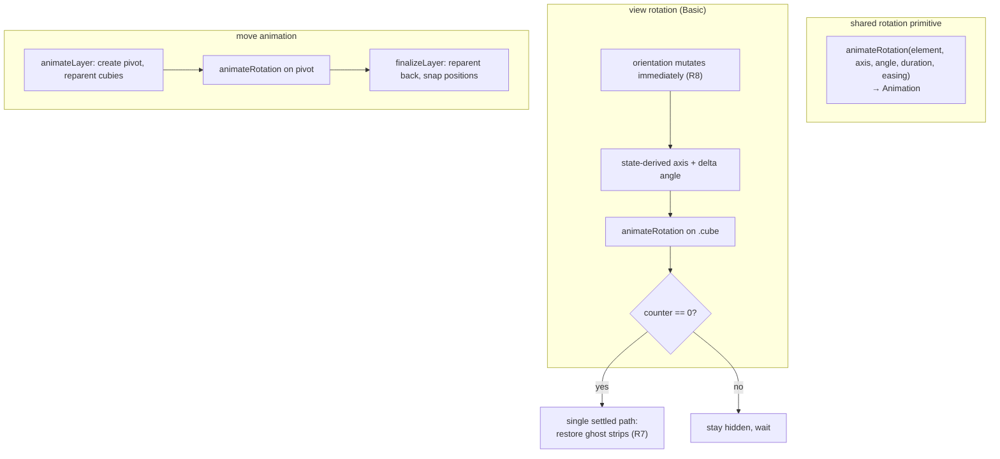
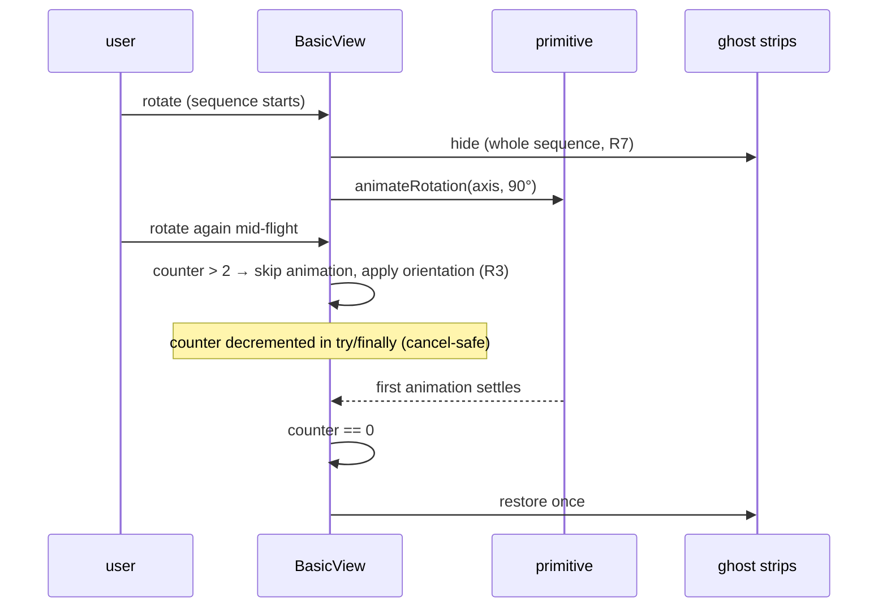

---
title:
  'refactor: Share one rotation-animation primitive across view rotation and
  move animation'
type: refactor
status: active
date: 2026-09-20
origin: docs/brainstorms/2026-09-20-shared-rotation-animation-requirements.md
---

## Summary

Replace the Basic view's matrix-based view-rotation animation with a shared,
angle-based rotation primitive, so that every intermediate frame of a rotation
is a valid rotation. The primitive is adopted by view rotation and move
animation alike, the rotation axis is derived from current state, rapid input
reuses the Circular view's existing skip-when-queued behaviour,
`prefers-reduced-motion` is honoured, and ghost strips are tied to a real "cube
settled" signal instead of a hard-coded delay.

## Problem Frame

Basic view rotation writes the whole orientation as one `matrix3d(...)` and lets
a CSS `transition: transform` interpolate it (`src/views/basic/rendering.ts`,
`.cube` in `src/views/basic/basic-view.module.css`). Matrix-to-matrix
interpolation is component-wise on the matrix entries, so the interpolated value
leaves the rotation group and the geometry shears. Two consequences are
user-visible: a large delta does not travel the intended path, and
**interrupting** a transition mid-flight adopts the already-sheared matrix as
the new start, so the next rotation visibly unwinds the wrong way. The second is
the reported defect and it reproduces in Chromium as well as Firefox, so it is a
defect in this codebase's animation scheme rather than a browser quirk.

Move animations do not have this defect: `animateLayer` in
`src/views/basic/animations.ts` animates a pivot with WAAPI `rotate3d`, i.e. it
ramps an **angle**. The two rotation systems therefore solve the same problem
two ways and only one of them is correct.

The known-issue note in `implementation-status.md` currently attributes this to
a Firefox-specific `matrix3d` limitation and files it as "acknowledged, not
planned to fix". Both claims are wrong and the entry has been suppressing the
fix.

## Requirements

- R1. View rotation animates by ramping an angle about a known axis, so that the
  cube reaches the intended orientation by travelling the intended path — the
  swept angle matches the intended delta and the direction never reverses
  mid-rotation.
- R2. The rotation axis is derived from current state per rotation. Across the
  24 reachable orientations a given rotation gesture uses six distinct world
  axes (±X, ±Y, ±Z), always by 90°; a fixed axis is wrong for essentially every
  case.
- R3. Rapid input follows the Circular view's existing precedent: a bounded
  pending queue, and once two or more rotations are already waiting, further
  rotations skip their animation and apply the orientation directly.
- R4. View rotation honours `prefers-reduced-motion` by applying the new
  orientation without animating, matching `animateMove`.
- R5. One shared primitive performs rotation animations for both view rotation
  and move animation, and animation duration is owned in one place.
- R6. `implementation-status.md` states the true defect rather than a
  Firefox-specific limitation.
- R7. Ghost strips stay hidden for a whole rotation _sequence_ and return once,
  when the cube has settled — not between rotations.
- R8. Orientation, `STATE_CHANGED`, and the selection re-anchor all apply
  immediately; the animation is only a visual layer, and re-anchoring must not
  be deferred to the end of an animation.

## Success Criteria

- A rapid sequence of view rotations — including a rotation that interrupts
  another — never shows the cube unwinding against the intended direction, in
  Chromium and Firefox.
- A two-step background drag reads as one continuous half-turn.
- Ghost strips stay hidden for a whole rapid sequence and return once, after the
  cube settles — not between rotations.
- Enabling reduced motion makes view rotation instantaneous.
- Move animations are visually unchanged.
- `getState()` never reports an orientation the cube has not yet reached while a
  rotation is still animating.
- The matrix writer is no longer the mechanism that animates a view rotation.

## Key Technical Decisions

- **The shared primitive takes a rotation and returns an `Animation`; it does
  not own the pivot lifecycle.** Move animation and view rotation have
  structurally different lifecycles — the former creates a pivot, reparents
  cubies into it, and reparents them back on settle; the latter has no pivot and
  no reparenting, and bakes a transform onto one element. Unifying that
  lifecycle would produce a primitive with two branches, and would change the
  DOM shape of a working move animation. Sharing the _technique_ and the
  duration satisfies R5 without forcing a shared DOM life story.
- **`transform-origin` is a caller concern, not a primitive assumption.** Move
  animation wants the cube centre (`faceHalf, faceHalf, 0`), while `.cube`
  carries `transform-origin: 50% 50% 0`. Baking either into the primitive would
  silently misplace the other.
- **The rotation axis comes from the state transition, not from a constant.**
  The exact rotation `R` mapping the current basis to the next one is `M'·Mᵀ`;
  its axis is one of ±X/±Y/±Z. Verified over all 24 orientations × 4 rotations:
  a fixed world-Y pivot is wrong in 96/96 cases, while a state-derived axis is
  correct in 96/96.
- **The pending counter is reimplemented locally rather than extracted from
  Circular.** Extracting would touch working Circular code for a single new
  consumer, and the counter there is not cancel-safe (`_pendingTotal--` sits
  outside `try/finally`, so an `AbortError` from `cancel()` leaks the count and
  latches the path off permanently). Interruption is precisely the case being
  fixed here, so cancel-safety is required, not optional. The duplication is
  recorded as a future consolidation, noting that no further views are planned.
- **The "settled" signal is an awaitable plus a cancel-safe counter in the view;
  no new event is introduced.** The primitive returns something awaitable, and
  the view drives a single settled path when its counter reaches zero. This
  collapses today's `endRotation()` / `endFinishedRotation()` pair into one path
  and retires the `turnAlreadyFinished` parameter. A bus event was rejected as
  YAGNI: the only consumer is `GhostStickers`, since R8 keeps the selection
  re-anchor synchronous.
- **No queue of pending moves exists to key the settled signal off.** The
  controller applies moves synchronously (`src/cube-controller.ts`),
  `MoveHistory` is undo/redo only, and there is no move queue. The model is
  updated before `MOVE_EXECUTED` fires and the animation is purely cosmetic, so
  "settled" has to be tracked by the view that owns the animations rather than
  inferred from the controller.

## High-Level Technical Design

The rotation primitive and its two consumers:

Interruption handling, which is the reported defect:

## Implementation Units

### U1. Add the shared rotation primitive

- **Goal:** One exported function that animates a rotation as an angle about a
  given axis, returning something awaitable.
- **Requirements:** R1, R5
- **Dependencies:** none
- **Files:** `src/views/basic/animations.ts`,
  `src/views/basic/animations.test.ts`
- **Approach:** Accept an element, an axis, an angle, a duration, and an easing.
  Emit keyframes as `rotate3d(<axis>, <from>deg)` → `rotate3d(<axis>, <to>deg)`
  and return the `Animation` (or a small `{ animation, finished }` shape) so
  callers can await completion and cancel. Do not set `transform-origin`, do not
  create or reparent any element, and do not bake the settled transform — those
  stay with the caller (KTD: lifecycle ownership). The angle may be any value,
  including multiples of 90° and values above 180°, and the ramp must use the
  supplied angle verbatim rather than normalising to a shortest arc.
- **Patterns to follow:** the `pivot.animate([...], {...})` call already in
  `animateLayer` (`src/views/basic/animations.ts`); the options shape of
  `BasicAnimationConfig` and `DEFAULT_BASIC_ANIMATION_CONFIG` in the same file.
- **Test scenarios:**
  - Happy path: animating 90° about `0,1,0` produces keyframes from
    `rotate3d(0,1,0,0deg)` to `rotate3d(0,1,0,90deg)` with the supplied duration
    and easing.
  - Happy path: a ramp whose delta exceeds 180° (e.g. 0° → 270°) is emitted
    verbatim, not normalised to the shorter arc — this is the regression that
    caused the reported defect.
  - Edge case: a negative delta (e.g. 0° → −90°) is emitted verbatim.
  - Edge case: the returned value exposes both cancellation and a completion
    signal the caller can await.
  - Error path: cancelling the returned animation rejects or settles its
    completion signal without leaving the caller's counter stuck (guards the
    cancel-safe requirement carried into U4).
- **Verification:** `animateLayer` can be refactored in the same commit to call
  this function with no change to its observable keyframes, and the existing
  `animations.test.ts` expectations still hold.

### U2. Route move animation through the primitive

- **Goal:** `animateLayer` uses the shared primitive instead of calling
  `pivot.animate` directly, proving the primitive is genuinely shared.
- **Requirements:** R5
- **Dependencies:** U1
- **Files:** `src/views/basic/animations.ts`,
  `src/views/basic/animations.test.ts`
- **Approach:** Keep pivot creation, cubie reparenting, `transform-origin`
  computation, and the axis-angle sign convention exactly as they are; change
  only the animation call. The existing CSS-axis negation (Y and Z are negated
  to match CSS space) is move-specific and stays here rather than moving into
  the primitive.
- **Patterns to follow:** the existing body of `animateLayer` — this unit is a
  substitution, not a rewrite.
- **Test scenarios:**
  - Integration: a Y-axis quarter turn still produces the same keyframes as
    before the refactor (`rotate3d(0,1,0,-90deg)`), confirming the sign
    convention survived the indirection.
  - Integration: the pivot is still created inside the cube element and cubies
    are still reparented into it, so `finalizeLayer` remains correct.
  - Edge case: the reduced-motion path still returns `null` from `animateMove`
    and never constructs a pivot.
- **Verification:** the move-animation test suites pass unchanged — these are
  pure regression tests for this unit, since no move behaviour is intended to
  change.

### U3. Derive the rotation axis from state and animate view rotation with the primitive

- **Goal:** View rotation animates a state-derived axis and angle instead of
  writing a new `matrix3d` pair, and the CSS transition on `.cube` is removed.
- **Requirements:** R1, R2, R5, R8
- **Dependencies:** U1
- **Files:** `src/views/basic/rendering.ts`,
  `src/views/basic/basic-view.module.css`, `src/views/basic/basic-view.ts`,
  `src/views/basic/rendering.test.ts`,
  `src/views/basic/basic-view.manual-rotation.test.ts`
- **Approach:** For a rotation, compute the target basis from the existing
  vector swap, derive the exact rotation `R = M'·Mᵀ` from current basis to
  target, and extract its axis and angle. Animate that axis/angle with the
  primitive, then bake the settled transform. Orientation must be mutated
  **before** the animation starts so that `getState()`, `STATE_CHANGED`, and the
  re-anchor all see the new orientation immediately (R8). Remove
  `transition: transform 0.25s` from `.cube` — leaving it would start a second,
  competing animation on the same element. Keep `updateRotation` as the function
  that writes the settled transform, since `ghost-stickers.ts` and the label
  refresh depend on the current write shape.
- **Patterns to follow:** `animateLayer` for the rotate3d form; the existing
  `rotateViewLeft/Right/Up/Down` vector swaps in `src/views/basic/navigation.ts`
  as the authority for the target orientation.
- **Execution note:** Start with a failing test that asserts the interpolated
  rotation stays a valid rotation for a delta beyond 180° — the reported defect
  made reachable through interruption.
- **Test scenarios:**
  - Happy path: a single 90° rotation settles on the expected orientation and
    passes through valid rotations only.
  - Happy path (`Covers R2`): rotation from a non-identity orientation uses the
    correct axis for that orientation, not a fixed axis — cover at least one
    case where the correct axis is X and one where it is Z, since a Y-only
    implementation passes a naive test.
  - Edge case (`Covers R1`): over the animation, the total swept angle matches
    the intended delta (within tolerance) and the traversal never reverses
    direction. **Do not use the rotation-block determinant as the assertion** —
    it measures 1.0 throughout even on the current broken implementation, so a
    determinant check passes on the very defect this unit exists to fix.
    `repro.html` carries a working metric (per-frame unwrapped angle deltas,
    counted reversals).
  - Edge case: a two-step rotation (the background far-drag path, which commits
    both steps before calling back) animates as one ramp over the full delta.
  - Edge case: `resetView` and `alignCubeToView` still settle on the correct
    orientation, with `alignCubeToView` keeping its existing
    `preserveSelectionAcrossOrientationChange` wrapper.
  - Integration (`Covers R8`): `getState()` reports the new orientation
    immediately after the rotation is requested, while the animation is still
    running.
  - Integration: the selection re-anchor still resolves the remembered screen
    cell against the post-rotation orientation.
- **Verification:** `basic-view.manual-rotation.test.ts` orientation assertions
  continue to pass; the transform assertions are updated from `matrix3d(...)`
  string matching to the new animated form, and the updated expectations are
  justified by the settle-state check rather than a string literal.

### U4. Cancel-safe pending counter and a single settled path

- **Goal:** Track in-flight rotations, honour `prefers-reduced-motion`, skip
  animation past the threshold, and collapse the two rotation-closing paths into
  one that fires when the cube settles.
- **Requirements:** R3, R4, R7, R8
- **Dependencies:** U3
- **Files:** `src/views/basic/basic-view.ts`,
  `src/views/basic/ghost-stickers.ts`,
  `src/views/basic/basic-view.ghost-orientation.test.ts`,
  `src/views/basic/layer-stability.test.ts`
- **Approach:** Hold a counter of in-flight rotation animations, incremented
  when an animation starts and decremented in a `finally` block so a
  cancellation cannot leak it (the Circular counter's non-cancel-safe shape must
  not be copied — KTD). When the counter is already above the threshold, apply
  the orientation without animating, reusing the Circular precedent's threshold
  of two. When the counter reaches zero, run the single settled path: restore
  the ghost strips. This replaces `endRotation()` and `endFinishedRotation()`
  and retires the `turnAlreadyFinished` parameter; `updateVisibleEdges` keeps
  accepting a delay, but the immediate-restore caller becomes the only caller so
  the delay constant and the comment restating the CSS duration are removed.
  Under `prefers-reduced-motion`, apply the orientation directly and do not
  animate, matching the `animateMove` convention. The settled path must run on
  **rejection as well as fulfilment**, and must be guarded so that a rotation
  resolving after a resize, a model update, or `destroy()` does not touch
  removed DOM or reconcile against superseded geometry. This unit also owns the
  decision of _which layer_ runs the rotation lifecycle, because the tilt and
  pitch commands call `updateRotation` directly rather than through a view
  method — that choice decides whether those two paths are covered or silently
  skipped.
- **Patterns to follow:** the skip-when-overloaded intent in `updateSelective`
  (`src/views/circular/rendering.ts`) — the _pattern_, not the code (KTD);
  `animateMove`'s reduced-motion early return; the existing `beginRotation()`
  hide discipline in `src/views/basic/basic-view.ts`; the existing
  event-identity guard on the move animation's completion handler in the same
  file, which already solves the stale-completion problem for moves.
- **Execution note:** Implement the interruption case test-first; it is the
  reported defect and a stubbed animation will not exercise it unless driven
  explicitly.
- **Test scenarios:**
  - Happy path (`Covers R7`): strips hide once at the start of a sequence and
    return once when the last rotation settles.
  - Happy path: strips stay hidden across a multi-step sequence rather than
    reappearing between steps.
  - Edge case (`Covers R3`): with more than two rotations pending, a further
    rotation applies its orientation without animating.
  - Edge case (`Covers R4`): under `prefers-reduced-motion`, view rotation
    applies the orientation directly and no animation is started — this
    behaviour is currently unrequired and untested.
  - Edge case: cancelling an in-flight rotation does not leak the counter — a
    subsequent rotation still animates, proving the path did not latch off.
  - Error path (`Covers R1`): a rotation interrupted mid-flight does not adopt a
    sheared starting state, and the sequence still ends on the intended
    orientation with strips restored exactly once.
  - Integration: an interrupted move animation still closes its rotation, so
    strips are not stranded hidden for the rest of the session.
  - Integration: tilt and pitch — which write the transform through a direct
    call from the commands module rather than through a view method — still
    settle correctly, so the lifecycle's owner is the layer that actually covers
    them.
  - Integration: `resetView` and `alignCubeToView` settle, including the
    non-animating form used by `alignCubeToView`, which must still settle even
    though no animation runs.
  - Integration: a resize or model update landing mid-rotation does not leave a
    completion writing to replaced DOM.
  - Integration: a rotation pending at `destroy()` does not write to removed
    DOM.
  - Edge case: linked-rotation peers settle on the same orientation as the
    source. A multi-step source sequence must not leave the peer sweeping, and
    must not leave the peer's strips hidden longer than the source's.
- **Verification:** the ghost-orientation suite covers all rotation paths plus
  the interruption case; a manual check in a real browser confirms strips return
  exactly once after a rapid sequence.

### U5. Correct the known-issue record

- **Goal:** The documented defect matches reality.
- **Requirements:** R6
- **Dependencies:** none
- **Files:** `implementation-status.md`, `TODO.md`
- **Approach:** Remove the Firefox-specific framing and the "not planned to fix"
  disposition. Either delete the entry (the defect is fixed by U3/U4) or, if a
  residual is genuinely kept, restate it without attributing it to a browser.
  Check whether `TODO.md` repeats the claim, since `implementation-status.md`
  states the two documents deliberately do not duplicate each other.
- **Test expectation:** none — documentation only.
- **Verification:** no document in the repo attributes this defect to a
  Firefox-specific `matrix3d` behaviour or describes it as unplanned.

### U6. Seeded verification against the real defect

- **Goal:** Prove the fix on the behaviour that was actually reported, with a
  harness that cannot produce plausible-but-wrong numbers.
- **Requirements:** R1, R2, R3, R7
- **Dependencies:** U3, U4
- **Files:** `scripts/scratch-debug/repro.html`,
  `scripts/scratch-debug/validate-repro.mjs` (both exist today but are
  untracked)
- **Approach:** Drive a rapid rotation sequence in a real browser and assert the
  cube reaches the intended orientation, that the traversal never reverses, and
  that strips return exactly once. Three artifacts carry the plan's measured
  claims and must be kept until this unit completes:
  `scripts/scratch-debug/probe-css-transition.mjs` (the only probe that
  exercises the real CSS `transition` path, and therefore the only one that
  shows the actual defect — per-frame sweep plus a reversal count),
  `scripts/scratch-debug/analysis-pivot-structure.mjs` (the 96/96 computation
  behind the state-derived-axis requirement), and
  `scripts/scratch-debug/repro.html` with
  `scripts/scratch-debug/validate-repro.mjs` (the standalone page and its
  driver, which are the only way to check this in the user's real browsers — the
  automated Firefox available in this environment is a patched build and cannot
  stand in for the shipped browser). The other probes in that directory are
  superseded diagnostics from the investigation and should be deleted, not
  preserved: several measure a proxy (pivot angle) rather than the outcome, and
  keeping them invites a future reader to trust a misleading number. Measurement
  must be taken in headed mode, since the headless compositor path differs, and
  the harness must be validated against a known-good control before any number
  from it is trusted. **Decide this unit's final state deliberately:** the
  strongest outcome is to promote the axis computation into a real unit test,
  since that claim is load-bearing for the plan itself and a scratch script is
  not a durable guard. Otherwise promote the artifacts into a tracked location,
  or delete the directory when the fix lands — leaving untracked scratch files
  as the only home for a plan's verification tooling means the next reader
  cannot find it, and a `git clean` silently destroys it. Note also that the
  browser-level check covers the model-space correctness of R1/R2; R3's
  skip-when-overloaded rule and R4's reduced-motion path are jsdom-testable and
  are covered by U4's scenarios instead.
- **Test expectation:** none automated — this is browser-level verification
  complementing the unit tests in U3/U4, not a replacement for them.
- **Verification:** a rapid sequence in a real browser shows no reversed
  rotation at any point, and strips return once.

## System-Wide Impact

**Linked rotations across the Basic view family are the sharpest constraint.**
The source view emits `BASIC_VIEW_ROTATION_LINKED` once per _step_ while
rendering once per _gesture_ (the touch path loops `steps` times; keyboard
navigation emits per step but calls `updateRotation` once after the sequence,
and `rotateViewToFace` applies two steps for the anti-parallel case). The peer
variant's listener calls its own `rotateViewLeft()` and friends once per
received event. Today source and peer stay accidentally symmetric because every
peer call writes `matrix3d` and the writes are overwritten within one tick,
leaving a single CSS transition over the net delta. Once the animation ramps an
angle from the last rendered value, that symmetry breaks: the peer would run N
successive sweeps instead of one, and its strips would stay hidden roughly N
times longer than the source's. N synchronous calls on one side must therefore
**coalesce into a single sweep**; this is _not_ the same as the
skip-when-overloaded rule (coalescing merges the delta, skipping drops the
animation), and the two must not be conflated in `basic-view.ts`.

The existing payload (`{ rotation, sourceViewType }`) carries no step count and
no end-of-sequence marker, so a peer cannot know where the source's sequence
finishes — which R7 needs. If the payload gains sequence framing, the change
reaches `src/types/events.ts`, the event-catalogue test that fails when a
declared event has no production emitter, the Basic view's event tests, and
`src/docs/commanding-and-eventing-system.md`. That last one is **already stale**
(basic-view rotation events are among several undocumented entries), so it must
be updated rather than assumed correct.

**The settled signal stays view-local.** Every view subsystem owns ghost
visibility through a different module and mechanism — the Basic view through
`src/views/basic/ghost-stickers.ts`, Flat through a separate
`src/views/flat/ghost-strips.ts`, and Circular by mutating ghost elements from
inside its animation path. Because the event bus is global, a bus-wide "cube
settled" event would make the Basic view a second writer of ghost visibility in
views that own their own, and ghost visibility carries an accessibility
dimension. The signal is therefore an awaitable plus a view-local counter (KTD),
and the peer must never consume the source's settle.

**Tilt and pitch are the call sites most likely to be silently missed.** The
view-rotation commands go through the view's methods, but the tilt and pitch
commands call `rendering.updateRotation` **directly** from
`src/views/basic/commands.ts`. The command context exposes no begin/end pair, so
if the settled lifecycle is owned by each caller rather than by the function
that writes the transform, these two paths are skipped without any test
noticing. U3/U4 must state which layer owns it. The same question applies to
`resetView`, `alignCubeToView` (which uses the non-animating form and also emits
whole-cube moves), `setState`, and the resize/model-update paths, which replace
cubie DOM outright.

**Completion must be guarded against a stale DOM.** Resize and `update(model)`
replace cubie elements and swap the model. The move path already guards
staleness by event identity rather than by generation, and Circular has a known
stale-snapshot defect from capturing state before a model change. A rotation
resolving after a resize, a model update, or `destroy()` must not write to
removed DOM or reconcile against superseded geometry — U4 needs an equivalent
guard.

**Failure propagation.** Two failure shapes matter and both are unaddressed
today: a leaked pending counter (Circular's counter is decremented outside
`try/finally`, so a cancellation latches its path off permanently — the exact
shape U4 must avoid), and a rejection that is not our own interrupt leaving a
pivot orphaned and children reparented in the move path. The plan's settled path
must run on rejection as well as fulfilment.

**Invariants that must survive this change:** orientation mutation and the
selection re-anchor stay synchronous (R8), so the settled path must never be
where re-anchoring happens; `updateRotation(state, true)` must remain genuinely
non-animating _and_ still settle; and the base tilt must stay on a nested
element so the animated rotation axis is a world axis rather than the tilted
one.

## Scope Boundaries

### Deferred to Follow-Up Work

- Extracting a shared pending-counter helper if a third rotation consumer
  appears. Today there are two, one of which (Circular) has a non-cancel-safe
  counter; consolidating now would mean touching working code for a single new
  consumer. Recorded as a future improvement; no further views are planned.

### Outside this scope

- Changing the persisted orientation format. Orientation stays the three
  orthonormal vectors in `BasicViewState`; only how a change is animated is in
  scope.
- Changing view-rotation semantics — which face comes forward for a given
  gesture or key. The destination orientation is unchanged.
- Changing move-animation timing or easing as perceived today.
- Redesigning the ghost-strip concept. Only _when_ strips are revealed relative
  to a rotation sequence is in scope (R7).
- Unifying the reparenting mechanics of move animations with view rotation — the
  shared surface is the animation technique, not the surrounding DOM handling.

## Risks & Dependencies

- **A new element between the container and `.cube` would change ghost-anchor
  scoping.** The ghost anchors live inside `.cube`
  (`src/views/basic/rendering.ts`) and `GhostStickers` is constructed with that
  wrapper as its scoped root, precisely so its `[data-basic-face]` query cannot
  match cubie sticker divs. The chosen approach (KTD: lifecycle stays with the
  caller) avoids introducing such an element for view rotation; if
  implementation drifts toward a pivot wrapper, the anchor scoping and
  `preserve-3d` on the new wrapper must both be re-checked.
- **Removing the CSS transition invalidates the ghost-strip delay's rationale.**
  `src/views/basic/ghost-stickers.ts` documents its delay as tuned to the 250 ms
  transform it was timed against. U4 replaces that with a real settled signal;
  the constant must not simply be left in place with a now-false comment.
- **The seek to unify carries regression risk in move animation.** U2 changes a
  working path. It is scoped to a single call substitution, and the existing
  move test suites act as regression tests — but any temptation to also
  restructure pivot handling should be deferred rather than absorbed here.
- **The obvious assertion for R1 does not detect the defect.** The
  rotation-block determinant of the interpolated matrix measures 1.0 for the
  whole animation even when the rotation travels the wrong way, and
  identity/360° frames serialize as a 2D `matrix(...)` rather than
  `matrix3d(...)`, so a metric that only accepts 16-value matrices silently
  drops those frames and under-reports the swept angle. U3's test scenario names
  the assertion that does work; this is recorded here because it is the single
  most likely way for this fix to ship with a test that proves nothing.
- **Reachable scope limitation:** the reproduction harness cannot be exercised
  in the bundled environment's Firefox. The automated Firefox available here is
  a patched build that is not the shipped browser, so a browser-specific claim
  cannot be settled automatically — it needs confirmation in the user's real
  browser.
- **jsdom cannot exercise the defect.** A stubbed `animate` resolves instantly,
  so the interruption case that motivated this work will not fail for free in
  unit tests. U4 carries an explicit test-first note and U6 provides
  browser-level verification; neither alone is sufficient.
- **Verification measurement is a known trap.** The earlier attempt to measure
  this defect produced plausible, wrong conclusions by comparing against a
  patched Playwright Firefox build that is not the shipped browser, and by
  measuring a proxy (pivot angle) rather than the outcome (resulting
  orientation). U6 encodes the corrected approach; any browser-specific claim
  still needs confirmation in the user's real browser.

## Sources & Research

- Origin requirements:
  `docs/brainstorms/2026-09-20-shared-rotation-animation-requirements.md`
- Animation technique precedent: `src/views/basic/animations.ts`
  (`animateLayer`)
- Precedent for skipping animation under load: `src/views/circular/rendering.ts`
  (`updateSelective`)
- Orientation and rotation semantics: `src/views/basic/navigation.ts`
- Re-anchor policy and its accessor-not-values interface:
  `src/views/basic/reanchor.ts`
- Measured evidence for the axis claim and the interpolation defect: reproduced
  in a standalone harness and by exact computation over all 24 orientations × 4
  rotations (96/96 wrong for a fixed axis, 96/96 correct for a state-derived
  one).
