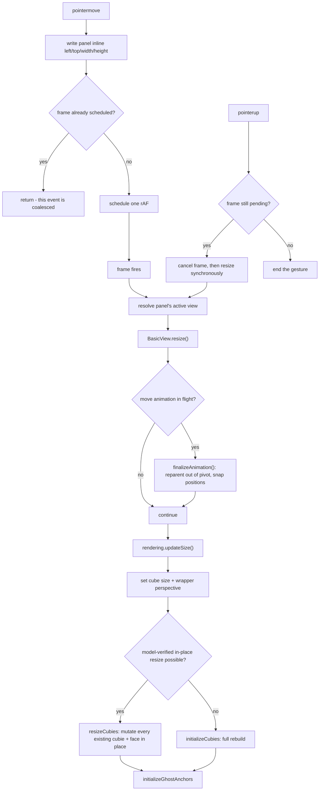

---
title:
  'fix: Stop the Basic view resize flicker by coalescing resize work and
  updating cubies in place'
type: fix
status: completed
date: 2026-09-21
---

## Summary

Dragging a panel resize handle currently drives a full teardown and rebuild of
the Basic view's entire `preserve-3d` cubie tree on every raw `pointermove`
event. This plan bounds that work to one update per animation frame and stops
the resize path from destroying DOM it could simply update in place.

## Problem Frame

The reported defect is in `TODO.md`: resizing the Basic view's panel produces
unexpected visual artifacts in Firefox (screenshot at
`docs/visuals/firefox-resize-issue.png`), described as dark flicker across the
cube's faces. Chromium appears unaffected.

Two things are independently wrong on that path, and both are confirmed by
reading the code:

1. **The resize notification is unthrottled.** `handleResize` in
   `src/view-manager/panel-interaction-handler.ts` computes and writes the
   panel's new inline dimensions and then calls `activeView.view.resize()`
   unconditionally, once per `pointermove`. A pointer device that reports faster
   than the display refreshes therefore drives more view resizes than there are
   frames to show them in, and a coalesced-event burst produces several resizes
   for a single painted frame.

2. **Every one of those resizes destroys and re-creates the whole cubie tree.**
   `resize()` → `updateSize()` in `src/views/basic/rendering.ts` →
   `initializeCubies()` in `src/views/basic/cubie-rendering.ts`, which removes
   every `[data-cubie-id]` element and builds each cubie and each of its face
   elements from scratch via `document.createElement`. A 7x7 cube has 218
   surface cubies, 294 stickers and six face elements per cubie — 1308 face
   elements in total, plus the cubies — all re-created per event, with every
   node's inline `transform`, `width`, `height` and inherited
   `--cubie-border-width` re-resolved by style and layout each time.

The mechanism is confirmed but the _engine attribution_ is not. What is
established by measurement (in a previous investigation) is that the front
face's projected height oscillated `352px -> 302px -> 0 -> 353px` while the
cube's bounding box stayed roughly constant at `~430px` — the signature of a
transitional paint/compositing state, not of a change in geometry. What is _not_
established is why Gecko shows it and Blink does not: the only Firefox available
in this environment is Playwright's patched build, which this repository has
already documented as unable to stand in for the shipped browser, and
`docs/brainstorms/2026-09-20-shared-rotation-animation-requirements.md` records
a prior "Firefox-only" 3D claim that turned out to be engine-independent.

So this plan does not add engine-specific workarounds. It removes the two
conditions that make a per-frame rebuild possible at all, and treats "the
Firefox symptom is gone" as a success criterion the user verifies in a real
Firefox rather than as an outcome the plan asserts.

## Requirements

**Resize notification (panel handler)**

- R1. Dragging a panel resize handle notifies the view's `resize()` at most once
  per animation frame, regardless of how many `pointermove` events arrive in
  that frame.
- R2. When the resize gesture ends, the view reflects the panel's final
  dimensions — no resize is left uncommitted because its frame never ran.

**Cubie DOM update (Basic view)**

- R3. A plain panel resize removes and re-creates no cubie element and no face
  element.
- R4. The in-place resize path yields the same geometry as a full rebuild for
  the same size and cube size: cubie `width`/`height`, each cubie's
  `translate3d`, each face's transform, and `--cubie-border-width`.
- R5. If the existing cubie DOM does not correspond to the current model and
  cube size, the resize falls back to a full rebuild rather than mutating a
  partial DOM.
- R6. Selection and highlight markup survive a plain resize because the elements
  that carry it are the ones that were kept.

**Animation interaction**

- R7. A resize during a move animation settles that animation first, so the
  resize never rescales cubies that are currently inside an animation pivot.

## Success Criteria

- Dragging the Basic view's resize handle in a real Firefox shows no dark or
  blank flicker across the cube's faces, at any cube size and in both resize
  directions. This is confirmed by the user, not by an automated test.
- The same gesture in Chromium is visually unchanged from today.
- Across a whole resize gesture, the cubie elements present at the start are the
  same node objects present at the end.
- After any resize — in-place or rebuilt — the cube's geometry is identical to
  what a fresh `initializeCubies` at that size would produce.
- Resizing while a move animation is running leaves the cube showing the move's
  post-move positions at the new size, with no pivot left attached.
- `npm run type-check`, `npm run lint:imports` and the full suite pass with
  coverage at or above the 70% thresholds.

## Key Technical Decisions

- **Coalesce with `requestAnimationFrame`, not a time-based debounce.** The
  frame boundary is what the compositor actually presents, so one update per
  frame is exactly the achievable rate; a millisecond threshold would still
  allow more than one rebuild per frame at a low threshold, and would under-work
  a high-refresh display at a high one. `src/view-manager/view-manager.ts`
  already defers its own view resizing into `requestAnimationFrame` for the same
  class of reason, so this follows an existing convention rather than
  introducing one.

- **Only the view notification is coalesced; the panel's own inline geometry is
  still written per event.** The panel's `left`/`top`/`width`/`height` writes
  are what make the drag feel direct, and collapsing them would make the panel
  trail the pointer for no benefit — the cost being removed is the descendant
  rebuild, not the panel write.

- **Schedule-on-first with a single pending handle, executed on the trailing
  edge.** Because the panel's dimensions are written synchronously before the
  frame is scheduled, the callback reads the frame's final size, so no frame is
  ever painted at a superseded size and no work is spent on a size that was
  already replaced.

- **The pending frame is flushed synchronously at gesture end instead of being
  cancelled or left to run.** Leaving it queued would let a callback fire after
  `dispose()` for no reason; cancelling it without flushing would leave the view
  sized to the second-to-last `pointermove`, which is a visible defect at the
  end of every drag.

- **The in-place path is self-verifying against the model, not gated by a "DOM
  is stale" flag.** This area has already produced one bug of exactly this
  shape: `initializeCubies` stored `cubieSize` on `state` while
  `updateCubiePositions` read it from `cubeElement`, so a missing element-level
  value silently fell back to 3x3 geometry. A boolean that each caller must
  remember to set is the same class of latent defect. Driving the update from
  the model's cubie list means an absent flag cannot be forgotten, and the same
  check catches a model that changed without a rebuild.

- **Every face element records its own face in a dedicated attribute.** The
  in-place path needs each child's face to recompute its transform, and deriving
  it from child order is fragile. The attribute must not be `data-basic-face`:
  `src/views/basic/touch-handler.ts` already resolves stickers through
  `[data-basic-face="${face}"][data-basic-pos="0"]` with no class filter, and
  the ghost-anchor query relies on that attribute meaning "sticker or full-face
  anchor". Overloading it on interior faces would make those selectors match
  elements they were never meant to.

- **The resize path does not re-apply selection or highlight markup, because it
  no longer needs to.** `reapplySelectionMarkup` and `reapplyHighlightMarkup`
  exist in `initializeCubies` for one reason: a rebuild replaces the sticker
  elements that carry the classes. Keeping the elements keeps the classes, so
  the in-place path drops two full DOM queries per frame without changing
  observable behaviour.

- **The view, not the render module, decides to settle an in-flight move
  animation before resizing.** The animation lifecycle lives in
  `src/views/basic/basic-view.ts`, and its `finalizeAnimation()` already knows
  how to reparent cubies out of the pivot and snap them to post-move positions.
  Putting this policy in `rendering.ts` would require the render module to learn
  about pivot state it deliberately does not own.

## High-Level Technical Design

The resize path after this change, with the two gates this plan introduces:



Coalescing across a single drag, and the flush at the end:

```mermaid
sequenceDiagram
    participant P as pointer
    participant H as PanelInteractionHandler
    participant V as BasicView
    participant D as cubie DOM
    P->>H: pointermove ×N within one frame
    Note over H: first event schedules one rAF; the rest return early
    H->>V: resize() (once)
    V->>D: update every existing cubie and face in place
    P->>H: pointerup
    H->>H: frame still pending? cancel and flush
    H->>V: resize() (final size)
    V->>D: update in place
```

## Implementation Units

### U1. Coalesce resize notifications to one per animation frame

- **Goal:** A drag that delivers many `pointermove` events per frame causes
  exactly one view resize per frame, and the gesture's final size is committed.
- **Requirements:** R1, R2
- **Dependencies:** none
- **Files:** `src/view-manager/panel-interaction-handler.ts`,
  `src/view-manager/panel-interaction-handler.test.ts`
- **Approach:** Add a private pending-frame field to `PanelInteractionHandler`
  holding the `requestAnimationFrame` handle, cleared when the callback runs. In
  `handleResize`, keep the existing per-event panel geometry writes and replace
  the direct `activeView.view.resize()` call with a schedule-on-first helper: if
  a frame is already pending, return without scheduling; otherwise request a
  frame whose callback resolves the view from
  `this.activeViews.get(panel.id.replace('-panel', ''))` at fire time, so a
  panel removed mid-frame is a no-op rather than a call against a stale view.
  Capture the panel element when scheduling, since `endDragOrResize` clears
  `dragState.panel` before the frame can run. In `endDragOrResize`, if a frame
  is still pending, cancel it and invoke the same resize path synchronously so
  the final dimensions are committed within the gesture. In `dispose()`, cancel
  any pending frame in addition to removing listeners.
- **Execution note:** The resize call moves out of the synchronous event handler
  into a frame callback, where a throw becomes an unhandled error rather than
  propagating to the caller. Wrap the view call so a view whose `resize()`
  throws cannot break the drag, matching how `resizeAllViews` in
  `src/view-manager/view-manager.ts` already guards its per-view calls.
- **Patterns to follow:** `resizeAllViews` in `src/view-manager/view-manager.ts`
  (guarded per-view resize, `requestAnimationFrame` deferral); the `disposed`
  guard already in `PanelInteractionHandler.dispose()`.
- **Test scenarios:**
  - Happy path: with `requestAnimationFrame` stubbed to invoke synchronously,
    one `pointermove` on a resize handle calls the active view's `resize()`
    exactly once.
  - Happy path (coalescing): three `pointermove` events dispatched while the
    frame is held pending produce exactly one `resize()` call when the frame is
    flushed, and the panel's inline `width` reflects the third event.
  - Edge case: `pointerup` while a frame is still pending commits a final
    `resize()` at the last `pointermove`'s size.
  - Edge case: `dispose()` with a frame pending means the view's `resize()` is
    never called for that frame.
  - Error path: a view whose `resize()` throws does not propagate out of the
    frame callback and does not prevent a later resize in the same gesture.
  - Integration: the existing "should handle resize movement" expectation of an
    immediate `resize()` call is updated to flush the frame deliberately, not by
    adding a real timer wait.
- **Verification:** A drag delivering an arbitrary number of `pointermove`
  events executes no more view resizes than the frames it spans, and the view's
  size after `pointerup` matches the panel's size on screen.

### U2. Give face elements a face attribute and add an in-place cubie resize

- **Goal:** A function that rescales an existing cubie tree to a new size
  without creating or removing a single element.
- **Requirements:** R3, R4, R5
- **Dependencies:** none
- **Files:** `src/views/basic/cubie-rendering.ts`,
  `src/views/basic/cubie-rendering.test.ts`
- **Approach:** In `renderCubieFaces`, record each face element's face in a
  dedicated attribute — on sticker elements and on the interior elements alike —
  so every face element is self-describing (KTD: a dedicated attribute, never
  `data-basic-face`). Add an exported `resizeCubies(state, size)` that returns
  whether it updated in place. It takes `cubeSize` from the model the same way
  `initializeCubies` does, rather than round-tripping it back out of
  `getCubeSizeFromElement`, which is where the earlier size bug came from. It
  then performs a **discovery pass followed by a mutation pass**: first collect
  each expected surface cubie's element by `[data-cubie-id]` and confirm the
  collected count matches the model's surface cubie count, returning `false`
  without mutating anything on any miss; only then set `--cubie-border-width`
  from `stickerBorderWidth(cubieSize)`, stamp `cubieSize` on the cube element
  and on `state`, and for each cubie set `width`/`height` and its `translate3d`
  from `cubie.position`, and for each face element set its transform from the
  attribute's face and the new half-size. Extract the position-to-transform
  arithmetic so `buildCubieElement` and the resize path compute it from one
  place — the duplicated formula is the reason the two can drift.
- **Execution note:** Add the geometry-equality test first: assert the in-place
  result against what `buildCubieElement` produces for the same cubie at the
  same size, so the test cannot pass by encoding the same mistake twice.
- **Patterns to follow:** `updateCubiePositions` in
  `src/views/basic/cubie-rendering.ts` (mutating existing elements in place,
  looking each one up by id); the storage of `cubieSize` on both the cube
  element and `state`, and the comment explaining why both.
- **Test scenarios:**
  - Happy path (3x3): after resizing 300 to 600, every cubie element's
    `width`/`height` and `translate3d` equal what `buildCubieElement` produces
    for that cubie at the new size.
  - Happy path: every face element's transform equals
    `getFaceTransform(face, newHalf)` for the face named by its attribute.
  - Happy path: `--cubie-border-width` on the cube element equals
    `stickerBorderWidth(newCubieSize)`.
  - Edge case (7x7): all 218 surface cubies are rescaled and every cubie element
    is the same node object afterwards, keyed by `data-cubie-id`.
  - Edge case: two resizes to the same size leave identical geometry.
  - Error path: a DOM missing one expected cubie is rejected and leaves every
    existing element untouched — assert widths and transforms are unchanged, not
    just that the return value is `false`.
  - Error path: an empty cubie DOM is rejected.
  - Integration: after `initializeCubies`, both sticker and interior elements
    carry the face attribute, and no interior element carries `data-basic-face`,
    guarding the touch-handler and ghost-anchor selector contracts.
- **Verification:** Rescaling a populated cube for a 3x3 and a 7x7 produces
  geometry indistinguishable from a rebuild, with node identity preserved.

### U3. Route plain resizes through the in-place path with a model-verified fallback

- **Goal:** `updateSize` uses the in-place resize whenever the existing DOM can
  answer for the model, and rebuilds otherwise.
- **Requirements:** R3, R4, R5, R6
- **Dependencies:** U2
- **Files:** `src/views/basic/rendering.ts`, `src/views/basic/rendering.test.ts`
- **Approach:** In `updateSize`, after setting the cube element's width/height
  and the wrapper's perspective, call `resizeCubies(state, faceSize)` and fall
  back to `initializeCubies(state, faceSize)` only when it reports it could not
  update in place. Keep the `initializeGhostAnchors(state, faceSize)` call
  unconditional: it already updates existing anchors in place and only creates
  an anchor that is absent, so it is correct on both paths. The resize path
  needs no selection or highlight re-application once the elements survive
  (KTD), which is what lets U2's function stay a pure geometry update. Also
  correct the comment on the `resetRotationAnimation` call at the top of
  `updateSize`: it currently justifies the reset by saying the ramp would be
  animating detached nodes, but the ramp targets the `.cube` element, which no
  path here replaces — the real reason the reset stays is that a rebuild
  underneath an in-flight ramp would leave an interpolated transform applied
  over a freshly built grid, so the resize settles the view. Keep the behaviour,
  fix the stated reason.
- **Patterns to follow:** the existing structure of `updateSize`; the comment
  style already used in `initializeCubies` for why the value is published from
  the one place that knows the cubie size.
- **Test scenarios:**
  - Happy path: `updateSize` with a DOM matching the model resizes in place and
    never calls `initializeCubies`.
  - Happy path: `updateSize` still sets the cube element's width and height and
    the wrapper's perspective.
  - Edge case: `updateSize` with a stale DOM (a cubie id that is not in the
    model, or a missing one) calls `initializeCubies`.
  - Edge case: `updateSize` with no cubie DOM at all calls `initializeCubies`.
  - Integration: the selected sticker's `selected` class is still on the same
    node after a plain resize.
  - Integration: ghost anchors are updated to the new size on both the in-place
    and the rebuilt path.
  - Regression: the existing "recalculates cube size, rebuilds cubies, and
    exposes the minimum size" test asserts `initializeCubies` is called with
    330, and it builds no cubie DOM. It must keep its rebuild expectation (an
    empty DOM is a legitimate fallback) while the 330 and the cube-element
    sizing assertions stay, and a companion test with a matching DOM must assert
    the in-place path. Asserting only one of the two leaves the fallback
    untested.
  - Regression: the `resize(state)` portion of "rebuilds the cubie DOM during
    update and delegates to resize" no longer holds for a populated DOM and must
    be updated, while the `update()` portion still asserts a full rebuild —
    `update()` is deliberately not routed through the in-place path.
- **Verification:** No surface in the view reaches `initializeCubies` from a
  plain resize when the DOM already matches the model, and every existing
  resize-related assertion either still holds or was changed deliberately.

### U4. Settle an in-flight move animation before resizing

- **Goal:** A resize can never rescale cubies that are reparented inside an
  animation pivot, and never leave a pivot attached.
- **Requirements:** R7
- **Dependencies:** U2
- **Files:** `src/views/basic/basic-view.ts`,
  `src/views/basic/layer-stability.test.ts`
- **Approach:** Have `resize()` call the existing private `finalizeAnimation()`
  before delegating to `rendering.resize(state)`. This matters because the
  pivot's `transform-origin` is computed from the face size captured when the
  animation started, so a resize mid-animation would leave the pivot orbiting a
  stale centre, and because the cubies are children of the pivot rather than of
  the cube element for the duration. The model is already at its post-move state
  before `MOVE_EXECUTED` fires, so settling early costs only the visual
  remainder of the turn — the same trade-off already made when a new move
  interrupts a running one.
- **Patterns to follow:** `finalizeAnimation` itself, and its existing use at
  the top of `handleMoveExecuted` for the interruption case.
- **Test scenarios:**
  - Happy path: `resize()` with a move animation running cancels the animation,
    removes the pivot, and leaves each moved cubie a direct child of the cube
    element before the resize runs.
  - Integration: after `resize()` mid-move, each cubie's `translate3d` equals
    the post-move model position at the new cubie size.
  - Edge case: `resize()` with no animation running leaves animation state
    untouched and does not call the finalize path.
  - Edge case: the reduced-motion path, where no animation was ever created,
    behaves as before.
- **Verification:** Resizing at any point during a move leaves no pivot element
  in the DOM and no cubie scaled from stale geometry.

## Verification Notes

The engine-level question is not answerable in this environment, so the primary
success criterion is a manual check the user performs:

1. In a real Firefox (not a Playwright build), open the app and drag the Basic
   view's resize handle slowly and then quickly, horizontally and vertically, at
   3x3 and at 7x7. No dark or blank frames should appear across the cube's
   faces.
2. Repeat in Chromium to confirm the gesture is visually unchanged.
3. With a move animation running, resize the panel mid-turn; the cube should
   settle the turn and stay correctly scaled, with no pivot left behind.

If the Firefox symptom survives this change, the two mechanisms removed here
were not its cause, and the next step is a Firefox profile capture of the drag
(WebRender profiler) to distinguish layerisation churn from a paint gap from a
`preserve-3d` flattening fallback — recorded in Risks rather than guessed at
here.

## Scope Boundaries

### Deferred to Follow-Up Work

- Removing the redundant cubie removal inside `rendering.update()`, which clears
  `[data-cubie-id]` immediately before `initializeCubies` clears it again.
  Adjacent cleanup, not part of this defect.
- Coalescing resize notifications for the Circular and Flat views. They have no
  per-cubie DOM to rebuild, so the same flood costs them far less; if a second
  consumer ever needs it, the scheduling helper should be extracted from
  `PanelInteractionHandler` then rather than now.
- Extracting a shared `requestAnimationFrame` coalescing utility. There is one
  consumer after this change.
- `data-basic-pos`, which `touch-handler.ts` reads but which production code
  does not currently write. Unrelated to this defect; noted because the in-place
  path must not be assumed to maintain it.

### Outside this scope

- The cube's geometry math — cubie pitch, the y-flip, the z-centring, and the
  face transforms. This plan changes where the arithmetic is called from, not
  what it computes.
- The sticker border ratio and its quantisation, addressed in commit `d1b27e1`.
- The panel drag (move) path. Only the resize notification is coalesced.
- Move-animation timing, easing or duration as perceived today.
- Engine-specific compositing workarounds such as `will-change: transform` or a
  `translateZ(0)` promotion hint. See Alternatives.
- The view's model-facing behaviour during a resize. Resizing is a visual
  operation; no model or orientation change is involved.

## Alternatives Considered

- **Scale the whole scene with one container transform instead of recomputing
  per-cubie geometry.** Rejected. `faceSize` is not only a visual size: it feeds
  `--cubie-border-width`, the wrapper's `perspective`
  (`1000 * faceSize / defaultSize`), and the ghost anchors' width, height and
  face transforms, while `cubeElement.style.width` is also what
  `getCubeSizeFromElement` divides by to recover the cube size. Leaving the DOM
  at one pixel size and scaling it would put the browser's scale factor and
  those derived pixel values out of agreement, and the touch handler's
  hit-testing math reads the same pixel sizes.

- **Coalesce inside each view's `resize()` instead of in the panel handler.**
  Rejected as the primary fix. It would still leave the handler resolving the
  active view and computing minimum sizes once per event, and it would spread
  the same scheduling logic across every view. Coalescing at the one place that
  produces the flood covers every view at once.

- **Drive the sticker's `translateZ` from a CSS custom property so nothing needs
  recomputing.** Attractive, and it would make the resize a single property
  write. Rejected for now because `getFaceTransform` is also used at full-face
  scale for the ghost anchors, so the function would need two modes, and because
  it changes how every face is positioned — a larger surface than this defect
  warrants. Worth revisiting if a third consumer of face geometry appears.

- **Considered and deferred, not rejected outright: layer-promotion hints.** No
  evidence points at absent layer promotion, and the observed signal — a
  constant bounding box with an oscillating projected height — reads as a
  transitional paint state rather than a missing compositor layer. Adding hints
  would raise GPU memory for every cube size, so it belongs behind evidence
  rather than ahead of it.

## System-Wide Impact

- **Panel interaction.** The handler gains frame-scheduling state that must be
  cleaned up in `dispose()` alongside its listeners. A resize notification now
  happens a frame after the event that caused it, which is observable in tests
  that assumed synchronous behaviour.
- **Basic view rendering.** `updateSize` gains a second path. Both paths must
  agree on geometry, which is why the position arithmetic is extracted rather
  than duplicated.
- **Move animation.** Resizing now settles a running animation. This is a
  behaviour change users may notice: previously a resize during a turn left the
  turn running against stale geometry.
- **Other views.** Unaffected beyond receiving fewer, frame-aligned resize
  notifications.

## Risks & Dependencies

- **The Firefox mechanism is unconfirmed.** No unpatched Firefox is available
  here, and this repository has a documented case of a Firefox-only 3D claim
  turning out to be engine-independent. The change is therefore justified on its
  own terms — unbounded per-frame work and needless DOM destruction are wrong
  regardless of engine — and the engine-level claim stays a user-verified
  success criterion.
- **The in-place path could silently diverge from the rebuild path.** Two
  implementations of the same geometry are exactly how the earlier 3x3-fallback
  bug happened. Mitigated by extracting the position arithmetic to one place and
  by asserting the in-place result against `buildCubieElement`'s output rather
  than against hand-written expected numbers.
- **A boolean-style staleness gate would be a latent bug.** Mitigated by making
  the precondition model-verified rather than caller-declared (KTD).
- **A half-mutated DOM on a failed in-place attempt.** Mitigated by the
  discovery-then-mutation split, with a test that asserts existing elements are
  untouched on rejection rather than only that the function returns `false`.
- **Node-identity assertions can pass while geometry is wrong.** Every identity
  assertion is paired with a geometry assertion.
- **jsdom cannot exhibit the symptom.** The tests pin the mechanism — node
  identity and resize call counts — not the visual symptom, which stays a manual
  check.
- **Existing tests encode the synchronous resize.** Two assertions in
  `src/views/basic/rendering.test.ts` and one in
  `src/view-manager/panel-interaction-handler.test.ts` depend on the old
  behaviour. Each must be changed deliberately as part of U1 or U3; a test made
  to pass by adding a wait for a real frame would hide the regression.
- **A resize mid-animation now ends the animation.** Visible as a move that
  snaps rather than completing. Accepted: it is the same behaviour already
  triggered by interrupting a move with another move, and the alternative leaves
  the cube rotating about a stale centre.

## Sources & Research

- Trigger: the Firefox resize entry in `TODO.md`, with the screenshot at
  `docs/visuals/firefox-resize-issue.png`.
- Defect site: `handleResize` in
  `src/view-manager/panel-interaction-handler.ts`; `updateSize` and
  `initializeCubies` in `src/views/basic/rendering.ts` and
  `src/views/basic/cubie-rendering.ts`.
- In-place precedent for cubie geometry: `updateCubiePositions` in
  `src/views/basic/cubie-rendering.ts`, including the comment recording why
  `cubieSize` must be stored on both the cube element and `state`.
- Frame-deferral and guarded-resize precedent:
  `src/view-manager/view-manager.ts` (`resizeAllViews`, `applyLayoutMode`,
  `showOnlyActivePanel`) and `src/view-manager/command-renderer.ts` (its own
  `requestAnimationFrame` use and a guarded `ResizeObserver`).
- Animation lifecycle and the interruption path: `src/views/basic/animations.ts`
  (`animateLayer`, `finalizeLayer`) and `src/views/basic/basic-view.ts`
  (`activeAnimation`, `finalizeAnimation`).
- Selector contracts the new face attribute must not disturb:
  `src/views/basic/touch-handler.ts` and `src/views/basic/ghost-stickers.ts`,
  plus the stray-element test in `src/views/basic/rendering.test.ts`.
- Institutional context:
  `docs/solutions/ui-bugs/overflow-priority-greedy-fill-flicker-2026-04-19.md`
  (the same `view-manager` module already has one documented resize-to-flicker
  defect) and `docs/solutions/features/basic-view-ghost-stickers-2026-05-03.md`
  (the anchor-scoping trap that any new `[data-cubie-id]` or face query must
  respect).
- Browser guidance, MDN: `Window.requestAnimationFrame()` is one-shot per
  request and returns the id to pass to `cancelAnimationFrame`, and its callback
  runs before the next repaint — the basis for schedule-on-first coalescing;
  `ResizeObserver` documentation recommends deferring resize-driven layout work
  into a `requestAnimationFrame` callback, which is the same recommendation this
  plan applies to the pointer-driven path, and is why `ResizeObserver` was not
  adopted as a replacement here.
