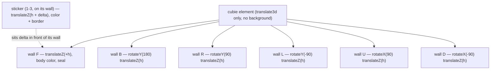

# fix: Seal cubie face planes to stop far-side bleed-through

## Summary

Zmeniť každý cubie v Basic view na plne uzavreté telo: šesť nepriehľadných stien
v rovine tváre (telo) s nálepkou ako samostatným filmom navrchu. Odstráni sa
plochý quad v centre cubie (zdroj presvitania) a stien bez nálepky sa zaoblia.
Kocka si zachová zamýšľaný vzhľad — jediné viditeľné zmeny sú zaoblenie stien
bez nálepky a odstránenie presvitania far-side cez škáry. Zmena prejde cez
scratch prototyp a vizuálnu bránu vo Firefoxe/Edge pred reálnym refactorom.

---

## Problem Frame

Po fixe backface-flash (`b07d1ea`) má `.cubie` `background-color` — plochý quad
v centrálnej rovine z=0 (cubie sa iba translatuje, nikdy nerotuje). Škáry medzi
stenami ležia v rovine tváre z=±h, o pol hrany bližšie k pozorovateľovi, takže
centrálny quad ich nedokáže utesniť a far-side sticker cez ne presvitá —
**symptóm [2]**. Pri graze uhloch naopak quad sám presvitá cez nálepky ako čiara
cez stred — **symptóm [1]**. Steny bez nálepky sú štvorcové a viditeľné práve
vďaka [2] — **symptóm [3]**.

Meraním (A/B diff v Chromium) sa potvrdilo, že quad zakrýva 143 px bielych a 102
px modrých nálepkových pixelov už v pokoji, a že jeho odstránenie bez náhrady
leak cez škáry zhorší (red 614→381 px). Riešenie: presunúť tesnenie zo stredu
kocky do roviny tváre.

---

## Requirements

Carried from `docs/brainstorms/2026-09-23-cubie-sealed-body-requirements.md`.

### Telo cubie

- R1. Každý renderovaný cubie nesie šesť nepriehľadných stien, jednu na každú
  tvár, s farbou `--color-domain-cube-interior`.
- R2. Všetkých šesť stien je 100 % × 100 % cubie, `transform-origin` v strede,
  poziciovaných výhradne transformom tváre (tuhý box v lokálnom rámci).
- R3. Cubie element sám už nenesie `background-color` — centrálny quad zmizne.
- R4. Cubie sa stále iba translatuje, nikdy nerotuje.

### Nálepka

- R5. Nálepka zostáva samostatným klikateľným elementom navrchu tela (farba,
  zaoblené rohy, border, `data-sticker-id`).
- R6. Nálepka je k stene odsadená pozdĺž svojej normály tak, aby nikdy
  nezdieľala rovinu so stenou (žiadny z-fighting); odsadenie je vizuálne
  nepostrehnuteľné.
- R7. Click / hover / selection logika ostáva na nálepke; telo je
  `pointer-events: none`.

### Vzhľad a konzistencia

- R8. V pokoji aj pri rotácii sa cez zaoblené rohy a škáry ukazuje len tmavé
  telo, nikdy farba nálepky z far-side.
- R9. Steny bez nálepky majú zaoblené rohy lícujúce s rohmi nálepiek. **Doplnené
  2026-09-24:** stena, ktorá nálepku MÁ, je naopak hranatá. Dôvod je meraný, nie
  estetický: nálepka je 100 % box S BORDER-om pri `box-sizing: border-box`,
  takže jej content box je menší než content box steny, a rovnaké percento
  `border-radius` sa meria z dvoch rôznych boxov — zaoblená hrana nálepky tak
  leží VONKU zaoblenej hrany steny. Hranatá stena túto hranu pokrýva
  konštrukčne, nezávisle od polomeru. KTD2 teda platí doslovne a R9 sa vzťahuje
  len na steny bez nálepky.
- R10. Vizuálny vzhľad sa nemení okrem dvoch výnimiek: zaoblenia stien bez
  nálepky (R9) a odstránenia presvitania.

### Výkon

- R11. Na 7×7 (218 povrchových cubies) ostáva resize a rýchla rotácia plynulá;
  nárast na 7–9 elementov na cubie namiesto 6.

---

## Key Technical Decisions

- **KTD1 — šesť stien tvorí telo, nálepka je film navrchu.** Stena na tvári so
  stickerom aj bez neho; nálepka je samostatný element odsadený dopredu. Náhrada
  za centrálny quad.
- **KTD2 — tesniaci invariant na rohu nálepky.** Stena za nálepkou musí vyplniť
  oblasť, ktorú nálepka vo svojom zaoblenom rohu nevykreslí, aby cez roh
  nepresvitalo nič z far-side (R8). Steny bez nálepky sa zaoblia tak, aby
  lícovali s nálepkami (R9). Presné polomery a odsadenie sa dolaďujú vo
  vizuálnej bráne — headless ich nedokáže overiť. **Doplnené 2026-09-24:** „musí
  vyplniť oblasť" sa nedá splniť zaoblenou stenou, keďže content boxy nálepky a
  steny majú rôznu veľkosť (viď R9). Stena za nálepkou je preto hranatá; zvyšné
  steny zaoblené lícujú s nálepkami.
- **KTD3 — odsadenie a polomer prežijú resize cez jeden zdieľaný helper.**
  Odsadenie nálepky aj polomer zaoblenia sa odvodzujú z jedného zdieľaného
  zdroja (cubie size), ktorý volajú render, resize aj rehome; nálepka sa od
  steny odlíši prítomnosťou `data-sticker-id` (steny ju nemajú). Odsadenie má
  dolnú hranicu nad nameraným z-fighting prahom a hornú hranicu, pri ktorej
  nálepka nevyzerá ako vystúpená — obe sa potvrdia vo vizuálnej bráne (U1).
- **KTD6 — interakčné stavy ostanú výhradne na nálepke, border si nechá dvojitú
  úlohu.** Hover / selected / face-selected menia výhradne nálepku (fill aj
  border), presne ako dnes; tmavá stena za nálepkou sa v žiadnom stave nemení a
  roh tak nikdy nenaberie highlight farbu. Vychádza z origin rozhodnutia
  zachovať border aj pre selection highlight.
- **KTD4 — farba tela žije na stenách, nie na `.cubie`.** `.cubie` stratí
  `background-color`; `.sticker` aj stena si nechajú
  `backface-visibility: visible` — occlusion vychádza z nepriehľadnej geometrie,
  nie z backface testu.
- **KTD5 — znovupoužitie `.cubie-interior` pre všetkých šesť stien.** Namiesto
  novej triedy, kvôli minimalizácii zmien v testoch a CSS.

---

## High-Level Technical Design

Vrstvenie jedného cubie po zmene (rez):

Kľúčový vzťah: stena na tvári so stickerom je **za** nálepkou a vyplňuje
zaoblený roh nálepky — to je tesnenie, ktoré centrálny quad nevedel poskytnúť,
pretože ležal o pol hrany vzadu. Nálepka je odsadená o `delta` dopredu, aby so
stenou nezdieľala rovinu (z-fighting). Všetky transformy sa odvodzujú z
`data-face` cez `getFaceTransform`; odsadenie mení len vzdialenosť translateZ,
nie orientáciu tváre.

---

## Implementation Units

### U1. Scratch prototyp + vizuálna brána (origin F3)

- **Goal:** Vyrobiť nedestruktívny preview uzavretého tela a nechať ho
  používateľa schváliť vo Firefoxe a Edge pred reálnym refactorom.
- **Requirements:** origin F3 (Vizuálna brána), R8, R10, R11.
- **Dependencies:** žiadne.
- **Files:** `scripts/scratch-debug/validate-seal3.mjs` (nový scratch skript,
  necommitovaný).
- **Approach:** Skript nabehne proti dev serveru, prebuduje DOM každého cubie na
  6 stien + nálepky, injektuje CSS override (odstránenie `.cubie` backgroundu,
  `border-radius` na stenách, `delta` odsadenie) a vyrendruje pokoj, view
  rotáciu a ťah vrstvy na 3×3 aj 7×7. Používateľ kontroluje presvitanie a
  plynulosť v reálnom Firefoxe a Edge a potvrdí presné hodnoty `delta` a
  polomeru zaoblenia.
- **Test scenarios:** scratch validácia — žiadny commitnutý test; headless
  nedokáže overiť depth-sorting. Výstupom sú potvrdené hodnoty `delta` a
  polomer.
- **Verification:** Používateľ schváli preview; zaznamenané hodnoty `delta` a
  polomeru sa stanú vstupom U2/U3.

### U2. Rendering — uzavreté telo

- **Goal:** Zmeniť `renderCubieFaces` tak, aby emitovalo 6 stien + nálepky s
  odsadením, a aby `resizeCubies` aj rehome cestu aplikovali to isté odsadenie.
- **Requirements:** R1, R2, R5, R6, R7.
- **Dependencies:** U1 (hodnoty `delta` a polomeru).
- **Files:**
  - `src/views/basic/cubie-rendering.ts`
  - `src/views/basic/cubie-rendering.test.ts`
- **Approach:** `renderCubieFaces` vytvorí pre každú zo 6 tvárí stenu
  (`cubie-interior`) cez `getFaceTransform(face, cubieHalf)` a potom nálepky cez
  zdieľaný helper, ktorý k `cubieHalf` pripočíta `STICKER_OFFSET`.
  `resizeCubies` aplikuje odsadenie len elementom s `data-sticker-id`. Odstráni
  sa `background-color` zápis z cubie elementu (žije v CSS — U3).
- **Patterns to follow:** `getFaceTransform`, `renderCubieFaces`, `resizeCubies`
  — existujúca štruktúra iterovania cez `[data-face]`.
- **Test scenarios:**
  - roh (3 nálepky) → 6 stien + 3 nálepky = 9 elementov; hrana → 8; stred → 7
    (R1).
  - každá stena má `data-face`, `pointer-events: none`, `aria-hidden`, farbu
    tela; nálepka si nechá `data-sticker-id` (R5, R7).
  - nálepka má `translateZ(cubieHalf + delta)` a stena `translateZ(cubieHalf)`
    pre tú istú tvár (R6).
  - `resizeCubies` prepočíta nálepku aj stenu s tým istým odsadením (KTD3).
  - cubie element nemá inline `background-color` (R3).
- **Verification:** `npm run type-check` a `npm test` zelené; testy v
  `cubie-rendering.test.ts` pinujú počty elementov a odsadenie.

### U3. CSS — telo, zaoblenie, kontrakt

- **Goal:** Odstrániť `.cubie` background, pridať zaoblenie stenám, zachovať
  `backface-visibility: visible` a zdokumentovať kontrakt.
- **Requirements:** R3, R8, R9, R10.
- **Dependencies:** U1 (hodnoty polomeru).
- **Files:**
  - `src/views/basic/basic-view.module.css`
  - `src/views/basic/backface-culling.contract.test.ts`
- **Approach:** Z `.cubie` vypadne `background-color` a jeho komentár;
  `.cubie-interior` dostane `border-radius` lícujúci s `.sticker` (steny bez
  nálepky) a stena s nálepkou sa cez `data-sticker-backed` vyhrani a komentár
  vysvetľuje, prečo content boxy nálepky a steny nie sú rovnaké.
  `backface-visibility: visible` ostáva na `.sticker` aj `.cubie-interior`.
- **Test scenarios:**
  - `.cubie` nemá `background-color` (resp. je `transparent`) — R3.
  - `.cubie-interior` má nepriehľadnú farbu tela a `border-radius` ≠ 0 lícujúci
    s `.sticker`; `.cubie-interior[data-sticker-backed]` má `border-radius: 0` —
    R9 + KTD2.
  - `.sticker` a `.cubie-interior` nie sú culled — zachovaný existujúci
    kontrakt.
  - hover / `.selected` / `.face-selected` menia len `.sticker`; stena za
    nálepkou si v každom stave drží farbu tela (KTD6) — kontrakt pinuje, že
    interakčné stavy nezasahujú `.cubie-interior`.
- **Verification:** kontrakt test mutačne overený — revert ktorejkoľvek z
  deklarácií zlyhá vlastný test; `npm test` zelené.

### U4. Regression súprava a plný gate

- **Goal:** Aktualizovať zvyšné co-located testy zasiahnuté novou štruktúrou a
  prejsť plný quality gate.
- **Requirements:** R1–R11 (finálny check).
- **Dependencies:** U2, U3.
- **Files:**
  - `src/views/basic/layer-stability.test.ts`
  - `src/views/basic/corner-orientation.test.ts`
  - (testy `cubie-rendering.test.ts` a `backface-culling.contract.test.ts`
    dokončujú U2/U3 — U4 ich už len spúšťa, neupravuje)
- **Approach:** Opraviť testy, ktoré pinujú starý počet interior stien (3/4/5
  → 6) cez styles mapu, a overiť, že testy na `[data-face]` a `[data-cubie-id]`
  ostávajú konzistentné. Spustiť `npm run type-check`, `npm test` a
  `npm run build` (single-file output).
- **Test scenarios:** aktualizované existujúce; žiadne nové behaviorálne prípady
  nad rámec U2/U3.
- **Verification:** plný gate zelený; coverage nad 70 %; build produkuje
  single-file výstup.

---

## Scope Boundaries

- **V scope:** uzavreté telo cubie; odstránenie centrálneho quadru; zaoblenie
  stien; prototype-first vizuálna brána; 7×7 performance.
- **Deferred to Follow-Up Work:** explicitné varianty stred/hrana/roh ako
  samostatné komponenty (z origin — všetky cubies budú identické boxy); oprava
  ostatných položiek `TODO.md` (rotácia ±180°, rýchle ťahy, resize flicker).

---

## Risks & Dependencies

- **Riziko — z-fighting nálepky a steny.** Rieši KTD3 (odsadenie `delta`);
  hodnota sa potvrdí vo vizuálnej bráne, headless ju nedokáže overiť.
- **Riziko — diera v rohu pri zaoblených stenách.** Steny bez nálepky zaoblené
  môžu v rohoch zanechať drobnú medzeru; pretože stena za nálepkou je tesnenie
  (KTD2), najhorší prípad je tmavé telo, nikdy farba far-side (R8). Overí sa vo
  vizuálnej bráne.
- **Dependency:** reálny Firefox a Edge pre vizuálnu validáciu — headless
  Chromium/Playwright nedokáže overiť depth-sorting.
- **Poznámka — forced-colors:** `color-scheme: light only` a
  `forced-color-adjust: none` už dnes chránia nálepky pred systémovými farbami;
  rovnaké pravidlo treba zachovať aj na stenách, aby tmavé telo a farby tvárí
  neboli v režime Windows forced-colors prepísané (R8).

---

## Sources / Research

- `src/views/basic/cubie-rendering.ts` — `buildCubieElement`,
  `renderCubieFaces`, `getFaceTransform`, `resizeCubies`,
  `updateCubiePositions`, `isSurfaceCubie`.
- `src/views/basic/basic-view.module.css` — `.cubie`, `.sticker`,
  `.cubie-interior`.
- `src/views/basic/backface-culling.contract.test.ts` — existujúci CSS kontrakt.
- `src/views/basic/selection.ts`, `src/views/basic/ghost-stickers.ts`,
  `src/views/basic/rendering.ts` — konzumenti `[data-face]` / `.sticker`,
  scopovaní na `ghost-anchor-container`.
- `docs/solutions/ui-bugs/backface-culling-flash-during-view-rotation.md` —
  pôvodný fix a merania.
- `docs/solutions/features/basic-view-ghost-stickers-2026-05-03.md` — vzor
  malého `translateZ` offsetu proti z-fightingu.
