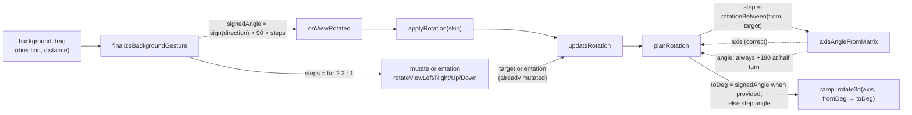

# fix: Correct view gesture inference and rotation animation

## Summary

Four fixes to view gesture inference and its visual feedback. The Basic view
carries a whole-cube rotation's ±180° sign from the gesture into the animation
instead of re-deriving it from the orientation matrix (which cannot express the
sign), and resolves sticker hits from the model rather than the mid-flight DOM.
The Flat view gains the same inference cross/line the Basic view already shows,
and promotes a far whole-cube legend drag to its `2` variant.

---

## Problem Frame

The two cube views share a move-inference core, but each leaks correctness at a
different boundary.

In the Basic view, a far background drag (or a rapid two-step gesture) composes
two quarter turns into one 180° sweep. The animation derives the sweep from the
orientation matrix via `rotationBetween` → `axisAngleFromMatrix`, and at exactly
180° the matrix is directionless — a half turn is the same either way, so the
axis comes back sign-normalized and the angle is always `+180`. One of the two
directions therefore animates backwards. The sign is knowable at gesture time;
the existing `mergeSameAxis` already carries a signed numeric angle, so the
mechanism exists and only the source is wrong.

The Basic view has a second, related defect: a move is animated by reparenting
the moving cubies into a pivot, so while the animation runs the sticker element
under the pointer is mid-flight. Hit-testing reads `data-face`/`data-basic-pos`
off that element, which lags until the post-move rebuild — so a drag started
before the previous animation settles targets the layer the sticker _looks_ like
it is in, not the layer the user grabbed (the reported "D move then expect L′
but get B′" case).

The Flat view has the mirror-image gaps: it shows no inference cross/line during
a drag (the Basic view does), and its whole-cube legend drag only ever emits
quarter turns instead of promoting far drags to `2` variants.

The remedy for all four lives in this document. Implementation detail is the
implementer's; the behavior, boundaries, and acceptance are fixed here.

---

## Requirements

Requirements are carried forward from the origin brainstorm
(`docs/brainstorms/2026-09-24-view-gesture-inference-fixes-requirements.md`).
R-IDs are preserved from the origin for traceability.

### Basic View — signed 180° animation

- R1. A whole-cube rotation initiated by a gesture carries a signed angle
  (±180°) from the gesture to the animation; the sign is never re-derived from
  the orientation matrix.
- R2. When two quarter-steps of one gesture compose into a half turn, the
  composed turn keeps the gesture's sense: a doubled clockwise turn animates as
  +180° and a doubled counter-clockwise turn as −180°.
- R3. The animation does not take a shorter arc to the same orientation: a +180°
  sweep travels 180° in the gesture's direction, never 180° the other way and
  never ±90°.

### Basic View — hit-test detached from mid-flight DOM

- R4. A drag started before the previous move animation has settled targets the
  layer of the sticker the user actually grabbed, independent of where that
  sticker's element is mid-flight.
- R5. The sticker hit is resolved from the model's current sticker identity and
  position, not from the face/position attributes of the DOM element under the
  pointer.
- R6. A chain of rapid moves is accepted in sequence, and every move in the
  chain targets the correct layer.

### Flat View — inference cross / line

- R7. During a drag in the Flat view, an inference cross/line is displayed that
  matches the Basic view's existing cross/line feedback.
- R8. The indicator updates as the gesture resolves its direction, and hides
  when no move is inferred or when the gesture ends.

### Flat View — whole-cube `2` variants

- R9. A far whole-cube drag in the Flat view promotes to the doubled variant,
  the same way a far layer drag promotes to a double.
- R10. The promotion uses the same far-drag distance threshold the rest of the
  app already applies to layer drags.

---

## Key Technical Decisions

- **Signed angle rides the gesture path only (origin's "Možnosť 1").** The
  `onViewRotated` callback and the rotation-planning chain accept an explicit
  signed angle parameter; every other rotation entry point (keyboard, reset,
  align, tilt/pitch) continues to derive 90° steps from the matrix, where the
  sign is recoverable. Rationale: the bug lives only on the composed-180°
  gesture path; a persistent state field would add a second source of truth to
  the already-fragile rendered-vs-requested bookkeeping.

- **Hit-test resolves identity from the model, uniformly.**
  `getStickerHitFromPoint` drops the `data-basic-pos`/`data-face` fast path and
  always resolves via `data-sticker-id` → `CubeStateUtils.getStickerById`,
  reading `face`/`row`/`col` from the returned sticker. Rationale: DOM
  attributes are authored per frame and stale mid-flight; the model is
  authoritative. This matches the `dom-attribute-conventions` repo memory:
  `data-sticker-id` is the model-identity contract, `data-basic-pos`/`data-face`
  are not trustworthy mid-animation.

- **Far-drag promotion reuses `toFar`, and does not change the legend mapping.**
  The Flat legend's direction mapping is left as-is (it emits only
  `x`/`x'`/`y`/`y'`); the promotion is `toFar(notation)` applied when the drag
  exceeds the far-drag threshold. Rationale: the brainstorm's `2` gap is about
  _promotion_, not about adding `z`/`z'` diagonals to the legend mapping — that
  would be a behavior change beyond the confirmed scope.

- **Flat cross/line mirrors the Basic SVG overlay.** The Flat view gets the same
  `<svg>` + two `<line>` structure and a `flat-drag-decision-arm` CSS class
  mirroring `basic-drag-decision-arm`, rather than a flat-specific indicator
  shape.

---

## High-Level Technical Design

The signed-angle fix is a narrow threading, shown here as the one data flow that
changes. The hit-test fix and the two Flat-view additions are pattern
applications that prose already carries; they need no diagram.

The override is scoped: the signed angle replaces only the _angle magnitude_ in
`planRotation` (both the fresh-ramp `toDeg` and the `mergeSameAxis` second
operand). The axis still comes from `rotationBetween`, whose axis recovery is
correct at 180°; only the sign of the principal angle is wrong.

---

## Implementation Units

### U1. Thread the signed 180° angle through the background-drag rotation path

- **Goal:** Make a composed 180° whole-cube gesture animate in the direction the
  user dragged, by passing an explicit signed angle from the gesture into the
  rotation plan.
- **Requirements:** R1, R2, R3.
- **Dependencies:** none.
- **Files:**
  - `src/views/basic/touch-handler.ts` — compute and emit the signed angle.
  - `src/views/basic/basic-view.ts` — forward the angle through the
    `onViewRotated` closure and `applyRotation`.
  - `src/views/basic/rendering.ts` — accept and forward the angle in
    `updateRotation`.
  - `src/views/basic/rotation-math.ts` — accept an optional signed step angle in
    `planRotation` and use it for the fresh-ramp `toDeg` and the `mergeSameAxis`
    operand.
  - Tests: `src/views/basic/rotation-math.test.ts`,
    `src/views/basic/basic-view.manual-rotation.test.ts`,
    `src/views/basic/touch-handler.test.ts`,
    `src/views/basic/rotation-composition.browser.test.ts`.
- **Approach:** In `finalizeBackgroundGesture`, derive a signed angle from the
  gesture direction and step count, and pass it through the existing
  `onViewRotated` callback (extending its parameter list). Thread it through
  `applyRotation` → `updateRotation` → `planRotation`, where it becomes an
  optional override used in place of the matrix-derived principal angle. The
  axis is still derived from `rotationBetween`; only the angle sign is
  overridden. Other entry points pass no override and keep current behavior.
- **Execution note:** Write the failing `planRotation`/`rotationBetween` test
  first: a 180° step between two orientations must produce the caller-supplied
  signed angle when provided, and +180 when not.
- **Patterns to follow:** `mergeSameAxis` (already carries and accumulates a
  signed numeric angle); `sliceRotationForViewTurn` (already recovers a signed
  turn from a matrix); `notationForSignedAngle` (already spells a signed angle
  as notation).
- **Test scenarios:**
  - Happy path: a far right-drag composes two steps and produces
    `toDeg === +180` (or the direction's sign); a far left-drag produces the
    opposite sign.
  - Happy path: a single short drag (one step) still animates 90° with the
    correct sign, unchanged.
  - Edge: a 180° step with no signed-angle override still falls back to the
    matrix-derived angle (back-compat for keyboard/reset/align entry points).
  - Edge: a signed override arriving while a ramp is already in flight extends
    the ramp via `mergeSameAxis` and accumulates the sign correctly.
  - Integration: `rotation-composition.browser.test.ts` still passes over all 24
    orientations × 4 steps — the slot rotation must still equal the settled bake
    (the transpose-trap guard must not be weakened).

---

### U2. Resolve Basic-view sticker hits from model identity

- **Goal:** A drag started mid-animation targets the layer of the sticker the
  user grabbed, because the hit is resolved from the model, not the flying DOM.
- **Requirements:** R4, R5, R6.
- **Dependencies:** none (independent of U1).
- **Files:**
  - `src/views/basic/touch-handler.ts` — rewrite `getStickerHitFromPoint`.
  - Tests: `src/views/basic/touch-handler.test.ts`,
    `src/views/basic/selection-anchor-timing.test.ts`.
- **Approach:** In `getStickerHitFromPoint`, keep `elementFromPoint` → `closest`
  only to identify _which_ sticker element is under the pointer, then read
  `data-sticker-id` and resolve `face`/`row`/`col` via
  `CubeStateUtils.getStickerById(model.getCurrentState(), stickerId)`. Delete
  the `data-basic-pos` fast path and the `data-face` read. `getModel` is already
  wired into the handler; the unit makes it the only path. The hit element is
  still needed for `stickerElement` (used by selection markup and basis
  helpers), but identity comes from the model.
- **Execution note:** Update the test fixture before changing the code path so
  the existing hit-resolution tests keep passing — the fixture must now supply a
  `getModel` whose `getStickerById` resolves the fixture's sticker ids to the
  correct face/position.
- **Patterns to follow:** the model-fallback branch already present in
  `getStickerHitFromPoint` (now promoted to the only branch);
  `CubeStateUtils.getStickerById` usage in `navigation.ts` and
  `resolveBasisElement`.
- **Test scenarios:**
  - Happy path: a sticker hit resolves `face`/`row`/`col` from the model sticker
    with a `data-basic-pos` value that disagrees with the model — the model
    wins.
  - Happy path: a hit on a sticker with no `data-basic-pos` still resolves (the
    old fallback path becomes the primary path).
  - Edge: `elementFromPoint` returns an element with no `data-sticker-id` →
    returns `undefined` (no hit).
  - Edge: no model present → returns `undefined` (no silent fabrication of
    row/col).
  - Integration: `Covers AE2.` A D move on cubie FLD, followed by a second
    pointer-down before the animation settles, infers the layer of the grabbed
    sticker's model position — the second move is L′, not B′.

---

### U3. Add the inference cross/line indicator to the Flat view

- **Goal:** The Flat view shows the same drag-inference cross/line the Basic
  view already shows, for the gestures that flow through its move-inference
  path.
- **Requirements:** R7, R8.
- **Dependencies:** none (independent of U1, U2, U4).
- **Files:**
  - `src/views/flat/touch-handler.ts` — build and append the SVG overlay.
  - `src/views/flat/touch-handler-overlays.ts` — add show/hide helpers and the
    `setSvgLineFromCenter` equivalent.
  - `src/views/flat/touch-handler-types.ts` — add the SVG/line state fields.
  - `src/views/flat/flat-view.module.css` — add `.flat-drag-decision-arm`.
  - Tests: `src/views/flat/touch-handler.test.ts`.
- **Approach:** Mirror the Basic overlay: a full-host `<svg>` (absolute,
  pointer-events none, `aria-hidden`) with two `<line>` children, revealed on
  drag start and hidden on drag end/cancel. Sticker (ring) drags show the two
  crossed zone-boundary arms from the face's screen basis; halo drags show a
  single radial line from the face center. The basis for sticker drags comes
  from the face's screen-space basis (the flat view has no `data-basic-pos`; use
  the existing adapter/`buildFaceScreenBasis` projection or a DOM basis like
  Basic's `getFaceScreenBasisFromDOM`). The exact basis source is an
  implementation-time choice, but the indicator must match the move the drag
  will actually infer.
- **Patterns to follow:** the Basic overlay (`dragDecisionSvgEl`,
  `showDragDecisionCross`, `showDragDecisionLine`, `hideDragDecision`,
  `setSvgLineFromCenter`) and `basic-drag-decision-arm` CSS.
- **Test scenarios:**
  - Happy path: a sticker drag past the commit distance reveals a cross with two
    visible arms; the arm direction matches the inferred move's dominant axis.
  - Happy path: a halo drag on the selected face reveals a single radial line.
  - Happy path: the indicator hides when the gesture ends or is cancelled.
  - Edge: a drag too short to infer a move never reveals the indicator.
  - Edge: a degenerate face basis (edge-on face) hides the indicator rather than
    drawing a NaN arm.

---

### U4. Promote far whole-cube legend drags to the `2` variant

- **Goal:** A far drag on the Flat legend emits `x2`/`y2` (or `x2'`/`y2'`)
  instead of the plain quarter turn.
- **Requirements:** R9, R10.
- **Dependencies:** none (independent of U1–U3).
- **Files:**
  - `src/views/flat/legend-drag.ts` — add the far-drag promotion.
  - `src/views/flat/flat-view.ts` — pass the far-drag threshold into the legend
    handler callbacks.
  - Tests: `src/views/flat/legend-drag.test.ts`.
- **Approach:** Extend `LegendDragCallbacks` (and the handler closure) with the
  far-drag threshold, defaulting to the shared `FAR_DRAG_THRESHOLD_PX = 60`. In
  the `move` and `up` handlers, when the drag distance exceeds the threshold,
  wrap the `inferLegendMove` result with `toFar` (from
  `src/interaction/move-inference.ts`). The direction mapping itself is
  unchanged — the promotion is applied after it, so `x` → `x2`, `x'` → `x2'`,
  and so on.
- **Patterns to follow:** `toFar` in `src/interaction/move-inference.ts`;
  `FAR_DRAG_THRESHOLD_PX` in `src/views/flat/touch-handler-types.ts`; the
  far-drag promotion in `src/views/flat/touch-handler-interaction.ts`
  (`inferMoveNotationForGesture` already applies `toFar` for layer drags).
- **Test scenarios:**
  - Happy path: a drag past the far-drag threshold in the desktop orientation
    emits `y2`/`y2'`/`x2`/`x2'` per direction, not the quarter turn.
  - Happy path: `Covers AE3.` the same drag shorter than the threshold emits the
    plain quarter turn.
  - Edge: the threshold boundary — exactly at the threshold is not promoted (or
    is, per the chosen comparison; assert the chosen side consistently).
  - Edge: the mobile (rotated) orientation still maps and promotes correctly
    (`x`/`x'` family).

---

## Scope Boundaries

### Deferred to Follow-Up Work

- Legend-drag inference _indicator_ (a cross/line for the whole-cube legend
  gesture) is not part of U3; U3 covers the Flat touch handler's sticker and
  halo gestures, which is where the move-inference path lives. Adding a legend
  indicator would touch the separate legend subsystem beyond the confirmed
  promotion scope.
- Adding `z`/`z'` diagonal whole-cube rotations to the Flat legend mapping. The
  legend currently emits only `x`/`y`; introducing diagonals is a behavior
  change, not a promotion fix.
- Merging the two views' touch handlers into one shared implementation.

### Outside this product's identity

- Keyboard `2` variants for whole-cube rotations in the Flat view. Whole-cube
  `2` notation and commands already exist; the confirmed gap is drag-inference
  promotion only.

---

## Sources / Research

- `src/views/basic/touch-handler.ts` — background-drag → view-rotation path,
  `getStickerHitFromPoint`, and the Basic cross/line overlay.
- `src/views/basic/rotation-math.ts` — `rotationBetween`, `axisAngleFromMatrix`,
  `mergeSameAxis`, `planRotation` (where the sign collapses and where a signed
  angle must be threaded).
- `src/views/basic/basic-view.ts` — the `onViewRotated` closure and
  `applyRotation`.
- `src/views/basic/rendering.ts` — `updateRotation`.
- `src/views/flat/legend-drag.ts` — `inferLegendMove`,
  `createLegendDragHandlers`.
- `src/views/flat/touch-handler.ts` / `touch-handler-overlays.ts` /
  `touch-handler-types.ts` — the Flat overlay surface to extend.
- `src/interaction/move-inference.ts` — `toFar` (the promotion primitive).
- `src/cube/core/cube-invariants.ts`, `src/cube/core/move-parser.ts` —
  `x2/y2/z2` already defined and parseable (no parser work needed).
- `docs/solutions/logic-errors/directional-180-moves.md` — the precedent for
  carrying a signed 180° end-to-end rather than re-deriving it from geometry.
- `docs/solutions/logic-errors/ctrl-arrow-slice-direction-rotated-view.md` —
  documents that `axisAngleFromMatrix` reports a principal angle in [0, 180]
  with the sign folded into the axis (the mechanism behind the sign loss).
- `docs/solutions/design-patterns/cubie-element-index-caching-trade-off.md` —
  documents that the DOM subtree is transient mid-animation (cubies reparent
  into a pivot), the rationale for model-based identity.
- `docs/solutions/conventions/move-notation-casing-2026-05-12.md` — whole-cube
  rotations are lowercase; `2` variants spell `X2`/`X2'`.
